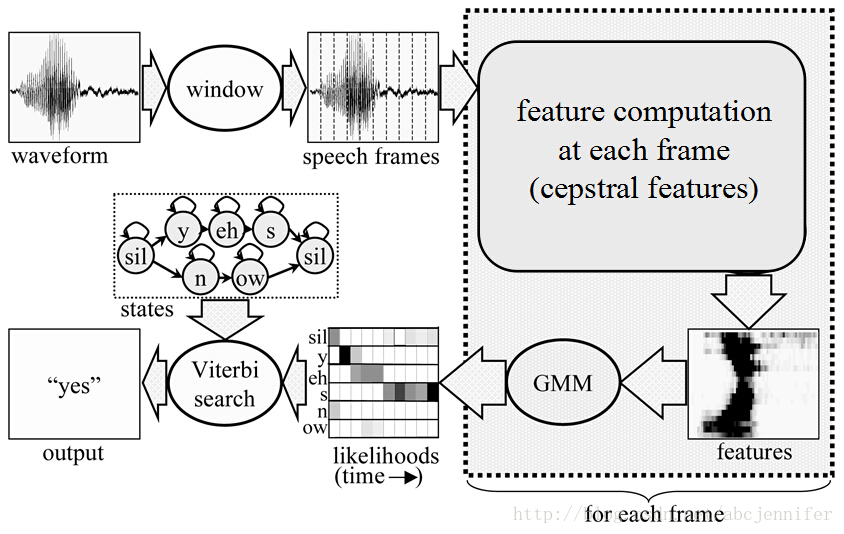

高斯混合模型

<!--more-->

## 高斯混合模型

概率图模型（ probabilistic graphical model）是一类用图来表达变量相关关系的概率模型。它以图为表示工具，最常见的是用一个结点表示一个或一组随机变量，结点之间的边表示变量间的概率相关关系，即“变量关系图”.根据边的性质不同，概率图模型可大致分为两类：

第一类是使用有向无环图表示变量间的依赖关系，称为有向图模型或贝叶斯网（ Bayesian network）；

第二类是使用无向图表示变量间的相关关系，称为无向图模型或马尔可夫网（ Markovnetwork）

**定义**

高斯混合模型是指具有如下形式的概率分布模型。
$$
P(y|\theta)=\sum^K_{k=1}\alpha_k\phi(y|\theta_k)
$$
其中，$\alpha_k$是系数，$\alpha_k\geq0$,$\sum^K_{k=1}\alpha_k=1$;$\phi(y|\theta_k)$是高斯分布密度，$\theta_k=(\mu_k,\delta^2_k)$;
$$
\phi(y|\theta_k)=\cfrac{1}{\sqrt{2\pi}\delta^2}exp(-\cfrac{(y-\mu_k)^2}{2\delta^2_k})
$$
称为第k个分模型。

一般混合模型可以由任意概率分布密度代替上式的高斯分布密度。

### 高斯混合模型参数估计的EM算法

概率模型有时既含有观测变量（ observable variable），又含有隐变量或潜在变量（ latent variable）.如果概率模型的变量都是观测变量，那么给定数据，可以直接用极大似然估计法，或贝叶斯估计法估计模型参数。但是，当模型含有隐变量时，就不能简单地使用这些估计方法。EM算法就是含有隐变量的概率模型参数的极大似然估计法，或极大后验概率估计法。我们仅讨论极大似然估计，极大后验概率估计与其类似。

假设观测数据$y_1,y_2,...,y_N$由高斯混合模型生成，
$$
P(y|\theta)=\sum^K_{k=1}\alpha_k\phi(y|\theta_k)
$$
其中，$\theta=(\alpha_1,\alpha_2,...,\alpha_k;\theta_1,\theta_2,\theta_k)$。我们用EM算法估计高斯混合模型的参数$\theta$。

**EM（期望最大化）算法**

输入：观测数据$y_1,y_2,...,y_N$，高斯混合模型；

输出：高斯混合模型参数。

1. 取参数的初始值开始迭代

2. 求E步，根据当前模型参数，计算分模型k对观测数据$y_j$的相应度
   $$
   \hat{\gamma}_{jk}=\cfrac{\alpha_k\phi(y_j|\theta_k)}{\sum^K_{k=1}\alpha_k\phi(y_j|\theta_k)}，j=1,2,...N;k=1,2,..K
   $$

3. 求M步:计算新一轮的迭代的模型参数：
$$
\hat{\mu}_k=\cfrac{\sum^N_{j=1}\hat{\gamma}_{jk}y_j}{\sum^N_{j=1}\hat{\gamma}_{jk}},k=1,2,..,K
$$

$$
\hat{\delta_k}^2=\cfrac{\sum^N_{j=1}\hat{gamma}_{jk}(y_j-\mu_k)^2}{\sum^N_{j=1}\hat{\gamma}_{jk}},k=1,2,...K
$$

$$
\hat{\alpha}_k=\cfrac{\sum^N_j=1\hat{\gamma_{jk}}}{N},k=1,2,...,K
$$

4. 重复第二步和第三步，直至收敛。

## GMM-HMM

语音识别系统主要由信号处理和特征提取、声学模型（AM）、语言模型（LM）和解码搜索部分。

* 信号处理和特征提取部分以音频信号为输入，通过消除噪声和信道失真对语音进行增强，将信号从时域转化到频域，并为声学模型提取合适的特征向量。
* 声学模型将声学和发音学（phonetics）进行整合，以特征向量作为输入，并为可变长特征序列生成声学模型分数。
* 语言模型学习词与词间的相互关系，来评估序列的可能性。
* 解码搜索对给定特征向量序列和若干假设次序列计算声学模型和语言模型分数，并输出得分最高的结果

语音识别系统中经常使用基于GMM-HMM的声学模型。

**GMM被整合进HMM中，用来拟合基于状态的输出分布。**

用GMM建模声学特征（Acoustic Feature）$O_1,O_2,...,O_n$，可以理解成：

* 每一个特征是由一个音素确定的，即不同特征可以按音素来聚类。由于在HMM中音素被表示为隐变量（状态），故等价于：
* 每一个特征是由某几个状态确定的，即不同特征可以按状态来聚类。
* 则设$P(O|S_i)$符合正态分布，则根据GMM的知识，$O_1,O_2,...,O_n$实际上就是一个混合高斯模型下的采样值。

若包含了语音顺序信息，GMM不再是一个好模型，因为它不包含任何顺序信息。当给定HMM的一个状态后，若要对属于该状态的语音特征向量的概率分布进行建模，GMM仍不失为一个好的模型。因此，GMM被整合进HMM中，用来拟合基于状态的输出分布。

**利用声学特征训练HMM**

确定状态转移矩阵，是执行解码问题的基础。

而状态转移矩阵的确定即等价于HMM的训练问题（即状态转移矩阵u=max(P(u|O))，从语音特征序列中利用EM算法学习得到状态转移矩阵。

## 应用GMM-HMM模型识别语音

- **对待识别语音做信号预处理**
- **对待识别语音提取声学特征**
- **对声学特征利用Viterbi算法解码**

对声学特征解码后得到的是状态序列，即音素序列。

如果把声学模型的结果表示为句子，往往效果不尽如意，所以还需要用语言模型把识别出的各个音素纠正为正确的句子

**其它应用**

将上图中的拼音换成语音，就成了语音识别问题，转移概率仍然是二元语言模型，其输出概率则是语音模型，即语音和汉字的对应模型。

