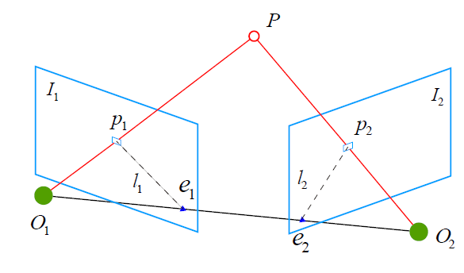
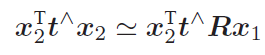
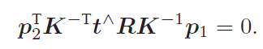

本文旨在了解一下几点：

1. 对极约束是什么
2. 基础矩阵F
3. F的秩有什么意义
4. 本质矩阵E
5. E与F的区别与联系

<!--More-->

## 对极约束

### 目的

在已知 2D像素坐标的前提下，根据两幅图像间多组2D像素点对来估计相机的运动。

### 概念

### 推导过程

如上图所示，我们希望求取两帧图像 $I_1$,$ I_2$ 之间的运动，设第一帧到第二帧的运动为 $R$，$t$。两个相机中心分别为 $O_1$,$O_2$。现在，考虑 $I_1$ 中有一个特征点 $p_1$，它在 $I_2$ 中对应着特征点 $p_2$。我们知道两者是通过特征匹配得到的。首先，连线 $O_2P$与$O_1P$ 在三维空间中会相交于点 P。由$O_1$, $O_2$, $P$ 三点确定的平面为**极平面**（`Epipolar plane`）。$O_1O_2$ 连线与像平面 $I_1$, $I_2$ 的交点$e_1$, $e_2$ 称为**极点**（`Epipoles`），$O_1O_2$ 被称为**基线**（`Baseline`）。我们称极平面与两个像平面 $I_1$, $I_2$ 之间的相交线 $l_1$, $l_2$ 为**极线**（`Epipolar line`）。

设P的空间位置为 $P=[X,Y,Z]^T$。则根据针孔模型，两个像素点$p_1,p_2$的像素位置为:
$$
s_1p_1=KP,s_2p_2=K(RP+t)
$$
其中，K为相机内参矩阵，R，t为两个坐标系的相机运动。具体来说，计算的是$R_{21}$，$t_{21}$，因为他们把第一个坐标系下的坐标转换到了第二个坐标系下。其也可写作是李代数形式。

尺度意义下相等记作：$sp\simeq p$，可表示投影关系。

因此有:
$$
x_1=K^{-1}p_1, x_2=K^{-1}p_2
$$
其中，$x_1$,$x_2$表示像素点在归一化平面上的坐标。代入上式，得：
$$
x_2\simeq Rx_1+t
$$
两边同时左乘`t^`。因此得到:
$$
t^{.}x_2\simeq t^{.}Rx_1
$$
然后同时左乘`x2^`，得到

重新带入$p_1,p_2$有:

上述两式称为**对极约束**。

**几何意义**:	$O_1,P,O_2$三者共面。

把中间部分记作两个矩阵，基础矩阵F和本质矩阵E，可进一步检核对极约束：`E=t^R`，$F=K^{-T}EK^{-1}$，$x^T_2Ex^1=p^T_2Fp_1=0$。

可看出，对极约束简洁地给出了两个匹配点之间的中间位置关系。

于是位子估计变为以下两部:

1. 根据配对点的像素为最初求出E或者F。
2. 根据E或者F求出R,t。

由于E和F只相差了相机内参，而内参在SLAM通常是已知的，因此实践中往往使用形式更简单的E。

## 基础矩阵F

## 本质矩阵E