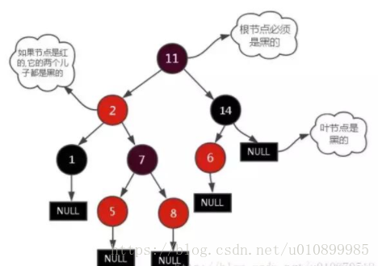
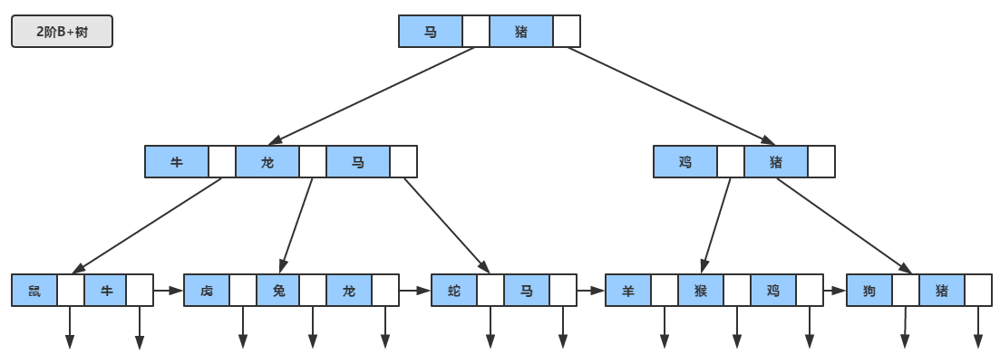
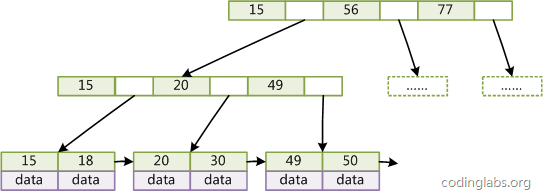
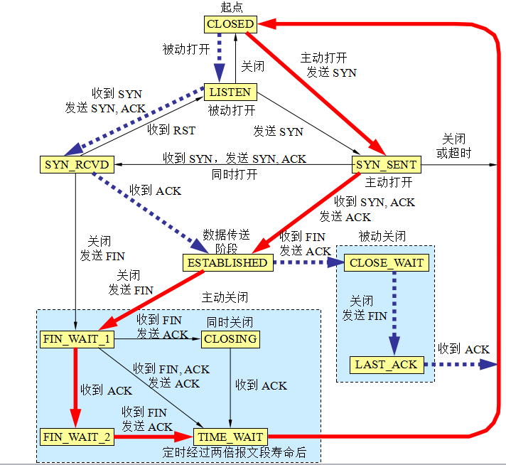

本文整理自网络：

1. [C++面经宝典](https://www.nowcoder.com/tutorial/93/8f140fa03c084299a77459dc4be31c95)
2. 现代操作系统
3. 计算机网络
4. 数据库系统概论
5. 设计模式

<!--More-->

# 一 C++基础

## 一 基本语言

### 零 编译过程

#### 1. 源文件从文本到可执行文件经历的过程

**简单版本**

对于C++源文件，从文本到可执行文件一般需要**四个过程**

> 1、**预处理阶段**：对源代码文件中文件包含关系（头文件）、预编译语句（宏定义）进行分析和替换，生成预编译文件。
>
> 2、**编译阶段**：将经过预处理后的预编译文件转换成特定汇编代码，生成汇编文件
>
> 3、**汇编阶段**：将编译阶段生成的汇编文件转化成机器码，生成可重定位目标文件
>
> 4、**链接阶段**：将多个目标文件及所需要的库连接成最终的可执行目标文件

**详细版本**

**1 预编译：主要处理源代码文件中的以“#”开头的预编译指令。处理规则见下**

> 1、删除所有的#define，展开所有的**宏定义**。
>
> 2、处理所有的**条件预编译指令**，如“#if”、“#endif”、“#ifdef”、“#elif”和“#else”。
>
> 3、处理“**#include”预编译指令**，将文件内容替换到它的位置，这个过程是递归进行的，文件中包含其他文件。
>
> 4、删除所有的**注释**，“//”和“/**/”。
>
> 5、保留所有的**#pragma 编译器指令**，编译器需要用到他们，如：#pragma once 是为了防止有文件被重复引用。
>
> 6、添加**行号和文件标识**，便于编译时编译器产生调试用的行号信息，和编译时产生编译错误或警告是能够显示行号。

**2 编译：把预编译之后生成的`xxx.i`或`xxx.ii`文件，进行一系列词法分析、语法分析、语义分析及优化后，生成相应的汇编代码文件。**

> 1、**词法分析**：利用类似于“有限状态机”的算法，将源代码程序输入到扫描机中，将其中的字符序列分割成一系列的记号。
>
> 2、**语法分析**：语法分析器对由扫描器产生的记号，进行语法分析，产生语法树。由语法分析器输出的语法树是一种以表达式为节点的树。
>
> 3、**语义分析**：语法分析器只是完成了对表达式语法层面的分析，语义分析器则对表达式是否有意义进行判断，其分析的语义是静态语义——在编译期能分期的语义，相对应的动态语义是在运行期才能确定的语义。
>
> 4、**优化**：源代码级别的一个优化过程。
>
> 5、**目标代码生成**：由代码生成器将中间代码转换成目标机器代码，生成一系列的代码序列——汇编语言表示。
>
> 6、**目标代码优化**：目标代码优化器对上述的目标机器代码进行优化：寻找合适的寻址方式、使用位移来替代乘法运算、删除多余的指令等。

**3）汇编**

> 将汇编代码转变成机器可以执行的指令(机器码文件)。 
>
> 汇编器的汇编过程相对于编译器来说更简单，没有复杂的语法，也没有语义，更不需要做指令优化，只是**根据汇编指令和机器指令的对照表一一翻译**过来，汇编过程有汇编器as完成。经汇编之后，产生目标文件(与可执行文件格式几乎一样)xxx.o(Windows下)、xxx.obj(Linux下)。

**4）链接：将不同的源文件产生的目标文件进行链接，从而形成一个可以执行的程序。链接分为静态链接和动态链接**

> - 静态库（.a 、.lib）：（Windows 下的 .lib，Linux 和 Mac 下的 .a）一组目标文件的集合，即很多目标文件经过压缩打包后形成的一个文件。
>
> - 动态库（.so 、.dll ）：（Windows 下的 .dll，Linux 下的 .so，Mac 下的 .dylib）
>
> 
>1、**静态链接**
> 
>函数和数据被编译进一个二进制文件。在使用静态库的情况下，在编译链接可执行文件时，链接器从库中复制这些函数和数据并把它们和应用程序的其它模块组合起来创建最终的可执行文件。
> 
>- 空间浪费：因为每个可执行程序中对所有需要的目标文件都要有一份副本，所以如果多个程序对同一个目标文件都有依赖，会出现同一个目标文件都在内存存在多个副本；
> - 更新困难：每当库函数的代码修改了，这个时候就需要重新进行编译链接形成可执行程序。
> - 运行速度快：但是静态链接的优点就是，在可执行程序中已经具备了所有执行程序所需要的任何东西，在执行的时候运行速度快。
> 
>2、**动态链接**
> 
>动态链接的基本思想是把程序按照模块拆分成各个相对独立部分，在程序运行时才将它们链接在一起形成一个完整的程序，而不是像静态链接一样把所有程序模块都链接成一个单独的可执行文件。
> 
>- 共享库：就是即使需要每个程序都依赖同一个库，但是该库不会像静态链接那样在内存中存在多分，副本，而是这多个程序在执行时共享同一份副本；
> - 更新方便：更新时只需要替换原来的目标文件，而无需将所有的程序再重新链接一遍。当程序下一次运行时，新版本的目标文件会被自动加载到内存并且链接起来，程序就完成了升级的目标。
> - 性能损耗：因为把链接推迟到了程序运行时，所以每次执行程序都需要进行链接，所以性能会有一定损失。


#### 2. include头文件的顺序，双引号””和尖括号<>的区别？

> Include头文件的顺序：对于include的头文件来说，如果在文件`a.h`中声明一个在文件`b.h`中定义的变量，而不引用`b.h`。那么要在`a.c`文件中引用`b.h`文件，并且要先引用`b.h`，后引用`a.h`,否则汇报变量类型未声明错误。
>
> **双引号和尖括号的区别：编译器预处理阶段查找头文件的路径不一样。**
>
> 对于使用双引号包含的头文件，查找头文件路径的顺序为
>
> 1. 当前头文件目录
> 2. 编译器设置的头文件路径（编译器可使用-I显式指定搜索路径）
> 3. 系统变量CPLUS_INCLUDE_PATH/C_INCLUDE_PATH指定的头文件路径
>
> 对于使用尖括号包含的头文件，查找头文件的路径顺序为：
>
> 1. 编译器设置的头文件路径（编译器可使用-I显式指定搜索路径）
> 2. 系统变量CPLUS_INCLUDE_PATH/C_INCLUDE_PATH指定的头文件路径


### 一 变量和基本类型

#### 1. static

**简短回答**

> 1. 对于函数定义和代码块之外的**全局变量**声明，static修改标识符的链接属性，由默认的external变为internal，作用域和存储类型不改变，这些符号只能在声明它们的源文件中访问。
> 2. 对于代码块**内部的变量**声明，static修改标识符的存储类型，由自动变量改为静态变量，作用域和链接属性不变。这种变量在程序执行之前就创建，在程序执行的整个周期都存在。
> 3. 对于被static修饰的**普通函数**，其只能在定义它的源文件中使用，不能在其他源文件中被引用
> 4. 对于被static修饰的**类成员变量和成员函数**，它们是属于类的，而不是某个对象，所有对象共享一个静态成员。静态成员通过<类名>::<静态成员>来使用。

**其它解答**

> 1. 加了static关键字的全局变量只能在本文件中使用。例如在a.c中定义了static int a=10;那么在b.c中用extern int a是拿不到a的，a的作用域只在a.c中。 
>
> 2. static定义的静态局部变量分配在数据段上，普通的局部变量分配在栈上，会因为函数栈的释放而被释放掉。
>
> 3. 对一个类中成员变量和成员函数来说，加了static关键字，则此变量/函数就没有了this指针了，必须通过类名才能访问

**详细说明**

> 1. **全局静态变量**
>
> > 在全局变量前加上关键字static，全局变量就定义成一个全局静态变量.
> >
> > 静态存储区，在整个程序运行期间一直存在。
> >
> > 初始化：未经初始化的全局静态变量会被自动初始化为0（自动对象的值是任意的，除非他被显式初始化）；
> >
> > 作用域：全局静态变量在声明他的文件之外是不可见的，准确地说是从定义之处开始，到文件结尾。
>
> 2. **局部静态变量**
>
> > 在局部变量之前加上关键字static，局部变量就成为一个局部静态变量。
> >
> > 内存中的位置：静态存储区
> >
> > 初始化：未经初始化的全局静态变量会被自动初始化为0（自动对象的值是任意的，除非他被显式初始化）；
> >
> > 作用域：作用域仍为局部作用域，当定义它的函数或者语句块结束的时候，作用域结束。但是当局部静态变量离开作用域后，并没有销毁，而是仍然驻留在内存当中，只不过我们不能再对它进行访问，直到该函数再次被调用，并且值不变；
>
> 3. **静态函数**
>
> > 在函数返回类型前加static，函数就定义为静态函数。函数的定义和声明在默认情况下都是extern的，但静态函数只是在声明他的文件当中可见，不能被其他文件所用。
> >
> > 函数的实现使用static修饰，那么这个函数只可在本cpp内使用，不会同其他cpp中的同名函数引起冲突；
> >
> > warning：不要在头文件中声明static的全局函数，不要在cpp内声明非static的全局函数，如果你要在多个cpp中复用该函数，就把它的声明提到头文件里去，否则cpp内部声明需加上static修饰；
>
> 4. **类的静态成员**
>
> > 在类中，静态成员可以实现多个对象之间的数据共享，并且使用静态数据成员还不会破坏隐藏的原则，即保证了安全性。因此，静态成员是类的所有对象中共享的成员，而不是某个对象的成员。对多个对象来说，静态数据成员只存储一处，供所有对象共用
>
> 5. **类的静态函数**
>
> > 静态成员函数和静态数据成员一样，都属于类的静态成员，都不是对象成员。因此，对静态成员的引用不需要用对象名。
> >
> > 在静态成员函数的实现中不能直接引用类中说明的非静态成员，可以引用类中说明的静态成员（这点非常重要）。如果静态成员函数中要引用非静态成员时，可通过对象来引用。从中可看出，调用静态成员函数使用如下格式：<类名>::<静态成员函数名>(<参数表>);


#### 2. 静态变量什么时候初始化

> 静态变量存储在虚拟地址空间的数据段和bss段，
>
> C语言中其在代码执行之前初始化，属于编译期初始化。
>
> 而C++中由于引入对象，对象生成必须调用构造函数，因此C++规定全局或局部静态对象当且仅当对象首次用到时进行构造


#### 3. C++中四种cast类型转换

> C++中四种类型转换是：static_cast, dynamic_cast, const_cast, reinterpret_cast
>
> **1、const_cast**
>
> 将const变量转为非const
>
> **2、static_cast**
>
> 各种隐式转换， static_cast能用于多态向上转化，如果向下转能成功但是不安全，结果未知；
>
> **3、dynamic_cast**
>
> 动态类型转换。
>
> 只能用于含有虚函数的类，用于类层次间的向上和向下转化。只能转指针或引用。向下转化时，如果是非法的对于指针返回NULL，对于引用抛异常。要深入了解内部转换的原理。
>
> 向上转换：指的是子类向基类的转换
>
> 向下转换：指的是基类向子类的转换
>
> 它通过判断在执行到该语句的时候变量的运行时类型和要转换的类型是否相同来判断是否能够进行向下转换。
>
> **4、reinterpret_cast**
>
> 几乎什么都可以转，比如将int转指针，可能会出问题，几乎什么都可以转，
>
> **5、为什么不使用C的强制转换？**
>
> C的强制转换表面上看起来功能强大什么都能转，但是转化不够明确，不能进行错误检查，容易出错。

> | 类型转换         | 功能                                                         | 例子                               |
> | ---------------- | ------------------------------------------------------------ | :--------------------------------- |
> | const_cast       | 把const变量转换为非const变量；<br />去掉变量const属性或者volatile属性的转换符 |                                    |
> | static_cast      | 各种隐式转换， <br />static_cast能用于多态向上转化，如果向下转能成功但是不安全，结果未知； | 非const转const<br />void*转指针等, |
> | dynamic_cast     | 动态类型转换。<br />只能用于含有虚函数的类，用于类层次间的向上和向下转化。<br />只能转指针或引用。<br />向下转化时，如果是非法的对于指针返回NULL，对于引用抛异常。<br />要深入了解内部转换的原理。 |                                    |
> | reinterpret_cast | 重新解释（无理）转换                                         | 将int转指针，可能会出问题，        |
>
> 调用方法
>
> ```cpp
> const char *str = "1";
> char* p = const_cast<char*>(str);
> ```


#### 4. const

> 1. const 修饰**变量**：可用于定义常量。const’定义的常量编译器可以对数据静态类型进行安全检查。
> 2. const修饰**函数形式参数**：当输入参数为用户自定义类型和抽象数据类型时，可将值传递改为const &传递，可以提高效率。引用传递不需要产生临时对象，节省了临时对象的构造、复制、析构过程消耗的时间。但光用引用可能改变a，因此加const
> 3. const可以**修饰函数返回值**：如果要给指针传递的函数返回值加const，则返回值不能被直接修改，且该返回值只能被赋值给加const修饰的同类型指针。
> 4. const修饰的**成员函数**：表明函数调用不会对对象做出任何更改。事实上，如果确认不会对对象做更改，就应该为函数加上const限定，这样无论const对象还是普通对象都可以调用该函数。
>
> ```cpp
> const char *GetChar(void){};
> char *ch = GetChar(); //error
> const char *ch = GetChar(); //right
> ```


#### 5. C++怎么定义常量？常量存放在内存的哪个位置？

> 常量在C++里的定义就是一个top-level const加上对象类型，常量定义必须初始化。
>
> 1. 对于局部对象，常量存放在栈区；
> 2. 对于全局对象，常量存放在全局/静态存储区；
> 3. 对于字面值常量，常量存放在常量存储区。


#### 6. 以下四行const代码的区别？ 

> ```cpp
> const char * arr = "123"; //字符串123保存在常量区，const本来是修饰arr指向的值不能通过arr去修改，但是字符串“123”在常量区，本来就不能改变，所以加不加const效果都一样
> char * brr = "123"; //字符串123保存在常量区，这个arr指针指向的是同一个位置，同样不能通过brr去修改"123"的值
> const char crr[] = "123"; //这里123本来是在栈上的，但是编译器可能会做某些优化，将其放到常量区
> char drr[] = "123"; //字符串123保存在栈区，可以通过drr去修改
> ```


#### 7. 隐式类型转换

> 首先，对于内置类型，低精度变量赋值给高精度变量时会发生隐式类型转换；
>
> 其次，对于只存在单个参数的构造函数的对象构造来说，
>
> 函数调用可以直接使用该参数传入，编译器会自动调用其构造函数生成临时对象。


#### 8. [`RTTI`](https://www.cnblogs.com/xuelisheng/p/9479288.html)

> RTTI是”Runtime Type Information”的缩写，意思是运行时类型信息，它提供了运行时确定对象类型的方法
>
> 运行时类型检查，在C++层面主要体现在dynamic_cast和typeid,VS中虚函数表的-1位置存放了指向type_info的指针。对于存在虚函数的类型，typeid和dynamic_cast都会去查询type_info。
>
> typeid的主要作用就是让用户知道当前变量的类型，对于内置数据类型以及自定义数据类型都生效；
>
> typeid函数返回的是一个结构体或者类，然后，再调用这个返回的结构体或类的name成员函数；


#### 9. extern

> **extern**是一种“**外部声明**”的关键字，字面意思就是**在此处声明**某种变量或函数，**在外部定义**。

> extern可以置于变量或者函数前，以标示变量或者函数的定义在别的文件中，提示编译器遇到此变量和函数时在其他模块中寻找其定义。
>
> extern也可用来进行链接指定。

##### **extern "c"的作用? **

> Extern “C”是由Ｃ＋＋提供的一个连接交换指定符号，用于告诉Ｃ＋＋这段代码是Ｃ函数。这是因为C++编译后库中函数名会变得很长，与C生成的不一致，造成Ｃ＋＋不能直接调用C函数，加上extren “c”后，C++就能直接调用C函数了。
>
> Extern “C”主要使用正规DLL函数的引用和导出和在C++包含C函数或C头文件时使用。使用时在前面加上extern “c” 关键字即可
>
> extern是C/C++语言中表明函数和全局变量作用范围（可见性）的关键字，该关键字告诉编译器，其声明的函数和变量可以在本模块或其它模块中使用。
>
> 记住下列语句：
>
> ```cpp
> extern int a;
> ```
>
> 仅仅是一个变量的声明，其并不是在定义变量a，并未为a分配内存空间。
>
> 变量a在所有模块中作为一种全局变量只能被定义一次，否则会出现连接错误。
>
> 通常，在模块的头文件中对本模块提供给其它模块引用的函数和全局变量以关键字extern声明。
>
> 例如，如果模块B欲引用该模块A中定义的全局变量和函数时只需包含模块A的头文件即可。这样，模块B中调用模块A中的函数时，在编译阶段，模块B虽然找不到该函数，但是并不会报错；它会在连接阶段中从模块A编译生成的目标代码中找到此函数。

> C++调用C函数需要extern "C"，因为C语言没有函数重载。
>

> **extern对应的关键字是static，static表明变量或者函数只能在本模块中使用，因此，被static修饰的变量或者函数不可能被extern C修饰。**

**extern "C"的使用要点总结**

> - 可以是如下的单一语句
>
> ```cpp
> extern "C" doublesqrt(double`);
> ```
>
> - 可以是复合语句, 相当于复合语句中的声明都加了extern "C"
>
> ```cpp
> extern "C" {
>     double sqrt(double);
>     int min(int,int);
> }
> ```
>
> - 可以包含头文件，相当于头文件中的声明都加了extern "C"
>
> ```cpp
> extern "C"{
>     ＃include <cmath>
> }　
> ```
>
> - 不可以将extern "C" 添加在函数内部
> - 如果函数有多个声明，可以都加extern "C", 也可以只出现在第一次声明中，后面的声明会接受第一个链接指示符的规则。
> - 除extern "C", 还有extern "FORTRAN" 等。

> 参考：[extern “C”的作用详解](https://www.cnblogs.com/carsonzhu/p/5272271.html)


### 二 指针、引用

#### 1. 指针和引用的区别

回答要点：空间、大小、初始化、修改、const、级数、++运算、作为返回值返回。

> 1. 指针有自己的一块空间，而引用只是一个别名；
>
> 2. 使用sizeof看一个指针的大小是4，而引用则是被引用对象的大小；
>
> 3. 指针可以被初始化为NULL，而引用必须被初始化且必须是一个已有对象 的引用；
>
> 4. 作为参数传递时，指针需要被解引用才可以对对象进行操作，而直接对引用的修改都会改变引用所指向的对象；
>
> 5. 可以有const指针，但是没有const引用；
>
> 6. 指针在使用中可以指向其它对象，但是引用只能是一个对象的引用，不能 被改变；
>
> 7. 指针可以有多级指针（**p），而引用至于一级；
>
> 8. 指针和引用使用++运算符的意义不一样；
>
> 9. 如果返回动态内存分配的对象或者内存，必须使用指针，引用可能引起内存泄露。


#### 2. 数组和指针的区别

> | 指针                                                         | 数组                                 |
> | ------------------------------------------------------------ | ------------------------------------ |
> | 保存数据的地址                                               | 保存数据                             |
> | 间接访问数据，首先获得指针的内容，然后将其作为地址，从该地址中提取数据 | 直接访问数据，                       |
> | 通常用于动态的数据结构                                       | 通常用于固定数目且数据类型相同的元素 |
> | 通过Malloc分配内存，free释放内存                             | 隐式的分配和删除                     |
> | 通常指向匿名数据，操作匿名函数                               | 自身即为数据名                       |


#### 3. 野指针

> 野指针就是指向一个已删除的对象或者未申请、访问受限内存区域的指针


#### 4. 函数指针

> **1、定义**
>
> 函数指针是指向函数的指针变量。
>
> 函数指针本身首先是一个指针变量，该指针变量指向一个具体的函数。这正如用指针变量可指向整型变量、字符型、数组一样，这里是指向函数。
>
> C在编译时，每一个函数都有一个入口地址，该入口地址就是函数指针所指向的地址。有了指向函数的指针变量后，可用该指针变量调用函数，就如同用指针变量可引用其他类型变量一样，在这些概念上是大体一致的。
>
> **2、用途**
>
> 调用函数和做函数的参数，比如回调函数。
>
> **3、示例**
>
> ```cpp
> char * fun(char * p)  {…}    // 函数fun
> char * (*pf)(char * p);       // 函数指针pf
> pf = fun;            // 函数指针pf指向函数fun
> pf(p);            // 通过函数指针pf调用函数fun
> ```


#### 5. 传值、传指针和传引用的区别和联系

> **指针：**指针就是一个变量，指针存放的是变量的地址。
>
> **传值：**传值即实参拷贝传递给形参，单向传递（实参->形参），赋值完毕后实参就和形参没有任何联系，对形参的修改就不会影响到实参。
>
> **传地址：**传地址也是一种传值呢？因为传地址是把实参地址的拷贝传递给形参。对形参地址所指向对象的修改却直接反应在实参中，因为形参指向的对象就是实参的对象。
>
> **传引用：**传引用本质没有任何实参的拷贝，其实就是让另外一个变量也执行该实参。就是两个变量指向同一个对象。这是对形参的修改，必然反映到实参上。


> **分析**
>值传递时函数操作的并不是实参本身，形参和实参是相互独立的，所以对形参进行操作并不会改变实参的值。
> 
>引用传递操作地址是实参地址 ，形参相当于实参的一个别名，对它的操作就是对实参的操作。


> **总结**
>传引用和传指针看上去效果一样的，但本质上有区别：
> 
>**指针传递**参数本质上是值传递的方式，它所传递的是一个地址值。值传递的特点是被调函数对形式参数的任何操作都是作为局部变量进行，不会影响主调函数的实参变量的值。
> 
>在值传递过程中，被调函数的形式参数作为被调函数的局部变量，即在栈中开辟了内存空间以存放由主调函数放进来的实参的值，指针通过局部变量中存储的地址访空间。
> 
>既然形参和实参是相互独立的，在没有任何修饰形参时，形参是可以被修改的，形参指针可以指向任何地方，而且修改后就无法再访问到实参。
> 
> 例如Pointer函数中n = &b后，（*n）++不会再修改实参的值，这也是传递指针时通常会用const进行修饰的原因。

 

#### 6. this指针

> （1）一个对象的this指针并不是对象本身的一部分，不会影响sizeof(对象)的结果。
>
> （2）this作用域是在类内部，当在类的非静态成员函数中访问类的非静态成员的时候，编译器会自动将对象本身的地址作为一个隐含参数传递给函数。也就是说，即使你没有写上this指针，编译器在编译的时候也是加上this的，它作为非静态成员函数的隐含形参，对各成员的访问均通过this进行。
>
> ##### this指针的使用
>
> （1）在类的非静态成员函数中返回类对象本身的时候，直接使用 return *this。
>
> （2）当参数与成员变量名相同时，如this->n = n （不能写成n = n)。


### 三 智能指针

#### 0. 概念和作用

> 智能指针主要用于管理在堆上分配的内存，它把普通的指针封装为一个栈对象。
>
> 当栈对象的生存周期结束后，会在析构函数中释放掉申请的内存，从而防止内存泄漏。
>
> 因为智能指针就是一个类，当超出了类的作用域是，类会自动调用析构函数，析构函数会自动释放资源。


#### 1. 四个智能指针

**为什么要使用智能指针**

> 智能指针的作用是管理一个指针，因为存在以下这种情况：申请的空间在函数结束时忘记释放，造成内存泄漏。
>
> 智能指针的作用：**在函数结束时自动释放内存空间，不需要手动释放内存空间**。

> C++里面的四个智能指针: **auto_ptr, shared_ptr, weak_ptr, unique_ptr** 其中后三个是c++11支持，并且第一个已经被11弃用。
>
> > C++ 11中最常用的智能指针类型为shared_ptr,它采用引用计数的方法，记录当前内存资源被多少个智能指针引用。该引用计数的内存在堆上分配。当新增一个时引用计数加1，当过期时引用计数减一。
> >
> > 只有引用计数为0时，智能指针才会自动释放引用的内存资源。对shared_ptr进行初始化时不能将一个普通指针直接赋值给智能指针，因为一个是指针，一个是类。可以通过make_shared函数或者通过构造函数传入普通指针。并可以通过get函数获得普通指针。

##### **1. auto_ptr（c++98的方案，cpp11已经抛弃）**

> 采用所有权模式。
>
> ```c++
> auto_ptr<string> p1 (new string ("I reigned lonely as a cloud.”));
> auto_ptr<string> p2;
> p2 = p1; //auto_ptr不会报错.
> ```
>
> 此时不会报错，p2剥夺了p1的所有权，但是当程序运行时访问p1将会报错。
>
> auto_ptr的缺点是：存在潜在的内存崩溃问题！

##### **2. unique_ptr（替换auto_ptr）**

> **unique_ptr实现独占式拥有或严格拥有的概念，保证同一时间内只有一个智能指针可以指向该对象。**
>
> 采用所有权模式，还是上面那个例子
>
> ```c++
> unique_ptr<string> p3 (new string ("auto"));  //#4
> unique_ptr<string> p4；  //#5
> p4 = p3; //此时会报错！！
> ```
>
> 编译器认为p4=p3非法，避免了p3不再指向有效数据的问题。因此，unique_ptr比auto_ptr更安全。
>
> 另外unique_ptr还有更聪明的地方：当程序试图将一个 unique_ptr 赋值给另一个时，如果源 unique_ptr 是个临时右值，编译器允许这么做；如果源 unique_ptr 将存在一段时间，编译器将禁止这么做，比如：
>
> ```c++
> unique_ptr<string> pu1(new string ("hello world"));
> unique_ptr<string> pu2;
> pu2 = pu1;                                      // #1 not allowed
> unique_ptr<string> pu3;
> pu3 = unique_ptr<string>(new string ("You"));   // #2 allowed
> ```
>
> 其中#1留下悬挂的`unique_ptr(pu1)`，这可能导致危害。而#2不会留下悬挂的unique_ptr，因为它调用 unique_ptr 的构造函数，该构造函数创建的临时对象在其所有权让给 pu3 后就会被销毁。这种随情况而已的行为表明，unique_ptr 优于允许两种赋值的auto_ptr 。
>
> 注：如果确实想执行类似与#1的操作，要安全的重用这种指针，可给它赋新值。
>
> C++有一个标准库函数std::move()，让你能够将一个unique_ptr赋给另一个。例如：
>
> ```C++
> unique_ptr<string> ps1, ps2;
> ps1 = demo("hello");
> ps2 = move(ps1);
> ps1 = demo("alexia");
> cout << *ps2 << *ps1 << endl;
> ```

##### **3. shared_ptr**

> **shared_ptr实现共享式拥有概念。多个智能指针可以指向相同对象，该对象和其相关资源会在“最后一个引用被销毁”时候释放。**
>
> 资源可以被多个指针共享，它**使用计数机制来表明资源被几个指针共享**。可以通过成员函数use_count()来查看资源的所有者个数。除了可以通过new来构造，还可以通过传入`auto_ptr`,` unique_ptr`,`weak_ptr`来构造。当我们调用release()时，当前指针会释放资源所有权，计数减一。当计数等于0时，资源会被释放。
>
> shared_ptr 是为了解决 auto_ptr 在对象所有权上的局限性(auto_ptr 是独占的), 在使用引用计数的机制上提供了可以共享所有权的智能指针。
>
> 成员函数
>
> - use_count 返回引用计数的个数
> - unique 返回是否是独占所有权( use_count 为 1)
> - swap 交换两个 shared_ptr 对象(即交换所拥有的对象)
> - reset 放弃内部对象的所有权或拥有对象的变更, 会引起原有对象的引用计数的减少
> - get 返回内部对象(指针), 由于已经重载了()方法, 因此和直接使用对象是一样的.如 shared_ptr<int> sp(new int(1)); sp 与 sp.get()是等价的

##### **4. weak_ptr**

> weak_ptr 是**一种不控制对象生命周期的智能指针**。
>
> 它指向一个 `shared_ptr` 管理的对象. 进行该对象的内存管理的是那个强引用的 `shared_ptr`. 
>
> weak_ptr只是提供了对管理对象的一个访问手段。
>
> weak_ptr设计的目的是为配合 shared_ptr 而引入的一种智能指针来协助 shared_ptr 工作, 它只可以从一个 shared_ptr 或另一个 weak_ptr 对象构造, 它的构造和析构不会引起引用记数的增加或减少。weak_ptr是用来解决shared_ptr相互引用时的死锁问题,如果说两个shared_ptr相互引用,那么这两个指针的引用计数永远不可能下降为0,资源永远不会释放。
>
> 它是对对象的一种弱引用，不会增加对象的引用计数，和shared_ptr之间可以相互转化，shared_ptr可以直接赋值给它，它可以通过调用lock函数来获得shared_ptr。
>
> ```cpp
> class A{
> public:
>       shared_ptr<B> pb_;
>       ~A(){
>           cout<<"A delete\n";
>       }
> };
> 
> class B{
> public:
> 	shared_ptr<A> pa_;
> 	~B(){
>   	cout<<"B delete\n";
> 	}
> };
> void fun(){
>        shared_ptr<B> pb(new B());
>        shared_ptr<A> pa(new A());
>        pb->pa_ = pa;
>        pa->pb_ = pb;
>        cout<<pb.use_count()<<endl;
>        cout<<pa.use_count()<<endl;
> }
> int main(){
>     fun();
>     return 0;
> }
> ```
>
> 可以看到fun函数中pa ，pb之间互相引用，两个资源的引用计数为2，当要跳出函数时，智能指针pa，pb析构时两个资源引用计数会减一，但是两者引用计数还是为1，导致跳出函数时资源没有被释放（A B的析构函数没有被调用），如果把其中一个改为weak_ptr就可以了，我们把类A里面的shared_ptr pb； 改为`weak_ptr pb;` 这样的话，资源B的引用开始就只有1，当pb析构时，B的计数变为0，B得到释放，B释放的同时也会使A的计数减一，同时pa析构时使A的计数减一，那么A的计数为0，A得到释放。
>
> 注意的是我们**不能通过weak_ptr直接访问对象的方法**，比如B对象中有一个方法print(),我们不能这样访问，pa->pb_->print(); 英文pb_是一个weak_ptr，应该先把它转化为shared_ptr,如：shared_ptr p = pa->pb_.lock(); p->print();


#### 2. 智能指针会不会内存泄露，如何解决？

> 当两个对象相互使用一个`shared_ptr`成员变量指向对方，会造成循环引用，使引用计数失效，导致内存泄漏。
>
> 为了解决循环引用导致的内存泄漏，引入了weak_ptr弱指针，weak_ptr的构造函数不会修改引用计数的值，从而不会对对象的内存进行管理，其类似一个普通指针，但不指向引用计数的共享内存，但是其可以检测到所管理的对象是否已经被释放，从而避免非法访问。

> ```cpp
> class Parent{
>  private:
>  std::shared_ptr<Child> ChildPtr;
>  public:
>  void setChild(std::shared_ptr<Child> Child){
>      this->ChildPtr = Child;
>  }
>  void dosomething(){
>      if(this->ChildPtr.use_count){
>      }
>  }
>  ~Parent(){
>  }
> }
> 
> class Child{
>  private:
>  std::shared_ptr<Parent> ParentPtr;
>  public:
>  void setPartent(std::shared_ptr<Parent> parent){
>    	this->ParentPtr = parent;
>  }
>  void dosomething(){
>        if(this->ParentPtr.use_count){
>        }
>  }
>  ~Child(){
>  }
> }
> 
> int main(){
>  std::weak_ptr<Parent> wpp;
>  std::weak_ptr<Child> wpc;
>  {
>      std::shared_ptr<Parent> p(new Parent);
>      std::shared_ptr<Parent> c(new Child);
>      p->setChild(c);
>      c->setParent(p);
>      wpp = p;
>      wpc = c;
>      std::cout <<p.use_count() <<std::endl;
>      std::cout <<c.use_count() <<std::endl;
>  }
>  std::cout <<wpp.use_count() <<std::endl;
>  std::cout <<wpc.use_count() <<std::endl;
>  return 0;
> }
> ```
>
> 上述代码中，parent有一个shared_ptr类型的成员指向孩子，而child也有一个shared_ptr类型的成员指向父亲。然后在创建孩子和父亲对象时也使用了智能指针c和p，随后将c和p分别又赋值给child的智能指针成员parent和parent的智能指针成员child。从而形成了一个循环引用：
>
> 


#### 3. 智能指针`shared_ptr`的实现

核心：要理解引用计数，什么时候销毁底层指针，还有赋值，拷贝构造时候的引用计数的变化，析构的时候要判断底层指针的引用计数为0了才能真正释放底层指针的内存

> ```C++
> template <typename T> 
> class SmartPtr{
> private:
>     T *ptr;    //底层真实的指针
>     int *use_count;//保存当前对象被多少指针引用计数
> public:
>     SmartPtr(T *p); //SmartPtr<int>p(new int(2));
>     SmartPtr(const SmartPtr<T>&orig);//SmartPtr<int>q(p);
>     SmartPtr<T>& operator=(const SmartPtr<T> &rhs);//q=p
>     ~SmartPtr(); SmartPtr<T>::operator
>     T operator*();  //为了能把智能指针当成普通指针操作定义解引用操作
>     T* operator->();  //定义取成员操作
>     T* operator+(int i);//定义指针加一个常数
>     int operator-(SmartPtr<T>&t1,SmartPtr<T>&t2);//定义两个指针相减
>     void getcount() { return *use_count } 
> }; 
> 
> template <typename T> int SmartPtr<T>::operator-(SmartPtr<T> &t1, SmartPtr<T> &t2) { return t1.ptr-t2.ptr; }
> 
> template <typename T> SmartPtr<T>::SmartPtr(T *p) { 
>     ptr=p; 
>     try { 
>         use_count=new int(1); 
>     }
>     catch (...) {
>         delete ptr;    //申请失败释放真实指针和引用计数的内存
>         ptr= nullptr; delete use_count; use_count= nullptr; 
>     } 
> } 
> template <typename T> SmartPtr<T>::SmartPtr(const SmartPtr<T> &orig){//复制构造函数
>     use_count=orig.use_count;//引用计数保存在一块内存，所有的SmarPtr对象的引用计数都指向这里
>     this->ptr=orig.ptr;
>     ++(*use_count);//当前对象的引用计数加1
> } 
> template <typename T> SmartPtr<T>& SmartPtr<T>::operator=(const SmartPtr<T> &rhs) {
>     //重载=运算符，例如SmartPtr<int>p,q; p=q;这个语句中，首先给q指向的对象的引用计数加1，因为p重新指向了q所指的对象，所以p需要先给原来的对象的引用计数减1，如果减一后为0，先释放掉p原来指向的内存，然后讲q指向的对象的引用计数加1后赋值给p
>     ++*(rhs.use_count); 
>     if((--*(use_count))==0) { 
>         delete ptr; 
>         ptr= nullptr; 
>         delete use_count; 
>         use_count= nullptr; 
>     } 
>     //SmartPtr的对象会在其生命周期结束的时候调用其析构函数，在析构函数中检测当前对象的引用计数是不是只有正在结束生命周期的这个SmartPtr引用，如果是，就释放掉，如果不是，就还有其他的SmartPtr引用当前对象，就等待其他的SmartPtr对象在其生命周期结束的时候调用析构函数释放掉
>     ptr=rhs.ptr; 
>     *use_count=*(rhs.use_count); 
>     return *this; 
> } 
> template <typename T> SmartPtr<T>::~SmartPtr() { 
>     getcount(); 
>     delete ptr;
>     ptr= nullptr;
>     delete use_count;
>     use_count=nullptr;
> }
> template <typename T>T SmartPtr<T>::operator*(){
>     return *ptr;
> }
> template <typename T>T*  SmartPtr<T>::operator->(){
> 	return ptr;
> }
> template <typename T> T* SmartPtr<T>::operator+(int i){
>     T *temp=ptr+i;
>     return temp;
> }
> ```


### 四 表达式与函数

#### 1. fork函数

> Fork：创建一个和当前进程映像一样的进程可以通过fork( )系统调用：
>
> ```cpp
> #include <sys/types.h>
> #include <unistd.h>
> pid_t fork(void);
> ```
>
> 成功调用fork( )会创建一个新的进程，它几乎与调用fork( )的进程一模一样，这两个进程都会继续运行。在子进程中，成功的fork( )调用会返回0。在父进程中fork( )返回子进程的pid。如果出现错误，fork( )返回一个负值。
>
> 最常见的fork( )用法是创建一个新的进程，然后使用exec( )载入二进制映像，替换当前进程的映像。这种情况下，派生（fork）了新的进程，而这个子进程会执行一个新的二进制可执行文件的映像。这种“派生加执行”的方式是很常见的。
>
> 在早期的Unix系统中，创建进程比较原始。当调用fork时，内核会把所有的内部数据结构复制一份，复制进程的页表项，然后把父进程的地址空间中的内容逐页的复制到子进程的地址空间中。但从内核角度来说，逐页的复制方式是十分耗时的。现代的Unix系统采取了更多的优化，例如Linux，采用了写时复制的方法，而不是对父进程空间进程整体复制。


#### 2. strcpy和strlen的区别

> strcpy是字符串拷贝函数，原型：
>
> ```cpp
> char *strcpy(char* dest, const char *src);
> ```
>
> 从src逐字节拷贝到dest，直到遇到'\0'结束，因为没有指定长度，可能会导致拷贝越界，造成缓冲区溢出漏洞,安全版本是strncpy函数。
>
> strlen函数是计算字符串长度的函数，返回从开始到'\0'之间的字符个数。


#### 3. 写个函数在main函数前运行

>  [使用`_attribute_`机制](https://blog.csdn.net/qq_30968657/article/details/55049341)
>
>  ```cpp
>  __attribute((constructor))void before(){
>  printf("before main\n");
>  }
>  ```
>
>    - void main_enter() **attribute**((constructor)); //main_enter函数在进入main函数前调用
>  - void main_exit() **attribute**((destructor)); //main_exit函数在main函数返回后调用


#### 4. 内联函数的作用

> **内联函数inline：**引入内联函数的目的是为了解决程序中函数调用的效率问题。
>
> 程序在编译器编译的时候，编译器将程序中出现的内联函数的调用表达式用内联函数的函数体进行替换，而对于其他的函数，都是在运行时候才被替代。这其实就是个空间代价换时间的i节省。
>
> ```cpp
> #include <iostream>
> using namespace std;
> inline int Max(int x, int y){
> 	return (x > y)? x : y;
> }
> 
> // 程序的主函数
> int main( ){
>      cout << "Max (20,10): " << Max(20,10) << endl;
>      cout << "Max (0,200): " << Max(0,200) << endl;
>      cout << "Max (100,1010): " << Max(100,1010) << endl;
>      return 0;
> }
> ```


#### 5. C语言怎么进行函数调用？

> 每一个函数调用都会分配函数栈，在栈内进行函数执行过程。调用前，先把返回地址压栈，然后把当前函数的esp指针压栈。


#### 6. C语言参数压栈顺序？

> 从右到左


#### 7. C++如何处理返回值？

>  函数的返回值用于初始化在调用函数是创建的临时对象。
>
>  1、返回值为非引用类型：
>
>  会将函数的返回值复制给临时对象。跟实参初始化形参的方式一样。
>
>  2、返回值为引用类型：
>
>  没有复制返回值，返回的是对象本身。返回引用时，在函数的参数中要有以引用方式或指针方式传入的要返回的参数
>
>  不能返回局部对象的引用。（因为函数执行结束，将释放分配给局部对象的存储空间，对局部对象的引用就会指向不确定的内存）


#### 8. 说说fork,wait,exec函数

> 父进程产生子进程使用fork拷贝出来一个父进程的副本，此时只拷贝了父进程的页表，两个进程都读同一块内存，当有进程写的时候使用写实拷贝机制分配内存，exec函数可以加载一个elf文件去替换父进程，从此父进程和子进程就可以运行不同的程序了。
>
> fork从父进程返回子进程的pid，从子进程返回0.调用了wait的父进程将会发生阻塞，直到有子进程状态改变,执行成功返回0，错误返回-1。
>
> exec执行成功则子进程从新的程序开始运行，无返回值，执行失败返回-1


#### 9. ++i和i++的区别

> ++i先自增1，再返回，i++先返回i,再自增1
>
> 內建数据类型的时候，效率没有区别；
>
> 自定义数据类型的时候，++i的效率更高；

**具体实现**

> **++i  实现**
>
> ```cpp
> int&  int::operator++（）{
>       *this +=1；
>       return *this；
> }
> ```
>
> **i++实现**
>
> ```cpp
> const int  int::operator（int）{
>       int oldValue = *this；
>       ++（*this）；
>       return oldValue；
> }
> ```


### 五 Volatile

#### 1. 关键字volatile的含义？

> volatile表示该变量可能会被意向不到的改变，因此编译器不要去假设这个变量的值。
>
> 精确地说，优化器在用到这个变量时必须每次都去内存中读取这个变量的值，而不是使用保存在寄存器里的备份。
>
> 下面是`volatile`变量的几个例子：
>
> 1. 并列设备的硬件寄存器
> 2. 一个终端服务子程序会访问到的非自动变量
> 3. 多线程应用中被几个任务共享的变量
>
> [参考链接](https://www.runoob.com/w3cnote/c-volatile-keyword.html)


#### 2. volatile的特性？

>  volatile 可以保证对特殊地址的稳定访问
>
>  三个特性
>
>  1. 易变性。易变性在汇编层面，就是两条语句，下一条语句不会直接使用上一条语句对应的volatile变量的寄存器内容，而是重新从内存中读取。
>  2. “不可优化”性。volatile告诉编译器，不要这个变量进行各种激进的优化，甚至将变量直接消除，保证程序员写在代码中的指令，一定会被执行。
>  3. ”顺序性”，能够保证Volatile变量间的顺序性，编译器不会进行乱序优化。


#### 3. 为什么Volatile不能保证原子性

volatile可以保证可见性和顺序性，但不能保证原子性

##### **可见性**

> volatile保证了变量的可见性，变量经过volatile修饰后，对此变量进行写操作时，汇编指令中会有一个LOCK前缀指令，这个不需要过多了解，但是加了这个指令后，会引发两件事情：
>
> - 将当前处理器缓存行的数据写回到系统内存
> - 这个写回内存的操作会使得在其他处理器缓存了该内存地址无效
>
> 什么意思呢？意思就是说**当一个共享变量被volatile修饰时，它会保证修改的值会立即被更新到主存，当有其他线程需要读取时，它会去内存中读取新值，这就保证了可见性。**

##### 原子性

> 问题来了，既然它可以保证修改的值立即能更新到主存，其他线程也会捕捉到被修改后的值，那么为什么不能保证原子性呢？
> 首先需要了解的是，Java中只有对基本类型变量的赋值和读取是原子操作，如i = 1的赋值操作，但是像j = i或者i++这样的操作都不是原子操作，因为他们都进行了多次原子操作，比如先读取i的值，再将i的值赋值给j，两个原子操作加起来就不是原子操作了。
>
> 所以，如果一个变量被volatile修饰了，那么肯定可以保证每次读取这个变量值的时候得到的值是最新的，但是一旦需要对变量进行自增这样的非原子操作，就不会保证这个变量的原子性了。


#### 4. mutable关键字

> 1. 在类中修饰成员变量，当成员函数被const修饰时，可以在const函数中修改该变量的值
> 2. 在Lambda表达式中，**按值捕获**（值传递）时，不可以在匿名函数体内部修改该值，当`[]()mutable{}`时可以在函数体内部进行修改，但是不会修改外部的数值

> 在C++中，mutable是为了突破const的限制而设置的。被mutable修饰的变量，将永远处于可变的状态，即使在一个const函数中，甚至结构体变量或者类对象为const，其mutabl
>
> e成员也可以被修改。mutable在类中只能够修饰非静态数据成员。
>
> ```cpp
> #include <iostream>
> using namespace std;
> class test
> {
>   mutable int a;
>   int b;
>  public:
>   test(int _a,int _b) :a(_a),b(_b){};
>   void fun() const            //fun是const 函数，不能修改类的对象的数据成员，但由于a被mutable修饰，可以修改，但不能修改b
>   {
>         a += b;
>   }
>   void print(){
>         cout << a << "," << b << endl;
>   }
> };
> ```
>
> 我们知道，如果类的成员函数不会改变对象的状态，那么这个成员函数一般会声明成const的。但是，有些时候，我们需要在const的函数里面修改一些跟类状态无关的数据成员，那么这个数据成员就应该被`mutatle`来修饰。


### 六 异常处理

> 异常是程序在执行期间产生的问题。C++ 异常是指在程序运行时发生的特殊情况，比如尝试除以零的操作。
>
> 异常提供了一种转移程序控制权的方式。C++ 异常处理涉及到三个关键字：**try、catch、throw**。
>
> - **throw:** 当问题出现时，程序会抛出一个异常。这是通过使用 **throw** 关键字来完成的。
> - **catch:** 在您想要处理问题的地方，通过异常处理程序捕获异常。**catch** 关键字用于捕获异常。
> - **try:** **try** 块中的代码标识将被激活的特定异常。它后面通常跟着一个或多个 catch 块。
>
> 如果有一个块抛出一个异常，捕获异常的方法会使用 **try** 和 **catch** 关键字。try 块中放置可能抛出异常的代码，try 块中的代码被称为保护代码。
>
> 用 try/catch 语句的语法如下所示：
>
> ```cpp
> try{
>    // 保护代码
> }
> catch( ExceptionName e1 ){
>    // catch 块
> }catch( ExceptionName e2 ){
>    // catch 块
> }catch( ExceptionName eN ){
>    // catch 块
> }
> ```
>
> 抛出异常
>
> 您可以使用 **throw** 语句在代码块中的任何地方抛出异常。throw 语句的操作数可以是任意的表达式，表达式的结果的类型决定了抛出的异常的类型。
>
> ```cpp
> double division(int a, int b){
>    if( b == 0 ){
>       throw "Division by zero condition!";
>    }
>    return (a/b);
> }
> ```
>
> 捕获异常
>
> catch 块跟在 try 块后面，用于捕获异常。您可以指定想要捕捉的异常类型，这是由 catch 关键字后的括号内的异常声明决定的。
>
> ```cpp
> try {   
>     // 保护代码 
> }
> catch( ExceptionName e ) {
>     // 处理 ExceptionName 异常的代码 
> }
> ```
>
> 上面的代码会捕获一个类型为 **ExceptionName** 的异常。如果您想让 catch 块能够处理 try 块抛出的任何类型的异常，则必须在异常声明的括号内使用省略号 ...，如下所示：
>
> ```cpp
> try {   
>     // 保护代码 
> }catch(...) {  
>     // 能处理任何异常的代码 
> }
> ```


### 七 其它操作

> 对输入流操作：seekg（）与tellg（）
>
> 对输出流操作：seekp（）与tellp（） seekg（）是对输入文件定位，它有两个参数：第一个参数是偏移量，第二个参数是基地址。 
>
> 对于第一个参数，可以是正负数值，正的表示向后偏移，负的表示向前偏移。而第二个参数可以是： ios：：beg：表示输入流的开始位置 ios：：cur：表示输入流的当前位置 ios：：end：表示输入流的结束位置 tellg（）函数不需要带参数，它返回当前定位指针的位置，也代表着输入流的大小。


## 二 类与数据抽象

### 一  类

#### 1. 若类里面有static、virtual等，类的内存如何分布


> #### 1、static修饰符
>
> > 1）static修饰成员变量
> >
> > 对于非静态数据成员，每个类对象都有自己的拷贝。而静态数据成员被当做是类的成员，无论这个类被定义了多少个，静态数据成员都只有一份拷贝，为该类型的所有对象所共享(包括其派生类)。所以，静态数据成员的值对每个对象都是一样的，它的值可以更新。
> >
> > 因为静态数据成员在**全局数据区**分配内存，属于本类的所有对象共享，所以它不属于特定的类对象，在没有产生类对象前就可以使用。
> >
> > 2）static修饰成员函数
> >
> > 与普通的成员函数相比，静态成员函数由于不是与任何的对象相联系，因此它不具有this指针。从这个意义上来说，它无法访问属于类对象的非静态数据成员，也无法访问非静态成员函数，只能调用其他的静态成员函数。
> >
> > Static修饰的成员函数，在**代码区**分配内存。
>
> #### 2、virtual修饰符
>
> 如果一个类是局部变量则该类数据存储在栈区，如果一个类是通过new/malloc动态申请的，则该类数据存储在堆区。
>
> 如果该类是virutal继承而来的子类，则该类的虚函数表指针和该类其他成员一起存储。虚函数表指针指向只读数据段中的类虚函数表，虚函数表中存放着函数指针，函数指针指向代码段中的具体函数。
>
> 如果类中成员是virtual属性，会隐藏父类对应的属性。


#### 2 类中的数据成员(static、const)

##### **const 数据成员**

> const 数据成员在某个对象生存期内是常量，对于整个类而言却是可变的。因为类可以创建多个对象，不同的对象其 const 数据成员的值可以不同。
>
> 不能在类声明中初始化 const 数据成员，因为类的对象未被创建时，编译器不知道const 数据成员的值是什么。
>
>  const 数据成员的初始化只能在类的构造函数的初始化表中进行。要想建立在整个类中都恒定的常量，应该用类中的枚举常量来实现，或者static const。

##### **static 数据成员**

> static 数据成员目的是作为类作用域的全局变量，被类里的所有对象共享，即使没有创建任何对象，该成员也存在。
>
> static成员变量不能在构造函数初始化列表中初始化，因为它不属于某个对象。
>
> 在类的内部只是声明，定义必须在类定义体的外部，并且不能在函数体内，通常在类外定义时初始化，或者使用静态函数初始化。
>
> 借用 gcc 的话：*ISO C++ forbids in-class initialization of non-const static member*
>
> 注意：static 成员变量的内存空间既不是在声明类时分配，也不是在创建对象时分配，而是在编译时在静态数据区分配内存，到程序结束时才释放。

##### **const static 数据成员**

> const static 数据成员被一个类的所有对象共享，常量，可以在类内定义处初始化，也可以在类外初始化。

##### **const 成员函数**

> const 成员函数主要是防止修改对象的成员变量（mutable 修饰的成员变量，static 变量除外）。
>
> 即const成员函数不能修改成员变量的值，但可以访问成员变量。注意 const 成员函数只能保证不修改当前 this 指针所指的对象的成员变量，若通过参数传递进来有别的对象名，是可以修改其成员变量的，还有就是在 const 成员函数里通过 const_cast 移除 *this 的 const 特性后调用一些非 const 成员函数也有可能会改变 *this 对象的成员变量，虽然这种做法其实是错误的。

##### static 成员函数

> static成员函数主要目的是作为**类作用域的全局函数**，不能访问类的非静态数据成员。
>
> 类的静态成员函数没有this指针：
>
> 1. 静态成员函数可以直接访问类的静态数据和函数成员，而访问非静态成员必须通过参数传递的方式得到一个对象名，然后通过对象名来访问，与其不同的是非静态成员函数可以任意地（非）静态成员函数和（非）静态数据成员；
> 2. 不能被声明为virtual。


#### 3 构造函数中的变量初始化顺序

> **变量的初始化顺序**就应该是：
>
> 1 基类的静态变量或全局变量
>
> 2 派生类的静态变量或全局变量
>
> 3 基类的成员变量
>
> 4 派生类的成员变量

> 1. 成员变量在使用初始化列表初始化时，**与构造函数中初始化成员列表的顺序无关，只与定义成员变量的顺序有关**。因为成员变量的初始化次序是根据变量在内存中次序有关，而内存中的排列顺序早在编译期就根据变量的定义次序决定了。这点在Effective C++中有详细介绍。
> 2. 如果不使用初始化列表初始化，在构造函数内初始化时，此时与成员变量在构造函数中的位置有关。
> 3. **注意：**类成员在定义时，是不能初始化的
> 4. **注意：**类中const成员常量必须在构造函数初始化列表中初始化。
> 5. **注意：**类中static成员变量，必须在类外初始化。
> 6. 静态变量进行初始化顺序是基类的静态变量先初始化，然后是它的派生类。直到所有的静态变量都被初始化。这里需要注意全局变量和静态变量的初始化是不分次序的。


#### 4 析构函数

> 析构函数与构造函数对应，当对象结束其生命周期，如对象所在的函数调用完毕时，系统会自动执行析构函数。
>
> 析构函数名应与类名相同，只是在函数名前面加一个位取反符~，例如~stud( )，以区别于构造函数。它不能带任何参数，也没有返回值（包括void类型）。只能有一个析构函数，不能重载。
>
> 如果用户没有编写析构函数，编译系统会自动生成一个缺省的析构函数（即使自定义了析构函数，编译器也总是会为我们合成一个析构函数，并且如果自定义了析构函数，编译器在执行时会先调用自定义的析构函数再调用合成的析构函数），它也不进行任何操作。所以许多简单的类中没有用显式的析构函数。
>
> 如果一个类中有指针，且在使用的过程中动态的申请了内存，那么最好显示构造析构函数在销毁类之前，释放掉申请的内存空间，避免内存泄漏。

析构函数的其它要点

> 1. 与构造函数相对应
> 2. 与构造函数的作用相反
> 3. 析构函数的形式：~类名( ){…}特点：
> 4. 固定的函数名称：~类名( )
> 5. 没有返回类型
> 6. 没有参数
> 7. 不可以重载
> 8. 一般由系统自动调用
> 9. 当类中含有虚函数的时候，创建该类的对象时，该对象的首地址即为虚函数表的地址，无论对该对象进行怎样的类型转换，该对象都只能访问自己的虚函数表

类析构顺序：1）派生类本身的析构函数；2）对象成员析构函数；3）基类析构函数。


##### 3.1. 为什么析构函数必须是虚函数？而默认的析构函数不是虚函数？

> 将可能会被继承的父类的析构函数设置为虚函数，可以保证当我们new一个子类，然后使用基类指针指向该子类对象，释放基类指针时可以释放掉子类的空间，防止内存泄漏。
>
> C++默认的析构函数不是虚函数是因为**虚函数需要额外的虚函数表和虚表指针**，占用额外的内存。而对于不会被继承的类来说，其析构函数如果是虚函数，就会浪费内存。因此C++默认的析构函数不是虚函数，而是只有当需要当作父类时，设置为虚函数。


#### 5 struct与class的区别

> C语言中，strcut只是一种复杂数据结构类型定义，struct只能定义成员变量，不能定义成员函数，不能使用面向对象编程。
>
> C++中，如果没有标明成员函数或者成员变量的访问权限级别，那么在struct中默认的是public，而class中默认的是private；


#### 6 C++中类成员的访问权限

> C++通过 public、protected、private 三个关键字来控制成员变量和成员函数的访问权限，它们分别表示公有的、受保护的、私有的，被称为成员访问限定符。
>
> 在类的内部（定义类的代码内部），无论成员被声明为 public、protected 还是 private，都是可以互相访问的，没有访问权限的限制。
>
> 在类的外部（定义类的代码之外），只能通过对象访问成员，并且通过对象只能访问 public 属性的成员，不能访问 private、protected 属性的成员


#### 7 拷贝赋值函数的形参能否进行值传递？

> 不能。如果是这种情况下，调用拷贝构造函数的时候，首先要将实参传递给形参，这个传递的时候又要调用拷贝构造函数。如此循环，无法完成拷贝，栈也会满。


#### 8 This指针

> 一个对象的this指针并不是对象本身的一部分，不会影响sizeof（对象）的结果。this[作用域](https://baike.baidu.com/item/作用域/10944767)是在类内部，当在类的非静态成员函数中访问类的非静态成员的时候，[编译器](https://baike.baidu.com/item/编译器/8853067)会自动将对象本身的地址作为一个隐含[参数传递](https://baike.baidu.com/item/参数传递/9019335)给函数。


#### 9 Sizeof() 计算类的大小计算

> - 空类的大小为1字节
> - 一个类中，虚函数本身、成员函数（包括静态与非静态）和静态数据成员都是不占用类对象的存储空间。
> - 对于包含虚函数的类，不管有多少个虚函数，只有一个虚指针vptr的大小。
> - 普通继承，派生类继承了所有基类的函数与成员，要按照字节对齐来计算大小
> - 虚函数继承，不管是单继承还是多继承，都是继承了基类的vptr。(32位操作系统4字节，64位操作系统 8字节)！
> - 虚继承, 继承基类的vptr。


#### 10 友元

> 友元提供了一种 普通函数或者类成员函数 访问另一个类中的私有或保护成员 的机制。也就是说有两种形式的友元：
>
> （1）友元函数：普通函数对一个访问某个类中的私有或保护成员。
>
> （2）友元类：类A中的成员函数访问类B中的私有或保护成员
>
> 优点：提高了程序的运行效率。
>
> 缺点：破坏了类的封装性和数据的透明性。
>
> 总结： - 能访问私有成员 - 破坏封装性 - 友元关系不可传递 - 友元关系的单向性 - 友元声明的形式及数量不受限制
>
> ```c++
> class A{
> 	public:
> 	friend function(...);
> 	friend class B;
> 	friend class B::memberfunction(...);
> 	private:
> }
> ```
>
> 因为友元函数没有this指针，则参数要有三种情况： 
>
> 1. 要访问非static成员时，需要对象做参数；
> 2. 要访问static成员或全局变量时，则不需要对象做参数；
> 3. 如果做参数的对象是全局对象，则不需要对象做参数.
> 4. 可以直接调用友元函数，不需要通过对象或指针
>
> 样例：
>
> ```cpp
> class INTEGER{
>     friend void Print(const INTEGER& obj);//声明友元函数
> };
> 
> void Print(const INTEGER& obj）{
>     //函数体
> }
> 
> void main(){
>     INTEGER obj;
>     Print(obj);//直接调用
> }
> ```

### 二 继承

> 多继承（Multiple Inheri[tan](http://c.biancheng.net/ref/tan.html)ce）是指从多个直接基类中产生派生类的能力，多继承的派生类继承了所有父类的成员。尽管概念上非常简单，但是多个基类的相互交织可能会带来错综复杂的设计问题，命名冲突就是不可回避的一个。
>
> 多继承时很容易产生命名冲突，即使我们很小心地将所有类中的成员变量和成员函数都命名为不同的名字，命名冲突依然有可能发生，比如典型的是菱形继承。

#### 虚继承

> 为了解决多继承时的命名冲突和冗余数据问题，[C++](http://c.biancheng.net/cplus/) 提出了虚继承，使得在派生类中只保留一份间接基类的成员。
>
> 在继承方式前面加上 virtual 关键字就是虚继承。
>
> 虚继承的目的是让某个类做出声明，承诺愿意共享它的基类。其中，这个被共享的基类就称为虚基类（Virtual Base Class），本例中的 A 就是一个虚基类。在这种机制下，不论虚基类在继承体系中出现了多少次，在派生类中都只包含一份虚基类的成员。


### 三 多态

> 要点： 当类中含有虚函数的时候，创建该类的对象时，该对象的首地址即为虚函数表的地址，无论对该对象进行怎样的类型转换，该对象都只能访问自己的虚函数表
>
> C++多态分为静态多态和动态多态。
>
> > 静态多态是通过重载和模板技术实现，在编译的时候确定。
> >
> > 动态多态通过虚函数和继承关系来实现，执行动态绑定，在运行的时候确定。
>
> 动态多态实现有几个条件：
>
> > (1) 虚函数；
> >
> > (2) 一个基类的指针或引用指向派生类的对象；
>
> 基类指针在调用成员函数(虚函数)时，就会去查找该对象的虚函数表。
>
> 虚函数表的地址在每个对象的首地址。查找该虚函数表中该函数的指针进行调用。
>
> 每个对象中保存的只是一个虚函数表的指针，C++内部为每一个类维持一个虚函数表，该类的对象都指向这同一个虚函数表。
>
> 虚函数表中为什么就能准确查找相应的函数指针呢？因为在类设计的时候，虚函数表直接从基类也继承过来，如果覆盖了其中的某个虚函数，那么虚函数表的指针就会被替换，因此可以根据指针准确找到该调用哪个函数。
>


#### 1. 多态及其作用

> 同一操作作用于不同的对象，可以有不同的解释，产生不同的执行结果，这就是多态性。
>
> 简单的说就是用基类的引用指向子类的对象。


#### 2. 虚函数和多态的区别

> 多态主要分为**静态多态**和**动态多态**
>
> > 静态多态主要是**重载**，在编译的时候就已经确定；
> >
> > 动态多态是用**虚函数机制**实现的，在运行期间动态绑定。
> >
> > 举个例子：一个父类类型的指针指向一个子类对象时候，使用父类的指针去调用子类中重写了的父类中的虚函数的时候，会调用子类重写过后的函数，在父类中声明为加了virtual关键字的函数，在子类中重写时候不需要加virtual也是虚函数。
>
> **虚函数**的实现
>
> > 在有虚函数的类中，类的头部是一个虚函数表的指针，这个指针指向一个虚函数表，表中放了虚函数的地址，实际的虚函数在代码段(.text)中。当子类继承了父类的时候也会继承其虚函数表，当子类重写父类中虚函数时候，会将其继承到的虚函数表中的地址替换为重新写的函数地址。使用了虚函数，会增加访问内存开销，降低效率。


#### 3. 重载和覆盖（重写）的区别

> 重载：两个函数名相同，但是参数列表不同（个数，类型），返回值类型没有要求，在同一作用域中
> 重写：子类继承了父类，父类中的函数是虚函数，在子类中重新定义了这个虚函数，这种情况是重写

> 重载是编写一个与已有函数同名但是参数表不同的方法，具有如下特征：
>
> > （1）方法名必须相同
> >
> > （2）参数列表必须不同，与参数列表的顺序无关
> >
> > （3）返回值类型可以不相同。
>
> 重写是派生类重写基类的虚函数
>
> > （1）只有虚函数和抽象方法才能被重写
> >
> > （2）相同的函数名
> >
> > （3）相同的参数列表
> >
> > （4）相同的返回值类型

> 重载是一种语法规则，由编译器在编译阶段完成，不属于面向对象的编程；
>
> 而重写是由运行阶段决定的，是面向对象编程的重要特征


#### 4. 虚函数表怎样实现运行时多态?

> 子类若重写父类虚函数，虚函数表中，该函数的地址会被替换。
>
> 对于存在虚函数的类的对象，在VS中，对象的对象模型的头部存放指向虚函数表的指针，通过该机制实现多态。

其它点：

> - 虚函数表属于类，类的所有对象共享这个类的虚函数表。
> - 不同对象虚函数表是一样的（虚函数表的第一个函数地址相同）；
> - 每个对象内部都保存一个指向该类虚函数表的指针vptr，每个对象的vptr的存放地址都不一样，但是都指向同一虚函数表。


#### 5. 虚函数与纯虚函数的区别

1. 虚函数与纯虚函数 在他们的子类中都可以被重写.它们的区别是：

> （1）纯虚函数只有定义,没有实现；而虚函数既有定义,也有实现的代码；纯虚函数一般没有代码实现部分，如  virtual void print() = 0;  
>
> ，而一般虚函数必须要有代码的实现部分，否则会出现函数未定义的错误。
>
> （2）包含纯虚函数的类不能定义其对象,而包含虚函数的则可以.

2. 虚函数的引入主要是为了实现多态

```cpp
#include<iostream>
#include<string>
#include<cstring>
#include<cstdlib>
#include<algorithm>
using namespace std;
class a{
	private:
	public:
		a(){      //构造函数用内联函数的形式 
		}
		//虚函数 
		virtual  void  xhs(){   	   //这个虚函数必须得在基类中实现 
			cout<<"我是基类的虚函数"<<endl;//即使是空的虚函数也要在基类中实现 
		}  //派生类中可以不写这个函数，但是派生类对象调用时会调用积累的虚函数 	
		//纯虚函数 
		virtual void cxhs() =0;  //这个纯虚函数不在基类中实现，必须在子类中实现 
		
}; 
```


#### 6. 虚函数可以是内联函数吗？

> - 虚函数可以是内联函数，内联是可以修饰虚函数的，但是当虚函数表现多态性的时候不能内联。
> - 内联是在编译器建议编译器内联，而虚函数的多态性在运行期，编译器无法知道运行期调用哪个代码，因此虚函数表现为多态性时（运行期）不可以内联。
> - `inline virtual` 唯一可以内联的时候是：编译器知道所调用的对象是哪个类（如 `Base::who()`），这只有在编译器具有实际对象而不是对象的指针或引用时才会发生。


#### 7.  静态函数和虚函数的区别

> 静态函数在编译的时候就已经确定运行时机，虚函数在运行的时候动态绑定。
>
> 虚函数因为用了虚函数表机制，调用的时候会增加一次内存开销


## 三 模板与泛型编程

### 1. 什么是右值引用，跟左值的区别？

> 右值引用是C++11中引入的新特性 , 它实现了转移语义和精确传递。
>
> 主要目的有两个方面：
>
> 1. **消除两个对象交互时不必要的对象拷贝**，节省运算存储资源，提高效率。
>
> 2. 能够更简洁明确地定义泛型函数。
>
> 
>
> #### 左值和右值
>
> - 左值：能对表达式取地址、或具名对象/变量。一般指表达式结束后依然存在的持久对象。
> - 右值：不能对表达式取地址，或匿名对象。一般指表达式结束就不再存在的临时对象。
>
> 
>
> #### 右值和左值的区别
>
> 1. 左值可以寻址，而右值不可以。
> 2. 左值可以被赋值，右值不可以被赋值，可以用来给左值赋值。
> 3. 左值可变,右值不可变（仅对基础类型适用，用户自定义类型右值引用可以通过成员函数改变）


### 2. [左值引用与右值引用](https://guodong.plus/2020/0307-190855/)。什么情况下使用右值引用

> 要了解什么情况下使用右值引用，我们就要先了充分了解右值的特性。
>
> 首先与左值不同，右值是非常短暂的，它要么是字面常量，要么是在表达式求值过程中创建的临时对象。由于这样的特性我们可以总结：
>
> - 所引用的对象将要被销毁
> - 该对象没有其他用户
>
> 这就意味着，使用右值引用的代码可以自由的接管被引用对象的资源。


> 需要注意的是，所有的变量都是左值，我们不能将一个右值引用绑定到一个右值引用类型的变量上。比如：
>
> ```mysql
> int &&rr1 = 42;   // 正确：字面量是右值
> int &&rr2 = rr1;  // 错误：rr1 是变量，虽然他是右值引用，但任然是左值Copy
> ```
>
> 可以这样理解：变量 rr1 是持久的，它不会像字面值 42 那样转瞬即逝，所以它是左值。这就引出了下面两个主题：移动、转发。
> [点击标题可以细看]


### 3. 泛型算法

> 只读算法：accumulate、count、equal；
>
> 写算法：fill、fill_n、back_inserter、copy;
>
> 重排：sort；unique(去掉重复元素); erase(真正的删除一个元素);

> ```C++
> void elimDups(vector<string> &words){
>     sort(words.begin(),words.end());
>     auto end_unique = unique(words.begin(),words.end());
>     words.erase(end_unique,words.end());
> }
> ```


### 4. Lambda表达式

```C++
// 1. 匿名lambda表达式
sort(str.begin(), str.end(), [](string a, string b) {
     return a + b < b + a;
});
// 2.具名lambda表达式
auto lam = [](string a, string b) {
     return a + b < b + a;
 };
sort(str.begin(), str.end(), lam);;
```


### 5. 模板

> 函数模板是一种抽象的函数定义，代表一类同构函数。
>
> 类模板是一种更高层次的抽象的类定义，用于使用相同代码创建不同的类。
>
> 函数模板的实例化是由编译程序在处理函数调用自动完成的，而类模板的实例化必须由程序员在程序中显式指定。


#### 模板的缺点

> 不当的使用模板会导致代码膨胀，即二进制代码臃肿松散，会严重影响程序的运行效率
>
> 解决方法，把C++模板中与参数无关的代码分离出来


## 四 STL 标准模板库

### 0 STL基本组成

> STL主要核心分为三大部分：容器（container）、算法（algorithm）和迭代器（iterator），另外还有容器适配器（container adaptor）和函数对象（functor）等其它标准组件。
>
> 其中的关系：
>
> 1. 分配器给容器分配存储空间；
> 2. 算法通过迭代器获取容器中的内容；
> 3. 仿函数可以协助算法完成各种操作；
> 4. 配接器用来套接适配仿函数；
>
> STL算法部分主要由头文件<algorithm>,<numeric>,<functional>组成。要使用 STL中的算法函数必须包含头文件<algorithm>，对于数值算法须包含<numeric>，<functional>中则定义了一些模板类，用来声明函数对象。

### 1 分配器（allocator）

> **STL的分配器用于封装STL容器在内存管理上的底层细节**。
>
> 作用：分配内存和释放；构造和析构对象。
>
> C++中的内存配置和释放过程如下：
>
> - **new运算**分两个阶段：(1)调用::operator new配置内存; (2)调用对象构造函数
> - **delete运算**分两个阶段：(1)调用对象希构函数；(2)调用::operator delete释放内存
>
> 而 STL allocator 将两个阶段操作分开：
>
> - 内存配置由alloc::allocate()负责，内存释放由alloc::deallocate()负责；
>- 对象构造由::construct()负责，对象析构由::destroy()负责。
> 
> 为了提升内存管理效率，减少申请小内存造成的内存碎片问题，SGI STL中的`Allocator`采用了两级配置器
>
> 1. 当分配的空间大于128B时，使用第一级空间配置器；
>2. 当分配的空间小于128B时，使用第二级空间配置器。
> 
>其中
> 
> - 第一级空间配置器直接使用malloc()、realloc()、free()函数进行内存空间的分配和释放;
>
> - 第二级空间配置器采用了内存池技术，通过空闲链表来管理内存。存在一个内存空间管理的链表，长度为16，分别指向内存大小为8、16...128字节大小的内存块，从内存链表上取所需内存向上扩充的内存块以供使用
>


> 以如下过程为例
>
> ```c++
> A *a=new A()
> ```
>
> 1. 调用operator new分配一段内存
> 2. 在这块内存上调用构造函数分配一个对象
>
> ##### 1 operator new
>
> `operator new`是一个操作符，该操作符可以进行重载。
>
> 在`Allocator`这个模板类上，存在一组构造函数，该构造函数会调用`allocate`这个函数去分配内存。
>
> 1. `allocate`调用`operator new`
> 2. `operator new`再根据类型、元素个数去调用`malloc`
>
> ##### 2 在内存上调用构造函数
>
> ```c++
>new (p) T(value);
> ```
> 
> 1. 这里的`new`是一个`replacement new` ，意思是在`p`所指的内存空间上构造对象
>2. `T`是类名，也是构造函数名
> 
> 使用完毕的析构过程
>
> ```c++
>delete a;
> ```
> 
> 1. 首先，在指定内存上调用析构内存释放对象
>2. 调用`operator delete`释放内存空间
> 
> ##### 3 operator delete
>
> `operator delete`是一个可以重载的操作符，负责释放内存
>
> 1. 在`Allocator`中存在`deallocate`函数，该函数调用`operator delete`
>2. `operator delete`会调用`free`进行内存释放
> 
> ##### 4 析构函数的调用
>
> ```c++
>void destroy(pointer p){
> 	p->~T();
> }
> ```
> 
> 根据指针调用析构函数即可
>


### 2  迭代器

#### 1 概念

> Iterator（迭代器）又称Cursor（游标），提供一种方法顺序访问一个聚合对象中各个元素, 而又不需暴露该对象的内部表示。
>
> 换个说法：Iterator是运用于聚合对象的一种模式，通过该模式，我们可以在不知道对象内部表示的情况下，按照一定顺序（由iterator提供的方法）访问聚合对象中的各个元素。
>
> 由于Iterator模式的以上特性：与聚合对象耦合，一定程度上限制了它的广泛运用，一般仅用于底层聚合支持类，如STL的list、vector、stack等容器类及ostream_iterator等扩展iterator。
>
> 在不同容器的不同使用场景中，迭代器的种类和用途各不相同，因此，算法需要先来**推导出迭代器类型，即萃取技术**
>
> 萃取技术用到**模板偏特化**


> 迭代器是指向节点的指针，有如下操作
>
> 1. 前向查询 --
> 2. 后向查询 ++
> 3. 解引用
> 4. 指针指向


> 在迭代器中存储的有四个信息
>
> 1. `cur` 在当前缓冲区中的位置
> 2. `first` 当前缓冲区中的第一个位置
> 3. `last` 当前缓冲区中的最后一个位置
> 4. `node` 指向当前当前缓冲区的map中的节点
>


#### 2 迭代器和指针的区别

> 迭代器不是指针，是类模板，表现的像指针。他只是模拟了指针的一些功能，通过重载了指针的一些操作符，->、*、++、--等。
>
> 迭代器封装了指针，是一个“可遍历STL（ Standard Template Library）容器内全部或部分元素”的对象， 本质是封装了原生指针，是指针概念的一种提升（lift），提供了比指针更高级的行为，相当于一种智能指针，他可以根据不同类型的数据结构来实现不同的++，--等操作。
>
> 迭代器返回的是对象引用而不是对象的值，所以**cout只能输出迭代器使用*取值后的值而不能直接输出其自身**。


#### 3 迭代器产生原因

> Iterator类的访问方式就是把不同集合类的访问逻辑抽象出来，使得不用暴露集合内部的结构而达到循环遍历集合的效果。


#### 4 用迭代器删除元素

> 1. 对于序列容器vector、deque来说，使用erase(itertor)后，后边的每个元素的迭代器都会失效，但是后边每个元素都会往前移动一个位置，但是erase会返回下一个有效的迭代器；
>
>    ```cpp
>    vector<int> val = { 1,2,3,4,5,6 };  //容器删除元素
>    vector<int>::iterator iter;
>    for (iter = val.begin(); iter != val.end();){
>         if (3 == *iter)  
>              iter = val.erase(iter);     //返回下一个有效的迭代器，无需+1  
>         else  
>              ++iter;  
>    }  
>    ```
>
>    
>
> 2. 对于关联容器map, set来说，使用了erase(iterator)后，当前元素的迭代器失效，但是其结构是红黑树，删除当前元素的迭代器，不会影响到下一个元素的迭代器，所以在调用erase之前，记录下一个元素的迭代器即可。
>
>    ```cpp
>    set<int> valset = { 1,2,3,4,5,6 };  
>    set<int>::iterator iter;  
>    for (iter = valset.begin(); iter != valset.end(); ) {  
>         if (3 == *iter)  
>              valset.erase(iter++);  
>         else  
>              ++iter;  
>    }  
>    ```
>
>    
>
> 3. 对于list来说，它使用了不连续分配的内存，并且它的erase方法也会返回下一个有效的iterator，因此上面两种正确的方法都可以使用。


##### 5 迭代器失效的情况

> ###### 插入操作
>
> 1. 对于`vector`和`string`是连续空间，如果容器内存被重新分配，全部迭代器失效；否则，插入位置前的迭代器有效，插入位置后的迭代器失效
> 2. 对于`deque`，如果插入点是`front`或`back`时，deque的迭代器失效，但`reference`和`pointer`有效；否则，全部失效
> 3. 对于`list`和`forward_list`，所有的迭代器有效
>
> ###### 删除操作
>
> 1. 对于`vector`和`string`，删除位置前的迭代器有效，后面的无效
> 2. 对于`deque`，如果删除点位于除`front`和`back`之外的其他位置，迭代器失效（移动）；否则，其余元素有效
> 3. 对于`list`和`forward_list`所有的迭代器有效
> 4. 对于`map`来说，如果一个元素被删除，其对应的迭代器失效


### 3 容器

容器主要包括顺序容器、关联容器、无序容器

#### 1 顺序容器


| 名称         | 特性                                                         |
| ------------ | ------------------------------------------------------------ |
| vector       | 模拟的数据结构式动态数组，在内存中是连续储存的，支持随机存取，支持在尾部快速插入和删除元素，搜索速度较慢 |
| deque        | 双端队列，在内存中的储存方式是小片连续，每片之间用链表连接起来，支持随机存取，支持在头部和尾部快速插入和删除元素，搜索速度较慢 |
| list         | 称为双向链表，在内存中的储存是不连续的，每个元素的内存之间用指针相连，不支持随机存取（因为要从首或尾遍历至指定位置），但是支持在任意位置快速插入和删除元素，搜索速度最慢，扩展内存时无需复制和拷贝原元素 |
| array        | 称为静态数组，在内存中是连续储存的，支持随机存取，不支持插入或删除元素 |
| forward_list | 称为前向链表，在内存中的储存是不连续的，同list一样支持在任意位置快速插入和删除元素，不支持随机存取，搜索速度也较慢，与list最大的区别在于其只能从头部遍历至尾部，不能反向遍历，因此没有保存后向指针，比list更省内存，插入和删除元素比list稍慢。 |


##### vector和list

|          | Vector                                                       | List                                                         |
| :------: | :----------------------------------------------------------- | :----------------------------------------------------------- |
|   概念   | 连续存储的容器，动态数组<br />在堆上分配空间                 | 动态链表<br />在堆上分配空间                                 |
| 底层实现 | 数组                                                         | 双向链表                                                     |
| 访问性能 | 支持随机访问，O(1)                                           | 不支持随机访问<br />随机访问性能很差<br />只能快速访问头尾节点。 |
| 插入性能 | 在最后插入（空间够）：很快<br/>在最后插入（空间不够）：需要内存申请和释放，以及对之前数据进行拷贝。<br/>在中间插入（空间够）：内存拷贝<br/>在中间插入（空间不够）：需要内存申请和释放，以及对之前数据进行拷贝。 | 很快，一般是常数开销<br />每插入一个元数都会分配空间，<br />每删除一个元素都会释放空间。 |
| 删除性能 | 在最后删除：很快<br/>在中间删除：内存拷贝                    | 很快，一般是常数开销                                         |
| 适用场景 | 经常随机访问，且不经常对非尾节点进行插入删除。               | 经常插入删除大量数据                                         |


**区别**

> 1）vector底层实现是数组；list是双向链表。
>
> 2）vector支持随机访问，list不支持。
>
> 3）vector是顺序内存，list不是。
>
> 4）vector在中间节点进行插入删除会导致内存拷贝，list不会。
>
> 5）vector一次性分配好内存，不够时才进行2倍扩容；list每次插入新节点都会进行内存申请。
>
> 6）vector随机访问性能好，插入删除性能差；list随机访问性能差，插入删除性能好。


##### list

> list使用一个双向链表来管理元素，list的内部结构和vector或deque截然不同，以下在主要方面与前述二者存在明显区别：
>
> - list不支持随机存取
> - 任何位置执行元素的安插和删除都非常快，始终是在常数时间内完成
> - 对异常处理，要么成功，要么什么都不发生
> - 由于不支持随机存储，既不提供下标操作符，也不提供at()
> - 并未提供容量、空间重新分配等操作函数
> - 提供不少成员 函数用于移动函数。
>
> List 是**带头结点的**双向循环链表，头结点本身是end()迭代器，同时，头结点是链表中唯一的元素
>
> 链表的优势是：元素的插入与删除是常数时间的
>
> | 位置     | 操作                                                         |
>| -------- | ------------------------------------------------------------ |
> | 首部     | `push_front  emplace_front  pop_front   front`               |
> | 尾部     | `push_back   emplace_back   pop_back   back`                 |
> | 任意位置 | `emplace `在迭代器指定的位置处构造元素并插入<br/>`insert`在指定的迭代器之前进行操作<br/>`erase` |
> 
> 其它操作
>
> 1. `remove  remova_if` 前者删除等于输入参数的全部节点，后者根据谓词条件进行删除
>2. `unique` 删除重复元素；同时可以传入二元谓词，来根据条件删除
> 3. `sort` 链表的排序函数，默认是字典序增大的方向，可以自己传入函数指针
> 4. `merge  reverse`


##### vector

> vector是内存空间可动态变化的连续空间
>
> ```c++
> template<class _Ty,
>     class _Ax>
>     class vector
>         : public _Vector_val<_Ty, _Ax>
> {   // varying size array of values
> public:
>     /********/
> protected:
>     pointer _Myfirst;//pointer to beginning of array
>     pointer _Mylast;// pointer to current end of sequence
>     pointer _Myend; // pointer to end of array
> };
> ```
>
> 维护了三个变量
>
> 1. `_Myfirst`
> 2. `_Mylast`
> 3. `_Myend`
>
> 在vector中与大小相关的属性有：当前元素个数，容器的容量，分别可以通过上述三个变量求得
>
> ```c++
> size=_Mylast-_Myfirst;//已使用空间
> capcity=_Myend-_Myfirst;//未使用空间
> ```
>
> **构造相关**
>
> ```c++
> ector<Elem> c
> vector <Elem> c1(c2)
> vector <Elem> c(n)
> vector <Elem> c(n, elem)
> vector <Elem> c(beg,end)
> c.~ vector <Elem>()
> ```
>
> **插入、删除、赋值**
>
> ```c++
> c.push_back(elem)
> c.pop_back()
> c.insert(pos,elem)
> c.insert(pos,n,elem)
> c.insert(pos,beg,end)
> c.erase(pos)
> c.erase(beg,end)
> c.clear()
> c.assign(beg,end)
> c.assign(n,elem)
> ```
>
> **大小相关**
>
> ```
> c.capacity()
> c.max_size()
> c.resize(num)
> c.reserve()
> c.size()
> ```
>


##### array

> C++中数组是一种内置的数据类型。数组是存放类型相同的对象的容器，数组的大小确定不变，不能随意向数组中增加元素。
>
> 1. 元素在内存中连续存放，每个元素占用内存相同，可以通过下标迅速访问数组中任何元素。
>
> 2. 插入数据和删除数据效率低，插入数据时，这个位置后面的数据在内存中都要向后移。删除数据时，这个数据后面的数据都要往前移动。
>
> 3. 随机读取效率很高。因为数组是连续的，知道每一个数据的内存地址，可以直接找到给地址的数据。如果应用需要快速访问数据，很少或不插入和删除元素，就应该用数组。
>
> 4. 数组需要预留空间，在使用前要先申请占内存的大小，可能会浪费内存空间。并且数组不利于扩展，数组定义的空间不够时要重新定义数组。
>
> array也位于名称空间std中,与数组一样,array对象的长度也是固定的,也使用栈(静态内存分配),而不是自由存储区,因此其效率与数组相同,但更方便,更安全.
>
> ```cpp
> array<typeName, nElem> arr;
> 
> # include <array>
> using namespace std;
> array<int, 5> ai;
> array<double, 4> ad = {1.1,1.2,1.2,1.3};
> ```
>
> 注意：不允许拷贝和赋值------不能将数组的内容拷贝给其他数组作为初始值，也不能用数组为其他数组赋值。


###### array与vector的区别

| 数组     | vector                     | array                                                        |
| -------- | -------------------------- | ------------------------------------------------------------ |
| 访问方式 | 支持随机访问               | 支持随机访问                                                 |
| 存储位置 | 堆                         | 栈                                                           |
| 复制     | 逐个复制                   |                                                              |
| 大小     | 可以变化。可以增加元素     | 大小不变，定义时指定                                         |
| 初始化   | 可以初始化其他vector       | 不能将数组的内容拷贝给其他数组作为初始值<br />也不能用数组为其他数组赋值 |
| 效率     | 低（扩容需要消耗大量时间） | 高                                                           |


##### deque

> deque是**双向开口**的**连续线性空间**
>
> 1. 允许常数时间内在头尾进行元素的插入或移除
> 2. 没有容量的概念，**分段连续空间**，可以随时增加一段新的空间并**链接**起来
> 3. 提供**随机访问迭代器**，但是复杂度比vector高很多
>
> **deque的数据结构**
>
> 1. `start`  第一个缓冲区的第一个元素
> 2. `finist` 最后一个缓冲区的最后一个元素的下一个位置
> 3. `map` 指向缓冲区的指针数组
> 4. `map`的大小，当`map`所能提供的节点不足，要配置一块更大的`map`
>
> **deque的中控器**
>
> deque在**逻辑上**是连续空间，由**一段一段的定量连续空间构成**，一旦有必要，在deque的前端或尾端增加新空间，便配置一段定量连续空间，串接在整个deque的头端或尾端
>
> deque采用一块**所谓的map**，map中的每个元素都是指针（map是指针数组，是二级指针），指向另一端**连续线性空间**，成为缓冲区，是deque的存储空间主体。当map满了，再申请一块更大的map，将map的数据搬过去
>
> **deque的迭代器**
>
> deque的迭代器在进行移动时，要判断是否到达缓冲区的边缘，如果下一个将要访问的位置不在本缓冲区中，要根据`node`和`map`跳跃到新的缓冲区上，更新迭代器信息
>
> | 操作         | 函数                                                         |
>| ------------ | ------------------------------------------------------------ |
> | 访问相关     | at()<br/>operator[]<br/>front()<br/>back()                   |
>| 容量相关     | empty()<br/>size();<br/>max_size();<br/>shrink_to_fit()<br/>resize() |
> | **修改相关** | clear()<br/>insert()<br/>emplace()<br/>erase()               |
>|              | push_back()<br/>push_front()<br/>emplace_back()<br/>emplace_front() |
> |              | pop_back()<br/>pop_front()                                   |


> | 名称           | 特性                                                         |
> | -------------- | ------------------------------------------------------------ |
> | stack          | 默认用deque来实现数据结构的栈的功能                          |
> | queue          | 默认用deque来实现数据结构的队列的功能                        |
> | priority_queue | 默认用vector来实现，其中保存的元素按照某种严格弱序进行排列，队首元素总是值最大的 |
>


##### stack

> stack是LIFO的数据结构，栈是一个单端开口的数据结构，提供在栈顶位置的插入、删除、读取，**只能在栈顶操作**
>
> **在STL中的实现**
>
> 封闭**deque**的前端开口，即可提供stack操作，这里称之为**adapter**，即配接器，除了deque，还可以使用list、vector作为其底层结构
>
> **不提供迭代器和随机访问功能**
>
> **提供的操作**
>
> **访问**：top()//栈顶元素
>
> **容量相关**：size(); empty();//判断栈空
>
> **修改**：push()；emplace()；pop()；


##### queue

> 队列是一种FIFO结构，两端分别称之为**队头和队尾**，只允许
>
> 1. 在队头取元素
> 2. 在队尾存元素
>
> **不提供迭代器**
>
> 默认以deque为底层结构，可选list，不可以选择vector，进行简单的封装实现所需功能
>
> **提供的操作**
>
> ```c++
> front()
> back()
> push()
> emplace()
> pop()
> empty()
> size()
> ```
>


###### priority_queue

> heap即堆是一种数据结构，它是**优先队列**的底层结构，支持
>
> 1. 允许以任何次序将元素插入容器
> 2. 总是**按照优先级最高的次序**从容器中取数据
>
> `binary heap`是一种**完全二叉树**，从根节点到最后一个节点没有空指针，可以利用**数组**进行存储
>
> 1. 保留数组的0号元素位置（不用）
> 2. 对于编号为$i$的节点，其左子树编号为$2i$，右子树编号为$2i+1$
> 3. 对于一个编号为$i$节点，其根节点的位置为$i/2$
>
> 利用一个`vector`和一组`heap`算法（插入元素、删除元素、取极值、将一组数据排列成一个`heap`）
>
> **sort heap**
>
> 不断的执行pop操作即可完成排序操作
>
> **提供的操作**
>
> ```c++
> top()
> push()
> pop()
> emplace()
> empty()
> size()
> ```
>
> **构造函数**
>
> ```c++
> priority_queue<T,vector<T>,less<T>> que;
> template<class T>
>     struct less;
> less::operator()(const T &lhs, const T &rhs)
> {
>     return lhs<rhs;
> }
> ```
>
> 默认是构造一个最大堆
>
> 对于自定义数据类型，可以认为定义操作符
>
> [自定义priority_queue比较](https://blog.csdn.net/AAMahone/article/details/82787184)
>
> **不提供迭代器，不提供遍历**

##### string

> 可变长的字符串
>


##### 1. resize和reserve的区别

主要在于改变大小之后，是否会填充元素；

###### resize()

> 改变当前容器内含有元素的数量(size())，eg:
>
> ```cpp
> vector<int>v; 
> v.resize(len);
> ```
>
> v的size变为len,如果原来v的size小于len，那么容器新增（len-size）个元素，元素的值为默认为0. 当v.push_back(3);之后，则是3是放在了v的末尾，即下标为len，此时容器是size为len+1；

###### reserve()

> 改变当前容器的最大容量（capacity）,它不会生成元素，只是确定这个容器允许放入多少对象，如果reserve(len)的值大于当前的capacity()，那么会重新分配一块能存len个对象的空间，然后把之前v.size()个对象通过copy construtor复制过来，销毁之前的内存；
>
> ```cpp
> #include <iostream>
> #include <vector>
> using namespace std;
> int main() {
>   	vector<int> a;
>       a.reserve(100);
>       a.resize(50);
>       cout<<a.size()<<"  "<<a.capacity()<<endl;         //50  100
>       a.resize(150);
>       cout<<a.size()<<"  "<<a.capacity()<<endl;        //150  200
>       a.reserve(50);
>       cout<<a.size()<<"  "<<a.capacity()<<endl;        //150  200
>       a.resize(50);
>       cout<<a.size()<<"  "<<a.capacity()<<endl;        //50  200    
> }
> ```


##### 2. push_back与emplace_back的区别

> 1. 调用push_back时，**参数为元素类型的对象**，这个对象被拷贝到容器中。
> 2. 调用emplace_back时，**参数与该元素类型构造函数的参数相同**，会在容器管理的内存空间内直接创建对象。
>
> |                      | push_back                                                    | emplace_back           |
> | -------------------- | ------------------------------------------------------------ | ---------------------- |
> | 参数为未被构造的对象 |                                                              |                        |
> | 涉及操作             | 新建临时对象<br/>将该临时对象拷贝至容器末尾<br/>销毁该临时对象<br/> | 在容器末尾新建对象     |
> | 参数为已构造对象     |                                                              |                        |
> | 涉及操作             | 将该对象拷贝至容器末尾                                       | 将该对象拷贝至容器末尾 |


##### 3 Array&List， 数组和链表的区别

> |      | 优点                                                         | 缺点                                                         |
>| ---- | ------------------------------------------------------------ | ------------------------------------------------------------ |
> | 数组 | 1. 随机访问性强<br/>2. 查找速度快                            | 1. 插入和删除效率低<br/>2. 可能浪费内存<br/>3. 内存空间要求高，必须有足够的连续内存空间。<br/>4. 数组大小固定，不能动态拓展 |
>| 链表 | 1. 插入删除速度快<br/>2. 内存利用率高，不会浪费内存<br/>3. 大小没有固定，拓展很灵活。 | 1. 不能随机查找，必须从第一个开始遍历，查找效率低            |


#### 2 关联容器

| 名称     | 特性                                                         |
| -------- | ------------------------------------------------------------ |
| set      | 以红黑树实现，内存中是不连续储存的，保存的是元素是唯一的键值且不可变，排列的方式根据指定的严格弱序排列，不支持随机存取，搜索速度较快 |
| multiset | 与set基本一致，差别就在于允许保存重复键值                    |
| map      | 同样以红黑树实现，保存的元素是一个pair类型{key, value}，每个键值对应一个值，且键值唯一不可变，键值的排列方式根据指定的严格弱序排列，支持用key进行随机存取，搜索速度较快 |
| multimap | 与map基本一致，差别在于键值可以重复                          |


##### map

> `map`是一种映射表，元素是一组`pair`，即`key-value`，`map`根据`key`的大小进行排序，关键字是不能更改的，而关键值所对应的值是可以改变的。关键字不允许重复
>
> 支持的操作有
>
> ```c++
> clear()
> insert()
> operator[]
> empty()
> size()
> max_size()
> emplace()
> insert_or_assign()
> erase()
> count()
> find()...
> ```

##### set

> `set`不同于`map`，`set`只有关键字，无对应的实值，相同的地方
>
> 1. 底层使用红黑树
> 2. 关键字不允许重复
> 3. 有序排列
>
> 允许的操作和map基本一致

##### multiset

> 允许关键字相同的`set`，差别在于使用的插入函数
>
> 1. `set`使用的是`insert_unique`
> 2. `multiset`使用的是`insert_equal`

##### multimap


##### 1 map和set的区别及各自的实现方法

> **map和set都是C++的关联容器，其底层实现都是红黑树（RB-Tree）**。
>
> 由于map 和set所开放的各种操作接口，RB-tree 也都提供了，所以几乎所有的 map 和set的操作行为，都只是转调 RB-tree 的操作行为。
>
> ##### map和set区别
>
> （1）map中的**元素**是key-value（关键字—值）对：关键字起到索引的作用，值则表示与索引相关联的数据；Set与之相对就是关键字的简单集合，set中每个元素只包含一个关键字。
>
> （2）set的**迭代器**是const的，不允许修改元素的值；map允许修改value，但不允许修改key。
>
> 其原因是因为map和set是根据关键字排序来保证其有序性的，如果允许修改key的话，那么首先需要删除该键，然后调节平衡，再插入修改后的键值，调节平衡，如此一来，严重破坏了map和set的结构，导致iterator失效，不知道应该指向改变前的位置，还是指向改变后的位置。所以STL中将set的迭代器设置成const，不允许修改迭代器的值；而map的迭代器则不允许修改key值，允许修改value值。
>
> （3）map支持**下标操作**，set不支持下标操作。
>
> map可以用key做下标，map的下标运算符[ ]将关键码作为下标去执行查找，如果关键码不存在，则插入一个具有该关键码和mapped_type类型默认值的元素至map中，因此下标运算符[ ]在map应用中需要慎用，const_map不能用，只希望确定某一个关键值是否存在而不希望插入元素时也不应该使用，mapped_type类型没有默认值也不应该使用。如果find能解决需要，尽可能用find。


##### 2 Map与Multimap

> 1、Map映射，map 的所有元素都是 pair，同时拥有实值（value）和键值（key）。pair 的第一元素被视为键值，第二元素被视为实值。所有元素都会根据元素的键值自动被排序。不允许键值重复。
>
> - 底层实现：红黑树
>
> - 适用场景：有序键值对不重复映射
>
>
> 2、Multimap
>
> 多重映射。multimap 的所有元素都是 pair，同时拥有实值（value）和键值（key）。pair 的第一元素被视为键值，第二元素被视为实值。所有元素都会根据元素的键值自动被排序。允许键值重复。
>
> - 底层实现：红黑树
>
> - 适用场景：有序键值对可重复映射


#### 3 无序容器

> 无序容器的底层结构是哈希表，哈希表采用的避免碰撞方法普遍是拉链法

| 名称               | 特性                                                         |
| ------------------ | ------------------------------------------------------------ |
| unordered_set      | 以哈希表实现，内存中是不连续储存的，保存的是元素是唯一的键值且不可变，无序的排列方式，不支持随机存取，搜索速度比红黑树实现的set要快 |
| unordered_multiset | 与unordered_set基本一致，差别就在于允许保存重复键值          |
| unordered_map      | 以哈希表实现，保存的元素是一个pair类型{key, value}，每个键值对应一个值，且键值唯一不可变，key值无序排列，支持用key进行随机存取，搜索速度比红黑树实现的map要快 |
| unordered_multimap | 与unordered_map基本一致，差别在于键值可以重复                |


### 4 容器适配器

> allocator模板类定义在头文件memory.h中，它帮助我们将内存分配和对象构造分开来。它提供一种类型感知的内存分配方法，它分配的内存是原始的、未构造的。利用allocate方法分配一段内存，当利用allocator对象分配了内存以后，要再用construct方法来再这块内存中构造指定类型的对象。当使用完这块内存中的对象后，可以利用destroy方法来销毁这个对象，这块内存又变为原始的未构造的内存，可以再次在这块内存中构造指定类型的对象。当使用完这块内存后，要先销毁其中保存的对象，再利用deallocate方法销毁这块内存。
>
> 均可以用vector, list和deque来实现，没有提供迭代器
>

### 5 线程安全

> STL容器提供的线程安全性只有两点：
>
> 1. 多个线程**读取**是安全的
> 2. 多个线程**对不同容器的写入**是安全的


### * 其他操作

#### 1 vector与set之间的相互转化

> ```C++
> unordered_set<string> s;
> vector<string> v(s.begin(),s.end());
> ```
>


#### 2 vector的扩容原理

在VS 下，扩容都是以 1.5 倍扩大，但是，在 gcc 编译环境下，是以 2 倍的方式扩容。

> ```cpp
> if (_Count == 0)//这里进行了判断，但是什么都不做，不知道为什么？？？？？？？  
>     ;  
> else if (max_size() - size() < _Count)//编译器可以申请的最大容量也装不下，抛出异常_THROW(length_error, "vector<T> too long");  
>     _Xlen();     
> else if (_Capacity < size() + _Count) //当前空间不足，需要扩容  
> {   // not enough room, reallocate  
>     _Capacity = max_size() - _Capacity / 2 < _Capacity  
>         ? 0 : _Capacity + _Capacity / 2;    // 先保证扩容后的内存大小不超限。如果满足，就扩容50%  
>     if (_Capacity < size() + _Count)// 扩容50%后依然不够容下，则使容量等于当前数据个数加上新增数据个数（有时候是好多数据（存在文件夹）一起push进去  
>         _Capacity = size() + _Count;  
>     pointer _Newvec = this->_Alval.allocate(_Capacity);//申请新的空间  
>     pointer _Ptr = _Newvec;  
> 
>     _TRY_BEGIN  
>         _Ptr = _Umove(_Myfirst, _VEC_ITER_BASE(_Where),  
>                       _Newvec);   // copy prefix      //拷贝原有数据到新的内存中  
>     _Ptr = _Ucopy(_First, _Last, _Ptr); //  //拷贝新增数据到新的内存的后面  
>     _Umove(_VEC_ITER_BASE(_Where), _Mylast, _Ptr);  // copy suffix  
>     _CATCH_ALL  
>         _Destroy(_Newvec, _Ptr);  
>     this->_Alval.deallocate(_Newvec, _Capacity);//释放原来申请的内存  
>     _RERAISE;  
>     _CATCH_END  
> ```


## 五 内存管理


### 1. C++的内存管理

在C++中，虚拟内存分为代码段、数据段、BSS段、堆区、文件映射区以及栈区六部分。

> 1. 代码段：包括只读存储区和文本区，其中只读存储区存储字符串常量，文本区存储程序的机器代码。
> 2. 数据段：存储程序中已初始化的全局变量和静态变量，（虚函数表)
> 3. bss 段：存储未初始化以及所有被初始化为0的全局变量和静态变量（局部+全局）。
> 4. 堆区：调用new/malloc函数时在堆区动态分配内存，需要调用delete/free来手动释放申请的内存。
> 5. 映射区：存储动态链接库以及调用mmap函数进行的文件映射
> 6. 栈：使用栈空间存储函数的返回地址、参数、局部变量、返回值

**示例说明**

> 32bit CPU可寻址4G线性空间，每个进程都有各自独立的4G逻辑地址，其中0~3G是用户态空间，3~4G是内核空间，不同进程相同的逻辑地址会映射到不同的物理地址中。其逻辑地址其划分如下：
>
> 各个段说明如下：
>
> `3G`用户空间和`1G`内核空间
>
> 静态区域：
>
> 1. `text segment`(代码段)：包括只读存储区和文本区，其中只读存储区存储字符串常量，文本区存储程序的机器代码。
> 2. `data segment`(数据段)：存储程序中已初始化的全局变量和静态变量
> 3. `bss segment`：存储未初始化的全局变量和静态变量（局部+全局），以及所有被初始化为0的全局变量和静态变量，对于未初始化的全局变量和静态变量，程序运行main之前时会统一清零。即未初始化的全局变量编译器会初始化为0。
>
> 动态区域：
>
> 1. heap（堆）： 当进程未调用malloc时是没有堆段的，只有调用malloc时会分配一个堆，并在程序运行过程中动态增加堆大小 (移动break指针)，从低地址向高地址增长。分配小内存时使用该区域。 堆的起始地址由mm_struct 结构体中的start_brk标识，结束地址由brk标识。
> 2. memory mapping segment (映射区) :	存储动态链接库等文件映射、申请大内存（malloc时调用mmap函数）
> 3. stack（栈）：使用栈空间存储函数的返回地址、参数、局部变量、返回值，从高地址向低地址增长。在创建进程时会有一个最大栈大小，Linux可以通过ulimit命令指定。


### 2. malloc的原理，另外brk系统调用和mmap系统调用的作用分别是什么？

> 答：Malloc函数用于动态分配内存。
>
> 为了减少内存碎片和系统调用的开销，malloc其采用内存池的方式，先申请大块内存作为堆区，然后将堆区分为多个内存块，以块作为内存管理的基本单位。
>
> 当用户申请内存时，直接从堆区分配一块合适的空闲块。Malloc采用隐式链表结构将堆区分成连续的、大小不一的块，包含已分配块和未分配块；同时malloc采用显示链表结构来管理所有的空闲块，即使用一个双向链表将空闲块连接起来，每一个空闲块记录了一个连续的、未分配的地址。
>
> 当进行内存分配时，Malloc会通过隐式链表遍历所有的空闲块，选择满足要求的块进行分配；当进行内存合并时，malloc采用边界标记法，根据每个块的前后块是否已经分配来决定是否进行块合并。
>
> Malloc在申请内存时，一般会通过brk或者mmap系统调用进行申请。其中当申请内存小于128K时，会使用系统函数brk在堆区中分配；而当申请内存大于128K时，会使用系统函数mmap在映射区分配。


### 3. 内存泄漏？

> 内存泄漏(memory leak)是指由于疏忽或错误造成了程序未能释放掉不再使用的内存的情况。
>
> 内存泄漏并非指内存在物理上的消失，而是应用程序分配某段内存后，由于设计错误，失去了对该段内存的控制，因而造成了内存的浪费。
>
> 内存泄漏的分类：
>
> 1. **堆内存泄漏 （Heap leak）**。对内存指的是程序运行中根据需要分配通过malloc,realloc new等从堆中分配的一块内存，再是完成后必须通过调用对应的 free或者delete 删掉。如果程序的设计错误导致这部分内存没有被释放，那么此后这块内存将不会被使用，就会产生Heap Leak.
> 2. **系统资源泄露（Resource Leak）**。主要指程序使用系统分配的资源比如 Bitmap,handle ,SOCKET等没有使用相应的函数释放掉，导致系统资源的浪费，严重可导致系统效能降低，系统运行不稳定。
> 3. **没有将基类的析构函数定义为虚函数**。**当基类指针指向子类对象时，如果基类的析构函数不是virtual，那么子类的析构函数将不会被调用**，子类的资源没有正确是释放，因此造成内存泄露。


### 4. 如何判断及处理内存泄漏？

> 内存泄漏通常是由于调用了malloc/new等内存申请的操作，但是缺少了对应的free/delete。
>
> 判断方法：可以使用linux环境下的内存泄漏检查工具Valgrind；另一方面我们在写代码时可以添加内存申请和释放的统计功能，统计当前申请和释放的内存是否一致，以此来判断内存是否泄露。
>
> 处理方法：使用varglind，mtrace检测。

例子：在未把析构函数定义为虚函数的情况下，父类指针指向子类对象或者父类引用子类对象


### 5. 段错误

> 段错误通常发生在访问非法内存地址的时候, 比如：
>
> 1. 使用野指针
> 2. 试图修改字符串常量的内容


### 6. new和malloc的区别

> 1、new分配内存按照数据类型进行分配，malloc分配内存按照指定的大小分配；
>
> 2、new返回的是指定对象的指针，而malloc返回的是void*，因此malloc的返回值一般都需要进行类型转化。
>
> 3、new不仅分配一段内存，而且会调用构造函数，malloc不会。
>
> 4、new分配的内存要用delete销毁，malloc要用free来销毁；delete销毁的时候会调用对象的析构函数，而free则不会。
>
> 5、new是一个操作符可以重载，malloc 是一个库函数。
>
> 6、malloc分配的内存不够的时候，可以用realloc 扩容。new没这样操作。new如果分配失败了会抛出bad_malloc 的异常，而malloc失败了会返回NULL。
>
> 7、申请数组时： new[]一次分配所有内存，多次调用构造函数，搭配使用delete[]，delete[]多次调用析构函数，销毁数组中的每个对象。而malloc则只能sizeof(int) * n。

#### **new/delete与malloc/free的区别**

> 首先，new/delete是C++的关键字，而malloc/free是C语言的库函数。
>
> malloc需要给定申请内存的大小，返回的指针需要强转。
>
> new会调用构造函数，不用指定内存大小，返回的指针不用强转。


### 7. 共享内存相关API

> Linux允许不同进程访问同一个逻辑内存，提供了一组API，头文件在`sys/shm.h`中。
>
> 1. 新建共享内存shmget
>
>    int shmget(key_t key,size_t size,int shmflg);
>
>    key：共享内存键值，可以理解为共享内存的唯一性标记。
>
>    size：共享内存大小
>
>    shmflag：创建进程和其他进程的读写权限标识。
>
>    返回值：相应的共享内存标识符，失败返回-1
>
> 2. 连接共享内存到当前进程的地址空间shmat
>
>    void *shmat(int shm_id,const void *shm_addr,int shmflg);
>
>    shm_id：共享内存标识符
>
>    shm_addr：指定共享内存连接到当前进程的地址，通常为0，表示由系统来选择。
>
>    shmflg：标志位
>
>    返回值：指向共享内存第一个字节的指针，失败返回-1
>
> 3. 当前进程分离共享内存shmdt
>
>    int shmdt(const void *shmaddr);
>
> 4. 控制共享内存shmctl
>
>    和信号量的semctl函数类似，控制共享内存
>
>    int shmctl(int shm_id,int command,struct shmid_ds *buf);
>
>    shm_id：共享内存标识符
>
>    command: 有三个值
>
>    IPC_STAT:获取共享内存的状态，把共享内存的shmid_ds结构复制到buf中。
>
>    IPC_SET:设置共享内存的状态，把buf复制到共享内存的shmid_ds结构。
>
>    IPC_RMID:删除共享内存
>
>    buf：共享内存管理结构体。


### 8. STL的内存优化

> #### 1）二级配置器结构
>
> STL内存管理使用二级内存配置器。
>
> ##### 1、第一级配置器
>
> 第一级配置器以malloc()，free()，realloc()等C函数执行实际的内存配置、释放、重新配置等操作，并且能在内存需求不被满足的时候，调用一个指定的函数。
> 一级空间配置器分配的是大于128字节的空间
> 如果分配不成功，调用句柄释放一部分内存
> 如果还不能分配成功，抛出异常
>
> #####  2、第二级配置器
>
> 在STL的第二级配置器中多了一些机制，避免太多小区块造成的内存碎片，小额区块带来的不仅是内存碎片，配置时还有额外的负担。区块越小，额外负担所占比例就越大。
>
> ##### 3、分配原则
>
> 如果要分配的区块大于128bytes，则移交给第一级配置器处理。
> 如果要分配的区块小于128bytes，则以内存池管理（memory pool），又称之次层配置（sub-allocation）：每次配置一大块内存，并维护对应的16个空闲链表（free-list）。下次若有相同大小的内存需求，则直接从free-list中取。如果有小额区块被释放，则由配置器回收到free-list中。
> 当用户申请的空间小于128字节时，将字节数扩展到8的倍数，然后在自由链表中查找对应大小的子链表
> 如果在自由链表查找不到或者块数不够，则向内存池进行申请，一般一次申请20块
> 如果内存池空间足够，则取出内存
> 如果不够分配20块，则分配最多的块数给自由链表，并且更新每次申请的块数
> 如果一块都无法提供，则把剩余的内存挂到自由链表，然后向系统heap申请空间，如果申请失败，则看看自由链表还有没有可用的块，如果也没有，则最后调用一级空间配置器

#### 2）二级内存池

> 二级内存池采用了16个空闲链表，这里的16个空闲链表分别管理大小为8、16、24......120、128的数据块。这里空闲链表节点的设计十分巧妙，这里用了一个联合体既可以表示下一个空闲数据块（存在于空闲链表中）的地址，也可以表示已经被用户使用的数据块（不存在空闲链表中）的地址。
>
> 
>
> #####  1、空间配置函数allocate
>
> 首先先要检查申请空间的大小，如果大于128字节就调用第一级配置器，小于128字节就检查对应的空闲链表，如果该空闲链表中有可用数据块，则直接拿来用（拿取空闲链表中的第一个可用数据块，然后把该空闲链表的地址设置为该数据块指向的下一个地址），如果没有可用数据块，则调用refill重新填充空间。
>
> #####  2、空间释放函数deallocate
>
> 首先先要检查释放数据块的大小，如果大于128字节就调用第一级配置器，小于128字节则根据数据块的大小来判断回收后的空间会被插入到哪个空闲链表。
>
> #####  3、重新填充空闲链表refill
>
> 在用allocate配置空间时，如果空闲链表中没有可用数据块，就会调用refill来重新填充空间，新的空间取自内存池。缺省取20个数据块，如果内存池空间不足，那么能取多少个节点就取多少个。
> 从内存池取空间给空闲链表用是chunk_alloc的工作，首先根据end_free-start_free来判断内存池中的剩余空间是否足以调出nobjs个大小为size的数据块出去，如果内存连一个数据块的空间都无法供应，需要用malloc取堆中申请内存。
> 假如山穷水尽，整个系统的堆空间都不够用了，malloc失败，那么chunk_alloc会从空闲链表中找是否有大的数据块，然后将该数据块的空间分给内存池（这个数据块会从链表中去除）。
>
> #### 3、总结：
>
> 1. 使用allocate向内存池请求size大小的内存空间，如果需要请求的内存大小大于128bytes，直接使用malloc。
> 2. 如果需要的内存大小小于128bytes，allocate根据size找到最适合的自由链表。
>    1. a. 如果链表不为空，返回第一个node，链表头改为第二个node。
>    2. b. 如果链表为空，使用blockAlloc请求分配node。
>    3. x. 如果内存池中有大于一个node的空间，分配竟可能多的node(但是最多20个)，将一个node返回，其他的node添加到链表中。
>    4. y. 如果内存池只有一个node的空间，直接返回给用户。
>    5. z. 若果如果连一个node都没有，再次向操作系统请求分配内存。
>       1. ①分配成功，再次进行b过程。
>       2. ②分配失败，循环各个自由链表，寻找空间。
>       3. I. 找到空间，再次进行过程b。
>       4. II. 找不到空间，抛出异常。
> 3. 用户调用deallocate释放内存空间，如果要求释放的内存空间大于128bytes，直接调用free。
> 4. 否则按照其大小找到合适的自由链表，并将其插入。


### 9. select/epoll的区别、原理、性能、限制

> #### 1 IO多路复用

> IO复用模型在阻塞IO模型上多了一个select函数，select函数有一个参数是文件描述符集合，意思就是对这些的文件描述符进行循环监听，当某个文件描述符就绪的时候，就对这个文件描述符进行处理。
>
> 这种IO模型是属于阻塞的IO。但是由于它可以对多个文件描述符进行阻塞监听，所以它的效率比阻塞IO模型高效。
>
> 
>
> 
>
> IO多路复用就是我们说的select，poll，epoll。select/epoll的好处就在于单个process就可以同时处理多个网络连接的IO。它的基本原理就是select，poll，epoll这个function会不断的轮询所负责的所有socket，当某个socket有数据到达了，就通知用户进程。
>
> 当用户进程调用了select，那么整个进程会被block，而同时，kernel会“监视”所有select负责的socket，当任何一个socket中的数据准备好了，select就会返回。这个时候用户进程再调用read操作，将数据从kernel拷贝到用户进程。
>
> 所以，I/O 多路复用的特点是通过一种机制一个进程能同时等待多个文件描述符，而这些文件描述符（套接字描述符）其中的任意一个进入读就绪状态，select()函数就可以返回。
>
> I/O多路复用和阻塞I/O其实并没有太大的不同，事实上，还更差一些。因为这里需要使用两个system call (select 和 recvfrom)，而blocking IO只调用了一个system call (recvfrom)。但是，用select的优势在于它可以同时处理多个connection。
>
> 所以，如果处理的连接数不是很高的话，使用select/epoll的web server不一定比使用multi-threading + blocking IO的web server性能更好，可能延迟还更大。select/epoll的优势并不是对于单个连接能处理得更快，而是在于能处理更多的连接。）
>
> 在IO multiplexing Model中，实际中，对于每一个socket，一般都设置成为non-blocking，但是，如上图所示，整个用户的process其实是一直被block的。只不过process是被select这个函数block，而不是被socket IO给block。
>
> #### 2 select
>
> select：是最初解决IO阻塞问题的方法。用结构体fd_set来告诉内核监听多个文件描述符，该结构体被称为描述符集。由数组来维持哪些描述符被置位了。对结构体的操作封装在三个宏定义中。通过轮寻来查找是否有描述符要被处理。
>
> 存在的问题：
>
> 1. 内置数组的形式使得select的最大文件数受限与FD_SIZE；
>
> 2. 每次调用select前都要重新初始化描述符集，将fd从用户态拷贝到内核态，每次调用select后，都需要将fd从内核态拷贝到用户态；
>
> 3. 轮寻排查当文件描述符个数很多时，效率很低；
>
> #### 3 poll
>
> poll：通过一个可变长度的数组解决了select文件描述符受限的问题。数组中元素是结构体，该结构体保存描述符的信息，每增加一个文件描述符就向数组中加入一个结构体，结构体只需要拷贝一次到内核态。poll解决了select重复初始化的问题。轮寻排查的问题未解决。
>
> #### 4 epoll
>
> - epoll：轮寻排查所有文件描述符的效率不高，使服务器并发能力受限。因此，epoll采用只返回状态发生变化的文件描述符，便解决了轮寻的瓶颈。
> - epoll对文件描述符的操作有两种模式：LT（level trigger）和ET（edge trigger）。LT模式是默认模式
>
> 1. ###### LT模式
>
> LT(level triggered)是缺省的工作方式，并且同时支持block和no-block socket。在这种做法中，内核告诉你一个文件描述符是否就绪了，然后你可以对这个就绪的fd进行IO操作。如果你不作任何操作，内核还是会继续通知你的。
>
> 2. ###### ET模式
>
> - ET(edge-triggered)是高速工作方式，只支持no-block socket。在这种模式下，当描述符从未就绪变为就绪时，内核通过epoll告诉你。然后它会假设你知道文件描述符已经就绪，并且不会再为那个文件描述符发送更多的就绪通知，直到你做了某些操作导致那个文件描述符不再为就绪状态了(比如，你在发送，接收或者接收请求，或者发送接收的数据少于一定量时导致了一个EWOULDBLOCK 错误）。但是请注意，如果一直不对这个fd作IO操作(从而导致它再次变成未就绪)，内核不会发送更多的通知(only once)。
> - ET模式在很大程度上减少了epoll事件被重复触发的次数，因此效率要比LT模式高。epoll工作在ET模式的时候，必须使用非阻塞套接口，以避免由于一个文件句柄的阻塞读/阻塞写操作把处理多个文件描述符的任务饿死。
>
> 3. ###### LT模式与ET模式的区别
>
> - LT模式：当epoll_wait检测到描述符事件发生并将此事件通知应用程序，应用程序可以不立即处理该事件。下次调用epoll_wait时，会再次响应应用程序并通知此事件。
> - ET模式：当epoll_wait检测到描述符事件发生并将此事件通知应用程序，应用程序必须立即处理该事件。如果不处理，下次调用epoll_wait时，不会再次响应应用程序并通知此事件。


### 10. 堆和栈的概念

> 堆（Heap）与栈（Stack）的理解需要放到具体的场景下，因为不同场景下，堆与栈代表不同的含义。
>
> 1. 程序内存布局场景下，堆与栈表示两种内存管理方式；
> 2. 数据结构场景下，堆与栈表示两种常用的数据结构。
>
> 
>
> #### 内存场景
>
> 堆上内存空间的分配过程
>
> * 首先，操作系统有一个记录空闲内存地址的链表，当系统收到程序的申请时，会遍历该链表，寻找第一个空间大于所申请空间的堆节点；
>
> * 然后，将该节点从空闲节点链表中删除，并将该节点的空间分配给程序。
>
> * 另外，对于大多数系统，会在这块内存空间中的首地址处记录本次分配的大小，这样，代码中的delete语句才能正确地释放本内存空间。
>
>   由于找到的堆节点的大小不一定正好等于申请的大小，系统会自动地将多余的那部分重新放入空闲链表。
>
> 栈由操作系统自动分配释放 ，用于存放函数的参数值、局部变量等，其操作方式类似于数据结构中的栈。
>
> 
>
> #### 数据结构
>
> 栈是一种运算受限的线性表，其限制是指只仅允许在表的一端进行插入和删除操作，这一端被称为栈顶（Top），相对地，把另一端称为栈底（Bottom）。
>
> 堆是一种常用的树形结构，是一种特殊的完全二叉树，当且仅当满足所有节点的值总是不大于或不小于其父节点的值的完全二叉树被称之为堆。


### 11. [堆和栈的区别](https://www.cnblogs.com/yiluyisha/p/9049051.html)

>   1、管理方式；
>   2、空间大小；
>   3、能否产生碎片；
>   4、生长方向；
>   5、分配方式；
>   6、分配效率；

> （1）管理方式：堆中资源由程序员控制（通过malloc/free、new/delete，容易产生memory leak），栈资源由编译器自动管理。
>
> （2）系统响应：对于堆，系统有一个记录空闲内存地址的链表，当系统收到程序申请时，遍历该链表，寻找第一个大于所申请空间的空间的堆结点，删除空闲结点链表中的该结点，并将该结点空间分配给程序（大多数系统会在这块内存空间首地址记录本次分配的大小，这样delete才能正确释放本内存空间，另外，系统会将多余的部分重新放入空闲链表中）。对于栈，只要栈的剩余空间大于所申请空间，系统就会为程序分配内存，否则报异常出现栈空间溢出错误。
>
> （3）空间大小：堆是不连续的内存区域（因为系统是用链表来存储空闲内存地址的，自然不是连续），堆的大小受限于计算机系统中有效的虚拟内存（32位机器上理论上是4G大小），所以堆的空间比较灵活，比较大。栈是一块连续的内存区域，大小是操作系统预定好的，windows下栈大小是2M（也有是1M，在编译时确定，VC中可设置）。
>
> （4）碎片问题：对于堆，频繁的new/delete会造成大量内存碎片，降低程序效率。栈是一个先进后出（first-in-last-out）的结构，进出一一对应，不会产生碎片。
>
> （5）生长方向：堆向上，向高地址方向增长；栈向下，向低地址方向增长。
>
> （6）分配方式：堆是动态分配（没有静态分配的堆）。栈有静态分配和动态分配，静态分配由编译器完成（如函数局部变量），动态分配由alloca函数分配，但栈的动态分配资源由编译器自动释放，无需程序员实现。
>
> （7）分配效率：堆由C/C++函数库提供，机制复杂，因此堆的效率比栈低很多。栈是机器系统提供的数据结构，计算机在底层对栈提供支持，分配专门的寄存器存放栈地址，提供栈操作专门的指令。


### 12. 分堆和栈的原因

> 第一，从软件设计的角度看，栈代表处理逻辑，而堆代表数据。这样分开，使得处理逻辑更为清晰。分而治之的思想。这种隔离、模块化的思想在软件设计的方方面面都有体现。
>
> 第二，堆与栈的分离，使得堆中的内容可以被多个栈共享（也可以理解为多个线程访问同一个对象）。这种共享的收益是很多的。一方面这种共享提供了一种有效的数据交互方式(如：共享内存)，另一方面，堆中的共享常量和缓存可以被所有栈访问，节省了空间。
>
> 第三，栈因为运行时的需要，比如保存系统运行的上下文，需要进行地址段的划分。由于栈只能向上增长，因此就会限制住栈存储内容的能力。而堆不同，堆中的对象是可以根据需要动态增长的，因此栈和堆的拆分，使得动态增长成为可能，相应栈中只需记录堆中的一个地址即可。
>
> 第四，面向对象就是堆和栈的完美结合。其实，面向对象方式的程序与以前结构化的程序在执行上没有任何区别。但是，面向对象的引入，使得对待问题的思考方式发生了改变，而更接近于自然方式的思考。当我们把对象拆开，你会发现，对象的属性其实就是数据，存放在堆中；而对象的行为（方法），就是运行逻辑，放在栈中。我们在编写对象的时候，其实即编写了数据结构，也编写的处理数据的逻辑。不得不承认，面向对象的设计，确实很美。
>
> #### 反证法
>
> 仅使用栈
>
> 假设我们的程序代码仅仅使用栈，那么我们的代码会变得非常的简单，程序在执行函数的时候，只需要依次的将变量压入堆栈就好了，当要释放的时候取出来就好了，针对实现的时候，只需要让指针上下移动就好。这么一看栈似乎很完美，它性能优越快速，而且不会产生内存碎片。但是假设我们现在有这么一个操作现在有两个变量 A,B 我们先依次把他们入栈，入栈后的后续操作我们主要是围绕 B 进行的，与 A 已经没有关系了，但是 A 依旧占用着空间，如果我们希望释放 A 的内存空间，那么根据后进先出的原则，那么我们必须先释放 B 才能释放 A，但是后续的计算又需要 B 这就导致我们无法释放 A，在后续的过程中 A 已经没有价值了，但是它还是必须驻留在内存中。而这个时候如果将 A 放入堆中，那么当 A 不在使用的时候，我们可以很容易的在堆中释放 A 所占用的空间，提高内存的有效使用率。这就是堆出现的初衷。
>
> 仅使用堆
>
> 堆之所以能与比栈更好的动态分配的性能是因为堆往往使用了较为复杂的数据结构，这就会导致操作堆的成本要远远大于栈的成本，所以如果仅仅使用堆会使的程序整体效率变慢。


### 13. C++函数栈空间的最大值

> 默认是1M，不过可以调整


### 14. 说说stack overflow，并举个简单例子

> 栈溢出指的是程序向栈中某个变量中写入的字节数超过了这个变量本身所申请的字节数，导致栈中与其相邻的变量的值被改变。
>
> #### 栈溢出的原因
>
> 1. 局部数组过大。当函数内部的数组过大时，有可能导致堆栈溢出。局部变量是存储在栈中的，因此这个很好理解。解决这类问题的办法有两个，一是增大栈空间,二是改用动态分配，使用堆（heap）而不是栈（stack）。
> 2. 递归调用层次太多。递归函数在运行时会执行压栈操作，当压栈次数太多时，也会导致堆栈溢出。
> 3. 指针或数组越界。这种情况最常见，例如进行字符串拷贝，或处理用户输入等等。
>
> #### 栈溢出例子
>
> ```cpp
> #include <stdio.h>
> #include <string.h>
> int main(int argc, char* argv[]) {
>     char buf[256];
>     strcpy(buf,argv[1]);
>     printf("Input:%s\n",buf);
>     return 0;
> }
> ```
>
> 上述代码中的`strcpy(buf,argv[1])`;这一行发生了缓冲区溢出错误，因为源缓冲区内容是用户输入的。


### 15.  栈和堆的区别，以及为什么栈要快

> #### 堆和栈的区别
>
> 1. 堆是由低地址向高地址扩展；栈是由高地址向低地址扩展
> 2. 堆中的内存需要手动申请和手动释放；栈中内存是由OS自动申请和自动释放，存放着参数、局部变量等内存
> 3. 堆中频繁调用malloc和free,会产生内存碎片，降低程序效率；而栈由于其先进后出的特性，不会产生内存碎片
> 4. 堆的分配效率较低，而栈的分配效率较高
>
> #### 栈的效率高的原因
>
> 栈是操作系统提供的数据结构，计算机底层对栈提供了一系列支持：分配专门的寄存器存储栈的地址，压栈和入栈有专门的指令执行；而堆是由C/C++函数库提供的，机制复杂，需要一些列分配内存、合并内存和释放内存的算法，因此效率较低。


### 16.  A* a = new A; a->i = 10;在内核中的内存分配上发生了什么？

> 1）A *a：a是一个局部变量，类型为指针，故而操作系统在程序栈区开辟4/8字节的空间（0x000m），分配给指针a。
>
> 2）new A：通过new动态的在堆区申请类A大小的空间（0x000n）。
>
> 3）a = new A：将指针a的内存区域填入栈中类A申请到的地址的地址。即*（0x000m）=0x000n。
>
> 4）a->i：先找到指针a的地址0x000m，通过a的值0x000n和i在类a中偏移offset，得到a->i的地址0x000n + offset，进行*(0x000n + offset) = 10的赋值操作，即内存0x000n + offset的值是10。


### 17. 大端小端及如何判断

> 大端是指低字节存储在高地址；小端存储是指低字节存储在低地址。
>
> 我们可以根据联合体来判断该系统是大端还是小端。因为联合体变量总是从低地址存储。

> ```cpp
> int fun1(){
>      union test{
>          int i;
>          char c;
>      };
>      test t;
>      t.i = 1;
>      //如果是大端，则t.c为0x00,则t.c!=1;否则 t.c为0x01,则t.c==1，返回1
>      return (it.c == 1);
> }
> ```


## 六 C++ 特性

### 1 C++和C的区别

> 1. (设计思想上) C++是面向对象的语言，而C是面向过程的结构化编程语言;
> 2. (语法上)
>
> - C++具有封装、继承和多态三种特性；C不支持
>
> - C++相比C，增加多许多类型安全的功能，比如强制类型转换、
>
> - C++支持范式编程，比如模板类、函数模板等


### 2 C++高级特性

> 1. auto关键字：编译器可以根据初始值自动推导出类型。但是不能用于函数传参以及数组类型的推导
> 2. nullptr关键字：nullptr 是一种特殊类型的字面值，它可以被转换成任意其它的指针类型；而NULL一般被宏定义为0，在遇到重载时可能会出现问题。
> 3. 智能指针：C++11新增了`std::shared_ptr`、`std::weak_ptr`等类型的智能指针，用于解决内存管理的问题。
> 4. 初始化列表：使用初始化列表来对类进行初始化
> 5. 右值引用：基于右值引用可以实现移动语义和完美转发，消除两个对象交互时不必要的对象拷贝，节省运算存储资源，提高效率
> 6. `atomic`原子操作用于多线程资源互斥操作
> 7. 新增`STL`容器`array`以及`tuple`


#### Auto的初始化

> 为了让编译器能够根据初始值的类型推断变量的类型，C++重新定义了auto的含义。
>
> 在初始化声明中，如果使用关键字auto，而不指定变量的类型，编译器将把变量的类型设置成与初始值相同；但自动推断类型并不是为这种简单情况而设计的，如果永用于简单情形，会出错，假设要将x,y,z都指定为double


### 3 GDB调试

#### 1. 请问GDB调试用过吗，什么是条件断点

> #### 1、GDB调试
>
> GDB 是一种软件工具，作用是协助程序员找到代码中的错误。如果没有GDB的帮助，程序员要想跟踪代码的执行流程，唯一的办法就是添加大量的语句来产生特定的输出。但这一手段本身就可能会引入新的错误，从而也就无法对那些导致程序崩溃的错误代码进行分析。
>
> GDB 的出现减轻了开发人员的负担，他们可以在程序运行的时候单步跟踪自己的代码，或者通过断点暂时中止程序的执行。此外还能够随时察看变量和内存的当前状态，并监视关键的数据结构是如何影响代码运行的。
>
> #### 2、条件断点
>
> 条件断点是当满足条件就中断程序运行，命令：break line-or-function if expr。
>
> 例如：(gdb)break 666 if testsize==100


# 二 算法与数据结构

## 一 堆、栈、队列、字符串

### 1. 堆

> 堆是一棵完全二叉树（如果一共有h层，那么1~h-1层均满，在h层可能会连续缺失若干个右叶子）。
>
> 小根堆：若根节点存在左子女则根节点的值小于左子女的值；若根节点存在右子女则根节点的值小于右子女的值。
>
> 大根堆：若根节点存在左子女则根节点的值大于左子女的值；若根节点存在右子女则根节点的值大于右子女的值。

#### 算法

> **push heap**算法
>
> 1. 将新元素放入vector的末尾，即heap的尾元素
> 2. 将当前元素与父节点进行比较
>    1. 如果满足交换的需求（最大堆中，当前节点大于父节点）则交换
>    2. 否则，停止，退出
> 3. 重复2直至条件不再满足，或者到达根节点
>
> $log(n)$的时间复杂度
>
> **pop heap**算法
>
> 每一次pop操作都是将vector元素的首元素取出，并从原vector中删除，以最大堆的操作为例
>
> 1. 取vector的首元素
> 2. 将vector的尾元素取出放在vector的首元素
> 3. 将当前元素与左右子树中权值较大的节点进行交换，不断地向下回溯

### 2. 栈

> 栈是允许在同一端进行插入和删除操作的特殊线性表。允许进行插入和删除操作的一端称为栈顶(top)，另一端为栈底(bottom)；栈底固定，而栈顶浮动；栈具有记忆作用，对栈的插入与删除操作中，不需要改变栈底指针。


## 二 数组与链表

### 1 合并两个有序链表

> #### 递归写法
>
> ```cpp
> ListNode* mergeTwoLists(ListNode* l1, ListNode* l2) {
>       if(l1 == nullptr)	return l2;
>       if(l2 == nullptr)   return l1;
>       if(l1->val < l2->val){
>          l1->next=mergeTwoLists(l1->next,l2);
>          return l1;
>       }
>       else{
>          l2->next=mergeTwoLists(l1,l2->next);
>           return l2;
>       }
> }
> ```
>
> #### 非递归写法
>
> ```cpp
> 
> ```


### 2 反转链表

> ```cpp
> Void reversal_list(node * head){
>       node* pre_node = nullptr;
>        node* cur_node = head->next;
>        node* next_node = cur_node->next;
>        if(cur_node == nullptr) return ;
>        while(1)
>        {
>            cur_node->next = forward_node;
>            pre_node = cur_node;
>            cur_node = next_node;
>            if(cur_node == nullptr)
>                break;
>            next_node = cur_node->next;
>        }
>      head->next = pre_node;
> }
> ```


### 3 判断回文链表

> 使用栈来判断
>


### 4 判断公共节点

> ```cpp
> ListNode *getIntersectionNode(ListNode *headA, ListNode *headB) {
>        ListNode *node1 = headA;
>        ListNode *node2 = headB;
> 
>        while (node1 != node2) {
>            node1 = node1 != NULL ? node1->next : headB;
>            node2 = node2 != NULL ? node2->next : headA;
>        }
>     	return node1;
> }
> ```


### 5 判断数组否有重复的数

> 一个长度为N的整形数组，数组中每个元素的取值范围是[0,n-1],判断该数组否有重复的数
>
> 把每个数放到自己对应序号的位置上，如果其他位置上有和自己对应序号相同的数，那么即为有重复的数值。时间复杂度为O(N),同时为了节省空间复杂度，可以在原数组上进行操作，空间复杂度为O(1)
>
> ```cpp
> bool IsDuplicateNumber(int *array, int n){
>        if(array==NULL) return false;
>        int i,temp;
>        for(i=0;i<n;i++){
>            while(array[i]!=i){
>                if(array[array[i]]==array[i])
>                    return true;
>                temp=array[array[i]];
>                array[array[i]]=array[i];
>                array[i]=temp;
>            }
>        }
>  	return false;
> }
> ```


## 三 树

### 零 二叉树的性质

> **性质1** ：在二叉树的第i层上至多有$2^{i-1}$ 个结点（i≥1）。（数学归纳法可证）
>
> **性质2** ：深度为k的二叉树最多有$2^{k-1}$个结点（k≥1）。（由性质1，通过等比数列求和可证）
>
> **性质3** ：一棵二叉树的叶子结点数为n0 ，度为2的结点数为n2 ，则n0 = n2 + 1。
>
> **性质4** ：具有n个结点的完全二叉树的深度为floor(log2n) + 1 。
>
> **性质5** ：如果对一棵有n个结点的完全二叉树（其深度为floor(log2n) + 1 ）的结点按层序编号，则对任一结点i（1≤i≤n）有：
>
> （1） 如果i = 1，则结点i是二叉树的根，无双亲；如果i > 1，则其双亲PARENT(i)是结点 floor((i)/2)。
>
> （2）如果2i > n，则结点i无左孩子；否则其左孩子LCHILD(i)是结点2i。
>
> （3）如果2i + 1 > n，则结点i无右孩子；否则其右孩子RCHILD(i)是结点2i + 1

#### 树与二叉树的关系

> 1. 树的先序对应二叉树的先序
> 2. 树的后序对应二叉树的中序

#### 树与二叉树的转换

> 1-加线：在所有的兄弟节点之间加一条线
> 2-去线：对树中每个结点，只保留它与第一个孩子节点的连线，删除它与其他孩子节点之间的连线。
> 3-层次调整：以树的根节点为轴心，将整颗树顺时针旋转一定的角度，使之结构层次分明。


### 一 递归遍历

### 二 非递归遍历

##### 前序遍历

> ```C++
> void Preorder(node* root){
>        if(root==nullptr)
>            return;
>        node* p = root;
>        stack<node*> st;
>        while(!st.empty()||p){
>            while(p!=nullptr){
>                st.push(p);
>                cout<<p->val<<endl;
>                p = p->left;
>            }
>            p = st.top();
>            st.pop();
>            p = p->right;
>        }
> }
> ```

##### 中序遍历

> ```C++
> void Inorder(node* root){
>        if(root==nullptr)
>            return;
>        node* p = root;
>        stack<node*> st;
>        while(!st.empty()||p){
>            while(p!=nullptr){
>                st.push(p);
>                p = p->left;
>            }
>            p = st.top();
>            st.pop();
>            cout<<p->val<<endl; //与前序遍历相比，输出位置有区别
>            p = p->right;
>        }
> }
> ```

##### 后序遍历

> ```C++
> //这种方法不需要辅助空间保存结果
> void PostOrder(node* root){
>        if(root==nullptr)
>            return;
>        stack<node*> st;
>        node *pcur,*plast;
>        pcur = root;
>        plast = nullptr;
>        while(pcur){
>            st.push(pcur);
>            pcur = pcur->left;
>        }
>        while(!st.empty()){
>            pcur = st.top();
>            st.pop();
>            if(pcur->left==nullptr||pcur->right==plast){ 
>                // 如果左右子树都访问过，则输出根节点；
>                cout<<pcur->val<<endl;
>                plast = pcur;
>            }
>            else{
>                // 否则，再次入栈，并挪到右子树的左端点
>                st.push(pcur);
>                pcur = pcur->right;
>                while(pcur){
>                    st.push(pcur);
>                    pcur = pcur->left;
>                }
>            }
>        }
> }
> ```


> ```cpp
> vector<int> PostOrder(TreeNode* root){
>        vector<int> ret;
>        if(root==nullptr)
>            return ret;
>        TreeNode* cur = root;
>        stack<TreeNode*> st;
> 
>        while(cur || st.size()) {
>            while(cur) {
>                ret.push_back(cur->val);
>                st.push(cur);
>                cur = cur->right;
>            }
>            cur = st.top();
>            st.pop();
>            cur = cur->left;
>        }
>        return vector<int>(ret.rbegin(), ret.rend());//最后需要逆序输出，或者做个转换
> }
> ```


### 三 Huffman树

> Huffman树的带权路劲长度WPL等于个叶子节点的带权路径长度之和。


### 四 红黑树

> 红黑树（Red Black Tree） 是一种自平衡二叉查找树，是在[计算机](https://baike.baidu.com/item/计算机)科学中用到的一种[数据结构](https://baike.baidu.com/item/数据结构/1450)，典型的用途是实现[关联数组](https://baike.baidu.com/item/关联数组/3317025)。
>
> 红黑树是一种特化的AVL树（[平衡二叉树](https://baike.baidu.com/item/平衡二叉树/10421057)），都是在进行插入和删除操作时通过特定操作保持二叉查找树的平衡，从而获得较高的查找性能。 [2] 
>
> 它虽然是复杂的，但它的最坏情况运行时间也是非常良好的，并且在实践中是高效的： 它可以在O(log n)时间内做查找，插入和删除，这里的n 是树中元素的数目。
>
> 红黑树是一种特定类型的[二叉树](https://baike.baidu.com/item/二叉树)，是在计算机科学中用来组织数据比如数字的块的一种结构。若一棵二叉查找树是红黑树，则它的任一子树必为红黑树。红黑树是一种平衡二叉查找树的变体，它的左右子树高差有可能大于 1，所以红黑树不是严格意义上的[平衡二叉树](https://baike.baidu.com/item/平衡二叉树/10421057)（AVL），但 对之进行平衡的代价较低， 其平均统计性能要强于 AVL 。 由于每一颗红黑树都是一颗二叉排序树，因此对红黑树进行查找时，可以采用运用于普通二叉排序树上的查找算法，在查找过程中不需要颜色信息。
>
> #### 性质
>
> 1. 节点是红色或黑色。 
> 2. 根节点是黑色。 
> 3. 所有叶子都是黑色。（叶子是NULL节点） 
> 4. 每个红色节点的两个子节点都是黑色。（从每个叶子到根的所有路径上不能有两个连续的红色节点）
> 5. 从任一节点到其每个叶子的所有路径都包含相同数目的黑色节点。 
>
> **应用**：广泛应用于C++的STL中，map和set底层都是用红黑树实现的。



> ###### 红黑树
>
> 1. 根节点是黑色的；
> 2. 每个叶子节点都是黑色的空节点（NIL），也就是说，叶子节点不存储数据；
> 3. 任何相邻的节点（父子节点）都不能同时为红色，也就是说，红色节点是被黑色节点隔开的；
> 4. 每个节点，从该节点到达其可达叶子节点的所有路径，都包含相同数目的黑色节点；
>
> [近似平衡的原因](https://time.geekbang.org/column/article/68638)


#### 1. 红黑树与平衡二叉树的区别

> 说它不严格是因为它不是严格控制左、右子树高度或节点数之差小于等于1。
> 但红黑树高度依然是平均log(n)，且最坏情况高度不会超过`2log(n)`，这有数学证明。所以它算平衡树，只是不严格。不过严格与否并不影响数据结构的复杂度。


### 五 B树与B+树

#### B树

> m阶B树满足以下条件：
>
> - 每个节点至多可以拥有m棵子树。
> - 根节点，只有至少有2个节点（要么极端情况，就是一棵树就一个根节点，单细胞生物，即是根，也是叶，也是树)。
> - 非根非叶的节点至少有的Ceil(m/2)个子树(Ceil表示向上取整，图中5阶B树，每个节点至少有3个子树，也就是至少有3个叉)。
> - 非叶节点中的信息包括[n,A0,K1,A1,K2,A2,…,Kn,An]，，其中n表示该节点中保存的关键字个数，K为关键字且Ki<Ki+1，A为指向子树根节点的指针。
> - 从根到叶子的每一条路径都有相同的长度，也就是说，叶子节在相同的层，并且这些节点不带信息，实际上这些节点就表示找不到指定的值，也就是指向这些节点的指针为空。
>

#### B+树

> 作为B树的加强版，B+树与B树的差异在于
>
> - 有n棵子树的节点含有n个关键字（也有认为是n-1个关键字）。
> - 所有的关键字全部存储在叶子节点上，且叶子节点本身根据关键字自小而大顺序连接。
> - 非叶子节点可以看成索引部分，节点中仅含有其子树（根节点）中的最大（或最小）关键字。
>
> B+树的查找过程，与B树类似，只不过查找时，如果在非叶子节点上的关键字等于给定值，并不终止，而是继续沿着指针直到叶子节点位置。因此在B+树，不管查找成功与否，每次查找都是走了一条从根到叶子节点的路径。
>
> 
>
> B+树的特性如下：
>
> - 所有关键字都存储在叶子节上，且链表中的关键字恰好是有序的。
> - 不可能非叶子节点命中返回。
> - 非叶子节点相当于叶子节点的索引，叶子节点相当于是存储（关键字）数据的数据层。
> - 更适合文件索引系统。
>
> 
>
> #### 带有顺序访问指针的B+Tree
>
> 一般在数据库系统或文件系统中使用的B+Tree结构都在经典B+Tree的基础上进行了优化，增加了顺序访问指针。
>
> 
>
> 如上图所示，在B+Tree的每个叶子节点增加一个指向相邻叶子节点的指针，就形成了带有顺序访问指针的B+Tree。做这个优化的目的是为了提高区间访问的性能，例如图4中如果要查询key为从18到49的所有数据记录，当找到18后，只需顺着节点和指针顺序遍历就可以一次性访问到所有数据节点，极大提高了区间查询效率。
>


### 六 平衡二叉树

> - `平衡因子` : 树中某结点其左子树的高度和右子树的高度之差
> - `AVL树`：中的任意一个结点, 其`平衡因子`的**绝对值小于2**
> - `AVL树`是一种特殊的二叉搜索树 (BST树), 相对于数据极端情况下, 二叉搜索树会退化成为单链表, `AVL树`定义了**旋转操作**, 在`平衡因子`大于等于2时, `AVL树`会旋转来调整树的结构, 来重新满足`平衡因子`小于2
>
> #### 树的平衡
>
> - 左子树的左子树插入结点 (左左)；（右旋）
> - 右子树的右子树插入节点 (右右)；（左旋）
> - 左子树的右子树插入节点 (左右)；（先左旋 后右旋）
> - 右子树的左子树插入节点 (右左)；（先右旋 后左旋）


## 四 图

### 1. 最小生成树是否唯一

> 最小生成树不唯一，最小生成树代价唯一
>
> 解释：Kruskal与prim算法都是贪婪算法，特别的Kruskal算法是Dijkstra算法的变种。
>
> 对于一个权重各不相同的无向图来说，这两种算法的最小生成树唯一（权值和自然唯一）。
>
> 但是如果在无向图中有两个边的权值相同，则在Kruskal算法中选择更新该边的顶点，还是其他权值相同的边的顶点会导致不同的结论。
>
> 与使用不相交集合实现的prim同理，这是贪婪算法的特性，因为局部最优，结果唯一。
>
> 特别的贪婪与动态规划都具有唯一确定性，结果都是唯一。不要指望用greed或者dp去求最优解的全集。但两者的区别就是greed保证局部最优，我不管你前因后果，我就管现在我做出最佳选择。DP保证全局最优（通过状态转移方程实现）


### 2. 如何判断一个图是否有环

> 1. DFS，如果要访问的元素已经访问过，它在当前的栈内还没出栈，那么就是有环。BFS不行是因为可能有多个节点指向该节点，不一定是因为有环。
>
> 2. 拓扑排序，拓扑排序会循环执行以下两步：
>    1. 选择一个入度为0的顶点，输出
>    2. 从图中删除此顶点以及所有的出边
>       循环结束后，若输出的顶点数小于网中的顶点数，则说明有回路


## 五 哈希表

> [散列表](https://baike.baidu.com/item/散列表/10027933)（Hash table，也叫哈希表），是根据关键码值(Key value)而直接进行访问的[数据结构](https://baike.baidu.com/item/数据结构/1450)。也就是说，它通过把关键码值映射到表中一个位置来访问记录，以加快查找的速度。这个映射函数叫做[散列函数](https://baike.baidu.com/item/散列函数/2366288)，存放记录的[数组](https://baike.baidu.com/item/数组/3794097)叫做[散列表](https://baike.baidu.com/item/散列表/10027933)。

### 1. 哈希表的构造方法

>  **构造哈希函数的原则**
>
>  ① 函数本身便于计算；② 计算出来的地址分布均匀，即对任一关键字k，f(k) 对应不同地址的概率相等，目的是尽可能减少冲突。
>
>  **构造方法**
>
>  1. 数字分析法 
>
>  >   如果事先知道关键字集合，并且每个关键字的位数比哈希表的地址码位数多时，可以从关键字中选出分布较均匀的若干位，构成哈希地址。
>  >
>
>  2. 平方取中法
>
>  >   当无法确定关键字中哪几位分布较均匀时，可以先求出关键字的平方值，然后按需要取平方值的中间几位作为哈希地址。这是因为：平方后中间几位和关键字中每一位都相关，故不同关键字会以较高的概率产生不同的哈希地址。
>  >
>
>  3. 分段叠加法
>
>  >   按哈希表地址位数将关键字分成位数相等的几部分（最后一部分可以较短），然后将这几部分相加，舍弃最高进位后的结果就是该关键字的哈希地址。具体方法有**折叠法**与**移位法。**
>  >
>  >   移位法是将分割后的每部分低位对齐相加；
>  >
>  >   折叠法是从一端向另一端沿分割界来回折叠（奇数段为正序，偶数段为倒序），然后将各段相加。
>  >
>
>  4. 除留余数法
>
>  >   假设哈希表长为m，p为小于等于m的最大素数，则哈希函数为
>  >
>  >   ```cpp
>  >   h（k）= k % p; //其中%为模p取余运算。
>  >   ```
>
>  5. 伪随机数法
>
>  >  采用一个伪随机函数做哈希函数，即h(key)=random(key)。
>  >
>  >   在实际应用中，应根据具体情况，灵活采用不同的方法，并用实际数据测试它的性能，以便做出正确判定。通常应考虑以下五个因素 ：
>  >
>  > 1.   l     计算哈希函数所需时间 （简单）。
>  >
>  > 2.   l     关键字的长度。
>  >
>  > 3.   l     哈希表大小。
>  >
>  > 4.   l     关键字分布情况。
>  >
>  > 5.   l     记录查找频率


### 2. 处理冲突的四种方法

#### **1 开放寻址法**

> 这种方法也称**再散列法，**其基本思想是：当关键字key的哈希地址p=H（key）出现冲突时，以p为基础，产生另一个哈希地址p1，如果p1仍然冲突，再以p为基础，产生另一个哈希地址p2，…，直到找出一个不冲突的哈希地址pi ，将相应元素存入其中。这种方法有一个通用的再散列函数形式：
>
> $     Hi=（H（key）+di）% m  i=1，2，…，n$
>
> 其中H（key）为哈希函数，m 为表长，di称为**增量序列。**增量序列的取值方式不同，相应的再散列方式也不同。
>
> 主要有以下三种：
>
> 1. 线性探测再散列
>
>      $d_ii=1，2，3，…，m-1$
>
>    这种方法的特点是：冲突发生时，顺序查看表中下一单元，直到找出一个空单元或查遍全表。
>
> 2.  二次探测再散列
>    $$
>    di=12，-12，22，-22，…，k2，-k2  ( k<=m/2 )
>    $$
>    这种方法的特点是：冲突发生时，在表的左右进行跳跃式探测，比较灵活。
>
> 3. 伪随机探测再散列
>
>    $di=伪随机数序列。$
>
>    具体实现时，应建立一个伪随机数发生器，（如i=(i+p) % m），并给定一个随机数做起点。

#### **2 再哈希法**

> 这种方法是同时构造多个不同的哈希函数：
> $$
> H_i=RH_1（key） i=1，2，…，k
> $$
> 当哈希地址$H_i=RH_1(key)$，发生冲突时，再计算$Hi=RH_2(key)$……，直到冲突不再产生。这种方法不易产生聚集，但增加了计算时间。

#### 3 拉链法

> 基本思想：将所有哈希地址为i的元素构成一个称为**同义词链**的单链表，并将单链表的头指针存在哈希表的第i个单元中，因而查找、插入和删除主要在同义词链中进行。链地址法适用于经常进行插入和删除的情况。

#### **4 建立一个公共的溢出区**

> 基本思想是：将哈希表分为**基本表**和**溢出表**两部分，凡是和基本表发生冲突的元素，一律填入溢出表


### 3. 哈希表的优缺点

#### 优点

> 1. 冲突少的情况下，访问速度很快

#### 缺点

> 1. 哈希函数的设计需要一些策略
> 2. 当数的数目较少时，哈希表会有冗余；
> 3. 当数的数目很多时，哈希表冲突的可能性很大。
> 4. 扩容机制复杂：在决定建立哈希表之前，最好可以估计输入的数据的size。否则，resize哈希表的过程将会是一个非常消耗时间的过程。例如，如果现在你的哈希表的长度是100，但是现在有第101个数要插入。这时，不仅哈希表的长度可能要扩展到150，且扩展之后所有的数都需要重新rehash。
> 5. 元素没有被排序：然而有些情况下，我们希望储存的数据是有序的。


## 六 查找与排序


### 1 各种排序算法及时间复杂度

> 1. **插入排序**：对于一个带排序数组来说，其初始有序数组元素个数为1，然后从第二个元素，插入到有序数组中。对于每一次插入操作，从后往前遍历当前有序数组，如果当前元素大于要插入的元素，则后移一位；如果当前元素小于或等于要插入的元素，则将要插入的元素插入到当前元素的下一位中。
>
> 2. **希尔排序**：先将整个待排序记录分割成若干子序列，然后分别进行直接插入排序，待整个序列中的记录基本有序时，在对全体记录进行一次直接插入排序。其子序列的构成不是简单的逐段分割，而是将每隔某个增量的记录组成一个子序列。希尔排序时间复杂度与增量序列的选取有关，其最后一个值必须为1.
>
> 3. **归并排序**：该算法采用分治法；对于包含m个元素的待排序序列，将其看成m个长度为1的子序列。然后两两合归并，得到n/2个长度为2或者1的有序子序列；然后再两两归并，直到得到1个长度为m的有序序列。
>
> 4. **冒泡排序**：对于包含n个元素的带排序数组，重复遍历数组，首先比较第一个和第二个元素，若为逆序，则交换元素位置；然后比较第二个和第三个元素，重复上述过程。每次遍历会把当前前n-i个元素中的最大的元素移到n-i位置。遍历n次，完成排序。
>
> 5. **快速排序**：通过一趟排序将要排序的数据分割成独立的两部分，其中一部分的所有数据都比另外一部分的所有数据都要小，然后再按此方法对这两部分数据分别进行快速排序，整个排序过程可以递归进行，以此达到整个数据变成有序序列。
>
> 6. **选择排序**：每次循环，选择当前无序数组中最小的那个元素，然后将其与无序数组的第一个元素交换位置，从而使有序数组元素加1，无序数组元素减1.初始时无序数组为空。
>
> 7. **堆排序**：堆排序是一种选择排序，利用堆这种数据结构来完成选择。其算法思想是将带排序数据构造一个最大堆（升序）/最小堆（降序），然后将堆顶元素与待排序数组的最后一个元素交换位置，此时末尾元素就是最大/最小的值。然后将剩余n-1个元素重新构造成最大堆/最小堆。

> 稳定的排序算法：基数排序、冒泡排序、直接插入排序、折半插入排序、归并排序
>
> 不稳定的排序算法：快些选堆（快速，希尔排序，直接选择排序（可以改造成稳定的），堆排序）。
>


### 2 快速排序

```cpp
vector<int> sortArray(vector<int>& nums) {
    quicksort(nums,0,nums.size()-1);
    return nums;
}
void quicksort(vector<int>& nums,int low ,int high){
    if(low >= high) return;
    int num = nums[low];
    int left = low+1;
    int right = high;
    while(true){
        while(left<=right && nums[left]<=num) left++;
        while(left<=right && nums[right]>=num) right--;
        if(left>right)
            break;
        swap(nums[left],nums[right]);
    }
    nums[low] = nums[right];
    nums[right] = num;
    quicksort(nums,low,right-1);
    quicksort(nums,right+1,high);
}
```


### 3	堆排序

```cpp
void Max_Heapify(int* A, int i,int size){
    int l = 2*i;
    int r = 2*i + 1;
    int large = i;
    if(l <= size && A[l] > A[i])
        large = l;
    else
        large = i;
    if(r <= size && A[r] > A[large])
        large = r;
    if(large != i){
        int t = A[large];
        A[large] = A[i];
        A[i] = t;
        Max_Heapify(A, large, size);
    }
}

void Build_Max_Heap(int* A, int size){
    for(int i=size/2;i>0;i--)
        Max_Heapify(A,i,size);
}

void Heap_Sort(int* A, int len){
    Build_Max_Heap(A, len);
    while(len-1){
        int t = A[1];
        A[1] = A[i];
        A[i] = t;
        len--;
        Max_Heapify(A,1,len);
    }
}
```


## 七 高级算法

### 1. KMP算法

> 核心：部分匹配表（PMT）**PMT中的值是字符串的前缀集合与后缀集合的交集中最长元素的长度**
>
> PMT的意义：例如，对于”aba”，它的前缀集合为{”a”, ”ab”}，后缀 集合为{”ba”, ”a”}。两个集合的交集为{”a”}，那么长度最长的元素就是字符串”a”了，长 度为1，所以对于”aba”而言，它在PMT表中对应的值就是1。再比如，对于字符串”ababa”，它的前缀集合为{”a”, ”ab”, ”aba”, ”abab”}，它的后缀集合为{”baba”, ”aba”, ”ba”, ”a”}， 两个集合的交集为{”a”, ”aba”}，其中最长的元素为”aba”，长度为3。
>
> 
>
> 主要思路：简言之，以图中的例子来说，在 i 处失配，那么主字符串和模式字符串的前边6位就是相同的。又因为模式字符串的前6位，它的前4位前缀和后4位后缀是相同的，所以我们推知主字符串i之前的4位和模式字符串开头的4位是相同的。就是图中的灰色部分。那这部分就不用再比较了。
>
> 
>
> 有了上面的思路，我们就可以使用PMT加速字符串的查找了。我们看到如果是在 j 位 失配，那么影响 j 指针回溯的位置的其实是第 j −1 位的 PMT 值，所以为了编程的方便， 我们不直接使用PMT数组，而是将PMT数组向后偏移一位。我们把新得到的这个数组称为next数组。下面给出根据next数组进行字符串匹配加速的字符串匹配程序。其中要注意的一个技巧是，在把PMT进行向右偏移时，第0位的值，我们将其设成了-1，这只是为了编程的方便，并没有其他的意义。在本节的例子中，next数组如下表所示。
>
> 
>
> ```C++
> int KMP(char * t, char * p) 
> {
> 	int i = 0; 
> 	int j = 0;
> 
> 	while (i < strlen(t) && j < strlen(p)){
> 		if (j == -1 || t[i] == p[j]) {
> 			i++;
>      	j++;
> 		}
> 	 	else {
>       j = next[j];
> 	}
> }
> if (j == strlen(p))
>  return i - j;
> else 
>  return -1;
> }
> ```
>
> 现在，我们再看一下如何编程快速求得next数组。其实，求next数组的过程完全可以看成字符串匹配的过程，即以模式字符串为主字符串，以模式字符串的前缀为目标字符串，一旦字符串匹配成功，那么当前的next值就是匹配成功的字符串的长度。
>
> 具体来说，就是从模式字符串的第一位(注意，不包括第0位)开始对自身进行匹配运算。 在任一位置，能匹配的最长长度就是当前位置的next值。如下图所示。
>
> 求next数组的程序如下：
>
> ```C++
> void getNext(char * p, int * next)
> {
> 	next[0] = -1;
> 	int i = 0, j = -1;
> 	while (i < strlen(p)){
> 		if (j == -1 || p[i] == p[j]){
> 			++i;
> 			++j;
> 			next[i] = j;
> 		}	
> 		else
> 			j = next[j];
> 	}
> }
> ```
>
> 
>
> #### 拓展题目
>
> ##### [1392. 最长快乐前缀](https://leetcode-cn.com/problems/longest-happy-prefix/)
>
> 「快乐前缀」是在原字符串中既是 **非空** 前缀也是后缀（不包括原字符串自身）的字符串。给你一个字符串 `s`，请你返回它的 **最长快乐前缀**。如果不存在满足题意的前缀，则返回一个空字符串。 
>
> **示例 1：**
>
> ```
> 输入：s = "level"
> 输出："l"
> 解释：不包括 s 自己，一共有 4 个前缀（"l", "le", "lev", "leve"）和 4 个后缀（"l", "el", "vel", "evel"）。最长的既是前缀也是后缀的字符串是 "l" 。
> ```
>
> 使用KMP算法进行求解
>
> 思想：「最长快乐前缀」就是最长的既是前缀也是后缀的字符串，因此我们使用 KMP 算法计算出数组 \textit{fail}*fail*，那么 s*s* 的长度为 \textit{fail}[s.\textit{length} - 1] + 1*fail*[*s*.*length*−1]+1 的前缀（或者后缀）即为答案。
>
> ```C++
> class solution{
> public:
> string longestPrefix(string s) {
>       int n = s.size();
>       vector<int> next(n,-1);
>       for(int i = 1;i<n;++i){
>           int j = next[i-1];
>           while(j!=-1&&s[j+1]!=s[i]){
>               j = next[j];
>           }
>           if(s[j+1]==s[i]){
>               next[i] = j+1;
>           }
>           return s.substr(0,next[n-1]+1);
>       }
> }
> ```


### 2. Manacher算法(马拉车算法)

> **Manacher算法是一个用来查找一个字符串中的最长回文子串(不是最长回文序列)的线性算法。它的优点就是把时间复杂度为O(n2)的暴力算法优化到了O(n)。**
>
> **基本概念**
>
> 1. ManacherString：经过Manacher预处理的字符串，以下的概念都是基于ManasherString产生的。
> 2. 回文半径和回文直径：因为处理后回文字符串的长度一定是奇数，所以回文半径是包括回文中心在内的回文子串的一半的长度，回文直径则是回文半径的2倍减1。比如对于字符串 "aba"，在字符 'b' 处的回文半径就是2，回文直径就是3。
> 3. 最右回文边界R：在遍历字符串时，每个字符遍历出的最长回文子串都会有个右边界，而R则是所有已知右边界中最靠右的位置，也就是说R的值是只增不减的。
> 4. 回文中心C：取得当前R的第一次更新时的回文中心。由此可见R和C时伴生的。
> 5. 半径数组：这个数组记录了原字符串中每一个字符对应的最长回文半径。
>
> **基本步骤**：
>
> 1. 字符串预处理。把偶数回文串都变成奇数回文串
> 2. R和C的初始值为-1，创建半径数组pArr
> 3. 开始从下标 i = 0去遍历字符串S
>    1. i > R ，也就是i在R外，此时没有什么花里胡哨的方法，直接暴力匹配，此时记得看看C和R要不要更新。
>    2. i <= R，也就是i在R内，此时分三种情况，在讨论这三个情况前，我们先构建一个模型。L是当前R关于C的对称点，i'是i关于C的对称点，可知 i' = 2*C - i，并且我们会发现，i'的回文区域是我们已经求过的，从这里我们就可以开始判断是不是可以进行加速处理了
>       1. i'的回文区域在L-R的内部，此时i的回文直径与 i' 相同，我们可以直接得到i的回文半径；
>       2. i'的回文区域左边界超过了L，此时i的回文半径则是i到R；
>       3. i' 的回文区域左边界恰好和L重合，此时i的回文半径最少是i到R，回文区域从R继续向外部匹配。
>
> 我们可以计算出时间复杂度为何是线性的，分支一的情况下时间时间复杂度是O(n)，分支二的前两种情况都是O(1)，分支二的第三种情况，我们可能会出现O(1)——无法从R继续向后匹配，也可能出现O(n)——可以从R继续匹配，即使可以继续匹配，R的值也会增大，这样会影响到后续的遍历匹配复杂度，所以综合起来整个算法的时间复杂度就是线性的，也就是O(n)。

> ```C++
> class Solution {
> public:
>  int countSubstrings(string s) {
>      int n = s.size();
>      string t = "$#";
>      for (const char &c: s) {
>          t += c;
>          t += '#';
>      }
>      n = t.size();
>      t += '!';
> 
>      auto f = vector <int> (n);
>      int iMax = 0, rMax = 0, ans = 0;
>      for (int i = 1; i < n; ++i) {
>          // 初始化 f[i]
>          f[i] = (i <= rMax) ? min(rMax - i + 1, f[2 * iMax - i]) : 1;
>          // 中心拓展
>          while (t[i + f[i]] == t[i - f[i]]) ++f[i];
>          // 动态维护 iMax 和 rMax
>          if (i + f[i] - 1 > rMax) {
>              iMax = i;
>              rMax = i + f[i] - 1;
>          }
>          // 统计答案, 当前贡献为 (f[i] - 1) / 2 上取整
>          ans += (f[i] / 2);
>      }
> 
>      return ans;
>  }
> };
> ```


### 3. 洗牌算法

> #### 1、Fisher-Yates Shuffle算法
>
> 最早提出这个洗牌方法的是 Ronald A. Fisher 和 Frank Yates，即 Fisher–Yates Shuffle。
>
> 基本思想就是**从原始数组中随机取一个之前没取过的数字到新的数组中**，具体如下：
>
> 1. 初始化原始数组和新数组，原始数组长度为n(已知)。
> 2. 还没处理的数组（假如还剩k个）中，随机产生一个[0, k)之间的数字p（假设数组从0开始）。
> 3. 剩下的k个数中把第p个数取出。
> 4. 重复步骤2和3直到数字全部取完。
> 5. 从步骤3取出的数字序列便是一个打乱了的数列。
>
> 时间复杂度为O(n*n)，空间复杂度为O(n)。
>
> #### 2、Knuth-Durstenfeld Shuffle
>
> Knuth 和 Durstenfeld  在Fisher 等人的基础上对算法进行了改进，在原始数组上对数字进行交互，省去了额外O(n)的空间。该算法的基本思想和 Fisher 类似，每次从未处理的数据中随机取出一个数字，然后把该数字放在数组的尾部，即数组尾部存放的是已经处理过的数字。
>
> 算法步骤为：
>
> 1. 建立一个数组大小为 n 的数组 arr，分别存放 1 到 n 的数值；
> 2. 生成一个从 0 到 n - 1 的随机数 x；
> 3. 输出 arr 下标为 x 的数值，即为第一个随机数；
> 4. 将 arr 的尾元素和下标为 x 的元素互换；
> 5. 同2，生成一个从 0 到 n - 2 的随机数 x；
> 6. 输出 arr 下标为 x 的数值，为第二个随机数；
> 7. 将 arr 的倒数第二个元素和下标为 x 的元素互换；
>
> ……
>
> 如上，直到输出m 个数为止
>
> 时间复杂度为O(n)，空间复杂度为O(1)，缺点必须知道数组长度n。


# 三 操作系统

## 一 系统概念

### 1. 并发和并行

> 并发（concurrency）：指宏观上看起来两个程序在同时运行。
>
> 比如说在单核cpu上的多任务。但是从微观上看两个程序的指令是交织着运行的，你的指令之间穿插着我的指令，我的指令之间穿插着你的，在单个周期内只运行了一个指令。这种并发并不能提高计算机的性能，只能提高效率。
>
> 并行（parallelism）：指严格物理意义上的同时运行。
>
> 比如多核cpu，两个程序分别运行在两个核上，两者之间互不影响，单个周期内每个程序都运行了自己的指令，也就是运行了两条指令。这样说来并行的确提高了计算机的效率。所以现在的cpu都是往多核方面发展。
>
> * 并发不加以控制会带来数据的不一致性问题，而对并发加以控制了，也就是加锁了，但是锁的控制没有弄好，才会带来死锁问题


### 2. 用户态和内核态的区别

> 用户态和内核态是操作系统的两种运行级别，两者最大的区别就是特权级不同。
>
> 用户态拥有最低的特权级，内核态拥有较高的特权级。运行在用户态的程序不能直接访问操作系统内核数据结构和程序。
>
> 内核态和用户态之间的转换方式主要包括：系统调用，异常和中断。


### 3. 为什么要分内核态和用户态

> 为了安全性。在cpu的一些指令中，有的指令如果用错，将会导致整个系统崩溃。
>
> 分了内核态和用户态后，当用户需要操作这些指令时候，内核为其提供了API，可以通过系统调用陷入内核，让内核去执行这些操作。


### 4. 用户态到内核态的方式

> 1、**系统调用**
>
> 这是用户进程主动要求切换到内核态的一种方式，用户进程通过系统调用申请操作系统提供的服务程序完成工作。而系统调用的机制其核心还是使用了操作系统为用户特别开放的一个中断来实现，例如Linux的ine 80h中断。
>
> 2、**异常**
>
> 当CPU在执行运行在用户态的程序时，发现了某些事件不可知的异常，这是会触发由当前运行进程切换到处理此异常的内核相关程序中，也就到了内核态，比如缺页异常。
>
> 3、**外围设备的中断**
>
> 当外围设备完成用户请求的操作之后，会向CPU发出相应的中断信号，这时CPU会暂停执行下一条将要执行的指令，转而去执行中断信号的处理程序，如果先执行的指令是用户态下的程序，那么这个转换的过程自然也就发生了有用户态到内核态的切换。比如硬盘读写操作完成，系统会切换到硬盘读写的中断处理程序中执行后续操作等。

2）切换操作

> 从出发方式看，可以在认为存在前述3种不同的类型，但是从最终实际完成由用户态到内核态的切换操作上来说，涉及的关键步骤是完全一样的，没有任何区别，都相当于执行了一个中断响应的过程，因为系统调用实际上最终是中断机制实现的，而异常和中断处理机制基本上是一样的。

用户态切换到内核态的步骤主要包括：

> 1、从当前进程的描述符中提取其内核栈的ss0及esp0信息。
>
> 2、使用ss0和esp0指向的内核栈将当前进程的cs,eip，eflags，ss,esp信息保存起来，这个过程也完成了由用户栈找到内核栈的切换过程，同时保存了被暂停执行的程序的下一条指令。
>
> 3、将先前由中断向量检索得到的中断处理程序的cs，eip信息装入相应的寄存器，开始执行中断处理程序，这时就转到了内核态的程序执行了。


### 5. 微内核与宏内核

宏内核：除了最基本的进程、线程管理、内存管理外，将文件系统，驱动，网络协议等等都集成在内核里面，例如linux内核。

> 优点：效率高。
>
> 缺点：稳定性差，开发过程中的bug经常会导致整个系统挂掉。

微内核：内核中只有最基本的调度、内存管理。驱动、文件系统等都是用户态的守护进程去实现的。

> 优点：稳定，驱动等的错误只会导致相应进程死掉，不会导致整个系统都崩溃
>
> 缺点：效率低。典型代表QNX，QNX的文件系统是跑在用户态的进程，称为resmgr的东西，是订阅发布机制，文件系统的错误只会导致这个守护进程挂掉。不过数据吞吐量就比较不乐观了。


### 6. 中断和异常

#### 操作系统中的中断

> 中断是指CPU对系统发生的某个事件做出的一种反应，CPU暂停正在执行的程序，保存现场后自动去执行相应的处理程序，处理完该事件后再返回中断处继续执行原来的程序。中断一般三类，一种是由CPU外部引起的，如I/O中断、时钟中断，一种是来自CPU内部事件或程序执行中引起的中断，例如程序非法操作，地址越界、浮点溢出），最后一种是在程序中使用了系统调用引起的。而中断处理一般分为中断响应和中断处理两个步骤，中断响应由硬件实施，中断处理主要由软件实施。

#### 中断

> 中断指 **CPU** 对系统发生某事件时的这样一种响应**:** 
>
> CPU 暂停正在执行的程序，在保留现场后自动地转去执行该事件的中断处理程序；执行完后，再返回到原程序的断点处继续执行。

#### 中断的分类

> - 外中断——就是我们指的**中断**——是指由于外部设备事件所引起的中断，如通常的磁盘中断、打印机中断等；
> - 内中断——就是**异常**——是指由于 CPU 内部事件所引起的中断，如程序出错(非法指令、地址越界)。内中断(trap)也被译为“**捕获**”或“**陷入**”。

#### 异常

> 异常是由于执行了现行指令所引起的。由于系统调用引起的中断属于异常。

#### 异同点

> - 相同点：都是CPU对系统发生的某个事情做出的一种反应。
>
> -  区别：中断由外因引起，异常由CPU本身原因引起。

#### 引入原因

> **中断的引入**——为了支持CPU和设备之间的并行操作
>
> **异常的引入**——表示CPU执行指令时本身出现的问题

#### 引发中断或异常的事件

> - **中断**——**外部事件引起**，**正在运行的程序所不期望的**
> - **异常**——**内部执行指令引起**


## 二 进程与线程

### 1 进程与线程

> **进程是对运行时程序的封装，是系统进行资源调度和分配的的基本单位**，实现了操作系统的并发；
>
> **线程是进程的子任务，是CPU调度和分派的基本单位**，用于保证程序的实时性，实现进程内部的并发；每个线程都独自占用一个虚拟处理器：独自的寄存器组，指令计数器和处理器状态。每个线程完成不同的任务，但是共享同一地址空间（也就是同样的动态内存，映射文件，目标代码等等），打开的文件队列和其他内核资源。


#### 1 进程与线程的区别

> 1. **一个线程只能属于一个进程，而一个进程可以有多个线程**，但至少有一个线程。线程依赖于进程而存在。
>
> 2. **进程在执行过程中拥有独立的内存单元，而多个线程共享进程的内存。**（资源分配给进程，同一进程的所有线程共享该进程的所有资源。同一进程中的多个线程共享代码段（代码和常量），数据段（全局变量和静态变量），扩展段（堆存储）。但是每个线程拥有自己的栈段，栈段又叫运行时段，用来存放所有局部变量和临时变量。
>
> 3. **进程是资源分配的最小单位，线程是CPU调度的最小单位；**
>
> 4. **系统开销**： 由于在创建或撤消进程时，系统都要为之分配或回收资源，如内存空间、I／o设备等。因此，操作系统所付出的开销将显著地大于在创建或撤消线程时的开销。
>
>    类似地，在进行进程切换时，涉及到整个当前进程CPU环境的保存以及新被调度运行的进程的CPU环境的设置。而线程切换只须保存和设置少量寄存器的内容，并不涉及存储器管理方面的操作。可见，**进程切换的开销也远大于线程切换的开销。**
>
> 5. **通信：**由于同一进程中的多个线程具有相同的地址空间，致使它们之间的同步和通信的实现，也变得比较容易。进程间通信IPC，线程间可以直接读写进程数据段（如全局变量）来进行通信—需要进程同步和互斥手段的辅助，以保证数据的一致性。
>
> 6. **进程编程调试简单可靠性高，但是创建销毁开销大；线程正相反，开销小，切换速度快，但是编程调试相对复杂。**


#### 2 线程产生的原因

> 进程可以使多个程序并发执行，以提高资源的利用率和系统的吞吐量；但有一些缺点：
>
> 1. 进程在同一时间只能干一件事
>
> 2. 进程在执行的过程中如果阻塞，整个进程就会挂起，即使进程中有些工作不依赖于等待的资源，仍然不会执行。
>
> 因此，操作系统引入了比进程粒度更小的线程，作为并发执行的基本单位，从而减少程序在并发执行时所付出的时空开销，提高并发性。
>
> 和进程相比，线程的优势如下：
>
> - 从**资源**上来讲，线程是一种非常"节俭"的多任务操作方式。在linux系统下，启动一个新的进程必须分配给它独立的地址空间，建立众多的数据表来维护它的代码段、堆栈段和数据段，这是一种"昂贵"的多任务工作方式。
>
> - 从**切换效率**上来讲，运行于进程中的多个线程将使用相同的地址空间，线程间切换所需时间也远远小于进程间切换所需要的时间。据统计，一个进程的开销大约是一个线程开销的30倍左右。
>
> - 从**通信机制**上来讲，线程间方便的通信机制。不同进程具有独立的数据空间，要进行数据的传递只能通过进程间通信的方式进行，这种方式不仅费时，而且很不方便。线程则不然，由于同一进程下的线程之间共享数据空间，所以一个线程的数据可以直接为其他线程所用，这不仅快捷，而且方便。
>
>
> 除以上优点外，多线程程序作为一种多任务、并发的工作方式，还有如下优点：
>
> 1、使多CPU系统更加有效。操作系统会保证当线程数不大于CPU数目时，不同的线程运行于不同的CPU上。
>
> 2、改善程序结构。一个既长又复杂的进程可以考虑分为多个线程，成为几个独立或半独立的运行部分，这样的程序才会利于理解和修改。


#### 3 多进程和多线程的使用场景

> 1. 多线程模型主要优势为线程间切换代价较小，因此适用于I/O密集型的工作场景，因此I/O密集型的工作场景经常会由于I/O阻塞导致频繁的切换线程。同时，多线程模型也适用于单机多核分布式场景。
> 2. 多进程模型的优势是CPU，适用于CPU密集型。同时，多进程模型也适用于多机分布式场景中，易于多机扩展。


### 2 进程的通信方式

**进程间通信主要包括管道、系统IPC（包括消息队列、信号量、信号、共享内存等）、以及套接字socket**。

> 1. 管道：速度慢，容量有限，只有父子进程能通讯   
>
> 2. 命名管道：任何进程间都能通讯，但速度慢   
>
> 3. 消息队列：容量受到系统限制，且要注意第一次读的时候，要考虑上一次没有读完数据的问题   
>
> 4. 信号量：不能传递复杂消息，只能用来同步   
>
> 5. 共享内存区：能够很容易控制容量，速度快，但要保持同步，比如一个进程在写的时候，另一个进程要注意读写的问题，相当于线程中的线程安全，当然，共享内存区同样可以用作线程间通讯，不过没这个必要，线程间本来就已经共享了同一进程内的一块内存

**linux下的多个进程间的通信机制叫做IPC(Inter-Process Communication)，它是多个进程之间相互沟通的一种方法**

> 1. 管道(pipe)：管道用于具有亲缘关系的进程间的通信，是一种半双工的方式，数据只能单向流动，允许一个进程和另一个与它有共同祖先的进程之间进行通信。
> 2. 命名管道(named pipe)：命名管道克服了管道没有名字的限制，同时除了具有管道的功能外（也是半双工），它还允许无亲缘关系进程间的通信。命名管道在文件系统中有对应的文件名。命名管道通过命令mkfifo或系统调用mkfifo来创建。
> 3. 信号（signal）：信号是比较复杂的通信方式，用于通知接收进程有某种事件发生，除了进程间通信外，进程还可以发送信号给进程本身。
> 4. 消息队列：消息队列是消息的链接表，存放在内核中。一个消息队列由一个标识符（即队列ID）来标识。
> 5. 共享内存：使多个进程可访问同一块内存空间，是最快的可用IPC形式。往往与信号量等通信机制结合使用，来实现进程间的同步及互斥。
> 6. 内存映射：内存映射允许任何多个进程间通信，每一个使用该机制的进程通过把一个共享的文件映射到自己的进程地址空间来实现它。
> 7. 信号量（semaphore）：主要作为进程间以及同一进程不同线程之间的同步手段。
> 8. 套接字（Socket）：可用于不同机器之间的进程间通信。


#### 1 管道

> **本质**
>
> > 管道是由内核管理的一个缓冲区，是用于进程间通信的一段共享内存，创建管道的进程称为管道服务器，连接到一个管道的进程为管道客户机。一个进程在向管道写入数据后，另一进程就可以从管道的另一端将其读取出来。
>
> **特点**
>
> > 1、管道是半双工的，数据只能向一个方向流动；需要双方通信时，需要建立起两个管道；
> > 2、只能用于父子进程或者兄弟进程之间（具有亲缘关系的进程）。比如fork或exec创建的新进程，在使用exec创建新进程时，需要将管道的文件描述符作为参数传递给exec创建的新进程。当父进程与使用fork创建的子进程直接通信时，发送数据的进程关闭读端，接受数据的进程关闭写端。
> > 3、单独构成一种独立的文件系统：管道对于管道两端的进程而言，就是一个文件，但它不是普通的文件，它不属于某种文件系统，而是自立门户，单独构成一种文件系统，并且只存在与内存中。
> > 4、数据的读出和写入：一个进程向管道中写的内容被管道另一端的进程读出。写入的内容每次都添加在管道缓冲区的末尾，并且每次都是从缓冲区的头部读出数据。
>
> **分类**
>
> > 管道主要包括无名管道和命名管道；
> >
> > 管道可用于具有亲缘关系的父子进程间的通信，有名管道除了具有管道所具有的功能外，它还允许无亲缘关系进程间的通信；
> >
> > 1 普通管道PIPE
> >
> > - 它是半双工的（即数据只能在一个方向上流动），具有固定的读端和写端
> >
> > - 它只能用于具有亲缘关系的进程之间的通信（也是父子进程或者兄弟进程之间）
> >
> > - 它可以看成是一种特殊的文件，对于它的读写也可以使用普通的read、write等函数。但是它不是普通的文件，并不属于其他任何文件系统，并且只存在于内存中。
> >
> > 2 命名管道FIFO
> >
> > 命名管道是一种特殊类型的文件，它在系统中以文件形式存在。这样克服了管道的弊端，他可以允许没有亲缘关系的进程间通信。 
> >
> > - FIFO可以在无关的进程之间交换数据
> > - FIFO有路径名与之相关联，它以一种特殊设备文件形式存在于文件系统中。

 

#### 2 消息队列

> 消息队列，是消息的链接表，存放在内核中。一个消息队列由一个标识符（即队列ID）来标记。
>
> 消息队列是内核地址空间中的内部链表，通过linux内核在各个进程直接传递内容，消息顺序地发送到消息队列中，并以几种不同的方式从队列中获得，每个消息队列可以用IPC标识符唯一地进行识别。内核中的消息队列是通过IPC的标识符来区别，不同的消息队列直接是相互独立的。每个消息队列中的消息，又构成一个独立的链表。
>
> (消息队列克服了信号传递信息少，管道只能承载无格式字节流以及缓冲区大小受限等特点)具有写权限得进程可以按照一定得规则向消息队列中添加新信息；对消息队列有读权限得进程则可以从消息队列中读取信息；

**特点**

> - 消息队列是面向记录的，其中的消息具有特定的格式以及特定的优先级。
> - 消息队列独立于发送与接收进程。进程终止时，消息队列及其内容并不会被删除。
>
> - 消息队列可以实现消息的随机查询,消息不一定要以先进先出的次序读取,也可以按消息的类型读取。


#### 3 信号量

> 信号量（semaphore）与已经介绍过的 IPC 结构不同，它是一个计数器，可以用来控制多个进程对共享资源的访问。
>
> 信号量用于实现进程间的互斥与同步，而不是用于存储进程间通信数据。

特点

> - 信号量用于进程间同步，若要在进程间传递数据需要结合共享内存。
> - 信号量基于操作系统的 PV 操作，程序对信号量的操作都是原子操作。
> - 每次对信号量的 PV 操作不仅限于对信号量值加 1 或减 1，而且可以加减任意正整数。
> - 支持信号量组。


#### 4 信号

> 信号是一种比较复杂的通信方式，用于通知接收进程某个事件已经发生。


#### 5 共享内存

> 共享内存使得多个进程可以访问同一块内存空间，不同进程可以及时看到对方进程中对共享内存中数据的更新。
>
> 这种方式需要依靠某种同步操作，如互斥锁和信号量等

特点

> - 共享内存是最快的一种IPC，因为进程是直接对内存进行存取
> - 因为多个进程可以同时操作，所以需要进行同步
> - 信号量+共享内存通常结合在一起使用，信号量用来同步对共享内存的访问


#### 6 套接字SOCKET

> socket也是一种进程间通信机制，与其他通信机制不同的是，它可用于不同主机之间的进程通信。


### 3 线程的通信方式和同步方式

#### 线程之间的通信方式

> 1. 全局变量
>
>    主要由于多个线程可能更改全局变量，因此全局变量最好声明为volatile
>
> 2. 使用消息实现通信
>     在Windows程序设计中，每一个线程都可以拥有自己的消息队列（UI线程默认自带消息队列和消息循环，工作线程需要手动实现消息循环），因此可以采用消息进行线程间通信sendMessage,postMessage。
>
> 3. 使用事件CEvent类实现线程间通信
>    Event对象有两种状态：有信号和无信号，线程可以监视处于有信号状态的事件，以便在适当的时候执行对事件的操作。


#### 线程间的同步方式

> 1. 临界区：通过多线程的串行化来访问公共资源或一段代码，速度快，适合控制数据访问；
> 2. 互斥量`Synchronized/Lock`：采用互斥对象机制，只有拥有互斥对象的线程才有访问公共资源的权限。因为互斥对象只有一个，所以可以保证公共资源不会被多个线程同时访问
> 3. 信号量`Semphare`：为控制具有有限数量的用户资源而设计的，它允许多个线程在同一时刻去访问同一个资源，但一般需要限制同一时刻访问此资源的最大线程数目。
> 4. 事件(信号)，Wait/Notify：通过通知操作的方式来保持多线程同步，还可以方便的实现多线程优先级的比较操作
>


##### 1 临界区

> 通过多线程的串行化来访问公共资源或一段代码，速度快，适合控制数据访问；
>
> 临界区对应着一个CcriticalSection对象，当线程需要访问保护数据时，调用EnterCriticalSection函数；当对保护数据的操作完成之后，调用LeaveCriticalSection函数释放对临界区对象的拥有权，以使另一个线程可以夺取临界区对象并访问受保护的数据。


##### 2 互斥量

> 互斥量又称互斥锁，主要用于线程互斥，不能保证按序访问，可以和条件锁一起实现同步。当进入临界区时，需要获得互斥锁并且加锁；当离开临界区时，需要对互斥锁解锁，以唤醒其他等待该互斥锁的线程。其主要的系统调用如下：
>
> - pthread_mutex_init:初始化互斥锁
> - pthread_mutex_destroy：销毁互斥锁
> - pthread_mutex_lock：以原子操作的方式给一个互斥锁加锁，如果目标互斥锁已经被上锁，pthread_mutex_lock调用将阻塞，直到该互斥锁的占有者将其解锁。
> - pthread_mutex_unlock:以一个原子操作的方式给一个互斥锁解锁。


##### 3 信号量

> 信号量是一种特殊的变量，可用于线程同步。它只取自然数值，并且只支持两种操作：
>
> P(SV)：如果信号量SV大于0，将它减一；如果SV值为0，则挂起该线程。wait()
>
> V(SV)：如果有其他进程因为等待SV而挂起，则唤醒，然后将SV+1；否则直接将SV+1。notify()
>
> 其系统调用为：
>
> - sem_wait（sem_t *sem）：以原子操作的方式将信号量减1，如果信号量值为0，则sem_wait将被阻塞，直到这个信号量具有非0值。
> - sem_post（sem_t *sem)：以原子操作将信号量值+1。当信号量大于0时，其他正在调用sem_wait等待信号量的线程将被唤醒。
>
> × 信号量的用法和互斥的用法很相似，不同的是它可以同一时刻允许多个线程访问同一个资源，PV操作


##### 4 条件变量

> 条件变量，又称条件锁，用于在线程之间同步共享数据的值。条件变量提供一种线程间通信机制：当某个共享数据达到某个值时，唤醒等待这个共享数据的一个/多个线程。即，当某个共享变量等于某个值时，调用 signal/broadcast。此时操作共享变量时需要加锁。其主要的系统调用如下：
>
> - pthread_cond_init:初始化条件变量
> - pthread_cond_destroy：销毁条件变量
> - pthread_cond_signal：唤醒一个等待目标条件变量的线程。哪个线程被唤醒取决于调度策略和优先级。
> - pthread_cond_wait：等待目标条件变量。需要一个加锁的互斥锁确保操作的原子性。该函数中在进入wait状态前首先进行解锁，然后接收到信号后会再加锁，保证该线程对共享资源正确访问。

##### 5 事件(信号)，Wait/Notify：

> 通过通知操作的方式来保持多线程同步，还可以方便的实现多线程优先级的比较操作


### 4 线程之间共享/独享的资源？

共享的资源

> 1. 堆  由于堆是在进程空间中开辟出来的，所以它是理所当然地被共享的；因此new出来的都是共享的（16位平台上分全局堆和局部堆，局部堆是独享的）
>
> 2. 全局变量 它是与具体某一函数无关的，所以也与特定线程无关；因此也是共享的
>
> 3. 静态变量 虽然对于局部变量来说，它在代码中是“放”在某一函数中的，但是其存放位置和全局变量一样，存于堆中开辟的.bss和.data段，是共享的
>
> 4. 文件等公用资源  这个是共享的，使用这些公共资源的线程必须同步。Win32 提供了几种同步资源的方式，包括信号、临界区、事件和互斥体。

独享的资源有

> a. 栈 栈是独享的
>
> b. 寄存器  这个可能会误解，因为电脑的寄存器是物理的，每个线程去取值难道不一样吗？其实线程里存放的是副本，包括程序计数器PC

**线程共享的环境包括：**

> 进程代码段、进程的公有数据(利用这些共享的数据，线程很容易的实现相互之间的通讯)、进程打开的文件描述符、信号的处理器、进程的当前目录和进程用户ID与进程组ID。


### 5 线程池

#### 概念

> 线程池就是首先创建一些线程，它们的集合称为线程池。使用线程池可以很好地提高性能，线程池在系统启动时即创建大量空闲的线程，程序将一个任务传给线程池，线程池就会启动一条线程来执行这个任务，执行结束以后，该线程并不会死亡，而是再次返回线程池中成为空闲状态，等待执行下一个任务。

#### 工作机制

> 在线程池的编程模式下，任务是提交给整个线程池，而不是直接提交给某个线程，线程池在拿到任务后，就在内部寻找是否有空闲的线程，如果有，则将任务交给某个空闲的线程。
>
> 一个线程同时只能执行一个任务，但可以同时向一个线程池提交多个任务。

#### 原因

> 多线程运行时间，系统不断的启动和关闭新线程，成本非常高，会过渡消耗系统资源，以及过渡切换线程的危险，从而可能导致系统资源的崩溃。这时，线程池就是最好的选择了。


#### 死循环+来连接时新建线程的方法效率有点低，怎么改进？

> 提前创建好一个线程池，用生产者消费者模型，创建一个任务队列，队列作为临界资源，有了新连接，就挂在到任务队列上，队列为空所有线程睡眠。改进死循环：使用select epoll 这样的技术。


### 6 进程和线程的状态

#### 进程的五种基本状态


> 1）创建状态：进程正在被创建
>
> 2）就绪状态：进程被加入到就绪队列中等待CPU调度运行
>
> 3）执行状态：进程正在被运行
>
> 4）等待阻塞状态：进程因为某种原因，比如等待I/O，等待设备，而暂时不能运行。
>
> 5）终止状态：进程运行完毕

#### 线程的五种状态


> 1. 新建状态：当用new操作符创建一个线程时。此时程序还没有开始运行线程中的代码。
>
> 2. 就绪状态：一个新创建的线程并不自动开始运行，要执行线程，必须调用线程的start()方法。当线程对象调用start()方法即启动了线程，start()方法创建线程运行的系统资源，并调度线程运行run()方法。当start()方法返回后，线程就处于就绪状态。
>
>    处于就绪状态的线程并不一定立即运行run()方法，线程还必须同其他线程竞争CPU时间，只有获得CPU时间才可以运行线程。因为在单CPU的计算机系统中，不可能同时运行多个线程，一个时刻仅有一个线程处于运行状态。因此此时可能有多个线程处于就绪状态。对多个处于就绪状态的线程是由Java运行时系统的线程调度程序来调度的。
>
> 3. 运行状态（running）当线程获得CPU时间后，它才进入运行状态，真正开始执行run()方法。
>
> 4. 阻塞状态（blocked）
>
>    线程运行过程中，可能由于各种原因进入阻塞状态：
>
>    ① 线程通过调用sleep方法进入睡眠状态；
>
>    ② 线程调用一个在I/O上被阻塞的操作，即该操作在输入输出操作完成之前不会返回到它的调用者；
>
>    ③ 线程试图得到一个锁，而该锁正被其他线程持有；
>
>    ④ 线程在等待某个触发条件；
>
>    所谓阻塞状态是正在运行的线程没有运行结束，暂时让出CPU，这时其他处于就绪状态的线程就可以获得CPU时间，进入运行状态。
>
> 5. 死亡状态（dead）
>
>    有两个原因会导致线程死亡：
>
>    ① run方法正常退出而自然死亡；
>
>    ② 一个未捕获的异常终止了run方法而使线程猝死；
>
>    为了确定线程在当前是否存活着（就是要么是可运行的，要么是被阻塞了），需要使用isAlive方法，如果是可运行或被阻塞，这个方法返回true；如果线程仍旧是new状态且不是可运行的，或者线程死亡了，则返回false。

#### 交换技术

> 当多个进程竞争内存资源时，会造成内存资源紧张，并且，如果此时没有就绪进程，处理机会空闲，I/0速度比处理机速度慢得多，可能出现全部进程阻塞等待I/O。
>
> 针对以上问题，提出了两种解决方法：
>
> 1）交换技术：换出一部分进程到外存，腾出内存空间。
>
> 2）虚拟存储技术：每个进程只能装入一部分程序和数据。
>
> 在交换技术上，将内存暂时不能运行的进程，或者暂时不用的数据和程序，换出到外存，来腾出足够的内存空间，把已经具备运行条件的进程，或进程所需的数据和程序换入到内存。
>
> 从而出现了进程的挂起状态：进程被交换到外存，进程状态就成为了挂起状态。

3、活动阻塞，静止阻塞，活动就绪，静止就绪

> 1）活动阻塞：进程在内存，但是由于某种原因被阻塞了。
>
> 2）静止阻塞：进程在外存，同时被某种原因阻塞了。
>
> 3）活动就绪：进程在内存，处于就绪状态，只要给CPU和调度就可以直接运行。
>
> 4）静止就绪：进程在外存，处于就绪状态，只要调度到内存，给CPU和调度就可以运行。

从而出现了：

> 活动就绪 ——  静止就绪    （内存不够，调到外存）
>
> 活动阻塞 ——  静止阻塞    （内存不够，调到外存）
>
> 执行   ——  静止就绪     （时间片用完）


### 7 多线程同步、锁的机制

> 同步的时候用一个互斥量，在访问共享资源前对互斥量进行加锁，在访问完成后释放互斥量上的锁。
>
> 对互斥量进行加锁以后，任何其他试图再次对互斥量加锁的线程将会被阻塞直到当前线程释放该互斥锁。
>
> 如果释放互斥锁时有多个线程阻塞，所有在该互斥锁上的阻塞线程都会变成可运行状态，第一个变为运行状态的线程可以对互斥量加锁，其他线程将会看到互斥锁依然被锁住，只能回去再次等待它重新变为可用。
>
> 在这种方式下，每次只有一个线程可以向前执行


### 8 常用的线程模型

#### 1 Future模型

> 该模型通常在使用的时候需要结合Callable接口配合使用。
>
> Future是把结果放在将来获取，当前主线程并不急于获取处理结果。允许子线程先进行处理一段时间，处理结束之后就把结果保存下来，当主线程需要使用的时候再向子线程索取。
>
> Callable是类似于Runnable的接口，其中call方法类似于run方法，所不同的是run方法不能抛出受检异常没有返回值，而call方法则可以抛出受检异常并可设置返回值。两者的方法体都是线程执行体。


#### 2 fork&join模型

> 该模型包含递归思想和回溯思想，递归用来拆分任务，回溯用合并结果。可以用来处理一些可以进行拆分的大任务。其主要是把一个大任务逐级拆分为多个子任务，然后分别在子线程中执行，当每个子线程执行结束之后逐级回溯，返回结果进行汇总合并，最终得出想要的结果。
>
> 这里模拟一个摘苹果的场景：有100棵苹果树，每棵苹果树有10个苹果，现在要把他们摘下来。为了节约时间，规定每个线程最多只能摘10棵苹树以便于节约时间。各个线程摘完之后汇总计算总苹果树。


#### 3 actor模型

> actor模型属于一种基于消息传递机制并行任务处理思想，它以消息的形式来进行线程间数据传输，避免了全局变量的使用，进而避免了数据同步错误的隐患。actor在接受到消息之后可以自己进行处理，也可以继续传递（分发）给其它actor进行处理。在使用actor模型的时候需要使用第三方Akka提供的框架。


#### 4 生产者消费者模型

> 生产者消费者模型都比较熟悉，其核心是使用一个缓存来保存任务。开启一个/多个线程来生产任务，然后再开启一个/多个来从缓存中取出任务进行处理。这样的好处是任务的生成和处理分隔开，生产者不需要处理任务，只负责向生成任务然后保存到缓存。而消费者只需要从缓存中取出任务进行处理。使用的时候可以根据任务的生成情况和处理情况开启不同的线程来处理。比如，生成的任务速度较快，那么就可以灵活的多开启几个消费者线程进行处理，这样就可以避免任务的处理响应缓慢的问题。


#### 5 master-worker模型

> master-worker模型类似于任务分发策略，开启一个master线程接收任务，然后在master中根据任务的具体情况进行分发给其它worker子线程，然后由子线程处理任务。如需返回结果，则worker处理结束之后把处理结果返回给master。


### 9 协程

> **概念**
>
> 协程，又称微线程，纤程，英文名Coroutine。协程看上去也是子程序，但执**行过程中，在子程序内部可中断，然后转而执行别的子程序，在适当的时候再返回来接着执行。**
>
> 例如：
>
> ```python
> def A() :
>        print '1'
>        print '2'
>        print '3'
> def B() :
>        print 'x'
>        print 'y'
>        print 'z'
> ```
>
> 由协程运行结果可能是`12x3yz`。在执行A的过程中，可以随时中断，去执行B，B也可能在执行过程中中断再去执行A。但协程的特点在于是一个线程执行。

**协程和线程区别**

> 那和多线程比，协程最大的优势就是协程极高的执行效率。因为子程序切换不是线程切换，而是由程序自身控制，因此，没有线程切换的开销，和多线程比，线程数量越多，协程的性能优势就越明显。
>
> 第二大优势就是不需要多线程的锁机制，因为只有一个线程，也不存在同时写变量冲突，在协程中控制共享资源不加锁，只需要判断状态就好了，所以执行效率比多线程高很多。
>
> **其他**
>
> 在协程上利用多核CPU呢——多进程+协程，既充分利用多核，又充分发挥协程的高效率，可获得极高的性能。
>
> Python对协程的支持还非常有限，用在generator中的yield可以一定程度上实现协程。虽然支持不完全，但已经可以发挥相当大的威力了。


### 10 进程的种类

#### 正常进程

> 正常情况下，子进程是通过父进程创建的，子进程再创建新的进程。子进程的结束和父进程的运行是一个异步过程，即父进程永远无法预测子进程到底什么时候结束。 当一个进程完成它的工作终止之后，它的父进程需要调用wait()或者waitpid()系统调用取得子进程的终止状态。
>
> unix提供了一种机制可以保证只要父进程想知道子进程结束时的状态信息， 就可以得到：在每个进程退出的时候，内核释放该进程所有的资源，包括打开的文件，占用的内存等。 但是仍然为其保留一定的信息，直到父进程通过wait / waitpid来取时才释放。保存信息包括：
>
> 1 进程号the process ID
>
> 2 退出状态the termination status of the process
>
> 3 运行时间the amount of CPU time taken by the process等

#### 孤儿进程

> 一个父进程退出，而它的一个或多个子进程还在运行，那么那些子进程将成为孤儿进程。孤儿进程将被init进程(进程号为1)所收养，并由init进程对它们完成状态收集工作。

#### 僵尸进程

> 一个进程使用fork创建子进程，如果子进程退出，而父进程并没有调用wait或waitpid获取子进程的状态信息，那么子进程的进程描述符仍然保存在系统中。这种进程称之为僵尸进程。
>
> 僵尸进程是一个进程必然会经过的过程：这是每个子进程在结束时都要经过的阶段。
>
> **查看僵尸进程**
>
> 如果子进程在exit()之后，父进程没有来得及处理，这时用ps命令就能看到子进程的状态是“Z”。如果父进程能及时 处理，可能用ps命令就来不及看到子进程的僵尸状态，但这并不等于子进程不经过僵尸状态。
>
> 如果父进程在子进程结束之前退出，则子进程将由init接管。init将会以父进程的身份对僵尸状态的子进程进行处理。
>
> **危害**
>
> 如果进程不调用wait / waitpid的话， 那么保留的那段信息就不会释放，其进程号就会一直被占用，但是系统所能使用的进程号是有限的，如果大量的产生僵死进程，将因为没有可用的进程号而导致系统不能产生新的进程。
>
> **外部消灭**
>
> 通过`kill`发送SIGTERM或者SIGKILL信号消灭产生僵尸进程的进程，它产生的僵死进程就变成了孤儿进程，这些孤儿进程会被init进程接管，init进程会wait()这些孤儿进程，释放它们占用的系统进程表中的资源
>
> **内部解决**
>
> 1、子进程退出时向父进程发送SIGCHILD信号，父进程处理SIGCHILD信号。在信号处理函数中调用wait进行处理僵尸进程。
>
> 2、fork两次，原理是将子进程成为孤儿进程，从而其的父进程变为init进程，通过init进程可以处理僵尸进程。


### 11 线程需要保存哪些上下文，SP、PC、EAX 这些寄存器的作用。

> 线程在切换的过程中需要保存**当前线程Id、线程状态、堆栈、寄存器状态**等信息。其中寄存器主要包括SP PC EAX等寄存器，其主要功能如下：
>
> - SP:堆栈指针，指向当前栈的栈顶地址
> - PC:程序计数器，存储下一条将要执行的指令
> - EAX:累加寄存器，用于加法乘法的缺省寄存器


### 12 fork和vfork的区别

#### fork

> fork:创建一个和当前进程映像一样的进程可以通过fork( )系统调用：
>
> ```C++
> #include <sys/types.h>
> #include <unistd.h>
> pid_t fork(void);
> ```
>
> 成功调用`fork( )`会创建一个新的进程，它几乎与调用fork( )的进程一模一样，这两个进程都会继续运行。在子进程中，成功的fork( )调用会返回0。在父进程中fork( )返回子进程的pid。如果出现错误，fork( )返回一个负值。
>
> 最常见的fork( )用法是创建一个新的进程，然后使用exec( )载入二进制映像，替换当前进程的映像。这种情况下，派生（fork）了新的进程，而这个子进程会执行一个新的二进制可执行文件的映像。这种“派生加执行”的方式是很常见的。
>
> 在早期的Unix系统中，创建进程比较原始。当调用fork时，内核会把所有的内部数据结构复制一份，复制进程的页表项，然后把父进程的地址空间中的内容逐页的复制到子进程的地址空间中。但从内核角度来说，逐页的复制方式是十分耗时的。现代的Unix系统采取了更多的优化，例如Linux，采用了写时复制的方法，而不是对父进程空间进程整体复制。

#### vfork

> 在实现写时复制之前，Unix的设计者们就一直很关注在fork后立刻执行exec所造成的地址空间的浪费。BSD的开发者们在3.0的BSD系统中引入了vfork( )系统调用。
>
> ```C++
> #include <sys/types.h>
> #include <unistd.h>
> pid_t vfork(void);
> ```
>
> 除了子进程必须要立刻执行一次对exec的系统调用，或者调用_exit( )退出，对vfork( )的成功调用所产生的结果和fork( )是一样的。vfork( )会挂起父进程直到子进程终止或者运行了一个新的可执行文件的映像。通过这样的方式，vfork( )避免了地址空间的按页复制。在这个过程中，父进程和子进程共享相同的地址空间和页表项。实际上vfork( )只完成了一件事：复制内部的内核数据结构。因此，子进程也就不能修改地址空间中的任何内存。
>
> vfork( )是一个历史遗留产物，Linux本不应该实现它。需要注意的是，即使增加了写时复制，vfork( )也要比fork( )快，因为它没有进行页表项的复制。然而，写时复制的出现减少了对于替换fork( )争论。实际上，直到2.2.0内核，vfork( )只是一个封装过的fork( )。因为对vfork( )的需求要小于fork( )，所以vfork( )的这种实现方式是可行的。

#### 补充知识点：写时复制

> Linux采用了写时复制的方法，以减少fork时对父进程空间进程整体复制带来的开销。
>
> 写时复制是一种采取了惰性优化方法来避免复制时的系统开销。它的前提很简单：如果有多个进程要读取它们自己的那部门资源的副本，那么复制是不必要的。每个进程只要保存一个指向这个资源的指针就可以了。只要没有进程要去修改自己的“副本”，就存在着这样的幻觉：每个进程好像独占那个资源。从而就避免了复制带来的负担。如果一个进程要修改自己的那份资源“副本”，那么就会复制那份资源，并把复制的那份提供给进程。不过其中的复制对进程来说是透明的。这个进程就可以修改复制后的资源了，同时其他的进程仍然共享那份没有修改过的资源。所以这就是名称的由来：在写入时进行复制。
>
> 写时复制的主要好处在于：如果进程从来就不需要修改资源，则不需要进行复制。惰性算法的好处就在于它们尽量推迟代价高昂的操作，直到必要的时刻才会去执行。
>
> 在使用虚拟内存的情况下，写时复制（Copy-On-Write）是以页为基础进行的。所以，只要进程不修改它全部的地址空间，那么就不必复制整个地址空间。在fork( )调用结束后，父进程和子进程都相信它们有一个自己的地址空间，但实际上它们共享父进程的原始页，接下来这些页又可以被其他的父进程或子进程共享。
>
> 写时复制在内核中的实现非常简单。与内核页相关的数据结构可以被标记为只读和写时复制。如果有进程试图修改一个页，就会产生一个缺页中断。内核处理缺页中断的方式就是对该页进行一次透明复制。这时会清除页面的COW属性，表示着它不再被共享。
>
> 现代的计算机系统结构中都在内存管理单元（MMU）提供了硬件级别的写时复制支持，所以实现是很容易的。
>
> 在调用fork( )时，写时复制是有很大优势的。因为大量的fork之后都会跟着执行exec，那么复制整个父进程地址空间中的内容到子进程的地址空间完全是在浪费时间：如果子进程立刻执行一个新的二进制可执行文件的映像，它先前的地址空间就会被交换出去。写时复制可以对这种情况进行优化。

#### fork和vfork的区别

> 1. fork( )的子进程拷贝父进程的数据段和代码段；vfork( )的子进程与父进程共享数据段
>
> 2. fork( )的父子进程的执行次序不确定；vfork( )保证子进程先运行，在调用exec或exit之前与父进程数据是共享的，在它调用exec或exit之后父进程才可能被调度运行。
>
> 3. vfork( )保证子进程先运行，在它调用exec或exit之后父进程才可能被调度运行。如果在调用这两个函数之前子进程依赖于父进程的进一步动作，则会导致死锁。
>
> 4. 当需要改变共享数据段中变量的值，则拷贝父进程。


### 13 进程切换与线程切换的区别

> **进程切换涉及到虚拟地址空间的切换**而线程切换则不会。
>
> 因为每个进程都有自己的虚拟地址空间，而线程是共享所在进程的虚拟地址空间的，因此同一个进程中的线程进行线程切换时不涉及虚拟地址空间的转换。


## 三 互斥 同步

### 1 单核机器上写多线程程序是否需要加锁？

> 在单核机器上写多线程程序，仍然需要线程锁。
>
> 因为线程锁通常用来实现线程的同步和通信。在单核机器上的多线程程序，仍然存在线程同步的问题。因为在抢占式操作系统中，通常为每个线程分配一个时间片，当某个线程时间片耗尽时，操作系统会将其挂起，然后运行另一个线程。如果这两个线程共享某些数据，不使用线程锁的前提下，可能会导致共享数据修改引起冲突。


### 2 Linux的4种锁(C++)

> 1. 互斥锁：`mutex`，用于保证在任何时刻，都只能有一个线程访问该对象。当获取锁操作失败时，线程会进入睡眠，等待锁释放时被唤醒
>
> 2. 读写锁：`rwlock`，分为读锁和写锁。
>
>    处于读操作时，可以允许多个线程同时获得读操作。但是同一时刻只能有一个线程可以获得写锁。其它获取写锁失败的线程都会进入睡眠状态，直到写锁释放时被唤醒。 注意：写锁会阻塞其它读写锁。当有一个线程获得写锁在写时，读锁也不能被其它线程获取；写者优先于读者（一旦有写者，则后续读者必须等待，唤醒时优先考虑写者）。适用于读取数据的频率远远大于写数据的频率的场合。
>
> 3. 自旋锁：`spinlock`，在任何时刻同样只能有一个线程访问对象。
>
>    当获取锁操作失败时，不会进入睡眠，而是会在原地自旋，直到锁被释放。这样节省了线程从睡眠状态到被唤醒期间的消耗，在加锁时间短暂的环境下会极大的提高效率。但如果加锁时间过长，则会非常浪费CPU资源。
>
> 4. RCU：即`read-copy-update`，在修改数据时，首先需要读取数据，然后生成一个副本，对副本进行修改。修改完成后，再将老数据update成新的数据。使用RCU时，读者几乎不需要同步开销，既不需要获得锁，也不使用原子指令，不会导致锁竞争，因此就不用考虑死锁问题了。而对于写者的同步开销较大，它需要复制被修改的数据，还必须使用锁机制同步并行其它写者的修改操作。在有大量读操作，少量写操作的情况下效率非常高。


### 3 互斥锁、读写锁的区别

> 1. 读写锁区分读者和写者，而互斥锁不区分
>2. 互斥锁同一时间只允许一个线程访问该对象，无论读写；读写锁同一时间内只允许一个写者，但是允许多个读者同时读对象。


### 4 两个进程访问临界区资源，会不会出现都获得自旋锁的情况？

> 单核CPU，并且开了抢占可以造成这种情况。

```cpp
semaphore rw = 1;   //实现对文件的互斥访问
int count = 0;
semaphore mutex = 1;//实现对count变量的互斥访问
int i = 0;
writer(){
    while(1){
        P(rw); //写之前“加锁”
        写文件
        V(rw); //写之后“解锁”
    }
}
reader (){
    while(1){
        P(mutex);     //各读进程互斥访问count
        if(count==0)  //第一个读进程负责“加锁”
        {
            P(rw);
        }
        count++;      //访问文件的进程数+1
        V(mutex);
        读文件
        P(mutex);     //各读进程互斥访问count
        count--;      //访问文件的进程数-1
        if(count==0)  //最后一个读进程负责“解锁”
        {
            V(rw);
        }
        V(mutex);
    }
}
```


## 四 死锁 

### 1 死锁的条件及解决方法

> 死锁是指两个或两个以上进程在执行过程中，因争夺资源而造成的相互等待的现象。
>

#### 死锁发生的四个必要条件

> 1. 互斥条件：进程对所分配到的资源不允许其他进程访问，若其他进程访问该资源，只能等待，直至占有该资源的进程使用完成后释放该资源；
> 2. 请求和保持条件：进程获得一定的资源后，又对其他资源发出请求，但是该资源可能被其他进程占有，此时请求阻塞，但该进程不会释放自己已经占有的资源
> 3. 不可剥夺条件：进程已获得的资源，在未完成使用之前，不可被剥夺，只能在使用后自己释放
> 4. 循环等待条件：进程发生死锁后，必然存在一个进程-资源之间的环形链

#### 1 死锁预防

> 1. 资源一次性分配，从而剥夺请求和保持条件
> 2. 可剥夺资源：即当进程新的资源未得到满足时，释放已占有的资源，从而破坏不可剥夺的条件
> 3. 资源有序分配法：系统给每类资源赋予一个序号，每个进程按编号递增的请求资源，释放则相反，从而破坏环路等待的条件


#### **2 死锁避免（银行家算法）**

> 预防死锁的几种策略，会严重地损害系统性能。因此在避免死锁时，要施加较弱的限制，从而获得 较满意的系统性能。由于在避免死锁的策略中，允许进程动态地申请资源。因而，系统在进行资源分配之前预先计算资源分配的安全性。若此次分配不会导致系统进入[不安全状态](http://metc.gdut.edu.cn/os/oscai/chapter2/pages/ch29.htm#概念)，则将资源分配给进程；否则，进程等待。其中最具有代表性的避免死锁算法是**银行家算法**。


#### **3 死锁检测**

> 首先为每个进程和每个资源指定一个唯一的号码；然后建立资源分配表和进程等待表，


#### **4 死锁解除**

> 当发现有进程死锁后，便应立即把它从死锁状态中解脱出来.
>
> 常采用的方法有：
>
> 1. **剥夺资源**：从其它进程剥夺足够数量的资源给死锁进程，以解除死锁状态；
>
> 2. **撤消进程**：可以直接撤消死锁进程或撤消代价最小的进程，直至有足够的资源可用，死锁状态.消除为止；所谓代价是指优先级、运行代价、进程的重要性和价值等。


### 2 生产者-消费者问题

> 两个进程共享一个公共的固定大小的缓冲区。其中一个是生产者（将信息放入缓冲区），另一个是消费者（从缓冲区去除信息）。
>
> 问题在于当缓冲区已满，而此时生产者还想向其中放入一个新的数据项的情况。其解决方法是，让生产者睡眠，等消费者从缓冲区中去取一个数据项或者多个数据项时再唤醒它。同样的，当消费者试图从缓冲区中取数据而发现缓冲区为空时，消费者就睡眠，知道生产者向其中放入一些数据时再将其唤醒。
>
> 竞争条件
>
> 1. 跟踪数据项数需要一个变量 count（互斥访问）；
>
> 有问题的代码
>
> ```cpp
> #define N 100;	//缓冲区的槽数目
> int count = 0;	//缓冲区的数据项数目
> void produce(void){
>     int item;
>     while(TRUE){
>         item = produce_item();
>         if(count == N) sleep();
>         insert_item(item);
>         count = count+1;
>         if(count == 1) wakeup(consumer);
>     }
> }
> 
> void consumer(void){
>     int item;
>     while(TRUE){
>         if(count==0) sleep();
>         item = remove_item();
>         count = count - 1;
>         if(count == N-1) wakeup(producer);
>         consume_item(item);
>     }
> }
> ```
>
> 存在的问题：1. 未对count的访问进行限制，可能会导致wakeup信号丢失。
>
> 用信号量解决生产者-消费者问题
>
> ```cpp
> #define N 10;
> int count = 0;
> semaphore mutex = 1;	//控制对临界区的访问
> semaphore tmpty = N;	//计数缓冲区的空槽数目
> semaphore full = 0;		//计数缓冲区的满槽数目
> 
> void producer(void){
>     int item;
>     while(TRUE){
>         item = produce_item();
>         P(&empty);		//将空槽数目减1
>         P(&mutex);		//进入临界区
>         insert_item(item);	//将新数据项放到缓冲区中
>         V(&mutex);		//离开临界区
>         V(&full);		//将满槽的数目加1
>     }
> }
> void consumer(void){
>     int item;
>     while(TRUE){
>         P(&full);		//将满槽数目减1
>         V(&mutex);		//进入临界区
>         item = remove_item();	//从缓冲区中去除数据项
>         V(&mutex);		//离开临界区
>         V(&empty);		//将空槽数目加1
>         consume_item(item);
>     }
> } 
> ```
>


### 3 银行家算法

> 银行家算法（Banker’s Algorithm）是一个避免死锁（Deadlock）的著名算法，是由艾兹格·迪杰斯特拉在1965年为T.H.E系统设计的一种避免死锁产生的算法。
>
> > **银行家算法中的数据结构**
> >
> > ​		为了实现银行家算法，在系统中必须设置这样四个数据结构，分别用来描述系统中可利用的资源、所有进程对资源的最大需求、系统中的资源分配，以及所有进程还需要多少资源的情况。
> >
> > (1)	可利用资源向量 Available。这是一个含有 m 个元素的数组，其中的每一个元素代表一类可利用的资源数目，其初始值是系统中所配置的该类全部可用资源的数目，其数值随该类资源的分配和回收而动态地改变。如果 Available[j] = K，则表示系统中现Rj类资源K个。
> > (2)	最大需求矩阵Max。这是一个n x m的矩阵，它定义了系统中n个进程中的每个进程对m类资源的最大需求。如果Max[i,j] = K，则表示进程i需要Rj 类资源的最大数目为K。
> > (3)	分配矩阵 Allocation。这也是一个n x m的矩阵，它定义了系统中每一类资源当前已分配给每一进程的资源数。如果 Allocation[i,jl = K，则表示进程i当前己分得Rj类资源的数目为K。
> > (4)	需求矩阵Need。这也是一个n×m的矩阵，用以表示每一个进程尚需的各类资源数。如果Need[i,j] = K，则表示进程i还需要Rj类资源K个方能完成其任务。
> >
> > 上述三个矩阵间存在下述关系
> > 　　　　　　　　　　　　　　$Need[i,j] = Max[i,j] - allocation[i, j]$
> > 　　　　　　　　　　　　　　
> > **银行家算法**
> >
> > 设 Request；是进程Pi的请求向量，如果 Requesti[j] = K，表示进程Pi需要K个Rj类型的资源。当Pi发出资源请求后，系统按下述步骤进行检査:
> >
> > (1)	如果 Requesti[j] ≤ Need[i,j]便转向步骤(2)；否则认为出错，因为它所需要的资源数已超过它所宣布的最大值。
> >
> > (2)	如果 Requesti[j] ≤ Available[j]，便转向步骤(3)；否则，表示尚无足够资源，Pi须等待。
> >
> > (3)	系统试探着把资源分配给进程Pi，并修改下面数据结构中的数值
> > $$
> > Available[j] = Available[j] - Requesti[j];\\
> > 　　　　Allocation[i,j] = Allocation[i,j] + Requesti[j];\\
> > 　　　　Need[i,j] = Need[i,j] - Requesti[j];
> > $$
> >
> > (4)	系统执行安全性算法，检查此次资源分配后系统是否处于安全状态。若安全，才正式将资源分配给进程Pi，以完成本次分配；否则，将本次的试探分配作废，恢复原来的资源分配状态，让进程Pi等待。
>


### 4 死锁避免和死锁预防的区别

> 死锁预防是设法至少破坏产生死锁的四个必要条件之一, 严格的防止死锁的出现.
>
> 死锁避免则不那么严格的限制产生死锁的必要条件, 因为即使死锁的必要条件存在,也不一定发生死锁.
>
> 死锁避免是在系统运行过程中注意避免死锁的发生.


## 五 内存管理


**内存储器**


- 运算器:　负责数据的算术运算和逻辑运算，即数据的加工处理。
- 控制器:　是整个计算机的中枢神经，分析程序规定的控制信息，并根据程序要求进行控制，协调计算机各部分组件工作及内存与外设的访问等。
- 运算器和控制器统称中央处理器（即CPU)
- 存储器:　实现记忆功能的部件，用来存储程序、数据和各种信号、命令等信息，并在需要时提供这些信息。
- 输入设备:　实现将程序、原始数据、文字、字符、控制命令或现场采集的数据等信息输入到计算机。
- 输出设备:　实现将计算机处理后生成的中间结果或最后结果（各种数据符号及文字或各种控制信号等信息）输出出来。


### 1 程序的内存结构


一个程序本质上都是由BSS段、data段、text段三个组成的。可以看到一个可执行程序在存储（没有调入内存）时分为代码段、数据区和未初始化数据区三部分。

> 1. BSS段（未初始化数据区）：通常用来存放程序中未初始化的全局变量和静态变量的一块内存区域。BSS段属于静态分配，程序结束后静态变量资源由系统自动释放。
>
> 2. 数据段：存放程序中已初始化的全局变量的一块内存区域。数据段也属于静态内存分配
>
> 3. 代码段：存放程序执行代码的一块内存区域。这部分区域的大小在程序运行前就已经确定，并且内存区域属于只读。在代码段中，也有可能包含一些只读的常数变量
>
> 4. text段和data段在编译时已经分配了空间，而BSS段并不占用可执行文件的大小，它是由链接器来获取内存的。
>
> 5. bss段（未进行初始化的数据）的内容并不存放在磁盘上的程序文件中。其原因是内核在程序开始运行前将它们设置为0。需要存放在程序文件中的只有正文段和初始化数据段。
>
> 6. data段（已经初始化的数据）则为数据分配空间，数据保存到目标文件中。
>
>    数据段包含经过初始化的全局变量以及它们的值。BSS段的大小从可执行文件中得到，然后链接器得到这个大小的内存块，紧跟在数据段的后面。当这个内存进入程序的地址空间后全部清零。包含数据段和BSS段的整个区段此时通常称为数据区。
>
> **可执行程序在运行时又多出两个区域：栈区和堆区。**
>
> 7. 栈区：由编译器自动释放，存放函数的参数值、局部变量等。每当一个函数被调用时，该函数的返回类型和一些调用的信息被存放到栈中。然后这个被调用的函数再为他的自动变量和临时变量在栈上分配空间。每调用一个函数一个新的栈就会被使用。栈区是从高地址位向低地址位增长的，是一块连续的内存区域，最大容量是由系统预先定义好的，申请的栈空间超过这个界限时会提示溢出，用户能从栈中获取的空间较小。
>
> 2. 堆区：用于动态分配内存，位于BSS和栈中间的地址区域。由程序员申请分配和释放。堆是从低地址位向高地址位增长，采用链式存储结构。频繁的malloc/free造成内存空间的不连续，产生碎片。当申请堆空间时库函数是按照一定的算法搜索可用的足够大的空间。因此堆的效率比栈要低的多。


### 2 虚拟内存

#### 概念

> 目的：为了防止不同进程同一时刻在物理内存中运行而对物理内存的争夺和践踏，采用了虚拟内存。
>
> 作用：虚拟内存是计算机系统内存管理的一种技术。能使程序在只有一部分被调入内存的情况下运行；它使程序有一个连续完整的地址空间，而实际上，它通常是被分隔成多个物理内存碎片，还有部分暂时存储在外部磁盘存储器上，在需要时进行数据交换。
>


#### 基本思想

> 每个程序都有自己的地址空间，这个空间被分割成多个快，每一块被分割成多块，每一块称作一页或页面。每一页有连续的传值范围。这些也被映射到物理内存，但不是所有的页都必须在内存中才能运行程序。
>
> - 当程序引用到一部分在物理内存中的地址空间时，由硬件立刻执行必要的映射。
>
> - 当程序引用到一部分不在物理内存中的地址空间时，这些页被映射到物理内存并重新执行失败的指令。


#### 虚拟内存的好处

> 1. 扩大地址空间；
>
> 2. 内存保护：
>
>    每个进程运行在各自的虚拟内存地址空间，互相不能干扰对方。虚存还能对特定的内存地址提供写保护，可以防止代码或数据被恶意篡改。
>
> 3. 公平内存分配。采用了虚存之后，每个进程都相当于有同样大小的虚存空间。
>
> 4. 当进程通信时，可采用虚存共享的方式实现。
>
> 5. 当不同的进程使用同样的代码时，比如库文件中的代码，物理内存中可以只存储一份这样的代码，不同的进程只需要把自己的虚拟内存映射过去就可以了，节省内存。
>
> 6. 虚拟内存很适合在多道程序设计系统中使用，许多程序的片段同时保存在内存中。当一个程序等待它的一部分读入内存时，可以把CPU交给另一个进程使用。在内存中可以保留多个进程，系统并发度提高
>
> 7. 在程序需要分配连续的内存空间的时候，只需要在虚拟内存空间分配连续空间，而不需要实际物理内存的连续空间，可以利用碎片


#### 虚拟内存的代价

> 1. 虚存的管理需要建立很多数据结构，这些数据结构要占用额外的内存
> 2. 虚拟地址到物理地址的转换，增加了指令的执行时间。
> 3. 页面的换入换出需要磁盘I/O，这是很耗时的
> 4. 如果一页中只有一部分数据，会浪费内存。


### 3 缺页中断

> malloc()和mmap()等内存分配函数，在分配时只是建立了进程虚拟地址空间，并没有分配虚拟内存对应的物理内存。当进程访问这些没有建立映射关系的虚拟内存时，处理器自动触发一个缺页异常。
>
> 缺页中断：在请求分页系统中，可以通过查询页表中的状态位来确定所要访问的页面是否存在于内存中。每当所要访问的页面不在内存是，会产生一次缺页中断，此时操作系统会根据页表中的外存地址在外存中找到所缺的一页，将其调入内存。
>
> 缺页本身是一种中断，与一般的中断一样，需要经过4个处理步骤：
>
> > 1、保护CPU现场
> >
> > 2、分析中断原因
> >
> > 3、转入缺页中断处理程序进行处理
> >
> > 4、恢复CPU现场，继续执行
>
> 但是缺页中断是由于所要访问的页面不存在于内存时，由硬件所产生的一种特殊的中断，因此，与一般的中断存在区别：
>
> > 1、在指令执行期间产生和处理缺页中断信号
> >
> > 2、一条指令在执行期间，可能产生多次缺页中断
> >
> > 3、缺页中断返回是，执行产生中断的一条指令，而一般的中断返回是，执行下一条指令。
>


### 4 页表寻址

> 页式内存管理，内存分成固定长度的一个个页片。操作系统为每一个进程维护了一个从虚拟地址到物理地址的映射关系的数据结构，叫页表，页表的内容就是该进程的虚拟地址到物理地址的一个映射。页表中的每一项都记录了这个页的基地址。通过页表，由逻辑地址的高位部分先找到逻辑地址对应的页基地址，再由页基地址偏移一定长度就得到最后的物理地址，偏移的长度由逻辑地址的低位部分决定。一般情况下，这个过程都可以由硬件完成，所以效率还是比较高的。页式内存管理的优点就是比较灵活，内存管理以较小的页为单位，方便内存换入换出和扩充地址空间。
>
> Linux最初的两级页表机制：
>
> 两级分页机制将32位的虚拟空间分成三段，低十二位表示页内偏移，高20分成两段分别表示两级页表的偏移。
>
> 1. PGD(Page Global Directory): 最高10位，全局页目录表索引
> 2. PTE(Page Table Entry)：中间10位，页表入口索引
>
> 当在进行地址转换时，结合在CR3寄存器中存放的页目录(page directory, PGD)的这一页的物理地址，再加上从虚拟地址中抽出高10位叫做页目录表项(内核也称这为pgd)的部分作为偏移, 即定位到可以描述该地址的pgd；从该pgd中可以获取可以描述该地址的页表的物理地址，再加上从虚拟地址中抽取中间10位作为偏移, 即定位到可以描述该地址的pte；在这个pte中即可获取该地址对应的页的物理地址, 加上从虚拟地址中抽取的最后12位，即形成该页的页内偏移, 即可最终完成从虚拟地址到物理地址的转换。从上述过程中，可以看出，对虚拟地址的分级解析过程，实际上就是不断深入页表层次，逐渐定位到最终地址的过程，所以这一过程被叫做page talbe walk。
>
> Linux的三级页表机制：
>
> 当X86引入物理地址扩展(Pisycal Addrress Extension, PAE)后，可以支持大于4G的物理内存(36位），但虚拟地址依然是32位，原先的页表项不适用，它实际多4 bytes被扩充到8 bytes，这意味着，每一页现在能存放的pte数目从1024变成512了(4k/8)。相应地，页表层级发生了变化，Linus新增加了一个层级，叫做页中间目录(page middle directory, PMD), 变成：
>
> 字段      描述            位数
>
> cr3      指向一个PDPT      crs寄存器存储
>
> PGD    指向PDPT中4个项中的一个  位31~30
>
> PMD    指向页目录中512项中的一个  位29~21
>
> PTE      指向页表中512项中的一个  位20~12
>
> page offset  4KB页中的偏移      位11~0
>
> 
>
> 现在就同时存在2级页表和3级页表，在代码管理上肯定不方便。巧妙的是，Linux采取了一种抽象方法：所有架构全部使用3级页表: 即PGD -> PMD -> PTE。那只使用2级页表(如非PAE的X86)怎么办？
>
> 办法是针对使用2级页表的架构，把PMD抽象掉，即虚设一个PMD表项。这样在page table walk过程中，PGD本直接指向PTE的，现在不了，指向一个虚拟的PMD，然后再由PMD指向PTE。这种抽象保持了代码结构的统一。
>
> 
>
> Linux的四级页表机制：
>
> 硬件在发展，3级页表很快又捉襟见肘了，原因是64位CPU出现了, 比如X86_64， 它的硬件是实实在在支持4级页表的。它支持48位的虚拟地址空间1。如下：
>
> 字段      描述            位数
>
> PML4    指向一个PDPT      位47~39
>
> PGD    指向PDPT中4个项中的一个  位38~30
>
> PMD    指向页目录中512项中的一个  位29~21
>
> PTE      指向页表中512项中的一个  位20~12
>
> page offset  4KB页中的偏移      位11~0
>
> Linux内核针为使用原来的3级列表(PGD->PMD->PTE)，做了折衷。即采用一个唯一的，共享的顶级层次，叫PML4。这个PML4没有编码在地址中，这样就能套用原来的3级列表方案了。不过代价就是，由于只有唯一的PML4, 寻址空间被局限在(239=)512G, 而本来PML4段有9位, 可以支持512个PML4表项的。现在为了使用3级列表方案，只能限制使用一个， 512G的空间很快就又不够用了，解决方案呼之欲出。


### 5 缺页置换算法

> 当访问一个内存中不存在的页，并且内存已满，则需要从内存中调出一个页或将数据送至磁盘对换区，替换一个页，这种现象叫做缺页置换。
>
> 当前操作系统最常采用的缺页置换算法如下：
>
> 1. 先进先出(FIFO)算法：置换最先调入内存的页面，即置换在内存中驻留时间最久的页面。按照进入内存的先后次序排列成队列，从队尾进入，从队首删除。
>
> 2. 最近最少使用（LRU）算法: 置换最近一段时间以来最长时间未访问过的页面。根据程序局部性原理，刚被访问的页面，可能马上又要被访问；而较长时间内没有被访问的页面，可能最近不会被访问。
>
>
> 当前最常采用的就是LRU算法。
>
> 比较常见的内存替换算法有：**FIFO，LRU，LFU，LRU-K，2Q**。
>
> #### 1、FIFO（先进先出淘汰算法）
>
> 思想：最近刚访问的，将来访问的可能性比较大。
>
> 实现：使用一个队列，新加入的页面放入队尾，每次淘汰队首的页面，即最先进入的数据，最先被淘汰。
>
> 弊端：无法体现页面冷热信息 BELADY
>
> #### 2、LFU（最不经常访问淘汰算法）
>
> 思想：如果数据过去被访问多次，那么将来被访问的频率也更高。
>
> 实现：每个数据块一个引用计数，所有数据块按照引用计数排序，具有相同引用计数的数据块则按照时间排序。每次淘汰队尾数据块。
>
> 开销：排序开销。
>
> 弊端：缓存颠簸。
>
> 
>
> #### 3、LRU（最近最少使用替换算法）
>
> 思想：如果数据最近被访问过，那么将来被访问的几率也更高。
>
> 实现：使用一个栈，新页面或者命中的页面则将该页面移动到栈底，每次替换栈顶的缓存页面。
>
> 优点：LRU算法对热点数据命中率是很高的。
>
> 缺陷：
>
> 1）缓存颠簸，当缓存（1，2，3）满了，之后数据访问（0，3，2，1，0，3，2，1。。。）。
>
> 2）缓存污染，突然大量偶发性的数据访问，会让内存中存放大量冷数据。
>
> #### 4、LRU-K（LRU-2、LRU-3）
>
> 思想：最久未使用K次淘汰算法。
>
> LRU-K中的K代表最近使用的次数，因此LRU可以认为是LRU-1。LRU-K的主要目的是为了解决LRU算法“缓存污染”的问题，其核心思想是将“最近使用过1次”的判断标准扩展为“最近使用过K次”。
>
> 相比LRU，LRU-K需要多维护一个队列，用于记录所有缓存数据被访问的历史。只有当数据的访问次数达到K次的时候，才将数据放入缓存。当需要淘汰数据时，LRU-K会淘汰第K次访问时间距当前时间最大的数据。
>
> 实现：
>
> 1）数据第一次被访问，加入到访问历史列表；
>
> 2）如果数据在访问历史列表里后没有达到K次访问，则按照一定规则（FIFO，LRU）淘汰；
>
> 3）当访问历史队列中的数据访问次数达到K次后，将数据索引从历史队列删除，将数据移到缓存队列中，并缓存此数据，缓存队列重新按照时间排序；
>
> 4）缓存数据队列中被再次访问后，重新排序；
>
> 5）需要淘汰数据时，淘汰缓存队列中排在末尾的数据，即：淘汰“倒数第K次访问离现在最久”的数据。
>
> 针对问题：
>
> LRU-K的主要目的是为了解决LRU算法“缓存污染”的问题，其核心思想是将“最近使用过1次”的判断标准扩展为“最近使用过K次”。
>
> #### 5、2Q
>
> 类似LRU-2。使用一个FIFO队列和一个LRU队列。
>
> 实现：
>
> 1）新访问的数据插入到FIFO队列；
>
> 2）如果数据在FIFO队列中一直没有被再次访问，则最终按照FIFO规则淘汰；
>
> 3）如果数据在FIFO队列中被再次访问，则将数据移到LRU队列头部；
>
> 4）如果数据在LRU队列再次被访问，则将数据移到LRU队列头部；
>
> 5）LRU队列淘汰末尾的数据。
>
> 针对问题：LRU的缓存污染
>
> 弊端：
>
> 当FIFO容量为2时，访问负载是：ABCABCABC会退化为FIFO，用不到LRU。


### 6 虚拟内存与物理内存的对应关系

> 物理地址：用于内存芯片级的单元寻址，与处理器和CPU连接的地址总线相对应。
>
> 虚拟地址：对整个内存的抽像描述。它是相对于物理内存来讲的，可以直接理解成“不直实的”，“假的”内存，例如，一个0x08000000内存地址，它并不对就物理地址上那个大数组中0x08000000 - 1那个地址元素；
>
> 现代操作系统都提供了一种内存管理的抽像，即虚拟内存（virtual memory）。进程使用虚拟内存中的地址，由操作系统协助相关硬件，把它“转换”成真正的物理地址。这个“转换”，是所有问题讨论的关键。有了这样的抽像，一个程序，就可以使用比真实物理地址大得多的地址空间。甚至多个进程可以使用相同的地址。不奇怪，因为转换后的物理地址并非相同的

#### 2、地址转换

> **逻辑地址转线性地址**
>
> CPU要利用其段式内存管理单元，先将为个逻辑地址转换成一个线程地址。
>
> 一个逻辑地址由两部份组成，【段标识符：段内偏移量】。
>
> 段标识符是由一个16位长的字段组成，称为段选择符。其中前13位是一个索引号。后面3位包含一些硬件细节，如图：
>
> 
>
> 通过段标识符中的索引号从GDT或者LDT找到该段的段描述符，段描述符中的base字段是段的起始地址。
>
> 段描述符：Base字段，它描述了一个段的开始位置的线性地址。
>
> 一些全局的段描述符，就放在“全局段描述符表(GDT)”中，一些局部的，例如每个进程自己的，就放在所谓的“局部段描述符表(LDT)”中。GDT在内存中的地址和大小存放在CPU的gdtr控制寄存器中，而LDT则在ldtr寄存器中。
>
> 段起始地址+ 段内偏移量 = 线性地址
>
> 
>
> 首先，给定一个完整的逻辑地址 [段选择符：段内偏移地址]，
>
> 1、看段选择符的T1=0还是1，知道当前要转换是GDT中的段，还是LDT中的段，再根据相应寄存器，得到其地址和大小。我们就有了一个数组了。
>
> 2、拿出段选择符中前13位，可以在这个数组中，查找到对应的段描述符，这样，它了Base，即基地址就知道了。
>
> 3、把Base + offset，就是要转换的线性地址了。
>
> 
>
> 第一步：页式管理——线性地址转物理地址
>
> 再利用其页式内存管理单元，转换为最终物理地址。
>
> linux假的段式管理
>
> Intel要求两次转换，这样虽说是兼容了，但是却是很冗余，但是这是intel硬件的要求。其它某些硬件平台，没有二次转换的概念，Linux也需要提供一个高层抽像，来提供一个统一的界面。所以，Linux的段式管理，事实上只是“哄骗”了一下硬件而已。按照Intel的本意，全局的用GDT，每个进程自己的用LDT——不过Linux则对所有的进程都使用了相同的段来对指令和数据寻址。即用户数据段，用户代码段，对应的，内核中的是内核数据段和内核代码段。
>
> 在Linux下，逻辑地址与线性地址总是一致的，即逻辑地址的偏移量字段的值与线性地址的值总是相同的。
>
> linux页式管理
>
> CPU的页式内存管理单元，负责把一个线性地址，最终翻译为一个物理地址。
>
> 线性地址被分为以固定长度为单位的组，称为页(page)，例如一个32位的机器，线性地址最大可为4G，可以用4KB为一个页来划分，这页，整个线性地址就被划分为一个tatol_page[2^20]的大数组，共有2的20个次方个页。
>
> 另一类“页”，我们称之为物理页，或者是页框、页桢的。是分页单元把所有的物理内存也划分为固定长度的管理单位，它的长度一般与内存页是一一对应的。
>
> 
>
> 每个进程都有自己的页目录，当进程处于运行态的时候，其页目录地址存放在cr3寄存器中。
>
> 每一个32位的线性地址被划分为三部份，【页目录索引(10位)：页表索引(10位)：页内偏移(12位)】
>
> 依据以下步骤进行转换：
>
> 从cr3中取出进程的页目录地址（操作系统负责在调度进程的时候，把这个地址装入对应寄存器）；
>
> 根据线性地址前十位，在数组中，找到对应的索引项，因为引入了二级管理模式，页目录中的项，不再是页的地址，而是一个页表的地址。（又引入了一个数组），页的地址被放到页表中去了。
>
> 根据线性地址的中间十位，在页表（也是数组）中找到页的起始地址；
>
> 将页的起始地址与线性地址中最后12位相加。
>
> 目的：
>
> 内存节约：如果一级页表中的一个页表条目为空，那么那所指的二级页表就根本不会存在。这表现出一种巨大的潜在节约，因为对于一个典型的程序，4GB虚拟地址空间的大部份都会是未分配的；
>
> 
>
> 32位，PGD = 10bit，PUD = PMD = 0，table = 10bit，offset = 12bit
>
> 64位，PUD和PMD ≠ 0


### 7 内存溢出和内存泄漏

#### 1、内存溢出

> 指程序申请内存时，没有足够的内存供申请者使用。内存溢出就是你要的内存空间超过了系统实际分配给你的空间，此时系统相当于没法满足你的需求，就会报内存溢出的错误
>

##### 原因

> 1. 内存中加载的数据量过于庞大，如一次从数据库取出过多数据
> 2. 集合类中有对对象的引用，使用完后未清空，使得不能回收
> 3. 代码中存在死循环或循环产生过多重复的对象实体
> 4. 使用的第三方软件中的BUG
> 5. 启动参数内存值设定的过小

#### 2、内存泄漏

> 内存泄漏是指由于疏忽或错误造成了程序未能释放掉不再使用的内存的情况。内存泄漏并非指内存在物理上的消失，而是应用程序分配某段内存后，由于设计错误，失去了对该段内存的控制，因而造成了内存的浪费。

##### 分类

> 1. 堆内存泄漏 （Heap leak）。对内存指的是程序运行中根据需要分配通过malloc,realloc new等从堆中分配的一块内存，再是完成后必须通过调用对应的 free或者delete 删掉。如果程序的设计的错误导致这部分内存没有被释放，那么此后这块内存将不会被使用，就会产生Heap Leak。
> 2. 系统资源泄露（Resource Leak）。主要指程序使用系统分配的资源比如 Bitmap,handle ,SOCKET等没有使用相应的函数释放掉，导致系统资源的浪费，严重可导致系统效能降低，系统运行不稳定。
> 3. 没有将基类的析构函数定义为虚函数。当基类指针指向子类对象时，如果基类的析构函数不是virtual，那么子类的析构函数将不会被调用，子类的资源没有正确是释放，因此造成内存泄露。


### 8 为什么要有page cache，操作系统怎么设计的page cache

> 加快从磁盘读取文件的速率。
>
> page cache中有一部分磁盘文件的缓存，因为从磁盘中读取文件比较慢，所以读取文件先去page cache中去查找，如果命中，则不需要去磁盘中读取，大大加快读取速度。
>
> 在 Linux 内核中，文件的每个数据块最多只能对应一个 Page Cache 项，它通过两个数据结构来管理这些 Cache项，一个是radix tree，另一个是双向链表。Radix tree 是一种搜索树，Linux内核利用这个数据结构来通过文件内偏移快速定位Cache 项


### 9 动态重定位分区法

> 虽然动态分区法比固定分区法的内存利用率高，但动态分区法有零头（碎片）的问题。
>
> 碎片是不连续的小块空闲区，可能所有碎片的综合超过某作业的容量要求，但由于不连续也无法分配。
>
> 解决碎片的问题方法是拼接，即当出现上述这种无法分配的情况时，向一个方向（例如向低地址端）移动已分配的作业，使那些零碎的小空闲区在另一个方向连成一片，这就是 “ 紧缩 ” 技术。在紧缩过程中，因为内存中已经存在的作业需要 “ 移动 ” ，因而其中所有关于地址的项均需得到相应的修改，也就是需要进行地址重定位。
>
> 因此这种分区方法被称为可重定位分区法


## 六 文件系统

### 1. 修改文件最大句柄数？

> linux默认最大文件句柄数是1024个，在linux服务器文件并发量比较大的情况下，系统会报"too many open files"的错误。故在linux服务器高并发调优时，往往需要预先调优Linux参数，修改Linux最大文件句柄数。
>
> 有两种方法：
>
> 1. ulimit -n <可以同时打开的文件数>，将当前进程的最大句柄数修改为指定的参数（注：该方法只针对当前进程有效，重新打开一个shell或者重新开启一个进程，参数还是之前的值）
>
> 首先用ulimit -a查询Linux相关的参数，如下所示：
>
> ```
> core file size          (blocks, -c) 0
> data seg size           (kbytes, -d) unlimited
> scheduling priority             (-e) 0
> file size               (blocks, -f) unlimited
> pending signals                 (-i) 94739
> max locked memory       (kbytes, -l) 64
> max memory size         (kbytes, -m) unlimited
> open files                      (-n) 1024
> pipe size            (512 bytes, -p) 8
> POSIX message queues     (bytes, -q) 819200
> real-time priority              (-r) 0
> stack size              (kbytes, -s) 8192
> cpu time               (seconds, -t) unlimited
> max user processes              (-u) 94739
> virtual memory          (kbytes, -v) unlimited
> file locks                      (-x) unlimited
> ```
>
> 其中，open files就是最大文件句柄数，默认是1024个。修改Linux最大文件句柄数：  ulimit -n 2048， 将最大句柄数修改为 2048个。
>
> 2. 对所有进程都有效的方法，修改Linux系统参数  `vi /etc/security/limits.conf` 添加
>
> ```
> soft　　nofile　　65536
> hard　　nofile　　65536
> ```
>
> 将最大句柄数改为65536
>
> 修改以后保存，注销当前用户，重新登录，修改后的参数就生效了。


### 2. 操作系统中的结构体对齐，字节对齐

1、原因：

> 1）平台原因（移植原因）：不是所有的硬件平台都能访问任意地址上的任意数据的；某些硬件平台只能在某些地址处取某些特定类型的数据，否则抛出硬件异常。
>
> 2）性能原因：数据结构（尤其是栈）应该尽可能地在自然边界上对齐。原因在于，为了访问未对齐的内存，处理器需要作两次内存访问；而对齐的内存访问仅需要一次访问。

2、规则

> 1）数据成员对齐规则：结构(struct)(或联合(union))的数据成员，第一个数据成员放在offset为0的地方，以后每个数据成员的对齐按照#pragma pack指定的数值和这个数据成员自身长度中，比较小的那个进行。
>
> 2）结构(或联合)的整体对齐规则：在数据成员完成各自对齐之后，结构(或联合)本身也要进行对齐，对齐将按照#pragma pack指定的数值和结构(或联合)最大数据成员长度中，比较小的那个进行。
>
> 3）结构体作为成员：如果一个结构里有某些结构体成员，则结构体成员要从其内部最大元素大小的整数倍地址开始存储。
>
> 3、定义结构体对齐
>
> 可以通过预编译命令#pragma pack(n)，n=1,2,4,8,16来改变这一系数，其中的n就是指定的“对齐系数”。

4、举例

```C++
#pragma pack(2)
struct AA {
    int a;    //长度4 > 2 按2对齐；偏移量为0；存放位置区间[0,3]
    char b;  //长度1 < 2 按1对齐；偏移量为4；存放位置区间[4]
    short c;   //长度2 = 2 按2对齐；偏移量要提升到2的倍数6；存放位置区间[6,7]
    char d;  //长度1 < 2 按1对齐；偏移量为7；存放位置区间[8]；共九个字节
};

#pragma pack()
```


### 3. 软链接和硬链接的区别

> 为了解决文件共享问题，Linux引入了软链接和硬链接。
>
> 除了为Linux解决文件共享使用，还带来了隐藏文件路径、增加权限安全及节省存储等好处。若1个inode号对应多个文件名，则为硬链接，即硬链接就是同一个文件使用了不同的别名,使用ln创建。若文件用户数据块中存放的内容是另一个文件的路径名指向，则该文件是软连接。
>
> 软连接是一个普通文件，有自己独立的inode,但是其数据块内容比较特殊。


## 七 输入和输出

### 1. 5种IO模型

> 1. 阻塞IO:调用者调用了某个函数，等待这个函数返回，期间什么也不做，不停的去检查这个函数有没有返回，必须等这个函数返回才能进行下一步动作
> 2. 非阻塞IO:非阻塞等待，每隔一段时间就去检测IO事件是否就绪。没有就绪就可以做其他事。
> 3. 信号驱动IO:信号驱动IO:linux用套接口进行信号驱动IO，安装一个信号处理函数，进程继续运行并不阻塞，当IO时间就绪，进程收到SIGIO信号。然后处理IO事件。
> 4. IO复用/多路转接IO:linux用select/poll函数实现IO复用模型，这两个函数也会使进程阻塞，但是和阻塞IO所不同的是这两个函数可以同时阻塞多个IO操作。而且可以同时对多个读操作、写操作的IO函数进行检测。知道有数据可读或可写时，才真正调用IO操作函数
> 5. 异步IO:linux中，可以调用aio_read函数告诉内核描述字缓冲区指针和缓冲区的大小、文件偏移及通知的方式，然后立即返回，当内核将数据拷贝到缓冲区后，再通知应用程序。

### 2.  异步编程的事件循环

> 事件循环就是不停循环等待时间的发生，然后将这个事件的所有处理器，以及他们订阅这个事件的时间顺序依次依次执行。当这个事件的所有处理器都被执行完毕之后，事件循环就会开始继续等待下一个事件的触发，不断往复。当同时并发地处理多个请求时，以上的概念也是正确的，可以这样理解：在单个的线程中，事件处理器是一个一个按顺序执行的。即如果某个事件绑定了两个处理器，那么第二个处理器会在第一个处理器执行完毕后，才开始执行。在这个事件的所有处理器都执行完毕之前，事件循环不会去检查是否有新的事件触发。在单个线程中，一切都是有顺序地一个一个地执行的！
>


# 四 计算机网络

## 一 整体架构

### OSI七层模型

|  OSI模型   | 作用                                | 传输单位 |         协议         | 设备           |
| :--------: | ----------------------------------- | :------: | :------------------: | -------------- |
|   应用层   | 允许访问OSI环境的手段               |   APDU   |     FTP HTTP DNS     |                |
|   表示层   | 对数据进行翻译、加密、压缩          |   PPDU   |      JPEG ASII       |                |
|   会话层   | 建立、管理和终止对话                |   SPDU   |       RPC NFS        |                |
|   运输层   | 提供端到端的可靠报文传递和错误恢复  |   报文   |       TCP UDP        |                |
|   网络层   | 负责数据包从源到宿的传递和网际互连  |    包    |     IP ARP ICMP      | 路由器、网关   |
| 数据链路层 | 将比特组装成帧和点到点的传递        |    帧    |     MAC VLAN PPP     | 网桥、交换机   |
|   物理层   | 通过媒介传输比特,确定机械及电气规范 |   比特   | IEEE802.3 CLOCK RJ45 | 中继器、集线器 |

### TCP/IP四层模型

| TCP/IP模型 |     协议      |
| :--------: | :-----------: |
|   应用层   | HTTP DNS SMTP |
|   传输层   |    TCP UDP    |
|   网络层   |  IP ARP ICMP  |
| 网络接口层 |   MAC VLAN    |


## 二 物理层和数据链路层

### 1 ARP协议与RARP协议

> ARP协议和RARP协议是作用于数据链路层的；
>
> ARP协议的作用是将IP地址转换为物理地址;
>
> 工作原理：将ARP请求报文广播到所在网络上的所有主机，报文中含有目的主机的IP地址，只有目标主机可以返回一个ARP应答报文，报文中含有该主机的物理地址。


### 2 ARP协议如何查询MAC地址

> 现在路由器要给主机B发送一条消息，必须得知道主机B的MAC地址才能进行通信。
>
> 路由器会以广播的形式发送一个ARP请求，每一台连接到该路由器的主机都收到得到这条消息。
>
> 但是只有主机B检查到自己的IP地址符合要求。
>
> 于是主机B发送给路由器一条ARP响应，把自己的MAC的地址告诉了路由器。就像下面图示的那样：
>
> 
>
>
> 每次路由器发送一个ARP请求的时候，就会增加一条数据，这一条数据记录了IP地址对应的MAC地址，这样路由器下次再给该主机发送消息的时候就不用广播了。当然如同交换机的CAM表中的数据有生存了时间一样，路由表中的数据也有生存时间。试想一下，如果数据一直存在，那么路由器岂不是需要花大量的存储空间来缓存已经失效的数据。


## 三 网络层

### 1  IP地址以及MAC地址的作用

> MAC地址是一个硬件地址，用来定义网络设备的位置，主要由数据链路层负责。
>
> IP地址是IP协议提供的一种统一的地址格式，为互联网上的每一个网络和每一台主机分配一个逻辑地址，以此来屏蔽物理地址的差异。


### 2 TCP/IP数据链路层的交互过程

> 网络层等到数据链层用mac地址作为通信目标，数据包到达网络等准备往数据链层发送的时候。
>
> 首先会去自己的arp缓存表(存着ip-mac对应关系)去查找目标ip的mac地址，如果查到了，就讲目标ip的mac地址封装到链路层数据包的包头。如果缓存中没有找到，会发起一个广播：`who is ip XXX tell ip XXX`,所有收到的广播的机器看这个ip是不是自己的，如果是自己的，则以单拨的形式将自己的mac地址回复给请求的机器


### 3 IP层怎么知道报文该给哪个应用程序，如何区分UDP报文还是TCP报文

> 根据端口区分；
>
> 看ip头中的协议标识字段，17是udp，6是tcp


### 4 电脑接入局域网后，怎么分配IP地址

> 1. 手动完成
>
>    配置主机连接到网络时，可以手动完成，也可以由网络管理员或DHCP服务器完成。对于家庭网络，手动配置非常简单。而在大型网络中，网络管理员可能会面临许多问题。
>
> 2. 使用DHCP配置主机
>
>    动态主机配置协议，用于获取网络设置信息的应用层协议。DHCP由DHCP服务器控制，动态分配网络配置参数，如IP地址，子网掩码和网关地址


### 5 ICMP协议(Internet Control Message Protocol, ICMP)

> IP协议是不可靠的传输协议，网络中进行可靠传输的是TCP协议，这个后面在讲传输层的时候会说到。那么，如果在消息没有送达的情况下，网络层是怎么解决的了？这个时候，就需要用到ICMP协议。什么是ICMP协议
>
> ICMP是网络控制报文协议(Internet Control Message Protocol, ICMP)。
>
> 它的作用：更加有效地转发IP数据报作为IP数据报的数据部分，可以分为ICMP差错报文，和ICMP查询报文。差错报文是用来简单的报告错误的, 至于对于错误怎么处理是高层协议的职责。同时, 差错报文总是发送给最初的数据源(这是因为在ICMP数据报中唯一可以使用的就是源IP和目的IP)，查询报文总是成对出现。


## 四 传输层

### 零 TCP和UDP的区别

|                        | TCP                                                          | UDP                                                          |
| ---------------------- | ------------------------------------------------------------ | ------------------------------------------------------------ |
| 连接                   | 面向连接<br />传输数据之前必须先建立好连接。                 | 无连接                                                       |
| 服务对象               | 是点对点的两点间服务，即一条TCP连接只能有两个端点；          | 支持一对一，一对多，多对一，多对多的交互通信。               |
| 可靠性                 | 可靠交付：无差错，不丢失，不重复，按序到达。                 | 尽最大努力交付，不保证可靠交付。                             |
| 拥塞控制<br />流量控制 | 有拥塞控制和流量控制保证数据传输的安全性。                   | 没有拥塞控制，网络拥塞不会影响源主机的发送效率。             |
| 报文长度               | 根据接收方的窗口大小和当前网络拥塞情况决定的                 | 面向报文，不合并，不拆分，保留上面传下来报文的边界。         |
| 首部开销               | 首部开销大，首部20个字节。                                   | 首部开销小，8字节。<br />（源端口，目的端口，数据长度，校验和） |
| 使用场景               | 通信数据完整性需让位与通信实时性<br />文件传输、重要状态的更新等 | 通信实时性不重要<br />视频传输、实时通信等                   |


### 一 TCP协议

#### 1 TCP怎么保证可靠性。

> （1）序列号、确认应答、超时重传
>
> 数据到达接收方，接收方需要发出一个确认应答，表示已经收到该数据段，并且确认序号会说明了它下一次需要接收的数据序列号。如果发送方迟迟未收到确认应答，那么可能是发送的数据丢失，也可能是确认应答丢失，这时发送方在等待一定时间后会进行重传。这个时间一般是2*RTT(报文段往返时间）+一个偏差值。
>
> （2）窗口控制与高速重发控制/快速重传（重复确认应答）
>
> TCP会利用窗口控制来提高传输速度，意思是在一个窗口大小内，不用一定要等到应答才能发送下一段数据，窗口大小就是无需等待确认而可以继续发送数据的最大值。如果不使用窗口控制，每一个没收到确认应答的数据都要重发。
>
> 使用窗口控制，如果数据段1001-2000丢失，后面数据每次传输，确认应答都会不停地发送序号为1001的应答，表示我要接收1001开始的数据，发送端如果收到3次相同应答，就会立刻进行重发；但还有种情况有可能是数据都收到了，但是有的应答丢失了，这种情况不会进行重发，因为发送端知道，如果是数据段丢失，接收端不会放过它的，会疯狂向它提醒......
>
> （3）拥塞控制
>
> 如果把窗口定的很大，发送端连续发送大量的数据，可能会造成网络的拥堵（大家都在用网，你在这狂发，吞吐量就那么大，当然会堵），甚至造成网络的瘫痪。所以TCP在为了防止这种情况而进行了拥塞控制。
>
> 1. 慢启动：定义拥塞窗口，一开始将该窗口大小设为1，之后每次收到确认应答（经过一个rtt），将拥塞窗口大小*2。
>
> 2. 拥塞避免：设置慢启动阈值，一般开始都设为65536。拥塞避免是指当拥塞窗口大小达到这个阈值，拥塞窗口的值不再指数上升，而是加法增加（每次确认应答/每个rtt，拥塞窗口大小+1），以此来避免拥塞。
>
>    将报文段的超时重传看做拥塞，则一旦发生超时重传，我们需要先将阈值设为当前窗口大小的一半，并且将窗口大小设为初值1，然后重新进入慢启动过程。
>
> 3. 快速重传：在遇到3次重复确认应答（高速重发控制）时，代表收到了3个报文段，但是这之前的1个段丢失了，便对它进行立即重传。
>
>    然后，先将阈值设为当前窗口大小的一半，然后将拥塞窗口大小设为慢启动阈值+3的大小。
>
> 这样可以达到：在TCP通信时，网络吞吐量呈现逐渐的上升，并且随着拥堵来降低吞吐量，再进入慢慢上升的过程，网络不会轻易的发生瘫痪。


#### 2. TCP建立连接和断开连接的过程：

##### 三次握手


> 1. Client将标志位SYN置为1，随机产生一个值seq=J，并将该数据包发送给Server，Client进入SYN_SENT状态，等待Server确认。
>
> 2. Server收到数据包后由标志位SYN=1知道Client请求建立连接，Server将标志位SYN和ACK都置为1，ack=J+1，随机产生一个值seq=K，并将该数据包发送给Client以确认连接请求，Server进入SYN_RCVD状态。
>
> 3. Client收到确认后，检查ack是否为J+1，ACK是否为1，如果正确则将标志位ACK置为1，ack=K+1，并将该数据包发送给Server，Server检查ack是否为K+1，ACK是否为1，如果正确则连接建立成功，Client和Server进入ESTABLISHED状态，完成三次握手，随后Client与Server之间可以开始传输数据了。


##### 四次挥手


> 由于TCP连接时全双工的，因此，每个方向都必须要单独进行关闭，这一原则是当一方完成数据发送任务后，发送一个FIN来终止这一方向的连接，收到一个FIN只是意味着这一方向上没有数据流动了，即不会再收到数据了，但是在这个TCP连接上仍然能够发送数据，直到这一方向也发送了FIN。首先进行关闭的一方将执行主动关闭，而另一方则执行被动关闭。
>
> 1. 数据传输结束后，客户端的应用进程发出连接释放报文段，并停止发送数据，客户端进入FIN_WAIT_1状态，此时客户端依然可以接收服务器发送来的数据。
> 2. 服务器接收到FIN后，发送一个ACK给客户端，确认序号为收到的序号+1，服务器进入CLOSE_WAIT状态。客户端收到后进入FIN_WAIT_2状态。
> 3. 当服务器没有数据要发送时，服务器发送一个FIN报文，此时服务器进入LAST_ACK状态，等待客户端的确认
> 4. 客户端收到服务器的FIN报文后，给服务器发送一个ACK报文，确认序列号为收到的序号+1。此时客户端进入TIME_WAIT状态，等待2MSL（MSL：报文段最大生存时间），然后关闭连接。

三次握手确认了什么？

> - **「第一次握手」**：Client 什么都不能确认；Server 确认了Client发送正常。
> - **「第二次握手」**：Client 确认了：自己发送、接收正常，对方发送、接收正常；Server 确认了：自己接收正常，Client发送正常。
> - **「第三次握手」**：Client 确认了：自己发送、接收正常，对方发送、接收正常；Server 确认了：自己发送、接收正常，对方发送接收正常。

既然三次握手的需要发送方和接收方确认，那么四次挥手也要得到发送方和接收方的确认。

> - **「第一次挥手」**：Client向Server发送断开的连接的请求。
> - **「第二次挥手」**：Server向Client发送断开连接的确认。Client收到以后，这个时候TCP进入了半连接的状态，从Client向Server发送数据的通道被关闭了。
> - **「第三次挥手」**：Server向Client发送一个断开连接的请求。
> - **「第四次挥手」**：Client向Server发送断开连接的确认。Server收到以后，这个时候TCP连接就完全断开了。


#### 3. 为什么客户端最后还要等待2MSL？

> MSL（Maximum Segment Lifetime），TCP允许不同的实现可以设置不同的MSL值。
>
> 2MSL意义：
>
> > 1、保证最后一次握手报文能到B，能进行超时重传。
> >
> > 2、2MSL后，这次连接的所有报文都会消失，不会影响下一次连接。
>
> 详细解答 
>
> > 第一，保证客户端发送的最后一个ACK报文能够到达服务器，因为这个ACK报文可能丢失，站在服务器的角度看来，我已经发送了FIN+ACK报文请求断开了，客户端还没有给我回应，应该是我发送的请求断开报文它没有收到，于是服务器又会重新发送一次，而客户端就能在这个2MSL时间段内收到这个重传的报文，接着给出回应报文，并且会重启2MSL计时器。
> >
> > 第二，防止类似与“三次握手”中提到了的“已经失效的连接请求报文段”出现在本连接中。客户端发送完最后一个确认报文后，在这个2MSL时间中，就可以使本连接持续的时间内所产生的所有报文段都从网络中消失。这样新的连接中不会出现旧连接的请求报文。


#### 4. TCP的状态转移模型（有限状态机）

> - TCP 有限状态机的图中每一个方框都是 TCP 可能具有的状态。
> - 每个方框中的大写英文字符串是 TCP 标准所使用的 TCP 连接状态名。
> - 状态之间的箭头表示可能发生的状态变迁。
> - 箭头旁边的字，表明引起这种变迁的原因，或表明发生状态变迁后又出现什么动作。
>
> 图中有三种不同的箭头。
>
> 1. 粗实线箭头表示对客户进程的正常变迁。
> 2. 粗虚线箭头表示对服务器进程的正常变迁。
> 3. 另一种细线箭头表示异常变迁。




#### 5. TCP的三次握手和四次挥手的过程及原因

> TCP的三次握手过程如下：
>
> 1. C-> SYN -> S
> 2. S->SYN/ACK->C
> 3. C->ACK->S
>
> 三次握手的原因：**为了防止已失效的连接请求报文段突然又传送到了服务端，因而产生错误。**
>
> 例如，客户端先发送了一个SYN，但是由于网络阻塞，该SYN数据包在某个节点长期滞留。然后客户端又重传SYN数据包并正确建立TCP连接，然后传输完数据后关闭该连接。该连接释放后失效的SYN数据包才到达服务器端。在二次握手的前提下，服务器端会认为这是客户端发起的又一次请求，然后发送SYN ，并且在服务器端创建socket套接字，一直等待客户端发送数据。但是由于客户端并没有发起新的请求，所以会丢弃服务端的SYN 。此时服务器会一直等待客户端发送数据从而造成资源浪费。
>
> TCP的四次挥手过程如下：
>
> - C->FIN->S
> - S->ACK->C
> - S->FIN->C
> - C->ACK->S
>
> 四次挥手的原因：**由于连接的关闭控制权在应用层，所以被动关闭的一方在接收到FIN包时，TCP协议栈会直接发送一个ACK确认包，优先关闭一端的通信。然后通知应用层，由应用层决定什么时候发送FIN包**。应用层可以使用系统调用函数read==0来判断对端是否关闭连接。

##### 5.1  TCP为什么不用两次握手？为什么不用四次？

> 两次不可以
>
> > tcp是全双工通信，两次握手只能确定单向数据链路是可以通信的，并不能保证反向的通信正常
>
> 不用四次：
>
> > 本来握手应该和挥手一样都是需要确认两个方向都能联通的，本来模型应该是：
>
> > 1. 客户端发送syn0给服务器
> > 2. 服务器收到syn0，回复ack(syn0+1)
> > 3. 服务器发送syn1
> > 4. 客户端收到syn1，回复ack(syn1+1) 
> >
> > 因为tcp是全双工的，上边的四部确认了数据在两个方向上都是可以正确到达的，但是2，3步没有没有上下的联系，可以将其合并，加快握手效率，所有就变成了3步握手。
>

##### 5.2 在三次握手的过程中可以传输数据吗？为什么

> 可以
>
> * 在三次握手的过程中，SYN报文段不能携数据，但需要消耗掉一个序号
> * ACK报文段可以携带数据，但要消耗一个序号；但不携带数据话，不需要消耗序列号
> * 因此在第三次握手的时候可以携带数据

####  6 TCP的拥塞控制？

> 发送方维持一个叫做拥塞窗口cwnd（congestion window）的状态变量。拥塞窗口的大小取决于网络的拥塞程度，并且动态地在变化。发送方让自己的发送窗口等于拥塞窗口，另外考虑到接受方的接收能力，发送窗口可能小于拥塞窗口。慢开始算法的思路就是，不要一开始就发送大量的数据，先探测一下网络的拥塞程度，也就是说由小到大逐渐增加拥塞窗口的大小。
>
> 过程cwnd的大小呈指数增长，直到超过慢启动门限，然后进入拥塞避免阶段，cwnd的大小线性增长，当出现网络拥塞(三个重复的ack或者超时)时候，将慢启动门限设置为出现拥塞时候大小的一半，cwnd的大小重新从0开始进入慢启动阶段。
> 快重传和快恢复：快重传要求接收方在收到一个失序的报文段后就立即发出重复确认（为的是使发送方及早知道有报文段没有到达对方）而不要等到自己发送数据时捎带确认。快重传算法规定，发送方只要一连收到三个重复确认就应当立即重传对方尚未收到的报文段，而不必继续等待设置的重传计时器时间到期。
>
> 拥塞控制是防止过多的数据注入网络，使得网络中的路由器或者链路过载。流量控制是点对点的通信量控制，而拥塞控制是全局的网络流量整体性的控制。发送双方都有一个拥塞窗口——cwnd。
>
> 1、慢开始
>
> 最开始发送方的拥塞窗口为1，由小到大逐渐增大发送窗口和拥塞窗口。每经过一个传输轮次，拥塞窗口cwnd加倍。当cwnd超过慢开始门限，则使用拥塞避免算法，避免cwnd增长过大。
>
> 2、拥塞避免
>
> 每经过一个往返时间RTT，cwnd就增长1。
>
> 在慢开始和拥塞避免的过程中，一旦发现网络拥塞，就把慢开始门限设为当前值的一半，并且重新设置cwnd为1，重新慢启动。（乘法减小，加法增大）
>
> 3、快重传
>
> 接收方每次收到一个失序的报文段后就立即发出重复确认，发送方只要连续收到三个重复确认就立即重传（尽早重传未被确认的报文段）。
>
> 4、快恢复
>
> 当发送方连续收到了三个重复确认，就乘法减半（慢开始门限减半），将当前的cwnd设置为慢开始门限，并且采用拥塞避免算法（连续收到了三个重复请求，说明当前网络可能没有拥塞）。
>
>
> 采用快恢复算法时，慢开始只在建立连接和网络超时才使用。


#### 7 拥塞控制什么时候减慢增长速度？

> 采用慢开始和拥塞避免算法的时候
>
> 1. 一旦cwnd>慢开始门限，就采用拥塞避免算法，减慢增长速度
>
> 2. 一旦出现丢包的情况，就重新进行慢开始，减慢增长速度
>
> 采用快恢复和快重传算法的时候
>
> 1. 一旦cwnd>慢开始门限，就采用拥塞避免算法，减慢增长速度
>
> 2. 一旦发送方连续收到了三个重复确认，就采用拥塞避免算法，减慢增长速度


#### 8. 介绍滑动窗口协议


> 当发送窗口和接收窗口的大小都等于 1时，就是停止等待协议。每发完一个分组就停止发送，等待下一个。
>
> 当发送窗口大于1，接收窗口等于1时，就是回退N步协议。
>
> 当发送窗口和接收窗口的大小均大于1时，就是选择重发协议。


#### 9. 粘包问题

##### 1 概念

> **端到端通信**，由客户端端口+服务端端口+客户端IP+服务端IP+传输协议组成的五元组可以明确的标识一条连接。
>
> TCP粘包就是指发送方发送的若干包数据到达接收方时粘成了一包，从接收缓冲区来看，后一包数据的头紧接着前一包数据的尾，出现粘包的原因是多方面的，可能是来自发送方，也可能是来自接收方。


##### 2 原因

> 1 发送方原因
>
> TCP默认使用`Nagle`算法（主要作用：减少网络中报文段的数量），而Nagle算法主要做两件事：
>
> 1. 只有上一个分组得到确认，才会发送下一个分组
> 2. 收集多个小分组，在一个确认到来时一起发送
>
> Nagle算法造成了发送方可能会出现粘包问题
>
> 2 接收方原因
>
> TCP接收到数据包时，并不会马上交到应用层进行处理，或者说应用层并不会立即处理。实际上，TCP将接收到的数据包保存在接收缓存里，然后应用程序主动从缓存读取收到的分组。这样一来，如果TCP接收数据包到缓存的速度大于应用程序从缓存中读取数据包的速度，多个包就会被缓存，应用程序就有可能读取到多个首尾相接粘到一起的包。


##### 3 什么时候需要处理沾包现象

> 1. 如果发送方发送的多组数据本来就是同一块数据的不同部分，比如说一个文件被分成多个部分发送，这时当然不需要处理粘包现象
> 2. 如果多个分组毫不相干，甚至是并列关系，那么这个时候就一定要处理粘包现象了


##### 4 如何处理沾包现象

> （1）发送方
>
> 对于发送方造成的粘包问题，可以通过关闭Nagle算法来解决，使用TCP_NODELAY选项来关闭算法。
>
> （2）接收方
>
> 接收方没有办法来处理粘包现象，只能将问题交给应用层来处理。
>
> （2）应用层
>
> 应用层的解决办法简单可行，不仅能解决接收方的粘包问题，还可以解决发送方的粘包问题。
>
> 解决办法：循环处理，应用程序从接收缓存中读取分组时，读完一条数据，就应该循环读取下一条数据，直到所有数据都被处理完成，但是如何判断每条数据的长度呢？
>
> 1. 格式化数据：每条数据有固定的格式（开始符，结束符），这种方法简单易行，但是选择开始符和结束符时一定要确保每条数据的内部不包含开始符和结束符。
> 2. 发送长度：发送每条数据时，将数据的长度一并发送，例如规定数据的前4位是数据的长度，应用层在处理时可以根据长度来判断每个分组的开始和结束位置。


### 二 UDP协议

> UDP协议全称用户数据报协议，在网络中它与TCP协议一样用于处理数据包，是一种无连接的协议。UDP有不提供数据包分组、组装和不能对数据包进行排序的缺点，也就是说，当报文发送之后，是无法得知其是否安全完整到达的。
>
> 它有以下特点：
>
> 1. 面向无连接
>
>    首先 UDP 是不需要和 TCP一样在发送数据前进行三次握手建立连接的，想发数据就可以开始发送了。并且也只是数据报文的搬运工，不会对数据报文进行任何拆分和拼接操作。
>
>    具体来说就是：
>
> - 在发送端，应用层将数据传递给传输层的 UDP 协议，UDP 只会给数据增加一个 UDP 头标识下是 UDP 协议，然后就传递给网络层了
> - 在接收端，网络层将数据传递给传输层，UDP 只去除 IP 报文头就传递给应用层，不会任何拼接操作
>
> 2. 有单播，多播，广播的功能
>
>    UDP 不止支持一对一的传输方式，同样支持一对多，多对多，多对一的方式，也就是说 UDP 提供了单播，多播，广播的功能。
>
> 3. UDP是面向报文的
>
>    发送方的UDP对应用程序交下来的报文，在添加首部后就向下交付IP层。UDP对应用层交下来的报文，既不合并，也不拆分，而是保留这些报文的边界。因此，应用程序必须选择合适大小的报文
>
> 4. 不可靠性
>
>    首先不可靠性体现在无连接上，通信都不需要建立连接，想发就发，这样的情况肯定不可靠。
>
>    并且收到什么数据就传递什么数据，并且也不会备份数据，发送数据也不会关心对方是否已经正确接收到数据了。
>
>    再者网络环境时好时坏，但是 UDP 因为没有拥塞控制，一直会以恒定的速度发送数据。即使网络条件不好，也不会对发送速率进行调整。这样实现的弊端就是在网络条件不好的情况下可能会导致丢包，但是优点也很明显，在某些实时性要求高的场景（比如电话会议）就需要使用 UDP 而不是 TCP。
>
> 5.头部开销小，传输数据报文时是很高效的。


#### 1. UDP的connect函数

> 除非套接字已连接，否则异步错误是不会返回到UDP套接字的。我们确实可以给UDP套接字调用connect，然而这样做的结果却与TCP连接不同的是没有三路握手过程。内核只是检查是否存在立即可知的错误，记录对端的IP地址和端口号，然后立即返回调用进程。
>
> 对于已连接UDP套接字，与默认的未连接UDP套接字相比，发生了三个变化。
>
> UDP套接字调用了connect系统调用，那么这个UDP上的连接就变成一对一的连接，但是通过这个UDP连接传输数据的性质还是不变的，仍然是不可靠的UDP连接。一旦变成一对一的连接，在调用系统调用发送和接受数据时也就可以使用TCP那一套系统调用了。
>
> - 1、我们再也不能给输出操作指定目的IP地址和端口号。也就是说，我们不使用sendto，而改用write或send。写到已连接UDP套接字上的任何内容都自动发送到由connect指定的协议地址。可以给已连接的UDP套接字调用sendto，但是不能指定目的地址。sendto的第五个参数必须为空指针，第六个参数应该为0.
> - 2、不必使用recvfrom以获悉数据报的发送者，而改用read、recv或recvmsg。在一个已连接UDP套接字上，由内核为输入操作返回的数据报只有那些来自connect指定协议地址的数据报。这样就限制一个已连接UDP套接字能且仅能与一个对端交换数据报。
> - 3、由已连接UDP套接字引发的异步错误会返回给它们所在的进程，而未连接的UDP套接字不接收任何异步错误。
>
> 来自任何其他IP地址或断开的数据报不投递给这个已连接套接字，因为它们要么源IP地址要么源UDP端口不与该套接字connect到的协议地址相匹配。
>
> UDP客户进程或服务器进程只在使用自己的UDP套接字与确定的唯一对端进行通信时，才可以调用connect。调用connect的通常是UDP客户，不过有些网络应用中的UDP服务器会与单个客户长时间通信TFTP，这种情况下，客户和服务器都可能调用connect。


#### 2 UDP会不会产生粘包问题呢？

> TCP为了保证可靠传输并减少额外的开销（每次发包都要验证），采用了基于流的传输，基于流的传输不认为消息是一条一条的，是无保护消息边界的（保护消息边界：指传输协议把数据当做一条独立的消息在网上传输，接收端一次只能接受一条独立的消息）。
>
> UDP则是面向消息传输的，是有保护消息边界的，接收方一次只接受一条独立的信息，所以不存在粘包问题。
>
> 举个例子：有三个数据包，大小分别为2k、4k、6k，如果采用UDP发送的话，不管接受方的接收缓存有多大，我们必须要进行至少三次以上的发送才能把数据包发送完，但是使用TCP协议发送的话，我们只需要接受方的接收缓存有12k的大小，就可以一次把这3个数据包全部发送完毕。


## 五 应用层

### 一 HTTP/HTTPs协议

#### HTTP协议

1 概念

> HTTP协议是Hyper Text Transfer Protocol（超文本传输协议）是用于从万维网（WWW:World Wide Web）服务器传输超文本到本地浏览器的传送协议。
>
> HTTP是一个基于TCP/IP通信协议来传递数据（HTML 文件，图片文件，查询结果等）。
>
> HTTP是一个属于应用层的面向对象的协议，由于其简捷、快速的方式，适用于分布式超媒体信息系统。
>
> HTTP协议工作于客户端-服务端架构为上。浏览器作为HTTP客户端通过URL向HTTP服务端即WEB服务器发送所有请求。Web服务器根据接收到的请求后，向客户端发送响应信息。

2 特点

> 1、**无状态**：HTTP协议是无状态协议。无状态是指协议对于事务处理没有记忆能力。**HTTP协议是无状态的协议。一旦数据交换完毕，客户端与服务器端的连接就会关闭，再次交换数据需要建立新的连接。这就意味着服务器无法从连接上跟踪会话**。缺少状态意味着如果后续处理需要前面的信息，则它必须重传，这样可能导致每次连接传送的数据量增大。另一方面，在服务器不需要先前信息时它的应答就较快。
>
> 2、无连接：限制每次连接只处理一个请求。服务器处理完客户的请求，并收到客户的应答后，即断开连接。采用这种方式可以节省传输时间。
>
> 3、简单快速：客户向服务器请求服务时，只需传送请求方法和路径。请求方法常用的有GET、HEAD、POST。每种方法规定了客户与服务器联系的类型不同。由于HTTP协议简单，使得HTTP服务器的程序规模小，因而通信速度很快。
>
> 4、灵活：HTTP允许传输任意类型的数据对象。正在传输的类型由Content-Type加以标记。
>
> 5、支持B/S及C/S模式。
>
> 6、默认端口80
>
> 7、基于TCP协议

3 HTTP过程概述

> HTTP协议定义Web客户端如何从Web服务器请求Web页面，以及服务器如何把Web页面传送给客户端。
>
> HTTP协议采用了请求/响应模型。客户端向服务器发送一个请求报文，请求报文包含请求的方法、URL、协议版本、请求头部和请求数据。
>
> 服务器以一个状态行作为响应，响应的内容包括协议的版本、成功或者错误代码、服务器信息、响应头部和响应数据。

HTTP 请求/响应的步骤如下：

> 1、客户端连接到Web服务器	
>
> 一个HTTP客户端，通常是浏览器，与Web服务器的HTTP端口（默认为80）建立一个TCP套接字连接。例如，[http://www.baidu.com](http://www.baidu.com/)。
>
> 2、发送HTTP请求
>
> 通过TCP套接字，客户端向Web服务器发送一个文本的请求报文，一个请求报文由请求行、请求头部、空行和请求数据4部分组成。
>
> 3、服务器接受请求并返回HTTP响应
>
> Web服务器解析请求，定位请求资源。服务器将资源复本写到TCP套接字，由客户端读取。一个响应由状态行、响应头部、空行和响应数据4部分组成。
>
> 4、释放连接TCP连接
>
> 若connection 模式为close，则服务器主动关闭TCP连接，客户端被动关闭连接，释放TCP连接;若connection 模式为keepalive，则该连接会保持一段时间，在该时间内可以继续接收请求;
>
> 5、客户端浏览器解析HTML内容
>
> 客户端浏览器首先解析状态行，查看表明请求是否成功的状态代码。然后解析每一个响应头，响应头告知以下为若干字节的HTML文档和文档的字符集。客户端浏览器读取响应数据HTML，根据HTML的语法对其进行格式化，并在浏览器窗口中显示。

4、举例

> 在浏览器地址栏键入URL，按下回车之后会经历以下流程：
>
> 1、浏览器向 DNS 服务器请求解析该 URL 中的域名所对应的 IP 地址；
>
> 2、解析出 IP 地址后，根据该 IP 地址和默认端口80，和服务器建立TCP连接；
>
> 3、浏览器发出读取文件（URL中域名后面部分对应的文件）的HTTP 请求，该请求报文作为 TCP 三次握手的第三个报文的数据发送给服务器；
>
> 4、服务器对浏览器请求作出响应，并把对应的 html 文本发送给浏览器；
>
> 5、释放 TCP连接；
>
> 6、浏览器将该 html 文本并显示内容；


#### 1 HTTP返回码

HTTP协议的响应报文由状态行、响应头部和响应包体组成，其响应状态码总体描述如下：

> `1xx`：指示信息--表示请求已接收，继续处理。
>
> `2xx`：成功--表示请求已被成功接收、理解、接受。
>
> `3xx`：重定向--要完成请求必须进行更进一步的操作。
>
> `4xx`：客户端错误--请求有语法错误或请求无法实现。
>
> `5xx`：服务器端错误--服务器未能实现合法的请求。


常见状态代码、状态描述的详细说明如下。

> - 200 OK：客户端请求成功。
> - 206 partial content服务器已经正确处理部分GET请求，实现断点续传或同时分片下载，该请求必须包含Range请求头来指示客户端期望得到的范围
> - 300 multiple choices（可选重定向）:被请求的资源有一系列可供选择的反馈信息，由浏览器/用户自行选择其中一个。
> - 301 moved permanently（永久重定向）：该资源已被永久移动到新位置，将来任何对该资源的访问都要使用本响应返回的若干个URI之一。
> - 302 move temporarily(临时重定向)：请求的资源现在临时从不同的URI中获得，
> - 304 not modified :如果客户端发送一个待条件的GET请求并且该请求以经被允许，而文档内容未被改变，则返回304,该响应不包含包体（即可直接使用缓存）。
> - 403 Forbidden：服务器收到请求，但是拒绝提供服务。
> - 404 Not Found：请求资源不存在，举个例子：输入了错误的URL。


#### 2 HTTP报文

> **请求报文构成**
>
> 1. 请求行：包括请求方法、URL、协议/版本
> 2. 请求头(Request Header)
> 3. 请求正文(body)
>
> **响应报文构成**
>
> 1. 状态行
> 2. 响应头
> 3. 响应正文


#### 3 HTTP中常见的方法

> - GET: 请求指定的页面信息，并返回实体主体。
> - POST: 向指定资源提交数据进行处理请求（例如提交表单或者上传文件）。数据被包含在请求体中。POST请求可能会导致新的资源的建立和/或已有资源的修改。
> - HEAD: 类似于get请求，只不过返回的响应中没有具体的内容，用于获取报头
> - PUT: 从客户端向服务器传送的数据取代指定的文档的内容。
> - DELETE: 请求服务器删除指定的页面。

详细内容

> HTTP/1.1协议中共定义了八种方法（也叫“动作”）来以不同方式操作指定的资源：
>
> 1. GET ：向指定的资源发出“显示”请求。使用GET方法应该只用在读取数据，而不应当被用于产生“副作用”的操作中，例如在Web Application中。其中一个原因是GET可能会被网络蜘蛛等随意访问。
> 2. HEAD：与GET方法一样，都是向服务器发出指定资源的请求。只不过服务器将不传回资源的本文部分。它的好处在于，使用这个方法可以在不必传输全部内容的情况下，就可以获取其中“关于该资源的信息”（元信息或称元数据）。
> 3. POST：向指定资源提交数据，请求服务器进行处理（例如提交表单或者上传文件）。数据被包含在请求本文中。这个请求可能会创建新的资源或修改现有资源，或二者皆有。
> 4. PUT：向指定资源位置上传其最新内容。
> 5. DELETE：请求服务器删除Request-URI所标识的资源。
> 6. TRACE：回显服务器收到的请求，主要用于测试或诊断。
> 7. OPTIONS：这个方法可使服务器传回该资源所支持的所有HTTP请求方法。用'*'来代替资源名称，向Web服务器发送OPTIONS请求，可以测试服务器功能是否正常运作。
> 8. CONNECT：HTTP/1.1协议中预留给能够将连接改为管道方式的代理服务器。通常用于SSL加密服务器的链接（经由非加密的HTTP代理服务器）。

注意事项：

> 1. 方法名称是区分大小写的。当某个请求所针对的资源不支持对应的请求方法的时候，服务器应当返回状态码405（Method Not Allowed），当服务器不认识或者不支持对应的请求方法的时候，应当返回状态码501（Not Implemented）。
> 2. HTTP服务器至少应该实现GET和HEAD方法，其他方法都是可选的。当然，所有的方法支持的实现都应当匹配下述的方法各自的语义定义。此外，除了上述方法，特定的HTTP服务器还能够扩展自定义的方法。例如PATCH（由 RFC 5789 指定的方法）用于将局部修改应用到资源*。*

请求方式: get与post请求（通过form表单我们自己写写看）

> - GET提交的数据会放在URL之后，也就是请求行里面，以?分割URL和传输数据，参数之间以&相连，如EditBook?name=test1&id=123456.（请求头里面那个content-type做的这种参数形式，后面讲） POST方法是把提交的数据放在HTTP包的请求体中.
> - GET提交的数据大小有限制（因为浏览器对URL的长度有限制），而POST方法提交的数据没有限制.
> - GET与POST请求在服务端获取请求数据方式不同，就是我们在服务端取请求数据的时候的方式不同。


#### 4 GET和POST的区别

> 对于GET的请求，浏览器会把http header和data一并发送出去，服务器响应200（返回数据）；
>
> 对于POST的请求，浏览器先发送header，服务器响应100 continue，浏览器再发送data，服务器响应200 ok（返回数据）

> - 都包含请求头请求行，post多了请求body。
> - get多用来查询，请求参数放在url中，不会对服务器上的内容产生作用。post用来提交，如把账号密码放入body中。
> - GET是直接添加到URL后面的，直接就可以在URL中看到内容，而POST是放在报文内部的，用户无法直接看到。
> - GET提交的数据长度是有限制的，因为URL长度有限制，具体的长度限制视浏览器而定。而POST没有。

区别：

> 1、get参数通过url传递，post放在request body中。
>
> 2、get请求在url中传递的参数是有长度限制的，而post没有。
>
> 3、get比post更不安全，因为参数直接暴露在url中，所以不能用来传递敏感信息。
>
> 4、get请求只能进行url编码，而post支持多种编码方式。
>
> 5、get请求会浏览器主动cache，而POST不会，除非手动设置。
>
> 6、get请求参数会被完整保留在浏览历史记录里，而post中的参数不会被保留。
>
> 7、GET和POST本质上就是TCP链接，并无差别。但是由于HTTP的规定和浏览器/服务器的限制，导致他们在应用过程中体现出一些不同。
>
> 8、GET产生一个TCP数据包；POST产生两个TCP数据包。


##### 产生两次TCP连接的原因

> 对于GET方式的请求，浏览器会把http header和data一并发送出去，服务器响应200（返回数据）；
>
> 而对于POST，浏览器先发送header，服务器响应100 continue，浏览器再发送data，服务器响应200 ok（返回数据）。


#### 5 http协议会话的结束标志

> 看tcp连接是否有断开的四部挥手阶段。


#### 6 Cookie

> Cookie，类型为“**小型文本文件**”，是某些网站为了辨别用户身份，进行[Session](https://baike.baidu.com/item/Session/479100)跟踪而储存在用户本地终端上的数据（通常经过加密），由用户[客户端](https://baike.baidu.com/item/客户端/101081)计算机暂时或永久保存的信息
>
> Cookie诞生的最初目的是**为了存储web中的状态信息，以方便服务器端使用**。
>
> Cookie是一个保存在客户机中的简单的文本文件, 这个文件与特定的 [Web](https://baike.baidu.com/item/Web/150564) 文档关联在一起, 保存了该客户机访问这个Web 文档时的信息, 当客户机再次访问这个 Web 文档时这些信息可供该文档使用

> **会话（Session）**跟踪是Web程序中常用的技术，用来**跟踪用户的整个会话**。常用的会话跟踪技术是Cookie与Session。**Cookie通过在客户端记录信息确定用户身份**，**Session通过在服务器端记录信息确定用户身份**。在程序中，会话跟踪是很重要的事情。理论上，**一个用户的所有请求操作都应该属于同一个会话**，而另一个用户的所有请求操作则应该属于另一个会话，二者不能混淆。**HTTP协议是无状态的协议。一旦数据交换完毕，客户端与服务器端的连接就会关闭，再次交换数据需要建立新的连接。这就意味着服务器无法从连接上跟踪会话**。Cookie就是这样的一种机制。它可以弥补HTTP协议无状态的不足。在Session出现之前，基本上所有的网站都采用Cookie来跟踪会话。

补充：HTTP的cookie是明文传送的，HTTPS的cooike是密文传送的。


####  HTTPS协议

> HTTPS是身披SSL外壳的HTTP。
>
> HTTPS是一种通过计算机网络进行安全通信的传输协议，经由HTTP进行通信，利用SSL/TLS建立全信道，加密数据包。HTTPS使用的主要目的是提供对网站服务器的身份认证，同时保护交换数据的隐私与完整性。
>
> PS: TLS是传输层加密协议，前身是SSL协议，由网景公司1995年发布，有时候两者不区分。


#### 2 HTTPS协议的优缺点

HTTPS优点：

> - HTTPS传输数据过程中使用密钥进行加密，所以安全性更高
> - HTTPS协议可以认证用户和服务器，确保数据发送到正确的用户和服务器

HTTPS缺点：

> - HTTPS握手阶段延时较高：由于在进行HTTP会话之前还需要进行SSL握手，因此HTTPS协议握手阶段延时增加
>
> - HTTPS部署成本高：一方面HTTPS协议需要使用证书来验证自身的安全性，所以需要购买CA证书；另一方面由于采用HTTPS协议需要进行加解密的计算，占用CPU资源较多，需要的服务器配置或数目高


#### 3 HTTP和HTTPS的区别

HTTP协议和HTTPS协议区别如下：

> 1）HTTP协议是以明文的方式在网络中传输数据，而HTTPS协议传输的数据则是经过TLS加密后的，HTTPS具有更高的安全性
>
> 2）HTTPS在TCP三次握手阶段之后，还需要进行SSL 的handshake，协商加密使用的对称加密密钥
>
> 3）HTTPS协议需要服务端申请证书，浏览器端安装对应的根证书
>
> 4）HTTP协议端口是80，HTTPS协议端口是443


#### 4 HTTPS的加密方法

加密方法主要有对称加密和费对称加密

##### 对称加密

> 需要对加密和解密使用相同密钥的加密算法。所谓对称，就是采用这种加密方法的双方使用方式用同样的密钥进行加密和解密。密钥是控制加密及解密过程的指令。算法是一组规则，规定如何进行加密和解密。
>
> 对称加密也叫密钥加密 
>
> 采用单钥密码系统的加密方法，同一个密钥可以同时用作信息的加密和解密，这种加密方法称为对称加密，也称为单密钥加密。
>
> ##### 优缺点
>
> 优点：对称加密算法的优点是算法公开、计算量小、加密速度快、加密效率高。
> 缺点：对称加密，密钥管理的安全性很低，因为加密和解密都使用同一个密钥，在密钥的发送过程中，密钥可能被第三方截取，导致第三方也可以破解密文。
>
> ##### 具体实现
>
> 在每次发送真实数据之前，服务器先生成一把密钥，然后先把密钥传输给客户端。之后服务器给客户端发送真实数据的时候，会用这把密钥对数据进行加密，客户端收到加密数据之后，用刚才收到的密钥进行解密。
>

##### 非对称加密

> ##### 密钥的形式
>
> 公钥与私钥是一对。传输双方均有自己的一对密钥（也就是双方每方均有：公、私密钥一把，双方加起来共4把）
>
> 例子:传输双方比如是甲乙双方，甲方有配对的公、私密钥一对，且公钥负责加密，私钥负责解对应的公钥加的密。乙方同理。
>
> ###### 优缺点
>
> 非对称密钥的算法强度复杂（是优点也是缺点），安全性依赖于算法与密钥。
> 优点：安全性较高，比对称密钥安全性高很多。 非对称加密算法的保密性比较好，它消除了最终用户交换密钥的需要。
> 缺点：由于其算法复杂，而使得加密解密速度没有对称加密解密的速度快。
>
> ###### 具体实现
>
> 1. 客户端要向服务器发送信息，客户端和服务器都要产生一对用于加密和解密的公钥和私钥。
> 2. 客户端的私钥保密，客户端的公钥告诉服务器；服务器的私钥保密，服务器的公钥告诉客户端。
> 3. 客户端要给服务器发送信息时，客户端用服务器的公钥加密信息，因为服务器的公钥是公开的，客户端可以得到。
> 4. 客户端将这个消息发给服务器（已经用服务器的公钥加密消息）。
> 5. 服务器收到这个消息后，服务器用自己的私钥解密客户端的消息。其他所有收到这个报文的人都无法解密，因为只有服务器才有服务器的私钥。 
>

#### 5 HTTPS采用的加密

HTTPS结合了对称加密+非对称加密这两种方式。

- 首先用非对称加密的方式来传输对称加密过程中的密钥，
- 其次采取对称加密的方式来传输数据了。

##### 定义

> 非对称加密算法需要两个密钥：公开密钥（publickey:简称公钥）和私有密钥（privatekey:简称私钥）。公钥与私钥是一对，如果用公钥对数据进行加密，只有用对应的私钥才能解密。如果用公钥对数据进行加密，只有用对应的私钥才能解密。因为加密和解密使用的是两个不同的密钥，所以这种算法叫作非对称加密算法。
>

##### 具体实现

> HTTPS采用的是处理信息的方式是：结合对称加密+非对称加密这两种方式，我们可以用非对称加密的方式来传输对称加密过程中的密钥，之后我们就可以采取对称加密的方式来传输数据了。具体是这样子的：
>
> 服务器用明文的方式给客户端发送自己的公钥，客户端收到公钥之后，会生成一把密钥(对称加密用的)，然后用服务器的公钥对这把密钥进行加密，之后再把密钥传输给服务器，服务器收到之后进行解密，最后服务器就可以安全得到这把密钥了，而客户端也有同样一把密钥，他们就可以进行对称加密了。
>

#### 6 证书

> 事实上，在没有引入证书之前，非对称加密也并非传输安全的，在此举个例子：
>
> 服务器以明文的方式给客户端传输公钥的时候，中间人截取了这把属于服务器的公钥，并且把中间人自己的公钥冒充服务器的公钥传输给了客户端。
>
> 之后客户端就会用中间人的公钥来加密自己生成的密钥。然后把被加密的密钥传输给服务器，这个时候中间人又把密钥给截取了，中间人用自己的私钥对这把被加密的密钥进行解密，解密后中间人就可以获得这把密钥了。
>
> 最后中间人再对这把密钥用刚才服务器的公钥进行加密，再发给服务器。
>
> 毫无疑问，在这个过程中，中间人获取了对称加密中的密钥，在之后服务器和客户端的对称加密传输中，这些加密的数据对中间人来说，和明文没啥区别。
>
> 非对称性加密之所以不安全，是应为客户端不知道，这把公钥是不是服务器的。因此，我们需要找到一种策略来证明这把公钥就是服务器的，而不是别人冒充的。解决这个问题的方式就是使用数字证书，具体是这样的：
>
> 1、我们需要找到一个第三方机构，它是一个拥有公信力、大家都认可的认证中心，那就是数字证书认证机构(简称CA)。
> 2、服务器在给客户端传输公钥的过程中，会把公钥以及服务器的个人信息通过Hash算法生成信息摘要。为了防止信息摘要被人调换，客户端还会用CA提供的私钥对信息摘要进行加密来形成数字签名。并且，最后还会把原来没Hash算法之前的个人信息以及公钥和数字签名合并在一起，形成数字证书。
> 3、当客户端拿到这份数字证书之后，就会用CA提供的公钥来对数字证书里面的数字签名进行解密来得到信息摘要，然后对数字证书里服务器的公钥以及个人信息进行Hash得到另外一份信息摘要。最后把两份信息摘要进行对比，如果一样，则证明这个人是服务器，否则就不是。这样，就可以保证服务器的公钥安全着交给客户端了。
>
> 一个重要的问题是，如何安全转交认证机构的公钥是一件很困难的事，因此，大多数浏览器开发商发布版本时，会事先植入常用认证机关的公钥。
>


#### 7. 数字证书是什么，里面包含哪些内容

> 1）概念：
>
> 数字证书是数字证书在一个身份和该身份的持有者所拥有的公/私钥对之间建立了一种联系，由认证中心（CA）或者认证中心的下级认证中心颁发的。根证书是认证中心与用户建立信任关系的基础。在用户使用数字证书之前必须首先下载和安装。
>
> 认证中心是一家能向用户签发数字证书以确认用户身份的管理机构。为了防止数字凭证的伪造，认证中心的公共密钥必须是可靠的，认证中心必须公布其公共密钥或由更高级别的认证中心提供一个电子凭证来证明其公共密钥的有效性，后一种方法导致了多级别认证中心的出现。
>
> 2）数字证书颁发过程：
>
> 数字证书颁发过程如下：用户产生了自己的密钥对，并将公共密钥及部分个人身份信息传送给一家认证中心。认证中心在核实身份后，将执行一些必要的步骤，以确信请求确实由用户发送而来，然后，认证中心将发给用户一个数字证书，该证书内附了用户和他的密钥等信息，同时还附有对认证中心公共密钥加以确认的数字证书。当用户想证明其公开密钥的合法性时，就可以提供这一数字证书。
>
> 3）内容：
>
> 数字证书的格式普遍采用的是X.509V3国际标准，一个标准的X.509数字证书包含以下一些内容：
>
> 1. 证书的版本信息；
>
> 2. 证书的序列号，每个证书都有一个唯一的证书序列号；
>
> 3. 证书所使用的签名算法；
>
> 4. 证书的发行机构名称，命名规则一般采用X.500格式；
>
> 5. 证书的有效期，通用的证书一般采用UTC时间格式；
>
> 6. 证书所有人的名称，命名规则一般采用X.500格式；
>
> 7. 证书所有人的公开密钥；
>
> 8. 证书发行者对证书的签名。


### 二 DNS协议

#### 1. DNS解析过程

> 1. 检查浏览器缓存中是否缓存过该域名对应的IP地址
>
> 2. 如果在浏览器缓存中没有找到IP，那么将继续查找本机系统是否缓存过IP
>
> 3. 向本地域名解析服务系统发起域名解析的请求
>
> 4. 向根域名解析服务器发起域名解析请求
>
> 5. 根域名服务器返回gTLD域名解析服务器地址
>
> 6. 向gTLD服务器发起解析请求
>
> 7. gTLD服务器接收请求并返回Name Server服务器
>
> 8. Name Server服务器返回IP地址给本地服务器
>
> 9. 本地域名服务器缓存解析结果
>
> 10. 返回解析结果给用户


#### 2. DNS的查询方式

递归查询

迭代查询


#### 3. 搜索baidu，会用到计算机网络中的什么层？每层是干什么的

> 浏览器要将URL解析为IP地址，解析域名就要用到DNS协议，首先主机会查询DNS的缓存，如果没有就给本地DNS发送查询请求。DNS查询分为两种方式，一种是递归查询，一种是迭代查询。如果是迭代查询，本地的DNS服务器，向根域名服务器发送查询请求，根域名服务器告知该域名的一级域名服务器，然后本地服务器给该一级域名服务器发送查询请求，然后依次类推直到查询到该域名的IP地址。DNS服务器是基于UDP的，因此会用到UDP协议。
>
> 得到IP地址后，浏览器就要与服务器建立一个http连接。因此要用到http协议，http协议报文格式上面已经提到。http生成一个get请求报文，将该报文传给TCP层处理，所以还会用到TCP协议。如果采用https还会使用https协议先对http数据进行加密。TCP层如果有需要先将HTTP数据包分片，分片依据路径MTU和MSS。TCP的数据包然后会发送给IP层，用到IP协议。IP层通过路由选路，一跳一跳发送到目的地址。当然在一个网段内的寻址是通过以太网协议实现(也可以是其他物理层协议，比如PPP，SLIP)，以太网协议需要直到目的IP地址的物理地址，有需要ARP协议。
>
> 其中：
>
> #### 1、DNS协议，http协议，https协议属于应用层
>
> 应用层是体系结构中的最高层。应用层确定进程之间通信的性质以满足用户的需要。这里的进程就是指正在运行的程序。应用层不仅要提供应用进程所需要的信息交换和远地操作，而且还要作为互相作用的应用进程的用户代理，来完成一些为进行语义上有意义的信息交换所必须的功能。应用层直接为用户的应用进程提供服务。
>
> #### 2、TCP/UDP属于传输层
>
> 传输层的任务就是负责主机中两个进程之间的通信。因特网的传输层可使用两种不同协议：即面向连接的传输控制协议[TCP](https://www.baidu.com/s?wd=TCP&tn=SE_PcZhidaonwhc_ngpagmjz&rsv_dl=gh_pc_zhidao)，和无连接的用户数据报协议[UDP](https://www.baidu.com/s?wd=UDP&tn=SE_PcZhidaonwhc_ngpagmjz&rsv_dl=gh_pc_zhidao)。面向连接的服务能够提供可靠的交付，但无连接服务则不保证提供可靠的交付，它只是“尽最大努力交付”。这两种服务方式都很有用，备有其优缺点。在分组交换网内的各个交换结点机都没有传输层。
>
> #### 3、IP协议，ARP协议属于网络层
>
> 网络层负责为分组交换网上的不同主机提供通信。在发送数据时，网络层将运输层产生的报文段或用户数据报封装成分组或包进行传送。在[TCP](https://www.baidu.com/s?wd=TCP&tn=SE_PcZhidaonwhc_ngpagmjz&rsv_dl=gh_pc_zhidao)/IP体系中，分组也叫作IP数据报，或简称为数据报。网络层的另一个任务就是要选择合适的路由，使源主机运输层所传下来的分组能够交付到目的主机。
>
> #### 4、数据链路层
>
> 当发送数据时，数据链路层的任务是将在网络层交下来的IP数据报组装成帧，在两个相邻结点间的链路上传送以帧为单位的数据。每一帧包括数据和必要的控制信息（如同步信息、地址信息、差错控制、以及[流量控制](https://www.baidu.com/s?wd=流量控制&tn=SE_PcZhidaonwhc_ngpagmjz&rsv_dl=gh_pc_zhidao)信息等）。控制信息使接收端能够知道—个帧从哪个比特开始和到哪个比特结束。控制信息还使接收端能够检测到所收到的帧中有无差错。
>
> #### 5、物理层
>
> 物理层的任务就是透明地传送比特流。在物理层上所传数据的单位是比特。传递信息所利用的一些物理媒体，如[双绞线](https://www.baidu.com/s?wd=双绞线&tn=SE_PcZhidaonwhc_ngpagmjz&rsv_dl=gh_pc_zhidao)、同轴电缆、光缆等，并不在物理层之内而是在物理层的下面。因此也有人把物理媒体当做第0层。


## 六 网络编程

### 1. 网络编程的基本步骤

> 服务端：socket-bind-listen-accept
>
> 客户端：socket-connect


### 2. 请问server端监听端口，但还没有客户端连接进来，此时进程处于什么状态？

> 这个需要看服务端的编程模型，如果如上一个问题的回答描述的这样，则处于阻塞状态，如果使用了epoll,select等这样的io复用情况下，处于运行状态


### 3. socket编程中服务器端和客户端主要用到哪些函数

> #### 1）基于TCP的socket：
>
> 1、服务器端程序：
>
> - 1 创建一个socket，用函数socket()
> - 2 绑定IP地址、端口等信息到socket上，用函数bind()
> - 3 设置允许的最大连接数，用函数listen()
> - 4 接收客户端上来的连接，用函数accept()
> - 5 收发数据，用函数send()和recv()，或者read()和write()
> - 6 关闭网络连接
>
> 2、客户端程序：
>
> - 1 创建一个socket，用函数socket()
> - 2 设置要连接的对方的IP地址和端口等属性
> - 3 连接服务器，用函数connect()
> - 4 收发数据，用函数send()和recv()，或read()和write()
> - 5 关闭网络连接
>
> 
>
> #### 2）基于UDP的socket：
>
> 1、服务器端流程
>
> - 1 建立套接字文件描述符，使用函数socket()，生成套接字文件描述符。
> - 2 设置服务器地址和侦听端口，初始化要绑定的网络地址结构。
> - 3 绑定侦听端口，使用bind()函数，将套接字文件描述符和一个地址类型变量进行绑定。
> - 4 接收客户端的数据，使用recvfrom()函数接收客户端的网络数据。
> - 5 向客户端发送数据，使用sendto()函数向服务器主机发送数据。
> - 6 关闭套接字，使用close()函数释放资源。UDP协议的客户端流程
>
> 2、客户端流程
>
> - 1 建立套接字文件描述符，socket()。
> - 2 设置服务器地址和端口，struct sockaddr。
> - 3 向服务器发送数据，sendto()。 
> - 4 接收服务器的数据，recvfrom()。
> - 5 关闭套接字，close()。
>
> 


### 4. Socket编程的send()、recv()、accept()、socket()函数？

> 1. send函数用来向TCP连接的另一端发送数据。客户程序一般用send函数向服务器发送请求，而服务器则通常用send函数来向客户程序发送应答,send的作用是将要发送的数据拷贝到缓冲区，协议负责传输。
> 2. recv函数用来从TCP连接的另一端接收数据，当应用程序调用recv函数时，recv先等待s的发送缓冲中的数据被协议传送完毕，然后从缓冲区中读取接收到的内容给应用层。
> 3. accept函数用了接收一个连接，内核维护了半连接队列和一个已完成连接队列，当队列为空的时候，accept函数阻塞，不为空的时候accept函数从上边取下来一个已完成连接，返回一个文件描述符。


### 5 Socket的connect函数

**当用socket建立了套接口后，可以调用connect为这个套接字指明远程端的地址；如果是字节流套接口，connect就使用三次握手建立一个连接；如果是数据报套接口，connect仅指明远程端地址，而不向它发送任何数据。**

```cpp
#include <sys/socket.h>　　 　 　
int connect(int sockfd,const struct sockaddr * servaddr,socklen_taddrlen); 　
//返回：0－－－成功　　　-1－－－失败
```

第一个参数是socket函数返回的套接口描述字；第二和第三个参数分别是一个指向套接口地址结构的指针和该结构的大小。


# 五 数据库

事物 索引 底层结构 隔离性的几个级别

## 一 数据库基础

### 一 事务

> 数据库事务(Database Transaction) ，是指作为单个逻辑工作单元执行的一系列操作，要么完全地执行，要么完全地不执行。 事务处理可以确保除非事务性单元内的所有操作都成功完成，否则不会永久更新面向数据的资源。通过将一组相关操作组合为一个要么全部成功要么全部失败的单元，可以简化错误恢复并使应用程序更加可靠。一个逻辑工作单元要成为事务，必须满足所谓的ACID（原子性、一致性、隔离性和持久性）属性。事务是数据库运行中的逻辑工作单位，由DBMS中的事务管理子系统负责事务的处理。


#### 0 概念

> 事务就是一组SQL语句; 主要是为了在数据库增删查改的过程中，保证数据的正确和安全。
>
> 事务处理(transaction processing)可以用来维护数据库的完整性,它保证成批的MySQL操作要么完全执行,要么完全不执行。
>
> 事务处理是一种机制,用来管理必须成批执行的MySQL操作,以保证数据库不包含不完整的操作结果。利用事务处理,可以保证一组操作不会中途停止,它们或者作为整体执行,或者完全不执行(除非明确指示)  。如果没有错误发生,整组语句提交给(写到)数据库表。如果发生错误,则进行回退(撤销)以恢复数据库到某个已知且安全的状态。
>
> 事务是访问数据库的一个操作序列，数据库应用系统通过事务集来完成对数据库的存取。**事务的正确执行使得数据库从一种状态转换为另一种状态**。


#### 1 事物的性质

> **1、原子性**
>
> 即不可分割，事务要么全部被执行，要么全部不执行。如果事务的所有子事务全部提交成功，则所有的数据库操作被提交，数据库状态发生变化；如果有子事务失败，则其他子事务的数据库操作被回滚，即数据库回到事务执行前的状态，不会发生状态转换
>
> **2、一致性**
>
> 事务的执行使得数据库从一种正确状态转换成另外一种正确状态
>
> **3、隔离性**
>
> 在事务正确提交之前，不允许把事务对该数据的改变提供给任何其他事务，即在事务正确提交之前，它可能的结果不应该显示给其他事务
>
> **4、持久性**
>
> 事务正确提交之后，其结果将永远保存在数据库之中，即使在事务提交之后有了其他故障，事务的处理结果也会得到保存


#### 2 事务的隔离

同一时间，只允许一个事务请求同一数据，不同的事务之间彼此没有任何干扰。比如A正在从一张银行卡中取钱，在A取钱的过程结束前，B不能向这张卡转账。

##### 事务的隔离级别

> #### 1 Read uncommitted
>
> `读未提交`：隔离级别最低的一种事务级别。在这种隔离级别下，会引发脏读、不可重复读和幻读。
>
> #### 2 Read Committed
>
> `读已提交`读到的都是别人提交后的值。这种隔离级别下，会引发不可重复读和幻读，但避免了脏读。
>
> #### 3 Repeatable Reads
>
> `可重复读`这种隔离级别下，会引发幻读，但避免了脏读、不可重复读。
>
> #### 4 Serializable
>
> `串行化`是最严格的隔离级别。在Serializable隔离级别下，所有事务按照次序依次执行。脏读、不可重复读、幻读都不会出现。


#### 3 事物隔离级别查看及修改

> 首先说明一下MySQL查看和修改事务隔离级别的几个命令：
>
> - 查看事务隔离级别使用select @@tx_isolation
> - 修改当前会话事务隔离级别使用**SET session TRANSACTION ISOLATION LEVEL Serializable;**（参数可以为：Read uncommitted|Read committed|Repeatable read|Serializable）
> - 修改全局事务隔离级别使用**SET global TRANSACTION ISOLATION LEVEL Serializable;**（参数可以为：Read uncommitted|Read committed|Repeatable read|Serializable）
>
> 修改了会话的事务隔离级别，比如MyBatis，getSqlSession()的时候，只针对这一次拿到的Session有效；比如CMD命令行，只对这一次的窗口有效。
>
> 修改了全局的事务隔离级别，那么针对此后所有的会话有效，**当前已经存在的会话不受影响**。
>
> 关于MySQL事务隔离级别，推荐大家一篇文章，很详细地测试了四种事务隔离级别https://www.cnblogs.com/snsdzjlz320/p/5761387.html，相信大家读了一定有所进步。


### 二 索引

> 索引是对数据库表中一列或多列的值进行排序的一种结构，使用索引可快速访问数据库表中的特定信息。
> 索引的一个主要目的就是加快检索表中数据的方法，亦即能协助信息搜索者尽快的找到符合限制条件的记录ID的辅助数据结构。


#### 1 概念

> 索引**是一个排序的列表**，在这个列表中存储着索引的值和包含这个值的数据所在行的物理地址，在数据十分庞大的时候，索引可以大大加快查询的速度，这是因为使用索引后可以不用扫描全表来定位某行的数据，而是先通过索引表找到该行数据对应的物理地址然后访问相应的数据。
>
> 因为索引并不是关系模型的组成部分，因此不同的DBMS有不同的实现，我们针对MySQL数据库的实现进行说明。


#### 2 分类

> 常见的索引类型有：主键索引、唯一索引、普通索引、全文索引、组合索引
>
> 1、主键索引：即主索引，根据主键pk_clolum(length)建立索引，不允许重复，不允许空值
>
> ```mysql
> ALTER TABLE 'table_name' ADD PRIMARY KEY pk_index('col')
> ```
>
> 2、唯一索引：用来建立索引的列的值必须是唯一的，允许空值
>
> ```mysql
> ALTER TABLE 'table_name' ADD UNIQUE index_name('col')
> ```
>
> 3、普通索引：用表中的普通列构造的索引，没有限制
>
> ```mysql
> ALTER TABLE 'table_name' ADD INDEX index_name('col')
> ```
>
> 4、全文索引：用大文本对象的列构造的索引
>
> ```mysql
> ALTER TABLE 'table_name' ADD FULLTEXT INDEX ft_index('col') 
> ```
>
> 5、组合索引：用多个列组合构建的索引，这多个列中的值不允许有空值
>
> ```mysql
> ALTER TABLE 'table_name' ADD INDEX index_name('col1','col2','col3')
> ```
>
> 遵循“最左前缀”原则，把最常用作为检索或排序的列放在最左，依次递减，组合索引相当于建立了col1,col1col2,col1col2col3三个索引，而col2或者col3是不能使用索引的。
>
> 在使用组合索引的时候可能因为列名长度过长而导致索引的key太大，导致效率降低，在允许的情况下，可以只取col1和col2的前几个字符作为索引
>
> ```mysql
> ALTER TABLE 'table_name' ADD INDEX index_name(col1(4),col2(3));
> ```
>
> 表示使用col1的前4个字符和col2的前3个字符作为索引


#### 3 优缺点

> 优点：优缺点，减少I/O次数，加快检索速度；根据索引分组和排序，可以加快分组的排序；
>
> 缺点：索引本身也是表，因此会占用存储空间，一般来说，索引表占用的空间是数据表的1.5倍；索引表的维护和创建需要时间成本，这个成本随着数据凉的增大而增大；构建索引会降低数据表的修改操作（删除，添加，修改）的效率，因为在修改数据表的同时还需要修改索引表。


> 优点：
>
> 1. 通过创建唯一性索引，可以保证数据库表中每一行数据的唯一性。
> 2. 可以大大加快数据的检索速度，这也是创建索引的最主要的原因。
> 3. 可以加速表和表之间的连接，特别是在实现数据的参考完整性方面特别有意义。
> 4. 在使用分组和排序子句进行数据检索时，同样可以显著减少查询中分组和排序的时间。
> 5. 通过使用索引，可以在查询的过程中，使用优化隐藏器，提高系统的性能。
>
> 缺点：
>
> 1. 创建索引和维护索引要耗费时间，这种时间随着数据量的增加而增加。
> 2. 索引需要占物理空间，除了数据表占数据空间之外，每一个索引还要占一定的物理空间，如果要建立聚簇索引，那么需要的空间就会更大。
> 3. 当对表中的数据进行增加、删除和修改的时候，索引也要动态的维护，这样就降低了数据的维护速度。


#### 4 添加索引原则

> 在查询中很少使用或者参考的列不应该创建索引。这是因为，既然这些列很少使用到，因此有索引或者无索引，并不能提高查询速度。相反，由于增加了索引，反而降低了系统的维护速度和增大了空间需求。
>
> 只有很少数据值的列也不应该增加索引。这是因为，由于这些列的取值很少，例如人事表的性别列，在查询的结果中，结果集的数据行占了表中数据行的很大比例，即需要在表中搜索的数据行的比例很大。增加索引，并不能明显加快检索速度。
>
> 定义为text、image和bit数据类型的列不应该增加索引。这是因为，这些列的数据量要么相当大，要么取值很少。
>
> 当修改性能远远大于检索性能时，不应该创建索引。这是因为，修改性能和检索性能是互相矛盾的。当增加索引时，会提高检索性能，但是会降低修改性能。当减少索引时，会提高修改性能，降低检索性能。因此，当修改性能远远大于检索性能时，不应该创建索引。


#### 5 索引的底层实现原理

> MySQL支持诸多存储引擎，而各种存储引擎对索引的支持也各不相同，因此MySQL数据库支持多种索引类型，如BTree索引，B+Tree索引，哈希索引，全文索引等等，
>
> 1、哈希索引
>
> 只有memory（内存）存储引擎支持哈希索引，哈希索引用索引列的值计算该值的hashCode，然后在hashCode相应的位置存执该值所在行数据的物理位置，因为使用散列算法，因此访问速度非常快，但是一个值只能对应一个hashCode，而且是散列的分布方式，因此哈希索引不支持范围查找和排序的功能。
>
> 2、全文索引
>
> FULLTEXT（全文）索引，仅可用于**MyISAM和InnoDB**，针对较大的数据，生成全文索引非常的消耗时间和空间。对于文本的大对象，或者较大的CHAR类型的数据，如果使用普通索引，那么匹配文本前几个字符还是可行的，但是想要匹配文本中间的几个单词，那么就要使用LIKE %word%来匹配，这样需要很长的时间来处理，响应时间会大大增加，这种情况，就可使用时FULLTEXT索引了，**在生成FULLTEXT索引时，会为文本生成一份单词的清单，在索引时及根据这个单词的清单来索引**。
>
> 3、BTree索引和B+Tree索引


#### 6 使用策略

|              | MyISAM           | innoDB                           |
| ------------ | ---------------- | -------------------------------- |
| 索引类型     | 非聚簇           | 聚簇                             |
| 支持事务     | 是               | 否                               |
| 支持表锁     | 是               | 是                               |
| 支持行锁     | 否               | 是（默认）                       |
| 支持外键     | 否               | 是                               |
| 支持全文索引 | 是               | 是（5.6以后支持）                |
| 适用操作类型 | 大量select下使用 | 大量insert、delete和update下使用 |


**MyISAM—非聚簇索引**

MyISAM引擎使用B+Tree作为索引结构，叶节点的data域存放的是数据记录的地址。

MyISAM中索引检索的算法为首先按照B+Tree搜索算法搜索索引，如果指定的Key存在，则取出其data域的值，然后以data域的值为地址，读取相应数据记录。

下图是MyISAM索引的原理图：


这里设表一共有三列，假设我们以Col1为主键，则上图是一个MyISAM表的主索引（Primary key）示意。可以看出MyISAM的索引文件仅仅保存数据记录的地址。在MyISAM中，主索引和辅助索引（Secondary key）在结构上没有任何区别，只是主索引要求key是唯一的，而辅助索引的key可以重复。如果我们在Col2上建立一个辅助索引，则此索引的结构如下图所示：


- MyISAM存储引擎采用的是非聚簇索引，非聚簇索引的**主索引和辅助索引几乎是一样的**，只是主索引不允许重复，不允许空值，他们的**叶子结点的key都存储指向键值对应的数据的物理地址**。
- 非聚簇索引的**数据表和索引表是分开存储**的。
- 非聚簇索引中的数据是根据数据的插入顺序保存。因此非聚簇索引更适合单个数据的查询。插入顺序不受键值影响。
- 只有在MyISAM中才能使用FULLTEXT索引。(mysql5.6以后innoDB也支持全文索引)


**InnoDB——聚簇索引**

> 聚集索引这种实现方式使得按主键的搜索十分高效，但是辅助索引搜索需要检索两遍索引：首先检索辅助索引获得主键，然后用主键到主索引中检索获得记录。
>
> 
>
> 第一个重大区别是InnoDB的数据文件本身就是索引文件。从上文知道，MyISAM索引文件和数据文件是分离的，索引文件仅保存数据记录的地址。而在InnoDB中，表数据文件本身就是按B+Tree组织的一个索引结构，这棵树的叶节点data域保存了完整的数据记录。这个索引的key是数据表的主键，因此InnoDB表数据文件本身就是主索引。
>
> - 聚簇索引的**主索引的叶子结点存储的是键值对应的数据本身，辅助索引的叶子结点存储的是键值对应的数据的主键键值**。因此主键的值长度越小越好，类型越简单越好。
> - 聚簇索引的**数据和主键索引存储在一起**。
> - 聚簇索引的数据是根据主键的顺序保存。因此适合按主键索引的区间查找，可以有更少的磁盘I/O，加快查询速度。但是也是因为这个原因，聚簇索引的插入顺序最好按照主键单调的顺序插入，否则会频繁的引起页分裂，严重影响性能。
> - 在InnoDB中，如果只需要查找索引的列，就尽量不要加入其它的列，这样会提高查询效率。


### 三 脏读

> `脏读`指一个事务读取了另外一个事务未提交的数据。
>
> `不可重复读`指在一个事务内读取表中的某一行数据，多次读取结果不同。
> 不可重复读和脏读的区别是，脏读是读取前一事务未提交的脏数据，不可重复读是重新读取了前一事务已提交的数据。
>
> `幻读(虚读)`指在一个事务内读取到了别的事务插入的数据，导致前后读取不一致。


### 四 数据库范式

> 第一范式：当关系模式R的所有属性都不能再分解为更基本的数据单位时，称R是满足第一范式，即属性不可分
>
> 第二范式：如果关系模式R满足第一范式，并且R得所有非主属性都完全依赖于R的每一个候选关键属性，称R满足第二范式
>
> 第三范式：设R是一个满足第一范式条件的关系模式，X是R的任意属性集，如果X非传递依赖于R的任意一个候选关键字，称R满足第三范式，即非主属性不传递依赖于键码


## 二 MySQL

### 1 mysql的四种隔离状态

| 事务隔离级别                 | 脏读 | 不可重复读 | 幻读 |
| ---------------------------- | ---- | ---------- | ---- |
| 读未提交（read-uncommitted） | 是   | 是         | 是   |
| 不可重复读（read-committed） | 否   | 是         | 是   |
| 可重复读（repeatable-read）  | 否   | 否         | 是   |
| 串行化（serializable）       | 否   | 否         | 否   |


### 2 MySQL的端口号是多少，如何修改

查看端口号：

使用命令show global variables like 'port';查看端口号 ，mysql的默认端口是3306。（补充：sqlserver默认端口号为：1433；oracle默认端口号为：1521；DB2默认端口号为：5000；PostgreSQL默认端口号为：5432）

修改端口号：

修改端口号：编辑/etc/my.cnf文件，早期版本有可能是my.conf文件名，增加端口参数，并且设定端口，注意该端口未被使用，保存退出。


### 3 mysql引擎以及其区别

> 在Mysql数据库中，常用的引擎为Innodb和MyIASM。
>
> 其中Innodb是一个事务型的存储引擎，有行级锁定和外键约束，提供了对数据库ACID事物的支持，实现了SQL标准的四种隔离级别，即读未提交，不可重复读，可重复读以及串行,其涉及目标就是处理大数据容量的数据库系统。
>
> 而MyIASM引擎是Mysql默认的引擎，不提供数据库事务的支持，也不支持行级锁和外键，因此当写操作时需要锁定整个表，效率较低。不过其保存了表的行数，当金星select count(*)form table时，可直接读取已经保存的值，不需要进行全表扫描。因此当表的读操作远多于写操作，并且不需要事务支持时，可以优先选择MyIASM

> MyISAM：
>
> 1. 不支持事务，但是每次查询都是原子的；
> 2. 支持表级锁，即每次操作是对整个表加锁；
> 3. 存储表的总行数；
> 4. 一个MYISAM表有三个文件：索引文件、表结构文件、数据文件；
> 5. 采用菲聚集索引，索引文件的数据域存储指向数据文件的指针。辅索引与主索引基本一致，但是辅索引不用保证唯一性。
>
> InnoDb：
>
> 1. 支持ACID的事务，支持事务的四种隔离级别；
> 2. 支持行级锁及外键约束：因此可以支持写并发；
> 3. 不存储总行数；
> 4. 一个InnoDb引擎存储在一个文件空间（共享表空间，表大小不受操作系统控制，一个表可能分布在多个文件里），也有可能为多个（设置为独立表空，表大小受操作系统文件大小限制，一般为2G），受操作系统文件大小的限制；
> 5. 主键索引采用聚集索引（索引的数据域存储数据文件本身），辅索引的数据域存储主键的值；因此从辅索引查找数据，需要先通过辅索引找到主键值，再访问辅索引；最好使用自增主键，防止插入数据时，为维持B+树结构，文件的大调整。


### 4 MySQL索引语法

创建索引

根据索引查询

删除索引

查看表中索引

查看查询语句使用索引的情况


### 5 MySQL语法

#### 1. 请你说一说inner join和left join

left join(左联接) 返回包括左表中的所有记录和右表中联结字段相等的记录 right join(右联接) 返回包括右表中的所有记录和左表中联结字段相等的记录
inner join(等值连接) 只返回两个表中联结字段相等的行


### 6 请你介绍一下mysql的MVCC机制

MVCC是一种多版本并发控制机制，是MySQL的InnoDB存储引擎实现隔离级别的一种具体方式，用于实现提交读和可重复读这两种隔离级别。MVCC是通过保存数据在某个时间点的快照来实现该机制，其在每行记录后面保存两个隐藏的列，分别保存这个行的创建版本号和删除版本号，然后Innodb的MVCC使用到的快照存储在Undo日志中，该日志通过回滚指针把一个数据行所有快照连接起来。


### 7 请问SQL优化方法有哪些

通过建立索引对查询进行优化

对查询进行优化，应尽量避免全表扫描

### 8 请你说一下MySQL引擎和区别

1、MySQL引擎

MySQL中的数据用各种不同的技术存储在文件（或者内存）中。这些技术中的每一种技术都使用不同的存储机制、索引技巧、锁定水平并且最终提供广泛的不同的功能和能力。通过选择不同的技术，你能够获得额外的速度或者功能，从而改善你的应用的整体功能。

数据库引擎是用于存储、处理和保护数据的核心服务。利用数据库引擎可控制访问权限并快速处理事务，从而满足企业内大多数需要处理大量数据的应用程序的要求。使用数据库引擎创建用于联机事务处理或联机分析处理数据的关系数据库。这包括创建用于存储数据的表和用于查看、管理和保护数据安全的数据库对象（如索引、视图和存储过程）。

MySQL存储引擎主要有： MyIsam、InnoDB、Memory、Blackhole、CSV、Performance_Schema、Archive、Federated、Mrg_Myisam。

但是最常用的是InnoDB和Mylsam。

2、InnoDB

InnoDB是一个事务型的存储引擎，有行级锁定和外键约束。

Innodb引擎提供了对数据库ACID事务的支持，并且实现了SQL标准的四种隔离级别，关于数据库事务与其隔离级别的内容请见数据库事务与其隔离级别这类型的文章。该引擎还提供了行级锁和外键约束，它的设计目标是处理大容量数据库系统，它本身其实就是基于MySQL后台的完整数据库系统，MySQL运行时Innodb会在内存中建立缓冲池，用于缓冲数据和索引。但是该引擎不支持FULLTEXT类型的索引，而且它没有保存表的行数，当SELECT COUNT(*) FROM TABLE时需要扫描全表。当需要使用数据库事务时，该引擎当然是首选。由于锁的粒度更小，写操作不会锁定全表，所以在并发较高时，使用Innodb引擎会提升效率。但是使用行级锁也不是绝对的，如果在执行一个SQL语句时MySQL不能确定要扫描的范围，InnoDB表同样会锁全表。

适用场景：

经常更新的表，适合处理多重并发的更新请求。

支持事务。

可以从灾难中恢复（通过bin-log日志等）。

外键约束。只有他支持外键。

支持自动增加列属性auto_increment。

索引结构：

InnoDB也是B+Treee索引结构。Innodb的索引文件本身就是数据文件，即B+Tree的数据域存储的就是实际的数据，这种索引就是聚集索引。这个索引的key就是数据表的主键，因此InnoDB表数据文件本身就是主索引。

InnoDB的辅助索引数据域存储的也是相应记录主键的值而不是地址，所以当以辅助索引查找时，会先根据辅助索引找到主键，再根据主键索引找到实际的数据。所以Innodb不建议使用过长的主键，否则会使辅助索引变得过大。建议使用自增的字段作为主键，这样B+Tree的每一个结点都会被顺序的填满，而不会频繁的分裂调整，会有效的提升插入数据的效率。

3、Mylsam

MyIASM是MySQL默认的引擎，但是它没有提供对数据库事务的支持，也不支持行级锁和外键，因此当INSERT或UPDATE数据时即写操作需要锁定整个表，效率便会低一些。MyIsam 存储引擎独立于操作系统，也就是可以在windows上使用，也可以比较简单的将数据转移到linux操作系统上去。

适用场景：

不支持事务的设计，但是并不代表着有事务操作的项目不能用MyIsam存储引擎，可以在service层进行根据自己的业务需求进行相应的控制。

不支持外键的表设计。

查询速度很快，如果数据库insert和update的操作比较多的话比较适用。

整天对表进行加锁的场景。

MyISAM极度强调快速读取操作。

MyIASM中存储了表的行数，于是SELECT COUNT(*) FROM TABLE时只需要直接读取已经保存好的值而不需要进行全表扫描。如果表的读操作远远多于写操作且不需要数据库事务的支持，那么MyIASM也是很好的选择。

缺点：就是不能在表损坏后主动恢复数据。

索引结构：

MyISAM索引结构：MyISAM索引用的B+ tree来储存数据，MyISAM索引的指针指向的是键值的地址，地址存储的是数据。B+Tree的数据域存储的内容为实际数据的地址，也就是说它的索引和实际的数据是分开的，只不过是用索引指向了实际的数据，这种索引就是所谓的非聚集索引。

3、InnoDB和Mylsam的区别：

1）事务：MyISAM类型不支持事务处理等高级处理，而InnoDB类型支持，提供事务支持已经外部键等高级数据库功能。

2）性能：MyISAM类型的表强调的是性能，其执行数度比InnoDB类型更快。

3）行数保存：InnoDB 中不保存表的具体行数，也就是说，执行select count() fromtable时，InnoDB要扫描一遍整个表来计算有多少行，但是MyISAM只要简单的读出保存好的行数即可。注意的是，当count()语句包含where条件时，两种表的操作是一样的。

4）索引存储：对于AUTO_INCREMENT类型的字段，InnoDB中必须包含只有该字段的索引，但是在MyISAM表中，可以和其他字段一起建立联合索引。MyISAM支持全文索引（FULLTEXT）、压缩索引，InnoDB不支持。

MyISAM的索引和数据是分开的，并且索引是有压缩的，内存使用率就对应提高了不少。能加载更多索引，而Innodb是索引和数据是紧密捆绑的，没有使用压缩从而会造成Innodb比MyISAM体积庞大不小。

InnoDB存储引擎被完全与MySQL服务器整合，InnoDB存储引擎为在主内存中缓存数据和索引而维持它自己的缓冲池。InnoDB存储它的表＆索引在一个表空间中，表空间可以包含数个文件（或原始磁盘分区）。这与MyISAM表不同，比如在MyISAM表中每个表被存在分离的文件中。InnoDB 表可以是任何尺寸，即使在文件尺寸被限制为2GB的操作系统上。

5）服务器数据备份：InnoDB必须导出SQL来备份，LOAD TABLE FROM MASTER操作对InnoDB是不起作用的，解决方法是首先把InnoDB表改成MyISAM表，导入数据后再改成InnoDB表，但是对于使用的额外的InnoDB特性(例如外键)的表不适用。

MyISAM应对错误编码导致的数据恢复速度快。MyISAM的数据是以文件的形式存储，所以在跨平台的数据转移中会很方便。在备份和恢复时可单独针对某个表进行操作。

InnoDB是拷贝数据文件、备份 binlog，或者用 mysqldump，在数据量达到几十G的时候就相对痛苦了。

6）锁的支持：MyISAM只支持表锁。InnoDB支持表锁、行锁 行锁大幅度提高了多用户并发操作的新能。但是InnoDB的行锁，只是在WHERE的主键是有效的，非主键的WHERE都会锁全表的。


## 三 redis

### 1 mongodb和redis的区别

> 内存管理机制上：Redis 数据全部存在内存，定期写入磁盘，当内存不够时，可以选择指定的 LRU 算法删除数据。MongoDB 数据存在内存，由 linux系统 mmap 实现，当内存不够时，只将热点数据放入内存，其他数据存在磁盘。

支持的数据结构上：Redis 支持的数据结构丰富，包括hash、set、list等。

MongoDB 数据结构比较单一，但是支持丰富的数据表达，索引，最类似关系型数据库，支持的查询语言非常丰富


### 3 Redis的定时机制怎么实现的

> Redis服务器是一个事件驱动程序，服务器需要处理以下两类事件：文件事件（服务器对套接字操作的抽象）和时间事件（服务器对定时操作的抽象）。Redis的定时机制就是借助时间事件实现的。
>
> 一个时间事件主要由以下三个属性组成：id：时间事件标识号；when：记录时间事件的到达时间；timeProc：时间事件处理器，当时间事件到达时，服务器就会调用相应的处理器来处理时间。一个时间事件根据时间事件处理器的返回值来判断是定时事件还是周期性事件
>
> 一个时间事件主要由以下三个属性组成：id：时间事件标识号；when：记录时间事件的到达时间；timeProc：时间事件处理器，当时间事件到达时，服务器就会调用相应的处理器来处理时间。一个时间事件根据时间事件处理器的返回值来判断是定时事件还是周期性事件。


### 4 Redis是单线程的，为什么高效?

> 虽然Redis文件事件处理器以单线程方式运行，但是通过使用I/O多路复用程序来监听多个套接字，文件事件处理器既实现了高性能的网络通信模型，又可以很好地与Redis服务器中其他同样以单线程运行的模块进行对接，这保持了Redis内部单线程设计的简单性。


### 5 Redis的数据类型有哪些，底层怎么实现?

> 1）字符串：整数值、embstr编码的简单动态字符串、简单动态字符串（SDS)
>
> 2）列表：压缩列表、双端链表
>
> 3）哈希：压缩列表、字典
>
> 4）集合：整数集合、字典
>
> 5）有序集合：压缩列表、跳跃表和字典


### 6 Redis的rehash怎么做的，为什么要渐进rehash，渐进rehash又是怎么实现的?

> 因为redis是单线程，当K很多时，如果一次性将键值对全部rehash，庞大的计算量会影响服务器性能，甚至可能会导致服务器在一段时间内停止服务。不可能一步完成整个rehash操作，所以redis是分多次、渐进式的rehash。渐进性哈希分为两种：
>
> 1）操作redis时，额外做一步rehash
>
> 对redis做读取、插入、删除等操作时，会把位于table[dict->rehashidx]位置的链表移动到新的dictht中，然后把rehashidx做加一操作，移动到后面一个槽位。
>
> 2）后台定时任务调用rehash
>
> 后台定时任务rehash调用链，同时可以通过server.hz控制rehash调用频率


### 7 Redis和memcached的区别

> 1）数据类型 ：redis数据类型丰富，支持set liset等类型；memcache支持简单数据类型，需要客户端自己处理复杂对象
>
> 2）持久性：redis支持数据落地持久化存储；memcache不支持数据持久存储。)
>
> 3）分布式存储：redis支持master-slave复制模式；memcache可以使用一致性hash做分布式。
>
> 4）value大小不同：memcache是一个内存缓存，key的长度小于250字符，单个item存储要小于1M，不适合虚拟机使用
>
> 5）数据一致性不同：redis使用的是单线程模型，保证了数据按顺序提交；memcache需要使用cas保证数据一致性。CAS（Check and Set）是一个确保并发一致性的机制，属于“乐观锁”范畴；原理很简单：拿版本号，操作，对比版本号，如果一致就操作，不一致就放弃任何操作
>
> 6）cpu利用：redis单线程模型只能使用一个cpu，可以开启多个redis进程


# 六 设计模式

> 设计模式（Design pattern）代表了最佳的实践，通常被有经验的面向对象的软件开发人员所采用。设计模式是软件开发人员在软件开发过程中面临的一般问题的解决方案。这些解决方案是众多软件开发人员经过相当长的一段时间的试验和错误总结出来的。

## 一 简介

#### 1. 概念

> 设计模式是一套被反复使用的、多数人知晓的、经过分类编目的、代码设计经验的总结。使用设计模式是为了重用代码、让代码更容易被他人理解、保证代码可靠性。 毫无疑问，设计模式于己于他人于系统都是多赢的，设计模式使代码编制真正工程化，设计模式是软件工程的基石，如同大厦的一块块砖石一样。项目中合理地运用设计模式可以完美地解决很多问题，每种模式在现实中都有相应的原理来与之对应，每种模式都描述了一个在我们周围不断重复发生的问题，以及该问题的核心解决方案，这也是设计模式能被广泛应用的原因。

#### 2. 六大原则

> **1、开闭原则（Open Close Principle）**
>
> 开闭原则的意思是：**对扩展开放，对内修改关闭**。在程序需要进行拓展的时候，不能去修改原有的代码，实现一个热插拔的效果。简言之，是为了使程序的扩展性好，易于维护和升级。想要达到这样的效果，我们需要使用接口和抽象类，后面的具体设计中我们会提到这点。
>
> **2、里氏代换原则（Liskov Substitution Principle）**
>
> 里氏代换原则是面向对象设计的基本原则之一。 里氏代换原则中说，任何基类可以出现的地方，子类一定可以出现。LSP 是继承复用的基石，只有当派生类可以替换掉基类，且软件单位的功能不受到影响时，基类才能真正被复用，而派生类也能够在基类的基础上增加新的行为。里氏代换原则是对开闭原则的补充。实现开闭原则的关键步骤就是抽象化，而基类与子类的继承关系就是抽象化的具体实现，所以里氏代换原则是对实现抽象化的具体步骤的规范。
>
> **3、依赖倒转原则（Dependence Inversion Principle）**
>
> 这个原则是开闭原则的基础，具体内容：针对接口编程，依赖于抽象而不依赖于具体。
>
> **4、接口隔离原则（Interface Segregation Principle）**
>
> 这个原则的意思是：使用多个隔离的接口，比使用单个接口要好。它还有另外一个意思是：降低类之间的耦合度。由此可见，其实设计模式就是从大型软件架构出发、便于升级和维护的软件设计思想，它强调降低依赖，降低耦合。
>
> **5、迪米特法则，又称最少知道原则（Demeter Principle）**
>
> 最少知道原则是指：一个实体应当尽量少地与其他实体之间发生相互作用，使得系统功能模块相对独立。
>
> **6、合成复用原则（Composite Reuse Principle）**
>
> 合成复用原则是指：尽量使用合成/聚合的方式，而不是使用继承。


## 二 分类

| 序号 | 模式 & 描述                                                  | 包括                                                         |
| :--- | :----------------------------------------------------------- | :----------------------------------------------------------- |
| 1    | **创建型模式** <br />这些设计模式提供了一种在创建对象的同时隐藏创建逻辑的方式，而不是使用 new 运算符直接实例化对象。<br />这使得程序在判断针对某个给定实例需要创建哪些对象时更加灵活。 | **工厂模式（**Factory Pattern）<br />**抽象工厂模式（Abstract Factory Pattern）**<br />**单例模式（Singleton Pattern）**<br />建造者模式（Builder Pattern）<br />原型模式（Prototype Pattern） |
| 2    | **结构型模式**<br />这些设计模式关注类和对象的组合。<br />继承的概念被用来组合接口和定义组合对象获得新功能的方式。 | **代理模式（Proxy Pattern）**<br />**装饰器模式（Decorator Pattern）**<br />适配器模式（Adapter Pattern）桥接模式（Bridge Pattern）过滤器模式（Filter、Criteria Pattern）组合模式（Composite Pattern）外观模式（Facade Pattern）享元模式（Flyweight Pattern） |
| 3    | **行为型模式** <br />这些设计模式特别关注对象之间的通信。    | **观察者模式（Observer Pattern）<br />**责任链模式（Chain of Responsibility Pattern）命令模式（Command Pattern）<br />解释器模式（Interpreter Pattern）迭代器模式（Iterator Pattern）中介者模式（Mediator Pattern）<br />备忘录模式（Memento Pattern）状态模式（State Pattern）空对象模式（Null Object Pattern）策略模式（Strategy Pattern）模板模式（Template Pattern）访问者模式（Visitor Pattern） |
| 4    | **J2EE 模式** <br />这些设计模式特别关注表示层。<br />这些模式是由 Sun Java Center 鉴定的。 | MVC 模式（MVC Pattern）业务代表模式（Business Delegate Pattern）<br />组合实体模式（Composite Entity Pattern）数据访问对象模式（Data Access Object Pattern）前端控制器模式（Front Controller Pattern）<br />拦截过滤器模式（Intercepting Filter Pattern）服务定位器模式（Service Locator Pattern）传输对象模式（Transfer Object Pattern） |


#### 设计模式之间的关系


## 三 设计模式

### 0 常见设计模式

1. 单例模式：单例模式主要解决一个全局使用的类频繁的创建和销毁的问题。单例模式下可以确保某一个类只有一个实例，而且自行实例化并向整个系统提供这个实例。单例模式有三个要素：一是某个类只能有一个实例；二是它必须自行创建这个实例；三是它必须自行向整个系统提供这个实例。
2. 工厂模式：工厂模式主要解决接口选择的问题。该模式下定义一个创建对象的接口，让其子类自己决定实例化哪一个工厂类，使其创建过程延迟到子类进行。
3. 观察者模式：定义对象间的一种一对多的依赖关系，当一个对象的状态发生改变时，所有依赖于它的对象都得到通知并被自动更新。

### 1. 单例模式

#### A. 简介

单例模式（Singleton Pattern）是 Java 中最简单的设计模式之一。这种类型的设计模式属于**创建型模式**，它提供了一种创建对象的最佳方式。这种模式涉及到一个单一的类，该类负责创建自己的对象，同时确保只有单个对象被创建。这个类提供了一种访问其唯一的对象的方式，可以直接访问，不需要实例化该类的对象。

**注意：**

- 1、单例类只能有一个实例。
- 2、单例类必须自己创建自己的唯一实例。
- 3、单例类必须给所有其他对象提供这一实例。

#### B.介绍

|              | 方法                                                         |
| ------------ | ------------------------------------------------------------ |
| 意图         | 保证一个类仅有一个实例，并提供一个访问它的全局访问点。       |
| 主要解决     | 一个全局使用的类频繁地创建与销毁。                           |
| 何时使用     | 当您想控制实例数目，节省系统资源的时候。                     |
| 如何解决     | 判断系统是否已经有这个单例，如果有则返回，如果没有则创建。   |
| 关键代码     | 构造函数是私有的。                                           |
| 优点         | 1、在内存里只有一个实例，减少了内存的开销，尤其是频繁的创建和销毁实例（比如管理学院首页页面缓存）。 <br />2、避免对资源的多重占用（比如写文件操作）。 |
| 缺点         | 没有接口，不能继承，与单一职责原则冲突，一个类应该只关心内部逻辑，而不关心外面怎么样来实例化。 |
| **应用实例** | 1、一个班级只有一个班主任。<br /> 2、Windows 是多进程多线程的，<br />在操作一个文件的时候，就不可避免地出现多个进程或线程同时操作一个文件的现象，<br />所以所有文件的处理必须通过唯一的实例来进行。 <br />3、一些设备管理器常常设计为单例模式，比如一个电脑有两台打印机，在输出的时候就要处理不能两台打印机打印同一个文件。 |
| 使用场景     | 1、要求生产唯一序列号。<br />2、WEB 中的计数器，不用每次刷新都在数据库里加一次，用单例先缓存起来。 <br />3、创建的一个对象需要消耗的资源过多，比如 I/O 与数据库的连接等。 |
| 注意事项     | getInstance() 方法中需要使用同步锁 synchronized (Singleton.class) 防止多线程同时进入造成 instance 被多次实例化。 |

#### 代码实现

单例模式有许多种实现方法，在C++中，甚至可以直接用一个全局变量做到这一点，但这样的代码显的很不优雅。 使用全局对象能够保证方便地访问实例，但是不能保证只声明一个对象——也就是说除了一个全局实例外，仍然能创建相同类的本地实例。
《设计模式》一书中给出了一种很不错的实现，定义一个单例类，使用类的私有静态指针变量指向类的唯一实例，并用一个公有的静态方法获取该实例。 单例模式通过类本身来管理其唯一实例，这种特性提供了解决问题的方法。唯一的实例是类的一个普通对象，但设计这个类时，让它只能创建一个实例并提供对此实例的全局访问。唯一实例类Singleton在静态成员函数中隐藏创建实例的操作。习惯上把这个成员函数叫做Instance()，它的返回值是唯一实例的指针。


#### C++的实现

1. 一种通过局部静态变量，利用其只初始化一次的特点，返回对象。

2. 另外一种，则是定义全局的指针，`getInstance`判断该指针是否为空，为空时才实例化对象

**1. 饿汉式：基于class loader机制避免多线程的同步问题，不过，instance在类装载时就实例化，可能会产生垃圾对象。**

```C++
class CSingleton
{
    private static Csingleton m_pInstance = new CSingleton();// 直接初始化一个实例对象
    private: CSingleton(){    //构造函数是私有的,保证其他类对象不能直接new一个该对象的实例
    }
    public: static CSingleton GetInstance(){
        return m_pInstance;
    }
};
```


**2. 懒汉式：通过双重锁机制实现线程安全**

```C++
public class CSingleton
{
    private static CSingleton *m_pInstance;
    private CSingleton(){	//构造函数是私有的
        }
	public static CSingleton * GetInstance(){ //对获取实例的方法进行同步
		if(m_pInstance == NULL)  //判断是否第一次调用
        {
            synchronnized(CSingleton.class){
                if(m_pInstance == NULL)
                	m_pInstance = new CSingleton();
            }
        }			
		return m_pInstance;
	}
};
```


另一个写法

```C++
/////////////////// 内部静态变量的懒汉实现（C++11 线程安全）////////////////// 
class Single { 
public: 
    // 获取单实例对象 
    static Single &GetInstance(){ 
        // 局部静态特性的方式实现单实例 
        static Single signal;  // 如果含有数据成员，需要修改构造函数对数据进行初始化
        return signal;
    }
    // 还需要定义一些外部函数 
private: 
    // 禁止外部构造 
    Single(); 
    // 禁止外部析构 
    ~Single(); 
    // 禁止外部复制构造 
    Single(const Single &signal); 
    // 禁止外部赋值操作 
    const Single &operator=(const Single &signal); 
}; 
/////////////////// 内部静态变量的懒汉实现 //////////////////
```


### 2. 工厂模式

工厂模式主要解决接口选择的问题。该模式下定义一个创建对象的接口，让其子类自己决定实例化哪一个工厂类，使其创建过程延迟到子类进行。

优点：解耦，代码复用，更改功能容易。


### 5. 装饰器模式

装饰器模式主要是为了动态的为一个对象增加新的功能，装饰器模式是一种用于代替继承的技术，无需通过继承增加子类就能扩展对象的新功能。这种模式创建了一个装饰类，用来包装原有的类，并在保持类方法签名完整性的前提下，提供了额外的功能。使用对象的关联关系代替继承关系，更加灵活，同时避免类型体系的快速膨胀。

优点：装饰类和被装饰类可以独立发展，不会相互耦合，装饰模式是继承的一个替代模式，装饰模式可以动态扩展一个实现类的功能。

缺点：多层装饰比较复杂。

使用场景：1、扩展一个类的功能。 2、动态增加功能，动态撤销。


### 6. 观察者模式

观察者模式中分为观察者和被观察者，当被观察者发生装填改变时，观察者会受到通知。主要为了解决对象状态改变给其他对象通知的问题，其实现类似于观察者在被观察者那注册了一个回调函数。


# 七 其他内容

## 一 Git

### 0 Git常用指令

#### 一、新建代码库

> ```bash
> $ git init # 在当前目录新建一个Git代码库
> $ git init [project-name]	# 新建一个目录，将其初始化为Git代码库
> $ git clone [url]	# 下载一个项目和它的整个代码历史
> ```

#### 二、配置

Git的设置文件为`.gitconfig`，它可以在用户主目录下（全局配置），也可以在项目目录下（项目配置）。

> ```bash
> $ git config --list # 显示当前的Git配置
> $ git config -e [--global]	# 编辑Git配置文件
> # 设置提交代码时的用户信息
> $ git config [--global] user.name "[name]"
> $ git config [--global] user.email "[email address]"
> ```

#### 三、增加/删除文件

> ```bash
> $ git add [file1] [file2] ... 	# 添加指定文件到暂存区
> $ git add [dir]		# 添加指定目录到暂存区，包括子目录
> $ git add .		# 添加当前目录的所有文件到暂存区
> # 添加每个变化前，都会要求确认
> $ git add -p	# 对于同一个文件的多处变化，可以实现分次提交
> $ git rm [file1] [file2] ...# 删除工作区文件，并且将这次删除放入暂存区
> $ git rm --cached [file]	# 停止追踪指定文件，但该文件会保留在工作区
> $ git mv [file-original] [file-renamed]	# 改名文件，并且将这个改名放入暂存区
> ```

#### 四、代码提交

> ```bash
> $ git commit -m [message]	# 提交暂存区到仓库区
> $ git commit [file1] [file2] ... -m [message]	# 提交暂存区的指定文件到仓库区
> $ git commit -a		# 提交工作区自上次commit之后的变化，直接到仓库区
> $ git commit -v		# 提交时显示所有diff信息
> # 使用一次新的commit，替代上一次提交
> $ git commit --amend -m [message]	# 如果代码没有任何新变化，则用来改写上一次commit的提交信息
> $ git commit --amend [file1] [file2] ...	# 重做上一次commit，并包括指定文件的新变化
> ```

#### 五、分支

> ```bash
> $ git branch	# 列出所有本地分支
> $ git branch -r		# 列出所有远程分支
> $ git branch -a		# 列出所有本地分支和远程分支
> $ git branch [branch-name]	# 新建一个分支，但依然停留在当前分支
> $ git checkout -b [branch]	# 新建一个分支，并切换到该分支
> $ git branch [branch] [commit]	# 新建一个分支，指向指定commit
> $ git branch --track [branch] [remote-branch]	# 新建一个分支，与指定的远程分支建立追踪关系
> $ git checkout [branch-name]	# 切换到指定分支，并更新工作区
> $ git checkout -	# 切换到上一个分支
> $ git branch --set-upstream [branch] [remote-branch]	# 建立追踪关系，在现有分支与指定的远程分支之间
> $ git merge [branch]	# 合并指定分支到当前分
> $ git cherry-pick [commit]	# 选择一个commit，合并进当前分支
> $ git branch -d [branch-name]	# 删除分支
> $ git push origin --delete [branch-name]	# 删除远程分支
> $ git branch -dr [remote/branch]
> ```

#### 六、标签

> ```bash
> $ git tag	# 列出所有tag
> $ git tag [tag]		# 新建一个tag在当前commit
> $ git tag [tag] [commit]	# 新建一个tag在指定commit
> $ git tag -d [tag]		# 删除本地tag
> $ git push origin :refs/tags/[tagName]	# 删除远程tag
> $ git show [tag]	# 查看tag信息
> $ git push [remote] [tag]	# 提交指定tag
> $ git push [remote] --tags	# 提交所有tag
> $ git checkout -b [branch] [tag]	# 新建一个分支，指向某个tag
> ```

#### 七、查看信息

> ```bash
> $ git status	# 显示有变更的文件
> $ git log	# 显示当前分支的版本历史
> $ git log --stat	# 显示commit历史，以及每次commit发生变更的文件
> $ git log -S [keyword]	# 搜索提交历史，根据关键词
> $ git log [tag] HEAD --pretty=format:%s	# 显示某个commit之后的所有变动，每个commit占据一行
> $ git log [tag] HEAD --grep feature	# 显示某个commit之后的所有变动，其"提交说明"必须符合搜索条件
> # 显示某个文件的版本历史，包括文件改名
> $ git log --follow [file]	
> $ git whatchanged [file]	
> $ git log -p [file]		# 显示指定文件相关的每一次diff
> $ git log -5 --pretty --oneline 	# 显示过去5次提交
> $ git shortlog -sn # 显示所有提交过的用户，按提交次数排序
> $ git blame [file]	# 显示指定文件是什么人在什么时间修改过
> $ git diff	# 显示暂存区和工作区的差异
> $ git diff --cached [file]	# 显示暂存区和上一个commit的差异
> $ git diff HEAD	# 显示工作区与当前分支最新commit之间的差异
> $ git diff [first-branch]...[second-branch]	# 显示两次提交之间的差异
> $ git diff --shortstat "@{0 day ago}"	# 显示今天你写了多少行代码
> $ git show [commit]	# 显示某次提交的元数据和内容变化
> $ git show --name-only [commit]	# 显示某次提交发生变化的文件
> $ git show [commit]:[filename]	# 显示某次提交时，某个文件的内容
> $ git reflog	# 显示当前分支的最近几次提交
> ```

#### 八、远程同步

> ```bash
> $ git fetch [remote]	# 下载远程仓库的所有变动
> $ git remote -v	# 显示所有远程仓库
> $ git remote show [remote]	# 显示某个远程仓库的信息
> $ git remote add [shortname] [url]	# 增加一个新的远程仓库，并命名
> $ git pull [remote] [branch]	# 取回远程仓库的变化，并与本地分支合并
> $ git push [remote] [branch]	# 上传本地指定分支到远程仓库
> $ git push [remote] --force		# 强行推送当前分支到远程仓库，即使有冲突
> $ git push [remote] --all	# 推送所有分支到远程仓库
> ```

#### 九、撤销

> ```bash
> $ git checkout [file]	# 恢复暂存区的指定文件到工作区
> $ git checkout [commit] [file]	# 恢复某个commit的指定文件到暂存区和工作区
> $ git checkout .	# 恢复暂存区的所有文件到工作区
> $ git reset [file]	# 重置暂存区的指定文件，与上一次commit保持一致，但工作区不变
> $ git reset --hard	# 重置暂存区与工作区，与上一次commit保持一致
> $ git reset [commit]	# 重置当前分支的指针为指定commit，同时重置暂存区，但工作区不变
> $ git reset --hard [commit]	# 重置当前分支的HEAD为指定commit，同时重置暂存区和工作区，与指定commit一致
> $ git reset --keep [commit]	# 重置当前HEAD为指定commit，但保持暂存区和工作区不变
> # 新建一个commit，用来撤销指定commit
> # 后者的所有变化都将被前者抵消，并且应用到当前分支
> $ git revert [commit]
> # 暂时将未提交的变化移除，稍后再移入
> $ git stash
> $ git stash pop
> ```

#### 十、其他

> ```bash
> # 生成一个可供发布的压缩包
> $ git archive
> ```

### 1. 请你回答一下git中Merge和rebase区别

> Merge会自动根据两个分支的共同祖先和两个分支的最新提交 进行一个三方合并，然后将合并中修改的内容生成一个新的 commit，即merge合并两个分支并生成一个新的提交,并且仍然后保存原来分支的commit记录。
>
> Rebase会从两个分支的共同祖先开始提取当前分支上的修改，然后将当前分支上的所有修改合并到目标分支的最新提交后面，如果提取的修改有多个，那git将依次应用到最新的提交后面。Rebase后只剩下一个分支的commit记录
>


## 二 Linux

### 1. Linux下怎么得到一个文件的100到200行

```
sed -n '100,200p' inputfile
awk 'NR>=100&&NR<=200{print}' inputfile
### head -200 inputfile|tail -100
```


### 2. linux内核中的Timer 定时器机制

#### 1）低精度时钟

> Linux 2.6.16之前，内核只支持低精度时钟，内核定时器的工作方式
>
> 1、系统启动后，会读取时钟源设备(RTC, HPET，PIT…)，初始化当前系统时间。
>
> 2、内核会根据HZ(系统定时器频率，节拍率)参数值，设置时钟事件设备，启动tick(节拍)中断。HZ表示1秒种产生多少个时钟硬件中断，tick就表示连续两个中断的间隔时间。
>
> 3、设置时钟事件设备后，时钟事件设备会定时产生一个tick中断，触发时钟中断处理函数，更新系统时钟,并检测timer wheel，进行超时事件的处理。
>
> 在上面工作方式下，Linux 2.6.16 之前，内核软件定时器采用timer wheel多级时间轮的实现机制，维护操作系统的所有定时事件。timer wheel的触发是基于系统tick周期性中断。
>
> 所以说这之前，linux只能支持ms级别的时钟，随着时钟源硬件设备的精度提高和软件高精度计时的需求，有了高精度时钟的内核设计。

#### 2）高精度时钟

> Linux 2.6.16 ，内核支持了高精度的时钟，内核采用新的定时器hrtimer，其实现逻辑和Linux 2.6.16 之前定时器逻辑区别：
>
> hrtimer采用红黑树进行高精度定时器的管理，而不是时间轮；
>
> 高精度时钟定时器不在依赖系统的tick中断，而是基于事件触发。
>
> 旧内核的定时器实现依赖于系统定时器硬件定期的tick，基于该tick，内核会扫描timer wheel处理超时事件，会更新jiffies，wall time(墙上时间，现实时间)，process的使用时间等等工作。
>
> 新的内核不再会直接支持周期性的tick，新内核定时器框架采用了基于事件触发，而不是以前的周期性触发。新内核实现了hrtimer(high resolution timer)：于事件触发。

#### hrtimer的工作原理

> 通过将高精度时钟硬件的下次中断触发时间设置为红黑树中最早到期的Timer 的时间，时钟到期后从红黑树中得到下一个 Timer 的到期时间，并设置硬件，如此循环反复。
>
> 在高精度时钟模式下，操作系统内核仍然需要周期性的tick中断，以便刷新内核的一些任务。hrtimer是基于事件的，不会周期性出发tick中断，所以为了实现周期性的tick中断(dynamic tick)：系统创建了一个模拟 tick 时钟的特殊 hrtimer，将其超时时间设置为一个tick时长，在超时回来后，完成对应的工作，然后再次设置下一个tick的超时时间，以此达到周期性tick中断的需求。
>
> 引入了dynamic tick，是为了能够在使用高精度时钟的同时节约能源，这样会产生tickless 情况下，会跳过一些 tick。
>
> 新内核对相关的时间硬件设备进行了统一的封装，定义了主要有下面两个结构：
>
> 时钟源设备(closk source device)：抽象那些能够提供计时功能的系统硬件，比如 RTC(Real Time Clock)、TSC(Time Stamp Counter)，HPET，ACPI PM-Timer，PIT等。不同时钟源提供的精度不一样，现在pc大都是支持高精度模式(high-resolution mode)也支持低精度模式(low-resolution mode)。
>
> 时钟事件设备(clock event device)：系统中可以触发 one-shot（单次）或者周期性中断的设备都可以作为时钟事件设备。
>
> 当前内核同时存在新旧timer wheel 和 hrtimer两套timer的实现，内核启动后会进行从低精度模式到高精度时钟模式的切换，hrtimer模拟的tick中断将驱动传统的低精度定时器系统（基于时间轮）和内核进程调度。

### 3. awk的使用

> AWK 是Linux下一种处理文本文件的语言，是一个强大的文本分析工具。
>
> #### 1）作用
>
> 样式扫描和处理语言。它允许创建简短的程序，这些程序读取输入文件、为数据排序、处理数据、对输入执行计算以及生成报表，还有无数其他的功能。
>
> #### 2）用法
>
> awk [-F  field-separator]  'commands'  input-file(s)
>
> #### 3）内置变量
>
> | ARGC     | 命令行参数个数                        |
> | -------- | ------------------------------------- |
> | ARGV     | 命令行参数排列                        |
> | ENVIRON  | 支持队列中系统环境变量的使用          |
> | FILENAME | awk浏览的文件名                       |
> | FNR      | 浏览文件的记录数                      |
> | FS       | 设置输入域分隔符，等价于命令行 -F选项 |
> | NF       | 浏览记录的域的个数                    |
> | NR       | 已读的记录数                          |
> | OFS      | 输出域分隔符                          |
> | ORS      | 输出记录分隔符                        |
> | RS       | 控制记录分隔符                        |

#### 4）实例

> 1、找到当前文件夹下所有的文件和子文件夹,并显示文件大小
>
> ```awk
> \> ls -l | awk '{print $5 "\t" $9}'
> ```
>
> 读入有'\n'换行符分割的一条记录，然后将记录按指定的域分隔符划分域，填充域。$0则表示所有域,$1表示第一个域,$n表示第n个域。默认域分隔符是"空白键" 或 "[tab]键"。
>
> 2、找到当前文件夹下所有的文件和子文件夹，并显示文件大小，并显示排序
>
> ```
> > ls -l | awk 'BEGIN {COUNT = -1; print "BEGIN COUNT"}
> {COUNT = COUNT + 1; print COUNT"\t"$5"\t"$9}
> END {print "END, COUNT = "COUNT}'
> ```
>
> 先处理BEGIN， 然后进行文本分析，进行第二个{}的操作，分析完进行END操作。
>
> 3、找到当前文件夹下所有的子文件夹,并显示排序
>
> ```cmd
> \> ls -l | awk 'BEGIN {print "BEGIN COUNT"} /4096/{print NR"\t"$5"\t"$9}
> 
> END {print "END"}'
> ```
>
> \* /4096/ 正则匹配式子
>
> \* 使用print $NF可以打印出一行中的最后一个字段，使用$(NF-1)则是打印倒数第二个字段，其他以此类推。

### 4. linux 的索引节点

> inode包含文件的元信息，具体来说有以下内容
>
> ```
> * 文件的字节数
> * 文件拥有者的User ID
> * 文件的Group ID
> * 文件的读、写、执行权限
> * 文件的时间戳，共有三个：ctime指inode上一次变动的时间，mtime指文件内容上一次变动的时间，atime指文件上一次打开的时间。
> * 链接数，即有多少文件名指向这个inode
> * 文件数据block的位置
> ```
>
> 至于为什么没有文件名，是因为由于inode号码与文件名分离，这种机制导致了一些Unix/Linux系统特有的现象。
>
> ```
> 1. 有时，文件名包含特殊字符，无法正常删除。这时，直接删除inode节点，就能起到删除文件的作用。
> 2. 移动文件或重命名文件，只是改变文件名，不影响inode号码。
> 3. 打开一个文件以后，系统就以inode号码来识别这个文件，不再考虑文件名。因此，通常来说，系统无法从inode号码得知文件名。
> ```


### 5. Linux 文件操作

> \>        输出重定向到一个文件或设备 覆盖原来的文件
> \>!       输出重定向到一个文件或设备 强制覆盖原来的文件
> \>>       输出重定向到一个文件或设备 追加原来的文件
> <        输入重定向到一个程序 


### awk 命令

> - -F fs or --field-separator fs
>   指定输入文件折分隔符，fs是一个字符串或者是一个正则表达式，如-F:。
> - -v var=value or --asign var=value
>   赋值一个用户定义变量。
> - -f scripfile or --file scriptfile
>   从脚本文件中读取awk命令。
> - -mf nnn and -mr nnn
>   对nnn值设置内在限制，-mf选项限制分配给nnn的最大块数目；-mr选项限制记录的最大数目。这两个功能是Bell实验室版awk的扩展功能，在标准awk中不适用。
> - -W compact or --compat, -W traditional or --traditional
>   在兼容模式下运行awk。所以gawk的行为和标准的awk完全一样，所有的awk扩展都被忽略。
> - -W copyleft or --copyleft, -W copyright or --copyright
>   打印简短的版权信息。
> - -W help or --help, -W usage or --usage
>   打印全部awk选项和每个选项的简短说明。
> - -W lint or --lint
>   打印不能向传统unix平台移植的结构的警告。
> - -W lint-old or --lint-old
>   打印关于不能向传统unix平台移植的结构的警告。
> - -W posix
>   打开兼容模式。但有以下限制，不识别：/x、函数关键字、func、换码序列以及当fs是一个空格时，将新行作为一个域分隔符；操作符**和**=不能代替^和^=；fflush无效。
> - -W re-interval or --re-inerval
>   允许间隔正则表达式的使用，参考(grep中的Posix字符类)，如括号表达式[[:alpha:]]。
> - -W source program-text or --source program-text
>   使用program-text作为源代码，可与-f命令混用。
> - -W version or --version
>   打印bug报告信息的版本。
>

## 三 GDB调试

GNU symbolic debugger，简称「**GDB 调试器**」，是 Linux 平台下最常用的一款程序调试器。GDB 编译器通常以 gdb 命令的形式在终端（Shell）中使用，它有很多选项，这是我们要重点学习的。

发展至今，GDB 调试器已经对 C、C++、Go、Objective-C、OpenCL、Ada 等多种编程语言提供了支持。实际场景中，GDB 更常用来调试 C 和 C++ 程序，虽然 Linux 平台下有很多能编写 C、C++ 代码的集成开发工具（IDE），但它们调试代码的能力往往都源自 GDB 调试器。

调试是开发流程中一个非常重要的环境，每个程序员都应具备调试代码的能力，尤其对于从事 Linux C/C++ 开发的读者，必须具备熟练使用 GDB 调试器的能力。

通过调试程序，我们可以监控程序执行的每一个细节，包括变量的值、函数的调用过程、内存中数据、线程的调度等，从而发现隐藏的错误或者低效的代码。


# 八 面试经历

## 一 网易雷火

| 一面流程   | 知识点                                                       |
| ---------- | ------------------------------------------------------------ |
| C++        | Volatile<br />C++的编译过程                                  |
| 操作系统   | 1. 进程与线程的区别；<br />2. 自旋锁 互斥锁<br/>3.           |
|            | 死锁的四个条件                                               |
|            | 生产者消费者问题                                             |
| 计算机网络 | 四次挥手                                                     |
| 手撕代码   | 根据前序遍历结果和中序遍历结果得到后序遍历结果<br/>#define   |
|            | 1-n丢了两个数 怎么找出来？                                   |
|            | 首先：位运算中异或的性质：**两个相同数字异或=0**，**一个数和0异或还是它本身**。<br/>当**只有一个数出现一次**时，我们把数组中所有的数，依次异或运算，最后剩下的就是落单的数，因为成对儿出现的都抵消了。<br/>依照这个思路，我们来看两个数（我们假设是AB）出现一次的数组。<br />我们首先还是先异或，剩下的数字肯定是A、B异或的结果，**这个结果的二进制中的1，表现的是A和B的不同的位**。<br />我们就取第一个1所在的位数，假设是第3位，接着把原数组分成**两组**，分组标准是第3位是否为1。<br />如此，**相同的数肯定在一个组**，因为相同数字所有位都相同，而不同的数，**肯定不在一组**。<br />然后把这两个组按照最开始的思路，依次异或，剩余的两个结果就是这两个只出现一次的数字。 |
| 反问环节   |                                                              |
| 结果       | 人才库                                                       |


找丢失的数可以使用异或位运算

```C++
void FindNumsAppearOnce(vector<int> data,int* num1,int *num2) {
    int ret = 0;
    for(int k:data) ret^=k;
    ret &= (-ret);
    *num1 = 0,*num2 = 0;
    for(int k:data){
        if(k&ret) *num1^=k;
        else *num2^=k;
    }
```

## 二 猿辅导

### 一面

> 做了两个算法题，题目：
>
> 1. 给定一个vector<vector<string>>表示一个段落，其中的vector<string> 表示段落，string表示句子，我们希望一个页面中最多有五句话，同一个段落尽量在同一个页面。因此需要重新划分段落，让他们尽量在同一个页面。
>
>    如果给定的大小为`{3,2,1,6,1}`，则最后得到的应该是`{5,1,5,2}`
>
>    
>
> 2. #### [K 个一组翻转链表](https://leetcode-cn.com/problems/reverse-nodes-in-k-group/)
>
>    给你一个链表，每 *k* 个节点一组进行翻转，请你返回翻转后的链表。
>
>    *k* 是一个正整数，它的值小于或等于链表的长度。
>
>    如果节点总数不是 *k* 的整数倍，那么请将最后剩余的节点保持原有顺序。
>
>    **示例：**
>
>    给你这个链表：`1->2->3->4->5`
>
>    当 *k* = 2 时，应当返回: `2->1->4->3->5`
>
>    当 *k* = 3 时，应当返回: `3->2->1->4->5`
>
>    
>
>    我用了一个迭代的思路去做，写题用了10min 最后给面试官讲题用了10分钟，没有时间问我基础知识了，很开心

### 二面

准备：专心致志把网络+算法+数据结构+CPP+操作系统搞定。据说数据库没那么重要之后再学习吧。

| 二面流程   | 知识点                                                       |
| ---------- | ------------------------------------------------------------ |
| C++        | 1. 指针与引用的区别<br/>2. C++中的智能指针                   |
| 操作系统   | 进程与线程的区别；<br />线程共享的是什么东西；<br />一个线程崩溃会不会影响别的线程 |
|            | 进程中有哪些锁及其机制                                       |
|            | 讲讲虚拟内存                                                 |
| 计算机网络 | 1. HTTP协议中有哪些方法（GET、POST）细说；<br/>2. 谈谈Cookie |
| 手撕代码   | 删除第K个链表结点（双指针）<br/><br/>需要注意一下细节；      |
|            | 之字形遍历二叉树；<br/>我用了一个栈把偶数层的数字倒腾一下，然后逆序输出；<br/>面试官想要一个更优的解法，没有想出来。<br/>最后LeetCode上说是需要用一个双端队列。 |
| 反问环节   | 数据库的内容相对于客户端开发来说有多重要<br/>答：没那么重要，一般都是封装好的。只有数据分析的时候才会用到 |
| 结果       | 人才库                                                       |


## 三 小米

| 一面流程 | 知识点                                                       |
| -------- | ------------------------------------------------------------ |
| 项目介绍 | 面试官做过SLAM和可穿戴算法。对项目比较感兴趣。<br/>讲过的点主要有：<br/>1. 相机的投影模型；IMU的测量模型；相机与IMU的联合标定<br/>2. 卡尔曼滤波跟非线性优化的区别，以及为什么要用非线性优化<br/>3. 高斯牛顿法和随机梯度下降 凸优化问题<br/>4. 雅克比矩阵、海森矩阵与上述两种方法的对应关系 |
| 代码题   | 股票收益问题（买入和卖出一次，收益的最大值）。               |
| 反问     | 可穿戴的产品主要有哪些：手环和手表<br/>可穿戴产品中的信息源主要有哪些？PPG(生理信号，心率 血糖 血氧)；ECG(运动用户)<br/>如果后续有面试，会安排在什么时候？面试官说肯定有，想要个算法的还是工程的，我选了工程的 |


| 二面流程      | 知识点                                                       |
| ------------- | ------------------------------------------------------------ |
| 项目介绍      | 工程面直接手撕了三个题                                       |
| C语言基础知识 | C语言纠错题<br/>   1. return 0;表示的意思<br/>   2. malloc free一一要对应<br/>   3. sizeof()的大小；strlen统计字符串长度<br/> |
| 代码题        | 2. 翻转链表<br/>   1. 最好不要用哨兵节点，面试官嫌弃浪费空间；<br/>3. 判断数字是不是回文数字<br/>   1. 不要用C++转换为字符串来做（不要调string类）<br/>   2. 最后的做法 a除10取余， b = b*10+m;保存到另外一个数字b中，最后看a和b是不是相等 |
| 反问          | 算法与工程之间的关系：<br />没有高下之分，都很重要，但可穿戴算法岗还是更偏算法 |


## 四 奇安信

| 一面 | 聊了20分钟项目和常用的环境 面试官说没有啥想问的了，之后可能是看我笔试成绩不错 给了二面机会 |
| ---- | ------------------------------------------------------------ |
| 二面 | sizeof()；<br />删除链表中的重复元素II<br />删除容器中的偶数元素（尽量用优雅一点的方法）；<br />函数指针的定义等等 |
| 三面 | 平常的学习方法；<br />城市要求；<br />自己的学习优势         |

 

## 五 深信服

| 一面流程       | 知识点                                      |
| -------------- | ------------------------------------------- |
| 项目介绍       |                                             |
| C++            | 多态；虚函数                                |
| 算法与数据结构 | 哈希表                                      |
| 操作系统       | 进程的通信方式                              |
| 计算机网络     | 1. TCP与UDP的区别<br/>2. TCP/IP五层网络模型 |


| 一面流程       | 知识点                                         |
| -------------- | ---------------------------------------------- |
| 项目介绍       |                                                |
| C++            | 多态的介绍                                     |
|                | 虚函数重写机制及原理（虚函数表指针）           |
|                | 内存对齐的介绍                                 |
|                | 智能指针的原理                                 |
| 算法与数据结构 | 哈希表<br />哈希表冲突的解决方式<br />扩容原理 |
|                | 红黑树与B树介绍一下（答不上来）                |
| 操作系统       | 进程的通信方式                                 |
| 手撕代码       | 白纸上手写翻转链表                             |
| 开放性问题     | 1千万条域名怎么找出其中的一条域名              |
|                | 马走日，从一个起点到终点的最短距离             |


## 六 腾讯

| 一面挂流程 | 知识点                                                       |
| ---------- | ------------------------------------------------------------ |
| 项目介绍   | 面试官深问过后 觉得我没有什么工作量                          |
| C++        |                                                              |
|            | static关键字的作用                                           |
|            | array与list 的区别                                           |
|            | 哈希表；stl；map；unordered_map                              |
|            | 多态 cpp struct A {     int a;     virtual int func(); }; sizeof(A); |
| 其它工具   | gdb；                                                        |
| Linux      | awk；                                                        |
| Git        | git                                                          |
| 代码题     | 二分查找                                                     |
|            | 链表翻转                                                     |
|            | 层序遍历；按行输出                                           |
| 结果       | 人才库                                                       |


## 七 字节跳动（头条）

| 一面流程   | 知识点                                                       |
| ---------- | ------------------------------------------------------------ |
| 项目介绍   | Git<br />怎么做的滤波                                        |
| C++        | 多态与虚函数机制                                             |
|            | vector的扩容原理                                             |
|            | map与unordered_map的区别；<br />哈希表的缺点<br />哈希表与红黑树相比有什么缺点 |
| 数据结构   | 哈希表的优点和缺点<br />哈希表怎么解决冲突的                 |
| OS         | 进程与线程的区别                                             |
|            | 进程的通信方式<br />管道为什么不属于系统IPC？<br />进程有哪些状态<br />线程有哪些状态<br />异常和中断 |
| 计算机网络 | TCP与UDP协议的区别<br />HTTP与HTTPS协议                      |
| 代码题     | 决策树的剪枝<br />使用递归的方法进行剪枝，先减掉左右子树的枝子，再减根节点的就可一 |
|            | 层序遍历；按行输出                                           |
| 面试官建议 | 下一次复习操作系统的知识点，可能会考很多；包括锁什么的`      |


| 二面流程 | 知识点                                                       |
| -------- | ------------------------------------------------------------ |
| C++      | 多态与虚函数机制                                             |
|          | 模板与define的区别（答错了）                                 |
|          | new和malloc的区别                                            |
|          | 右值引用（瞎答了）                                           |
| 数据结构 | 不需要辅助空间的排序算法（快排不算）                         |
|          | 归并排序                                                     |
|          | 快速排序和归并排序的区别（中招了）                           |
| OS       | 进程与线程的区别                                             |
|          | 进程调度算法                                                 |
|          | 僵尸进程（不清楚）                                           |
|          | 异常和中断                                                   |
|          | 虚拟内存；分块的程序被加载到了哪里（想不起来）；其实是（cache） |
| 设计模式 | 观察者模式                                                   |
|          | 怎么实现观察者模式（乱说一通）                               |
| Git      | 怎么合并分支                                                 |
| 代码题   | 单链表中，奇数节点有序、偶数节点有序，试着在O（n）的时间复杂度内重排整个链表 |

代码题

```
1->8->3->6->5->4->7->2->9//
//重排之后如下:
1->2->3->4->5->6->7->8->9
//我的思路，拆分链表，翻转链表，合并链表
```

| 三面流程       | 知识点                 |
| -------------- | ---------------------- |
| 算法与数据结构 | 讲一下快排和归并的区别 |
|                | 单链表怎么进行快排     |
| 代码题         | 判断当前是否发生了死锁 |
| 聊天           |                        |

## 八 网易互娱

| 一面流程   | 知识点                                                       |
| ---------- | ------------------------------------------------------------ |
| 项目介绍   | Git<br />怎么做的滤波                                        |
| C++        | 多态与虚函数机制<br />C++中的智能指针<br />虚函数与纯虚函数<br />泛型编程（不会） |
|            | vector的扩容原理                                             |
|            | map与unordered_map的区别；<br />vector与list的区别           |
| 数据结构   | 哈希表的构造方法<br />哈希表怎么解决冲突的                   |
| OS         | 进程与线程的区别<br />僵尸进程                               |
|            | 进程的通信方式<br />介绍一下虚拟内存<br />异常和中断         |
| 计算机网络 | TCP与UDP协议的区别<br />TCP的三次握手与四次挥手<br />HTTP与HTTPS协议 |
| 代码题     | 1、实现一个循环队列<br />2、LRU算法                          |

```cpp
int *p = nullptr;
p = p+1; //地址+1被重载
printf("%d",p); //输出是4
```


##  九 58同城

| 一面流程 | 知识点 |
| -------- | ------ |
| 项目介绍 |        |

| 二面流程   | 知识点                                            |
| ---------- | ------------------------------------------------- |
| 项目介绍   | 发明怎么写的                                      |
|            | 项目怎么做的                                      |
| C++        | C++的三大特性描述                                 |
| 计算机网络 | TCP有哪些协议                                     |
|            | 一个报文发送的时候主要由什么组成（各种报头+数据） |

| HR面                   |      |
| ---------------------- | ---- |
| 项目介绍               |      |
| 意向薪资 当前offer状况 |      |
| 应聘优势               |      |

