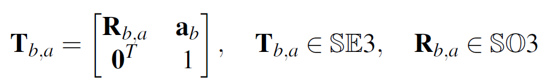
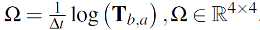
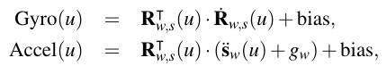

该文用来介绍仿真IMU数据的方法


<!--More-->

## 理论基础

### 1、定义相机变换矩阵

首先使用4*4的变换矩阵来来表示相机之间的变换T：



​	使用$T_{b,a}$表示时间Δt内，帧$T_{w,a}$与帧$T_{w,b}$(其中w为世界坐标系)之间运动的速度（该速度恒定且包括角速度和线速度）可表示为矩阵形式：



​		其中log是矩阵对数。对于矩阵组SE3，对数映射和它的逆(指数映射)就可以在闭域内计算。

### 2、根据离散的点拟合连续的曲线

为了得到IMU数据，我们需要知晓轨迹的数学形式，为此，我们需要先根据离散的点轨迹拟合曲线，这个过程通过B样条插值来完成。

曲线p(t)可以使用点$P_i$和基本方程$B_{i,k}(t)$来表示:
$$
p(t) = \sum^n_{i=0}p_iB_{i,k}(t)
$$
其中$p_i$表示控制点，$B_{i,k}(t)$是基础函数，可以使用De Boor-Cox递归公式进行计算得到。上式可以组织为如下形式：
$$
p(t)=p_0\tilde{B}_{0,k}(t)+\sum^{n}_{i=1}(p_i-p_{i-1})\tilde{B}_{i,k}(t)
$$
其中$\tilde{B}_{i,k}(t) = \sum^{n}_{j=i}B_{j,k}(t)$是累加的基础函数。利用对数和指数映射，把$p_0$映射到李代数上：$p_0 = \log(T_{w,0})$.

将$p_i,p_{i-1}$两两个点之间的转移方程映射到李代数上，可表示为$\Omega_i = \log(T^{-1}_{w,i-1}T_{w,i})$.

可以把由等式2描述的李群中的轨迹重写为如下形式。
$$
T_{w,s}(t) = \exp(\tilde{B_{0,k}(t)})\log(T_{w,0}))\prod^n_{i=1}\exp(\tilde{B}_{i,k}(t)\Omega_i)
$$
其中，$R_{w,s}(t)\in SE^3$是t可是沿着样条线的位姿。 $T_{w,s}(t)$ 可以看作是轨迹

### 3. 根据曲线生成IMU的加速度和陀螺仪角速度数据

​		累积的B样条参数化满足可求导性，因此可轻松地得到加速度计和陀螺仪的带误差的测量值。计算公式如下：



其中,$\dot{R}_{w,s}$和$\ddot{s}_w$分别是$\dot{T}_{w,s}$和$\ddot{T_{w,s}}$相应的子矩阵. $g_w$是世界坐标系下的重力加速度.

其中，$T_{w,s}$表示s系中的点在w系中的变换，$R^T_{w,s}$是的子矩阵，表示纯旋转。$R_{w,s}$是的子矩阵，$s_w(u)$是$T_{w,s}$的子矩阵，代表平移，$g_w$是重力在w系中的加速度。


## 实践环节

### TUM-GT2IMU

程序语言 （Matlab）

#### 文档目录结构

```cmd
(base) guoben@guoben-Ubuntu-1804:~/Project/TUM-RGBD-GT2IMU$ tree.
├── GT2IMU.m
├── IMUgenerate2.m
├── IMUgenerate.m
├── test1.m
├── trajEst.m
├── trajGenerate.m
├── trajRead.m
├── trajShow.m
└── trajWrite.m
├── tools
│   ├── asm2v.m
│   ├── c2q.m
│   ├── pose2T.m
│   ├── q2c.m
│   ├── q4inv.m
│   ├── q4mult.m
│   ├── RK4.m
│   ├── state_pro.m
│   ├── T2J.m
│   ├── v2asm.m
│   └── zeta2J.m
```

### 各文件函数与作用

#### 1. GT2IMU.m：源文件，在这里设置轨迹文件作为输入，然后生成IMU轨迹

#### 2. trajRead：读取轨迹文件

输入：`groundtruth.txt`文件

输出：`GT`文件，`timestamp`文件，`pose`文件

其中，时间戳文件是一维矩阵，pose文件是7维矩阵，格式：四元数+平移

#### 3. trajEst：仿真轨迹估计

读取`GT`文件，生成B样条插值函数

```Matlab
save('Bs','kT','Tk','dT','tIMU','Te','dt','B0','B1','B2','B3','tl')
```

生成仿真函数的过程

- 统计节点Node个数 计算对应的时间
- 最小化由实际观测值与预测观测值之差形成的目标函数，来批量或在窗口上求解样条曲线和摄像机参数。