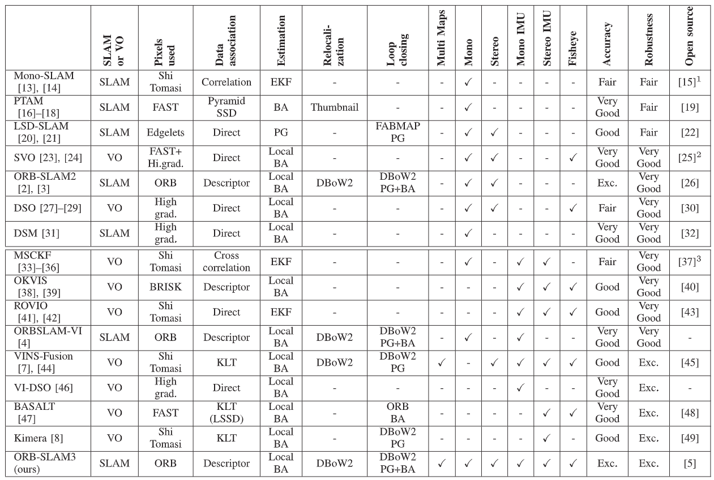
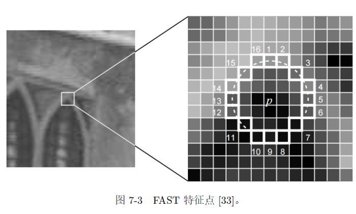
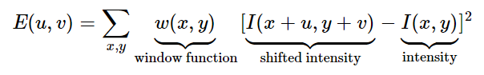
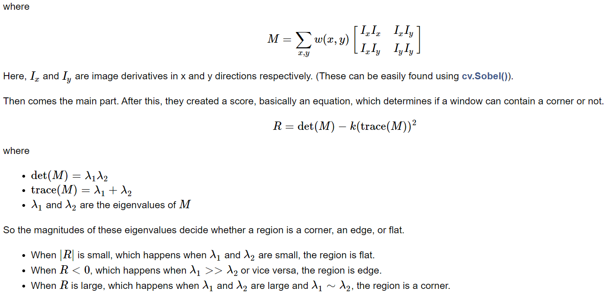
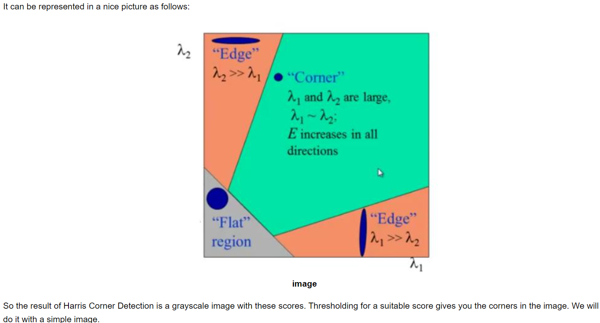
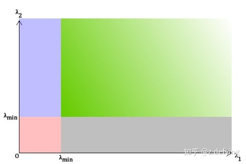

<!--More-->

### 特征点

人工设计的特征点该具有的特性

> 1. 可重复性（Repeatability）：相同的“区域”可以在不同的图像中被找到。
> 2. 可区别性（Distinctiveness）：不同的“区域”有不同的表达。
> 3. 高效率（Efficiency）：同一图像中，特征点的数量应远小于像素的数量。
> 4. 本地性（Locality）：特征仅与一小片图像区域相关。

#### 组成

1. 关键点

2. 描述子

   描述子设计原则：外观相似的特征应该又相似的描述子；

### 常用角点检测算法

SLAM中常用的角点检测算法整理如下：

本文根据ORBSLAM3中的综述表格进行总结：

## 

#### FAST关键点

1. 单纯的FAST关键点，没有描述子

2. FAST 是一种角点，主要检测局部像素灰度变化明显的地方，以速度快著称。它的思
   想是：如果一个像素与它邻域的像素差别较大（过亮或过暗）, 那它更可能是角点。相比于其他角点检测算法，FAST 只需比较像素亮度的大小，十分快捷。它的检测过程如下（见图7-3 ）：

   

   1. 在图像中选取像素p，假设它的亮度为$I_p$。
   2. 设置一个阈值T(比如$I_p$ 的20%)。
   3. 以像素p 为中心, 选取半径为3 的圆上的16 个像素点。
   4. 假如选取的圆上，有连续的N 个点的亮度大于Ip + T 或小于Ip - T，那么像素p可以被认为是特征点(N 通常取12，即为FAST-12。其它常用的N 取值为9 和11，他们分别被称为FAST-9，FAST-11)。
   5. 循环以上四步，对每一个像素执行相同的操作。

在FAST-12 算法中，为了更高效，可以添加一项预测试操作，以快速地排除绝大多数不是角点的像素。具体操作为，对于每个像素，直接检测邻域圆上的第1，5，9，13 个像素的亮度。只有当这四个像素中有三个同时大于Ip + T 或小于Ip 􀀀 T 时，当前像素才有可能是一个角点，否则应该直接排除。这样的预测试操作大大加速了角点检测。此外，原始的FAST 角点经常出现“扎堆”的现象。所以在第一遍检测之后，还需要用非极大值抑制（Non-maximal suppression），在一定区域内仅保留响应极大值的角点，避免角点集中的问题。

##### 缺点

FAST 特征点的计算仅仅是比较像素间亮度的差异，速度非常快，但它也有一些问题。

* 首先，FAST 特征点数量很大且不确定，而我们往往希望对图像提取固定数量的特征。因此，在ORB 中，对原始的FAST 算法进行了改进。我们可以指定最终要提取的角点数量N，对原始FAST 角点分别计算Harris 响应值，然后选取前N 个具有最大响应值的角点，
  作为最终的角点集合。
* 其次，FAST 角点不具有方向信息。而且，由于它固定取半径为3 的圆，存在尺度问题：远处看着像是角点的地方，接近后看可能就不是角点了。

#### Harris特征点

OPENCV描述：In the last chapter, we saw that corners are regions in the image with large variation in intensity in all the directions. One early attempt to find these corners was done by **Chris Harris & Mike Stephens** in their paper **A Combined Corner and Edge Detector** in 1988, so now it is called the Harris Corner Detector. He took this simple idea to a mathematical form. It basically finds the difference in intensity for a displacement of (u,v) in all directions. 

> [openCV链接](https://docs.opencv.org/4.x/dc/d0d/tutorial_py_features_harris.html)

#### Shi-Tomas特征点

> Harris 和 Shi-Tomasi 都是基于梯度计算的角点检测方法，Shi-Tomasi 的效果要好一些。
>
> * 基于梯度的检测方法有一些缺点: 计算复杂度高，图像中的噪声可以阻碍梯度计算。
>
> 想要提高检测速度的话，可以考虑基于模板的方法：FAST角点检测算法。该算法原理比较简单，但实时性很强。
>
> Harris 角点检测中每个窗口的分数公式是将矩阵 M 的行列式与 M 的迹相减：
>
> ![[公式]](https://www.zhihu.com/equation?tex=R+%3D+%CE%BB_1%CE%BB_2+%E2%88%92+k+%28%CE%BB_1+%2B+%CE%BB_2%29%5E2+%5C%5C)
>
> 由于 Harris 角点检测算法的稳定性和 k 值有关，而 k 是个经验值，不好设定最佳值。
>
> Shi-Tomasi 发现，角点的稳定性其实和矩阵 M 的较小特征值有关，于是直接用较小的那个特征值作为分数。这样就不用调整k值了。
>
> 所以 Shi-Tomasi 将分数公式改为如下形式：
>
> ![[公式]](https://www.zhihu.com/equation?tex=R+%3D+min+%28%CE%BB_1%2C+%CE%BB_2%29+%5C%5C)
>
> 和 Harris 一样，如果该分数大于设定的阈值，我们就认为它是一个角点。
>
> 我们可以把它绘制到 λ1 ～ λ2 空间中，就会得到下图：
>
> 

#### ORB特征点

1. 改进了FAST关键点;
2. ORB特征点有方向，采用BRIEF描述子进行描述；
3. 具有旋转和尺度不变性，速度快；

##### 改进FAST关键点

针对FAST 角点不具有方向性和尺度的弱点，ORB 添加了尺度和旋转的描述。尺度不变性由构建图像金字塔¬，并在金字塔的每一层上检测角点来实现。而特征的旋转是由灰度质心法（Intensity Centroid）实现的。我们稍微介绍一下。质心是指以图像块灰度值作为权重的中心。其具体操作步骤如下[35]：
1. 在一个小的图像块B 中，定义图像块的矩为：
  $$
  m_{pq} = \sum_{x;y\in \Beta} x^py^qI(x; y); p,q = \{0,1\}
  $$

2. 通过矩可以找到图像块的质心：
  $$
  C = (\frac{m_{10}}{m_{00}}，\frac{m_{10}}{m_{00}})
  $$
  连接图像块的几何中心O 与质心C，得到一个方向向量$OC$,于是特征点的方向可以定义为$\theta = \arctan{\frac{m01}{m10}}$。

通过以上方法，FAST 角点便具有了尺度与旋转的描述，大大提升了它们在不同图像之间表述的鲁棒性。所以在ORB 中，把这种改进后的FAST 称为Oriented FAST。

##### BRIEF 描述子

​	BRIEF 是一种二进制描述子，它的描述向量由许多个0 和1 组成，这里的0 和1 编码了关键点附近两个像素（比如说p 和q）的大小关系：如果p 比q 大，则取1，反之就取0。如果我们取了128 个这样的p; q，最后就得到128 维由0，1 组成的向量。那么，p和q 如何选取呢？在作者原始的论文中给出了若干种挑选方法，大体上都是按照某种概率分布，随机地挑选p 和q 的位置，读者可以阅读BRIEF 论文或OpenCV 源码以查看它的具体实现[34]。BRIEF 使用了随机选点的比较，速度非常快，而且由于使用了二进制表达，存储起来也十分方便，适用于实时的图像匹配。原始的BRIEF 描述子不具有旋转不变性的，因此在图像发生旋转时容易丢失。而ORB 在FAST 特征点提取阶段计算了关键点的方向，所以可以利用方向信息，计算了旋转之后的“Steer BRIEF”特征，使ORB 的描述子具有较好的旋转不变性。
由于考虑到了旋转和缩放，使得ORB 在平移、旋转、缩放的变换下仍有良好的表现。同时，FAST 和BRIEF 的组合也非常的高效，使得ORB 特征在实时SLAM 中非常受欢迎。

#### SIFT

> SIFT(Scale-Invariant Feature Transform)特征，即尺度不变特征变换，是一种计算机视觉的特征提取算法，用来侦测与描述图像中的局部性特征。
>
> 实质上，它是在不同的尺度空间上查找关键点(特征点)，并计算出关键点的方向。SIFT所查找到的关键点是一些十分突出、不会因光照、仿射变换和噪音等因素而变化的点，如角点、边缘点、暗区的亮点及亮区的暗点等。
>
> 1. 具有尺度不变性，充分考虑了图像变换过程中出现的光照，尺度，旋转等变化；计算量较大；
> 2. 无法实时计算SIFT特征，无法用在定位与建图中；

#### SURF

> SIFT和SURF由于计算复杂度的原因在SLAM中应用较少
>
> 链接：https://www.cnblogs.com/multhree/p/11296945.html