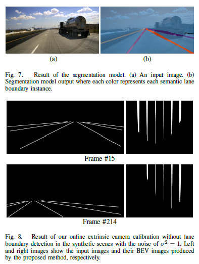
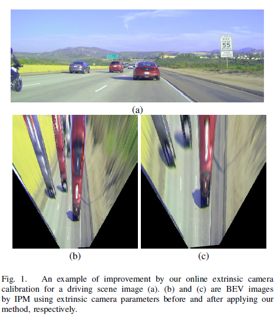
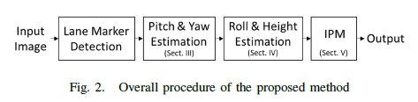
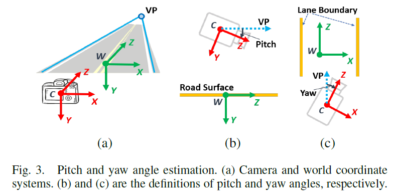
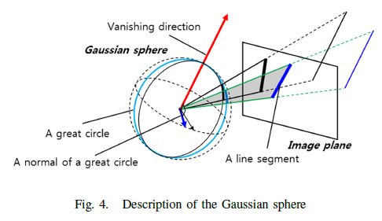
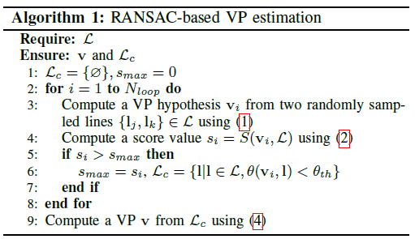
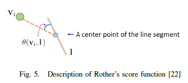
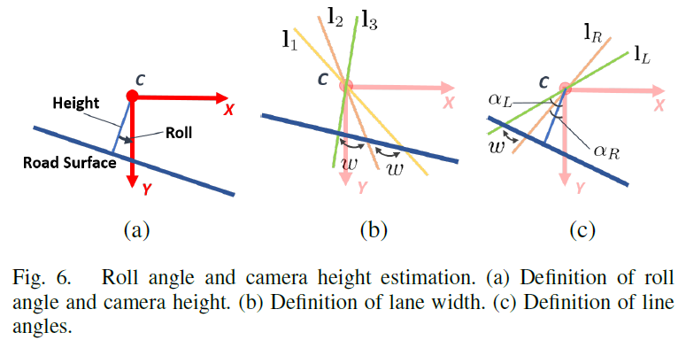

# Online Extrinsic Camera Calibration for Temporally Consistent IPM Using Lane Boundary Observations with a Lane Width Prior

<!--more-->

# Online Extrinsic Camera Calibration for Temporally Consistent IPM Using Lane Boundary Observations with a Lane Width Prior

标题：基于车道线等宽的先验进行车道边界观测的时间一致 IPM 的在线外部相机校准

## 摘要

​	在本文中，我们提出了一种在线外部相机校准方法，即在连续驾驶场景图像中从路面估计俯仰角、偏航角、侧倾角和相机高度。 所提出的方法通过两个步骤估计外部摄像机参数：

1. 使用从一组车道边界观测计算的消失点同时估计俯仰角和偏航角
2. 通过最小化车道之间的差异来计算滚动角和摄像机高度 宽度观察和车道宽度先验。 

​	外部相机参数使用扩展卡尔曼滤波 (EKF) 顺序更新，并最终用于通过逆透视映射 (IPM) 生成时间一致的鸟瞰 (BEV) 图像。 我们证明了所提出的方法在合成和现实世界数据集中的优越性。

## I 引言

近年来，针对ADAS（高级驾驶辅助系统）和AD（自动驾驶）应用的摄像头视觉感知研究已经深入开展。许多研究集中在相邻物体和驾驶环境的检测上，例如车道边界检测[1]、[2]、交通标志检测[3]、[4]、物体检测和跟踪[5]、[6]等，来自前置摄像头捕获的输入图像。特别是对于路面标记，主要使用逆透视映射（IPM）[7]，因为它们受摄像机透视失真的影响更大。给定相机与路面的几何关系，即相机外参，可将输入图像转换为鸟瞰（BEV）图像，从而保留路面标记的实际形状并提高检测性能。此外，外参被广泛用于估计单目相机系统[8]、[9]中物体的距离，并通过生成增强特征[10]来提高物体检测的性能。

外参通常在驾驶前通过使用矩形/梯形/平行四边形的各种图案[11]、[12]或车道标记上的手动注释线/顶点[13]、[14]、[15]来计算]。然而，由于出厂默认标定的不持久性，摄像头与路面的几何关系会逐渐发生变化，并且随着摄像头在行驶中的晃动而变化很大。因此，IPM 无法产生如图 1(b) 所示的良好 BEV 图像，因此在驾驶时应反复补偿外部相机参数，但人们不能在驾驶时干预校准过程，尤其是出于安全原因。因此，外部相机校准应该使用来自驾驶场景图像的观察来自动执行。

有几项研究 [16]、[17] 使用具有相机运动变化的驾驶环境的图像序列进行在线外部相机校准。他们使用从视觉里程计或车道边界的消失点 (VP) 估计的摄像机运动来更新外部摄像机参数，并生成显示平行车道边界的 BEV 图像。然而，这些研究仅更新俯仰角和偏航角，没有纠正所有外部相机参数。因此，当滚动角和相机高度发生变化时，它们可能会产生路面波动和比例（例如车道宽度和物体之间的距离）不一致的 BEV 图像。

​	在本文中，我们提出了一种在线外在相机校准方法，该方法可以估计连续驾驶场景图像中与路面的几何关系，如俯仰角、偏航角、滚动角和相机高度。据我们所知，这是第一个以在线方式同时计算所有四个外部相机参数的工作。所提出的方法分两个阶段估计外部摄像机参数，估计 1）俯仰角和偏航角，然后 2）滚动角和摄像机高度。使用从一组车道边界观测值计算的 VP 同时估计俯仰角和偏航角。然后，给定车道宽度作为先验，通过最小化陆地宽度观测值和车道宽度先验之间的差异来计算滚动角和相机高度。所提出的方法使用扩展卡尔曼滤波 (EKF) [18] 在序列图像中更新外部相机参数，因此可以产生时间一致的 IPM 结果，如图 1(c) 所示。

## II OVERVIEW

我们提出了一种在线外部相机校准方法，即从路面估计俯仰角、偏航角、滚动角和相机高度，从而产生时间上一致的 IPM 结果。我们假设相机经过校准，路面平坦，路面上所有车道边界相互平行，车道宽度与之前的车道宽度相同。

图 2 显示了所提出方法的总体过程。首先，我们使用基于全卷积网络的分割模型从输入图像中提取车道边界观测值 [19]。由于平行车道边界的 VP 仅取决于俯仰角和偏航角，并且不受滚动角和相机高度的变化，我们从一组平行车道边界中找到一个 VP，并使用 VP 估计俯仰角和偏航角。三）。然后我们计算滚动角和相机高度，以最小化车道宽度观测值与作为先验给出的实际车道宽度之间的差异（第 IV 节）。最后，使用更新的外部相机参数（第 V 节）计算 IPM。

## III Pitch角和Yaw角的估计

如在[13]、[15]、[17]中，我们将俯仰角和偏航角估计转换为找到相机和路面上平行车道边界的VP之间的旋转关系，如图3所示。C和W表示分别是相机和世界坐标系。让我们将 W 的 z 轴定义为 VP 的方向，即 VD（消失方向）。

然后俯仰角和偏航角可以定义为摄像机前向和VD之间的角度，如图3（b）和图3（c）所示。

我们采用基于高斯球体理论和 RANSAC [21] 的 [20] 的稳健 VP 估计方法，因为车道边界观测可能是嘈杂的。在使用 VP 初始化俯仰角和偏航角之后，它们在序列图像中由 EKF 估计。

### A. 高斯球

在针孔相机模型中，以相机主点为中心的单位球体称为高斯球。如图 4 所示，大圆是高斯球面与图像上的一条线与主点确定的平面的交点。由于平行线投影到像平面上时在VP处相交，平行线对应的大圆在高斯球面上有一个交点，主点到交点的方向为VD。 VD是由大圆（NGC）的所有法线确定的平面的法向量，我们称之为NGC-VD正交性。正交性与像平面中的线-VP入射相同，即像平面中的平行线入射到VP。 

### B. 灭点估计

我们假设给出了一组表示车道边界的线。 该集合通常包括一些噪声线或异常值，因此我们使用 RANSAC [21] 过滤掉异常值，然后估计对噪声线具有鲁棒性的 VP。 当给定一组线段 L 时，RANSAC 过程可以描述为算法 1。

在算法 1 中，VP 假设$v_i$由两个随机采样的线段 ${l_j , l_k} ⊂ L$ 计算得出，如下所示：
$$
v_i = l_j \times l_k
$$
然后，使用 Rother [22] 的评分函数计算 VP 假设 $v_i$ 的评分值 $s_i$。 

图 5 显示了计算 $s_i$ 时要考虑的两个约束：对于每条线段 $l ∈ L，1) $ 和包括 vi 和 l 中心点的假想线之间的角度 $θ(v_i, l)$，以及 2) l 的长度，ll。 得分函数定义为
$$
S\left(\mathbf{v}_i, \mathcal{L}\right)=\sum_{\mathbf{l} \in \mathcal{L}}\left[\lambda_1\left(1-\frac{\theta\left(\mathbf{v}_i, \mathbf{l}\right)}{\theta_{t h}}\right)+\lambda_2 \frac{l_1}{l_m}\right]
$$
其中，$\lambda=0.8$，$\lambda=0.2$。表示权重，$\theta_{th}=0.7°$。$l_m$是$\mathcal{L}$最长的分割线长度。当$\theta(v_i,l)$不超过$\theta_{th}$，$l$不会包含在分数计算中。

因此，具有最高分数的一组线段 Lc 被 RANSAC 过程聚类。 聚类线用于计算最佳 VP。 为了获得最佳 VP，我们使用了 NGC-VD 正交性，如第 1 节所述。 III-A。 每行 l 的 NGC n 由下式计算
$$
\mathbf{n}=\left(\mathbf{K}^{-1} \mathbf{p}_1\right) \times\left(\mathbf{K}^{-1} \mathbf{p}_2\right),
$$
其中，K是相机的内参矩阵，$p_1$和$p_2$是l的端点。 那么v和NGCs的正交方程如下：
$$
\mathbf{A v}=0 \text {, where } \mathbf{A}=[\cdots, \mathbf{n}, \cdots]^{\top} \text {. }
$$
线性方程组的超定系统可以通过奇异值分解 (SVD) 轻松求解。 实际上，(4)中计算的v是一个VD向量，它被K投影为成像平面上一个VP，即$v_d = K^{−1}v_p$ 其中$v_d$和$v_p$分别是VD和VP，但是它们是相同的，所以VD 从现在开始将被写为VP。

### C Pitch和Yaw角初始化

俯仰角和偏航角分别用 θ 和 φ 表示。 由pitch和yaw角计算的旋转矩阵，即从世界坐标到相机坐标的变换矩阵，用RCW(θ, φ)表示，世界坐标系W中z轴的方向向量用dWZ表示 = [0, 0, 1]。 那么dWZ和v有如下关系，
$$
\mathbf{v}=\mathbf{R}_{C W}(\theta, \phi) \mathbf{d}_{W_Z} .
$$
We can decompose the rotation matrix into two rotation matrices of $\theta$ and $\phi$ as follows.
$$
\begin{aligned}
\mathbf{R}_{C W}(\theta, \phi) &=\mathbf{R}(\theta) \mathbf{R}(\phi) \\
&=\left[\begin{array}{ccc}
1 & 0 & 0 \\
0 & c_\theta & -s_\theta \\
0 & s_\theta & c_\theta
\end{array}\right]\left[\begin{array}{ccc}
c_\phi & 0 & s_\phi \\
0 & 1 & 0 \\
-s_\phi & 0 & c_\phi
\end{array}\right](6)
\end{aligned}
$$
其中，$\theta$和$\phi$通过v来初始化：
$$
\begin{aligned}
\theta &=\operatorname{atan2}\left(-v_y, v_z\right) \text { and } \\
\phi &=\operatorname{atan} 2\left(v_x, v_z\right)
\end{aligned}
$$
Wwhere $\mathbf{v}=\left[v_x, v_y, v_z\right]^{\top}$ and $\operatorname{atan} 2(y, x)$ is the 2 -argument arctangent function.

### D EKF

我们使用 EKF [18] 来估计图像序列中的俯仰角和偏航角。 采用恒定角速度模型来模拟驾驶时的俯仰和偏航角变化。 因此，用于俯仰角和偏航角估计的状态向量 $x_{PY}$ 和系统模型$f_{PY}$ 被定义为：
$$
\begin{aligned}
\mathrm{x}_{P Y} &=\left[\theta, \phi, \omega_\theta, \omega_\phi\right]^{\top} \text { and } \\
\mathbf{f}_{P Y}\left(\mathbf{x}_{P Y}\right) &=\left[\begin{array}{c}
\theta+\omega_\theta \Delta t \\
\phi+\omega_\phi \Delta t \\
\omega_\theta \\
\omega_\phi
\end{array}\right]+\mathbf{w}_{P Y},
\end{aligned}
$$
where $\omega_\theta$ and $\omega_\phi$ are the angular velocity of pitch and yaw angles and $\mathbf{w}_{P Y}=\left[0,0, w_\theta, w_\phi\right]^{\top}$ is a noise variable of the system model with the normal distribution $\mathcal{N}\left(0, \mathbf{W}_{P Y}\right)$. 

Using the NGC-VD orthogonality, a measurement model $h_{P Y}$ for the pitch and yaw angle estimation is defined as
$$
h_{P Y}^{\mathbf{n}}\left(\mathbf{x}_{P Y}\right)=\mathbf{d}_{W_Z}^{\top} \mathbf{R}_{C W}(\theta, \phi)^{\top} \mathbf{n}+q_{P Y},
$$
where $\mathbf{n}$ is an $\mathrm{NGC}$ of $\mathrm{l} \in \mathcal{L}_c$ and $q_{P Y}$ is a noise variable of the measurement model with the normal distribution $\mathcal{N}\left(0, Q_{P Y}\right)$.

The state vector $\mathrm{x}_{P Y}$ are estimated by $\mathrm{EKF}$ as follows: For simplicity, $\mathrm{x}_{P Y}$ is abbreviated as $\mathrm{x}$. Then let $\mathrm{x}_{t-1}$ and $\mathbf{P}_{t-1}$ denote the state estimate and its covariance at time $t-1$. The prediction of the state $\hat{\mathbf{x}}_t$ and its covariance $\hat{\mathbf{P}}_t$ is calculated as follows.
$$
\begin{aligned}
\hat{\mathbf{x}}_t &=\mathbf{f}_{P Y}\left(\mathrm{x}_{t-1}\right) \text { and } \\
\hat{\mathbf{P}}_t &=\mathbf{F}_t \mathbf{P}_{t-1} \mathbf{F}_t^{\top}+\mathbf{W}_t,
\end{aligned}
$$
where $\mathbf{F}_t$ is a Jacobian of the system model. For all the inliers in $\mathcal{L}_c$, the residuals of the measurements are computed using (11) and concatenated as follows.
$$
\mathrm{y}_t=-\left[\cdots, h_{P Y}^{\mathrm{n}}\left(\hat{\mathbf{x}}_t\right), \cdots\right]^{\top}
$$
The Kalman gain $\mathrm{G}_t$ for update is computed as follows. 

$\mathbf{G}_t=\hat{\mathbf{P}}_t \mathbf{H}_t^{\top} \mathbf{S}_t^{-1}$, where $\mathbf{S}_t=\mathbf{H}_t \hat{\mathbf{P}}_t \mathbf{H}_t^{\top}+\mathbf{Q}_t$.
Here, $\mathrm{H}_t$ and $\mathrm{Q}_t$ denote a Jacobian of the measurement model, i.e., $\mathbf{H}_t=\left[\cdots,\left.\frac{\partial h_{P Y}^{\mathrm{n}}}{\partial \mathbf{x}}\right|_{\hat{\mathbf{x}}_t} ^{\top}, \cdots\right]^{\top}$, and a measurement noise covariance at time $t$, respectively. From the residuals and the Kalman gain, the predicted state and covariance are updated as follows.
$$
\begin{aligned}
\mathrm{x}_t &=\hat{\mathbf{x}}_t+\mathbf{G}_t \mathbf{y}_t \text { and } \\
\mathbf{P}_t &=\left(\mathbf{I}-\mathbf{G}_t \mathbf{H}_t\right) \hat{\mathbf{P}}_t
\end{aligned}
$$
where $\mathrm{I}$ is an identity matrix.

## IV roll角和相机高度估计

与 [14] 使用车道宽度先验和道路表面上手动注释的 3D 顶点作为观测值相比。

由于缺乏几何图形以及投影属性和观察到的车道边界与外参之间的非线性几何关系产生的信息，以车道线的2D投影作为观测值来校准roll角和相机高度变得更加复杂。为简化问题，假设俯仰角和偏航角在第三部分中已得到校正。这样在图 6 所示，roll角和相机高度估计可以被认为是计算它们在 x-y 平面上的近似值。

通过将路面和线投影到 x-y 平面上，我们可以估计滚动角和相机高度值，其中路面与线的交点之间的距离应等于车道宽度先验$w_p$。

### A. Roll角和相机高度初始化

（斜率可能出错，$\alpha$表示车道线与相机y轴的夹角）
$$
w_{1_L, l_R}(\psi, h)=h\left(\tan \left(\alpha_L-\psi\right)-\tan \left(\alpha_R-\psi\right)\right)
$$
An energy function for the roll angle and camera height estimation is defined as
$$
E_{R H}(\psi, h)=\sum_{\left(1_L, 1_R\right) \in \mathcal{L}_c} C_{\mathbf{l}_L, 1_R}(\psi, h),
$$
其中，
$$
C_{1_L, 1_R}(\psi, h)=w_p-w_{1_L, 1_R}(\psi, h)
$$
$\omega$ 和 $h$ 通过在有限范围内的穷举搜索进行初始化，然后使用 Gauss-Newton 方法通过最小化 (19) 的能量函数来优化。 值得注意的是，至少应考虑两条车道，因为侧倾角是根据一对车道宽度观测值的相等性估计的。

### B. 基于EKF 估计滚动角和相机高度

与第三部分D类似，本文使用恒定角和线速度模型来对滚动角和相机高度进行时间一致的估计。 因此，用于滚动角和相机高度估计的状态向量 $X_{RH}$ 和系统模型 $f_{RH}$ 定义为
$$
\begin{aligned}
\mathbf{x}_{R H}=& {\left[\psi, h, \omega_\psi, v_h\right]^{\top} \text { and } } \\
\mathbf{f}_{R H}\left(\mathbf{x}_{R H}\right)=& {\left[\begin{array}{c}
\psi+\omega_\psi \Delta t \\
h+v_h \Delta t \\
\omega_\psi \\
v_h
\end{array}\right]+\mathbf{w}_{R H} }
\end{aligned}
$$

式中，$ω_ψ$和$v_h$分别为横滚角的角速度和相机高度的线速度，$w_{RH}=[0, 0, w_ψ, v_h]$是系统模型的噪声变量，服从正态分布$N(0, W_{RH})$。 滚动角和相机高度估计的测量模型 $h_{RH}(ψ, h)$ 与 (20) 相同。 最后，滚动角和相机高度由 EKF 使用方程(12)-(17)估计 。

## V IPM

Finally, temporally consistent IPM is possible with the extrinsic camera parameter estimates $\theta, \phi, \psi$, and $h$. A homography matrix $\mathbf{H}_{W C}$ from the camera coordinates to the world (or ground) coordinates is calculated as follows.
$$
\mathbf{H}_{W C}=\left[\begin{array}{ccc}
a_X & 0 & \frac{b_X a_X}{2} \\
0 & -a_Z & b_Z a_Z \\
0 & 0 & 1
\end{array}\right]\left[\begin{array}{c}
\mathbf{R}_{r_1} \\
\mathbf{R}_{r_3} \\
\frac{1}{h} \mathbf{R}_{r_2}
\end{array}\right] \mathbf{K}^{-1}
$$
where $a_X$ and $a_Z$ are the scale parameters that determine the resolution of a BEV image, $b_X$ and $b_Z$ are the size parameters of $X$-axis and $Z$-axis in the world coordinate system, and $\mathbf{R}_{r_1}$ is the $i$-th row of the matrix $\mathbf{R}(\theta, \phi, \psi)$ which is computed by
$$
\mathbf{R}(\theta, \phi, \psi)=\left[\begin{array}{ccc}
\cos \psi & \sin \psi & 0 \\
-\sin \psi & \cos \psi & 0 \\
0 & 0 & 1
\end{array}\right] \mathbf{R}_{C W}(\theta, \phi)^{\top}
$$
Using (23), an input image can be converted into a BEV image as shown in Fig. 11(c).

## 实验结果

