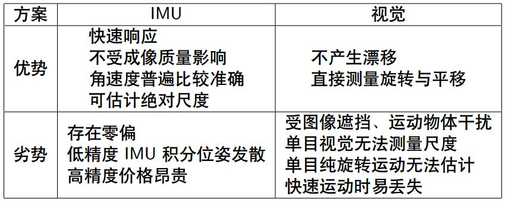
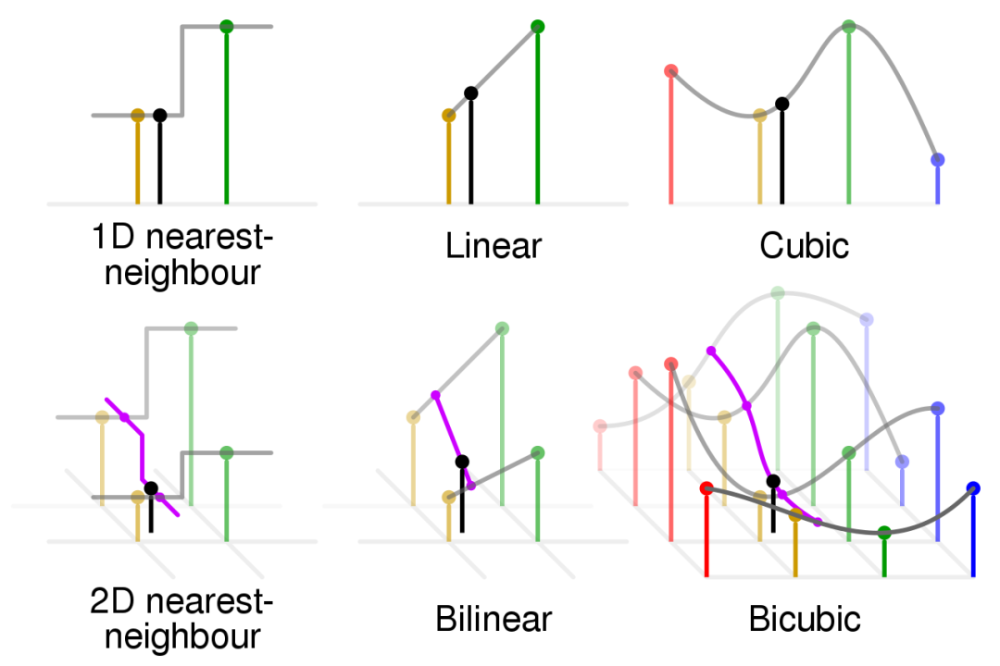
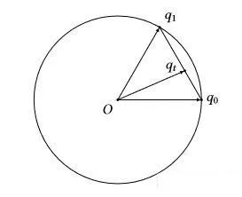

参考链接 : [从零开始一起学习SLAM | 用四元数插值来对齐IMU和图像帧](https://mp.weixin.qq.com/s/q6oJrPlzx2l4OihTGW50hw)

<!--More-->

IMU与相机帧的互补



### IMU与相机帧之间的同步

各种插值方法



##### 双线性插值

在图像处理和计算机视觉领域，应用比较多的双线性插值。双线性插值的效果不是最好的，但相较最邻近插值和线性插值的简单粗暴，其获得图像的效果还是更令人满意的，而且双线性插值的计算量和易于理解程度会优于双三次插值和三次样条插值等高阶插值方法。因此双线性插值还是最受广大图像研究者喜爱的。

#### 四元数的插值方法

线性插值->归一化线性插值
$$
q_{t}=\operatorname{Nerp}\left(q_{0}, q_{1}, t\right)=\frac{(1-t) q_{0}+t q_{1}}{\left\|(1-t) q_{0}+t q_{1}\right\|}
$$


线性插值即在$q_0$,$q_1$上进行插值得到$q_t$，对于匀速的变换，其扫过的面积却不是匀速的
$$
\begin{aligned}
&q_{t}=\operatorname{Serp}\left(q_{0}, q_{1}, t\right)=\frac{\sin ((1-t) \theta)}{\sin (\theta)} q_{0}+\frac{\sin (t \theta)}{\sin (\theta)} q_{1} \\
&\theta=\operatorname{acos}\left(q_{0} \cdot q_{1}\right)
\end{aligned}
$$

#### 注意事项

理论上是这样的，不过，在编程实现Slerp插值的时候还是有几个问题需要注意一下。

1、如果单位四元数之间的夹角θ非常小，那么sin(θ)可能会由于浮点数的误差被近似为0.0，从而导致除以0的错误．所以，我们在实施 Slerp 之前，需要检查两个四元数的夹角是否过小（或者完全相同）。一旦发现这种问题，我们就必须改用 Nlerp 对两个四元数进行插值，这时候 Nlerp 的误差非常小，所以基本不会与真正的 Slerp 有什么区别。

2、在对两个单位四元数进行插值之前，我们需要先检测q0与q1之间是否是钝角，即检测它们点积的结果q0⋅q1 是否为负数。如果 q0⋅q1<0，那么我们就反转其中的一个四元数，比如说将q1改为−q1 ，并使用q0与−q1之间新的夹角来进行插值，这样才能保证插值的路径是最短的．

#### **编程实现四元数球面线性插值。**

我们用智能手机采集了图像序列和IMU数据，由于IMU帧率远大于图像帧率，需要你用Slerp方法进行四元数插值，使得插值后的IMU和图像帧对齐。

已知某帧图像的时间戳为：t =700901880170406

离该图像帧最近的前后两个时刻IMU时间戳为：t1 = 700901879318945，t2 = 700901884127851

IMU在t1, t2时刻测量得的旋转四元数为：

$q_1x=0.509339, q_1y=0.019188, q_1z=0.049596, q1_w=0.858921$

$q_2x=0.509443, q_2y=0.018806, q_2z=0.048944,q_2w=0.858905$

根据上述信息求IMU对齐到图像帧的插值后的四元数。

参考结果已经给出。

```C++
Quaterniond slerp(double t, Quaterniond &q1, Quaterniond &q2)
{
	// ---- 开始你的代码 ----- //
	// 参考公众号推送文章
	Quaterniond deltaQ = q1.inverse() * q2;
	// Eigen::AngleAxisd rotation_vector(deltaQ);
	// double theta = rotation_vector.angle();

	double theta = acos(q1.dot(q2));
	// cout << rotation_vector.angle() << endl;
	// cout << rotation_vector.matrix() << endl;
	double q_slerp_w, q_slerp_x, q_slerp_y, q_slerp_z;
	if (theta < 0.001)
	{
		q_slerp_w = (1 - t) * q1.w() + t * q2.w();
		q_slerp_x = (1 - t) * q1.x() + t * q2.x();
		q_slerp_y = (1 - t) * q1.y() + t * q2.y();
		q_slerp_z = (1 - t) * q1.z() + t * q2.z();
	}
	else
	{
		q_slerp_w = sin((1 - t) * theta) / sin(theta) * q1.w() + sin(t * theta) / sin(theta) * q2.w();
		q_slerp_x = sin((1 - t) * theta) / sin(theta) * q1.x() + sin(t * theta) / sin(theta) * q2.x();
		q_slerp_y = sin((1 - t) * theta) / sin(theta) * q1.y() + sin(t * theta) / sin(theta) * q2.y();
		q_slerp_z = sin((1 - t) * theta) / sin(theta) * q1.z() + sin(t * theta) / sin(theta) * q2.z();
	}
	Quaterniond q_slerp(q_slerp_w, q_slerp_x, q_slerp_y, q_slerp_z);
	if (theta < 0.001)
	{
		q_slerp = q_slerp.Identity();
	}
	// ---- 结束你的代码 ----- //
	return q_slerp;
}
int main(int argc, char **argv)
{
	double t_img(700901880170406), t1_imu(700901879318945), t2_imu(700901884127851);
	Quaterniond q1 = Quaterniond(0.858921, 0.509339, 0.019188, 0.049596);
	Quaterniond q2 = Quaterniond(0.858905, 0.509443, 0.018806, 0.048944);
	double t = (t_img - t1_imu) / (t2_imu - t1_imu);
	Quaterniond q_slerp = slerp(t, q1, q2);
	cout << "插值后的四元数：q_slerp =\n"
		 << q_slerp.coeffs() << endl; // coeffs的顺序是(x,y,z,w)

	return 0;
}
```

